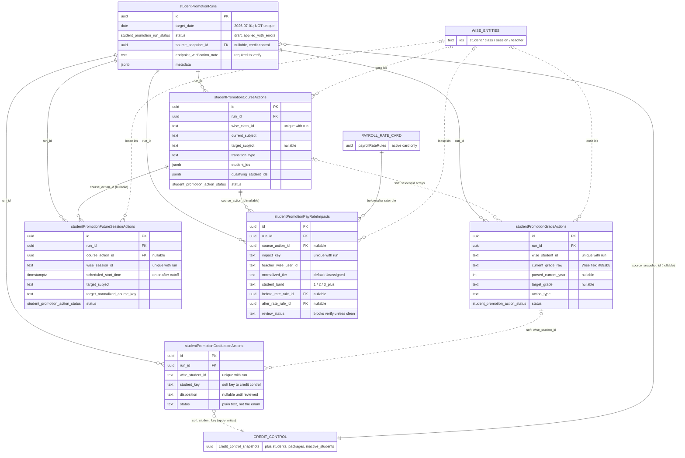

# Database Reference — Student Promotions (ER Diagram)

Scope: the 6 tables backing the Student Promotions feature (**stable**). The domain records one audited annual pass over Wise — bumping every accepted student's grade registration, moving the classes whose whole roster crossed a year boundary, and reviewing what those moves do to tutor pay bands — for a fixed target date, `2026-07-01` (`src/lib/student-promotions/rules.ts:1`).

Every table is **snapshot-independent and append-only**. Nothing here rotates with `snapshots` or `credit_control_snapshots`; a run instead *records* the credit-control snapshot it read (`sourceSnapshotId`) so a later reviewer can tell which data the audit was built from. No code path in `src/` deletes a run, a grade action, a course action, or a graduation action.

One run walks a lifecycle — `draft` → `verified` → `applying` → `applied` / `applied_with_errors` / `failed` (`schema.ts:136-143`) — and each of the five child tables holds one *proposed* Wise mutation carrying its own `pending` / `skipped` / `applied` / `failed` status, its request and response payloads, and the reason it was skipped. The audit trail is the point: the tables exist so that what was proposed, what a human decided, and what Wise actually answered are all recoverable after the fact.

Full column-by-column detail (types, defaults, every index) lives in [`./index.md`](./index.md); enum value sets live in [`./enums.md`](./enums.md). This page covers grain, keys, and relationships only. For purpose, business rules, and flows see [`../../features/student-promotions.md`](../../features/student-promotions.md).

## Scope

Exactly 6 tables (Drizzle export — Postgres table — `src/lib/db/schema.ts` line range):

| Table (varName) | Postgres table | Lines | Grain scope |
|---|---|---|---|
| `studentPromotionRuns` | `student_promotion_runs` | 1346–1378 | run ledger (lineage root) |
| `studentPromotionGradeActions` | `student_promotion_grade_actions` | 1379–1402 | one row per accepted Wise student per run |
| `studentPromotionCourseActions` | `student_promotion_course_actions` | 1403–1425 | one row per Wise class per run |
| `studentPromotionFutureSessionActions` | `student_promotion_future_session_actions` | 1426–1452 | one row per future Wise session per run |
| `studentPromotionGraduationActions` | `student_promotion_graduation_actions` | 1453–1475 | one row per Year 13 student per run |
| `studentPromotionPayRateImpacts` | `student_promotion_pay_rate_impacts` | 1476–1518 | one row per teacher × class × band × course pair per run |

Two of the six are **rebuilt in place** rather than written once: future-session actions are upserted on `(run_id, wise_session_id)` and pay-rate impacts are deleted and re-inserted wholesale for the run. Both refreshes fire again on every graduation-disposition change, on apply, and on readback (`src/lib/student-promotions/data.ts:2004-2019`, `:2357-2362`, `:2469-2475`). The other four are inserted once, during the dry run, and only ever `UPDATE`d thereafter.

## Relationship model

**Enforced foreign keys.** Every `.references(...)` on a `student_promotion_*` table, and every reference *to* one, is listed here. All are `ON DELETE no action` — the migrations declare no cascade anywhere in the domain (`drizzle/0040_student_promotions.sql:73-77`, `drizzle/0048_student_promotion_future_sessions.sql:22-24`, `drizzle/0049_student_promotion_graduation_pay_rates.sql:56-64`):

- `studentPromotionGradeActions.runId`, `studentPromotionCourseActions.runId`, `studentPromotionFutureSessionActions.runId`, `studentPromotionGraduationActions.runId`, `studentPromotionPayRateImpacts.runId` → `studentPromotionRuns.id`, all `notNull` (`schema.ts:1381`, `1405`, `1428`, `1455`, `1478`)
- `studentPromotionFutureSessionActions.courseActionId` and `studentPromotionPayRateImpacts.courseActionId` → `studentPromotionCourseActions.id`, both **nullable** (`schema.ts:1429`, `1479`)
- `studentPromotionRuns.sourceSnapshotId` → `creditControlSnapshots.id`, **nullable** — the domain's only outbound FK into another feature's lineage (`schema.ts:1350`; see [`./erd-credit-control.md`](./erd-credit-control.md))
- `studentPromotionPayRateImpacts.beforeRateRuleId` / `.afterRateRuleId` → `payrollRateRules.id`, both nullable — they pin a pay-band comparison to the exact rate-card cells that produced it (`schema.ts:1492-1493`; see [`./erd-payroll.md`](./erd-payroll.md))

**Nothing outside the domain references a `student_promotion_*` table.** These six tables are FK targets only for each other.

**Soft keys, no FK.** Everything else is a string resolved in application code:

- **Grade action ↔ graduation action** on `wise_student_id` within a run. A student parsed as Year 13 gets *both* a grade-action row (status `skipped`, so no Year 14 is ever written) and a graduation-action row awaiting a human disposition (`data.ts:1755-1803`).
- **Course action ↔ grade action** on the student ids inside `student_ids` / `qualifying_student_ids`. A class's roster is compared against the per-student parsed year in memory; `qualifyingStudentIds` keeps only students whose parsed year equals the year the transition requires (`data.ts:586-588`).
- **Future-session action ↔ course action** additionally on `wise_class_id`, matched against the class id on the live Wise session (`data.ts:470-474`).
- **Pay-rate impact ↔ tutor** on `teacher_wise_id` / `teacher_wise_user_id`, resolved from live Wise teacher records at audit time, never from the tutor snapshot's identity groups (`data.ts:1147-1173`).
- **Pay-rate impact ↔ payroll rate card** on the composite `(studentBand, normalizedCourseKey, tierKey)` — the same triple Payroll uses — looked up in memory against the active card and then *materialized* as the two nullable rate-rule FKs (`data.ts:1264-1272`).
- **Graduation action ↔ Credit Control** on `student_key`, used only at apply time to write an inactive marker (see [Cross-domain notes](#cross-domain-notes)).

Wise ids (`wise_student_id`, `wise_class_id`, `wise_session_id`, `teacher_wise_id`, `teacher_wise_user_id`) are loose strings throughout, shown below as one stub node.

## ER diagram

```mermaid
erDiagram
    studentPromotionRuns {
        uuid id PK
        date target_date "2026-07-01; NOT unique"
        student_promotion_run_status status "draft..applied_with_errors"
        uuid source_snapshot_id FK "nullable, credit control"
        text endpoint_verification_note "required to verify"
        jsonb metadata
    }
    studentPromotionGradeActions {
        uuid id PK
        uuid run_id FK
        text wise_student_id "unique with run"
        text current_grade_raw "Wise field if89sblj"
        int parsed_current_year "nullable"
        text target_grade "nullable"
        text action_type
        student_promotion_action_status status
    }
    studentPromotionCourseActions {
        uuid id PK
        uuid run_id FK
        text wise_class_id "unique with run"
        text current_subject
        text target_subject "nullable"
        text transition_type
        jsonb student_ids
        jsonb qualifying_student_ids
        student_promotion_action_status status
    }
    studentPromotionFutureSessionActions {
        uuid id PK
        uuid run_id FK
        uuid course_action_id FK "nullable"
        text wise_session_id "unique with run"
        timestamptz scheduled_start_time "on or after cutoff"
        text target_subject
        text target_normalized_course_key
        student_promotion_action_status status
    }
    studentPromotionGraduationActions {
        uuid id PK
        uuid run_id FK
        text wise_student_id "unique with run"
        text student_key "soft key to credit control"
        text disposition "nullable until reviewed"
        text status "plain text, not the enum"
    }
    studentPromotionPayRateImpacts {
        uuid id PK
        uuid run_id FK
        uuid course_action_id FK "nullable"
        text impact_key "unique with run"
        text teacher_wise_user_id
        text normalized_tier "default Unassigned"
        text student_band "1 / 2 / 3_plus"
        uuid before_rate_rule_id FK "nullable"
        uuid after_rate_rule_id FK "nullable"
        text review_status "blocks verify unless clean"
    }
    CREDIT_CONTROL {
        uuid credit_control_snapshots "plus students, packages, inactive_students"
    }
    PAYROLL_RATE_CARD {
        uuid payrollRateRules "active card only"
    }
    WISE_ENTITIES {
        text ids "student / class / session / teacher"
    }

    studentPromotionRuns ||--o{ studentPromotionGradeActions : "run_id"
    studentPromotionRuns ||--o{ studentPromotionCourseActions : "run_id"
    studentPromotionRuns ||--o{ studentPromotionFutureSessionActions : "run_id"
    studentPromotionRuns ||--o{ studentPromotionGraduationActions : "run_id"
    studentPromotionRuns ||--o{ studentPromotionPayRateImpacts : "run_id"
    studentPromotionCourseActions ||--o{ studentPromotionFutureSessionActions : "course_action_id (nullable)"
    studentPromotionCourseActions ||--o{ studentPromotionPayRateImpacts : "course_action_id (nullable)"
    CREDIT_CONTROL ||--o{ studentPromotionRuns : "source_snapshot_id (nullable)"
    PAYROLL_RATE_CARD ||--o{ studentPromotionPayRateImpacts : "before/after rate rule"
    studentPromotionGradeActions |o..o{ studentPromotionGraduationActions : "soft: wise_student_id"
    studentPromotionCourseActions |o..o{ studentPromotionGradeActions : "soft: student id arrays"
    studentPromotionGraduationActions }o..|| CREDIT_CONTROL : "soft: student_key (apply writes)"
    WISE_ENTITIES |o..o{ studentPromotionGradeActions : "loose ids"
    WISE_ENTITIES |o..o{ studentPromotionCourseActions : "loose ids"
    WISE_ENTITIES |o..o{ studentPromotionFutureSessionActions : "loose ids"
    WISE_ENTITIES |o..o{ studentPromotionPayRateImpacts : "loose ids"
```

## Tables

### `studentPromotionRuns` (`student_promotion_runs`, lines 1346–1378)

**Grain:** one row per audit attempt for one `target_date`. This is the lineage root — every other table in the domain points back at it.

There is **no unique constraint on `target_date`**, so a target date accumulates as many runs as an admin cares to audit; readers always take the newest by `created_at` (`data.ts:1928-1936`), and apply resolves the newest `verified` one by `verified_at` then `created_at` (`data.ts:2496-2507`). Three indexes support that: `student_promotion_runs_target_status_idx` on `(targetDate, status)`, plus single-column indexes on `createdAt` and `verifiedAt` (`schema.ts:1374-1376`).

The row carries three separable blocks of state:

- **Provenance** — `sourceSnapshotId` (the active credit-control snapshot the audit read), `wiseAcceptedStudentCount`, `websiteSnapshotStudentCount`, and a `metadata` jsonb stamped with the Wise grade registration field id and label and the snapshot's `generatedAt` (`data.ts:1731-1746`).
- **Counters** — `gradeOnlyCount`, `year8CourseMoveCount`, `year11CourseMoveCount`, `skippedGradeCount`, `pendingCourseActionCount`, `skippedCourseActionCount`. All six are written **once**, in a single `UPDATE` at the end of the dry run (`data.ts:1812-1824`), and are never recomputed afterwards. Every live count the UI shows is derived by filtering the child rows instead (`data.ts:1902-1924`).
- **Approval and apply lifecycle** — `verifiedAt` / `verifiedByEmail` / `verifiedByName`, the mandatory `endpointVerificationNote`, then `applyStartedAt` / `applyFinishedAt` / `appliedByEmail` / `appliedByName` and `errorSummary`.

`endpointVerificationNote` is a genuine gate, not decoration: `verifyStudentPromotionRun` rejects an empty note, rejects any run not in `draft`, and rejects a run whose graduation dispositions or pay-rate reviews are incomplete (`data.ts:1938-1970`).

### `studentPromotionGradeActions` (`student_promotion_grade_actions`, lines 1379–1402)

**Grain:** one row per accepted Wise student per run — unique on `(runId, wiseStudentId)` via `sp_grade_actions_run_student_idx`, with supporting indexes on `(runId, status)` and `wiseStudentId` (`schema.ts:1398-1400`).

Holds the parse of the Wise registration answer and the promotion it implies: `currentGradeRaw` (default `""`), the nullable `parsedCurrentYear`, and the nullable `targetGrade` formatted `Year N+1 / Grade N`. `actionType` is a plain text discriminator taking `grade_increment_only`, `year8_course_and_grade`, `year11_course_and_grade`, `graduation_review`, `missing_grade_review`, or `unparsed_grade_review` (`rules.ts:144-153`, `data.ts:1774-1777`).

**Rows the system cannot prove are inserted `skipped`, not omitted.** A blank or unparseable grade, or a Year 13 student, still gets a row — status `skipped`, `skipReason` set to the `actionType` — so the run's grade actions cover every live accepted student. That completeness is load-bearing at apply time: `assertRunCoversLiveAcceptedStudents` compares live Wise students against the run's grade-action student ids and refuses to apply if any are missing (`data.ts:826-835`).

`studentKey` is copied from the credit-control snapshot when a match exists, else `""`; it is informational here — only the graduation table's copy is used for a write.

`requestPayload` / `responsePayload` / `errorMessage` / `appliedAt` are filled during apply. An idempotent re-run stores `{ idempotent: true }` rather than re-issuing the Wise write, and a grade that changed since the audit lands as `skipReason: "grade_drift"` (`data.ts:2105-2124`).

### `studentPromotionCourseActions` (`student_promotion_course_actions`, lines 1403–1425)

**Grain:** one row per Wise class per run — unique on `(runId, wiseClassId)` via `sp_course_actions_run_class_idx`, plus `(runId, status)` and `wiseClassId` indexes (`schema.ts:1421-1423`). Classes are deduped from the snapshot's package rows before rows are built (`data.ts:558-570`).

Two jsonb arrays carry the roster, both `notNull` defaulting to `[]`: `studentIds` is everyone in the class at audit time, `qualifyingStudentIds` only those whose parsed year matches the year the transition requires. **The gap between them is the whole safety story** — a course subject is a class-level property, so a class is only promotable when every student in it qualifies. When the two arrays differ the row is written `skipped` with `skipReason: "mixed_class_roster"` (`data.ts:642-654`).

`transitionType` is plain text: `year8_to_year9`, `year11_to_year12`, `year13_to_university`, or `unmapped_course_variant`. `targetSubject` is nullable — a mapped subject with an explicitly null target, or a subject that merely *looks* like a year-range course without being in the mapping table, both produce a review row with no target and a skip reason (`data.ts:592-607`, `627-637`).

The other skip reasons stored here — `grade_missing_or_unparsed_review`, `unmapped_target_subject`, `graduation_disposition_pending`, `graduation_inactive`, `graduation_mixed_disposition` (`data.ts:1690-1710`), and at apply time `course_subject_drift` and `course_roster_drift` (`data.ts:2186`, `2202`) — are the domain's audit vocabulary; each names exactly why a proposed Wise write did not happen.

Year 13 classes are special: they are inserted `skipped` / `graduation_disposition_pending` and only become `pending` once **every** qualifying student has been dispositioned `university`. Any `inactive` in the mix keeps the class skipped (`data.ts:663-675`, `1676-1711`).

### `studentPromotionFutureSessionActions` (`student_promotion_future_session_actions`, lines 1426–1452)

**Grain:** one row per future Wise session per run — unique on `(runId, wiseSessionId)` via `sp_future_session_actions_run_session_idx`, with four supporting indexes on `(runId, status)`, `wiseClassId`, `courseActionId`, and `scheduledStartTime` (`schema.ts:1446-1450`).

This table exists for Payroll, not for Wise cosmetics. Payroll derives a session's course band from the *session's* subject, so a class promoted on July 1 whose already-scheduled sessions still carry the old subject would be paid at the old band. Rows are therefore generated only where both the source and target subjects normalize into the payroll school-curriculum course keys (`data.ts:210-217`, `453-465`), and only for sessions starting on or after `2026-06-30T17:00:00.000Z` — midnight July 1 Bangkok (`data.ts:198`, `445-447`).

`currentNormalizedCourseKey` / `targetNormalizedCourseKey` store the payroll keys the comparison ran on, so a later reader can see the normalization rather than re-deriving it. The classification writes `applied` immediately with `responsePayload: { idempotent: true }` when the live subject already normalizes to the target, `pending` when the live subject still matches the audited source, `skipped` / `payroll_course_unmapped` when the target does not normalize, and `skipped` / `session_subject_drift` otherwise (`data.ts:487-539`).

**This is the only table whose rows are upserted.** `upsertFutureSessionActionChunks` writes on the `(runId, wiseSessionId)` conflict target, refreshing every derived column from `excluded.*` (`data.ts:377-400`). Rows for sessions the live Wise `FUTURE` query no longer returns are flipped to `failed` with an explanatory `errorMessage` rather than deleted — a disappeared session is a finding, not a cleanup (`data.ts:1550-1571`).

Its write path is double-gated: the run must already be `applied` or `applied_with_errors`, **and** `WISE_SESSION_SUBJECT_UPDATE_VERIFIED=true` must be set (`data.ts:201`, `449-451`, `2411-2418`).

### `studentPromotionGraduationActions` (`student_promotion_graduation_actions`, lines 1453–1475)

**Grain:** one row per student parsed as Year 13 per run — unique on `(runId, wiseStudentId)` via `sp_graduation_actions_run_student_idx`, plus `(runId, status)` and `wiseStudentId` indexes (`schema.ts:1471-1473`).

The one place a human decision is the data. `disposition` is nullable text and stays null until an admin picks `inactive` or `university`; `status` is **plain `text`, not the `student_promotion_action_status` enum** (`schema.ts:1462`), moving `pending_review` → `selected` → `applied` / `failed`. Alongside the decision the row keeps its own reviewer attribution — `reviewedByEmail`, `reviewedByName`, `reviewedAt` — separate from the run-level verifier.

`studentName`, `parentName`, and `studentKey` are copied from the credit-control snapshot at audit time (each defaulting to `""`). `studentKey` is the only one that is load-bearing: applying an `inactive` disposition writes a credit-control inactive marker keyed by it, and a blank key fails the action rather than guessing (`data.ts:2247-2260`).

Setting a disposition is never just a local edit — it re-derives the Year 13 course actions and then re-runs both the future-session and pay-rate refreshes against live Wise (`data.ts:1996-2019`).

### `studentPromotionPayRateImpacts` (`student_promotion_pay_rate_impacts`, lines 1476–1518)

**Grain:** one row per `(course action, teacher, student band, current course key, target course key)` group per run — unique on `(runId, impactKey)` via `sp_pay_rate_impacts_run_key_idx`, with indexes on `(runId, reviewStatus)`, `wiseClassId`, and `courseActionId` (`schema.ts:1511-1514`).

`impactKey` is the grain, spelled out: the five components joined with `|`, falling back to `unknown_teacher` / `unmapped_current` / `unmapped_target` where a value is missing (`data.ts:1281-1287`). Many future sessions collapse into one row; `futureSessionCount`, `firstSessionStartTime`, and `lastSessionStartTime` record the coverage that was folded in.

The row is a before/after pay comparison: `rawTier` and `normalizedTier` (default `"Unassigned"`) from live Wise teacher tags, `studentBand` (`1` / `2` / `3_plus`), the two normalized course keys, the two nullable rate-rule FKs, `beforeExpectedHourlyRate` / `afterExpectedHourlyRate` / `rateDelta`, and the affected students denormalized into `affectedStudentIds` + `affectedStudentNames`.

**`reviewStatus` is the domain's hardest gate.** It is plain text defaulting to `pending_review` and takes `verified_correct`, `incorrect`, or `blocked`. A row is written `blocked` — with `blockerReason` naming which input was missing: `missing_active_rate_card`, `missing_teacher_tier`, `unmapped_course`, `missing_before_rate_rule`, or `missing_after_rate_rule` (`data.ts:1176-1191`) — whenever the comparison could not be computed. A blocked row cannot be marked `verified_correct` (`data.ts:2040-2042`), and `assertGraduationAndPayRateReviewComplete` refuses to verify the run while any row is blocked, still pending, or marked incorrect (`data.ts:837-860`). Fail-closed: an unprovable pay impact stops the whole promotion rather than being waved through.

Because the table is rebuilt by delete-and-reinsert, human review would be destroyed by every refresh. `preservePayRateImpactReview` prevents that: it re-attaches `reviewStatus` and the reviewer fields to a rebuilt row only when the row is not blocked and a JSON of its ~17 material fields is byte-identical to the previous version (`data.ts:1607-1627`). Any material change — a different teacher, band, rate rule, session count, or affected roster — silently discards the old verdict and forces a fresh review.

## Cross-domain notes

- **Credit Control → `studentPromotionRuns.sourceSnapshotId`** (read). The dry run loads the active `credit_control_snapshots` row plus its `credit_control_students` and `credit_control_packages`, throwing if no active snapshot exists (`data.ts:687-696`). Student names, parent names, `student_key`s, and every class/subject/roster fact come from there — Wise supplies the accepted-student list and the grade registration answers.
- **Credit Control ← graduation apply** (write). An `inactive` disposition calls `markCreditInactive`, which upserts `credit_control_inactive_students` on `student_key` with `source: "student-promotion-graduation"` (`data.ts:2253-2260`, `src/lib/credit-control/db.ts:258-282`). This is the domain's only write into another feature's tables, and it is a soft key join, not an FK.
- **Payroll → `studentPromotionPayRateImpacts`** (read). `loadActivePayrollRateCard` takes the single `payroll_rate_card_versions` row where `active = true`, newest first, and loads its `payroll_rate_rules` (`data.ts:1579-1595`). Missing card → every impact row is `blocked`. The matched rules are then stored as real FKs, so the exact cells behind a rate comparison survive a later card change.
- **Staleness is enforced against Credit Control, not against the tutor snapshot.** A run cannot be verified or applied if the active credit-control snapshot is newer than the one it read, or if the run is more than 24 hours old (`data.ts:804-818`). There is no relationship at all between this domain and the `snapshots` / `tutor_identity_groups` scheduling spine — tutors here are live Wise teacher records, resolved by Wise id.

## Write-path note

Nothing in this domain runs inside a database transaction. The dry run inserts the run row first and returns it, then chunk-inserts grade actions (500 at a time), course actions, graduation actions, and future-session actions (250 at a time), then stamps the counters (`data.ts:346-400`, `1810-1824`). A failure part-way leaves a `draft` run with partial children — recoverable because runs are cheap and append-only, and because the newest run wins.

Apply is deliberately **fail-isolated per action**, not atomic. Grade, course, and graduation actions each run through a bounded concurrency helper at 3 in flight behind a 130 ms rate gate, and each action wraps its own Wise call in try/catch, writing `applied` / `skipped` / `failed` onto its own row (`data.ts:196-197`, `2320-2338`). The run's terminal status is derived from the tally: any failure or drift skip yields `applied_with_errors` with a counted `errorSummary`, otherwise `applied` (`data.ts:2339-2352`). Every Wise write re-reads live state first and compares it against what the run audited, so a value that drifted since the dry run is skipped with a named reason rather than overwritten (`data.ts:2113-2124`, `2173-2194`, `2195-2209`).

Applying an already-applied run is a no-op that returns the existing detail (`data.ts:2296-2298`), which is what makes the annual cron safe to retry.

## Open questions

- **The target date is a source constant, not data.** `STUDENT_PROMOTION_TARGET_DATE = "2026-07-01"`, the apply-window gate `STUDENT_PROMOTION_CRON_READY_AT_UTC`, and the future-session cutoff `STUDENT_PROMOTION_FUTURE_SESSION_START_UTC` are all hardcoded (`rules.ts:1-2`, `data.ts:198`), and the sole `vercel.json` entry is the one-shot `5 17 30 6 *` — the only annual cron in the file. The column `target_date` accepts any date and `createStudentPromotionDryRun` accepts a `targetDate` override, but no caller passes one. How a *second* promotion year is meant to be run — editing the constants, or an unbuilt configuration path — is not answerable from the code. See [`../crons.md`](../crons.md).
- **Run counters are written once and then drift.** The six count columns on `studentPromotionRuns` reflect the dry run's first pass only; the later refreshes that rewrite future-session and pay-rate rows never touch them, and the UI reads derived counts instead. Whether the stored counters are intended as a historical "as first audited" record or are simply stale is not determinable from the code.
- **Retention is unbounded.** No code path in `src/` deletes a run or any of its grade, course, or graduation actions, and pay-rate impacts are only deleted as part of rebuilding the same run. With one target date and a handful of audits that is immaterial today; the schema states no policy either way.
- **`studentPromotionGraduationActions.status` and `studentPromotionPayRateImpacts.review_status` are plain `text`** while their four sibling status columns use `student_promotion_action_status`. Their value sets (`pending_review` / `selected` / `applied` / `failed`, and `pending_review` / `verified_correct` / `incorrect` / `blocked`) exist only as string literals in `data.ts`. Whether that is deliberate — the two human-review lifecycles genuinely differ from the four Wise-write ones — or simply unmigrated, the schema does not say.

_Verified against main@0cd1e81 (clean tree) on 2026-09-02._
