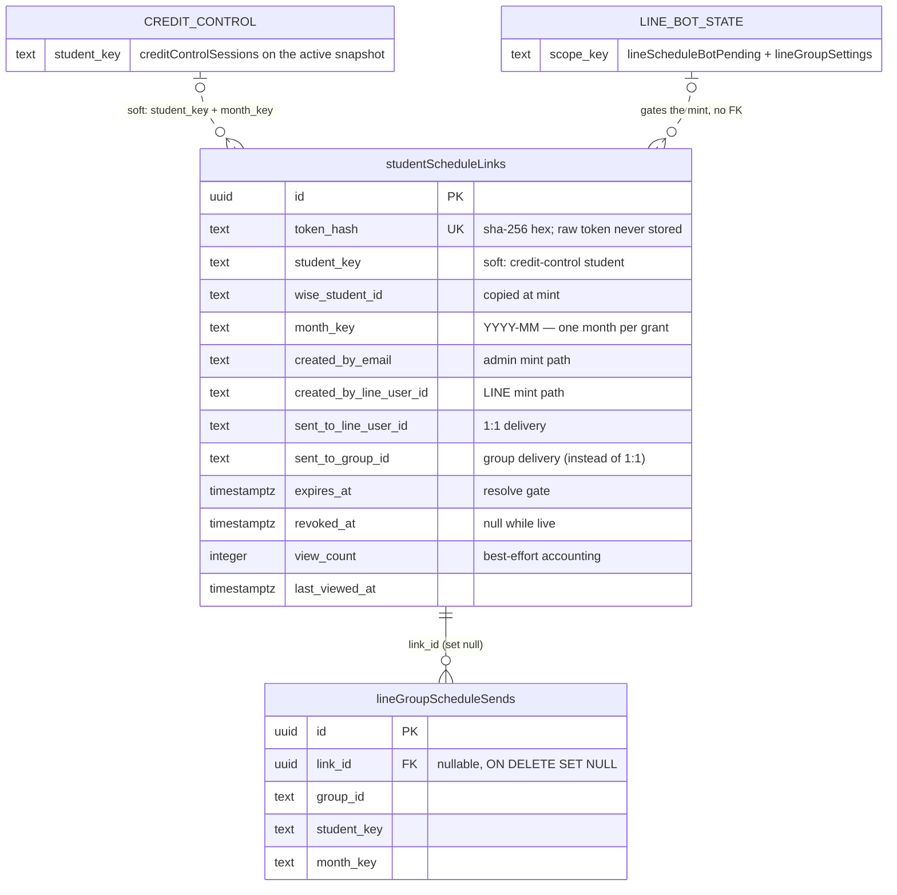

# Database Reference — Student Schedule (ER Diagram)

Scope: the **1 table** backing the Student Schedule feature (**stable**) — `student_schedule_links`, the capability-token store for the public `/schedule/{token}` parent page.

The feature owns exactly one thing: the *grant* that lets an unauthenticated browser see one student's month. Everything it renders is read from other domains — the month payload comes from `credit_control_sessions` on the active credit-control snapshot (`src/lib/student-schedule/data.ts:323-366`), and the LINE delivery machinery (confirm gate, per-chat audience, send audit) lives in the `line` tables.

Because the page is unauthenticated by design, **the token is the credential**, and the row is deliberately not a copy of it: only the SHA-256 hex digest is persisted (`src/lib/student-schedule/links.ts:38-40`, comment at `schema.ts:4629-4634`). There is no token column, and no way to re-issue a lost link — only to mint a new one.

Full column-by-column detail (types, defaults, every index) lives in [`./index.md`](./index.md); this page covers grain, keys, and relationships only. The table declares no enum-typed column, so [`./enums.md`](./enums.md) has nothing for this domain. For purpose, business rules, and flows see [`../../features/student-schedule.md`](../../features/student-schedule.md).

## Scope

Exactly 1 table (Drizzle export — Postgres table — `src/lib/db/schema.ts` line range of the declaration):

| Table (varName) | Postgres table | Lines | Grain scope |
|---|---|---|---|
| `studentScheduleLinks` | `student_schedule_links` | 4635–4656 | one row per issued capability token |

It sits under the `// ── Student monthly schedule (parent-facing) ──` section header (`schema.ts:4627`), between the admissions block and the LINE schedule-bot tables, and is grouped as `core` in [`./index.md`](./index.md).

The whole table — all 15 columns and both indexes — shipped in a single migration, `drizzle/0063_student_schedule_links.sql`, alongside `line_schedule_bot_pending` and `line_group_schedule_sends`. No later migration alters it (`grep -l student_schedule_links drizzle/*.sql` matches only `0063`), so the shape in `schema.ts` is the shape that was created.

## Relationship model

**Outbound foreign keys: none.** The declaration contains no `.references(...)` at all — a link row is self-describing and survives every snapshot rotation around it.

**Inbound foreign keys: exactly one, and it is cross-domain.** `lineGroupScheduleSends.linkId` → `studentScheduleLinks.id`, **nullable**, `onDelete: "set null"` (`schema.ts:4767`; DDL at `drizzle/0063_student_schedule_links.sql`). It is the only `.references(() => studentScheduleLinks…)` in the schema. Deleting a link therefore preserves the LINE group-send audit row and merely nulls its pointer — the audit outlives the grant on purpose (see [`./erd-line.md`](./erd-line.md)).

**Soft keys, no FK.** Everything else is a string resolved at read time or copied at mint time:

- **`studentKey` → credit control.** The public page resolves the token, then calls `getStudentMonthlySchedule`, which reads the active `creditControlSnapshots` row and selects `creditControlSessions WHERE snapshotId = active AND studentKey = grant.studentKey` inside the month window (`src/lib/student-schedule/data.ts:323-366`). No FK: a snapshot rotation can change what a live token renders without touching the link row, and a `studentKey` that stops appearing renders an empty month rather than an error.
- **`wiseStudentId`, `studentName`, `monthKey`** are values copied at mint time so the row explains itself in an audit without a join. Only `studentKey` and `monthKey` are actually load-bearing at resolve time (`links.ts:161-168`).
- **`createdByEmail` / `createdByLineUserId`** — issuance provenance, loose strings, no FK to `admin_users` or the LINE contact tables. Which one is set identifies the mint path.
- **`sentToLineUserId` / `sentToGroupId`** — delivery target. `sentToGroupId` is set *instead of* `sentToLineUserId` when the link went into a LINE group chat rather than a 1:1 conversation (comment at `schema.ts:4645-4646`); the exclusivity is a convention of the three call sites, not a constraint.

There is **no relationship to the core scheduling spine** — `snapshots`, `tutors`, `tutorIdentityGroups` are never touched by this domain. It is student-side, and its one live join is into the independent credit-control lineage.

**Indexes** (`schema.ts:4653-4655`):

- `student_schedule_links_token_hash_idx` — **UNIQUE** on `token_hash`. This is both the resolve lookup and the guarantee that one digest maps to at most one grant.
- `student_schedule_links_student_idx` — on `(student_key, created_at)`, the per-student issuance history.

## ER diagram

## Tables

### `studentScheduleLinks` (`student_schedule_links`, lines 4635–4656)

**Grain:** one row per capability token minted for exactly one (`studentKey`, `monthKey`) pair — **not** one per student and not one per student-month. Every mint is a plain `INSERT` with no conflict target (`links.ts:95-109`), so a student-month accumulates a new row each time an admin copies a link or a bot sends one. Uniqueness holds on `tokenHash` only.

Read the columns as four groups:

- **Credential** — `tokenHash` (`notNull`, unique). The raw token is 32 random bytes from `crypto.randomBytes` rendered base64url (43 chars, `links.ts:24`, `links.ts:92`) and exists in plaintext only in the mint return value; the row stores `sha256(token)` hex.
- **Grant** — `studentKey`, `wiseStudentId`, `studentName`, `monthKey`, all `notNull`. `monthKey` is validated as `YYYY-MM` by `isMonthKey` before the insert and throws otherwise (`links.ts:88-90`), so a malformed month can never be persisted.
- **Provenance and delivery** — the four nullable text columns `createdByEmail`, `createdByLineUserId`, `sentToLineUserId`, `sentToGroupId`.
- **Lifecycle and usage** — `expiresAt` (`notNull`), `revokedAt` (nullable), `viewCount` (`notNull` default `0`), `lastViewedAt`, `createdAt`.

**Three columns are the entire access-control surface.** `resolveStudentScheduleLink` shape-checks the token against `/^[A-Za-z0-9_-]{40,64}$/` before touching the database, then selects on `tokenHash = ? AND revokedAt IS NULL AND expiresAt > now` (`links.ts:126`, `links.ts:140-145`) and re-compares the stored digest in constant time via `timingSafeEqual` so a resolve cannot be timed to recover a prefix (`links.ts:47-52`, `links.ts:147`). Malformed, unknown, expired and revoked all return `null`, and the page renders one identical notice for every case (`src/app/schedule/[token]/page.tsx:104-106`) — the table cannot be used as an oracle for which tokens ever existed.

**`viewCount` / `lastViewedAt` are best-effort.** The increment is a SQL-side `view_count + 1` issued *after* the grant is resolved and wrapped in `.catch()` that only logs (`links.ts:150-159`), so a failed write never denies a valid parent. Treat the counter as approximate.

**`revokedAt` is a soft, idempotent stamp.** The update is itself guarded by `isNull(revokedAt)` (`links.ts:180-183`), so re-revoking keeps the first timestamp. Nothing deletes rows; expired and revoked grants stay in the table indefinitely.

**TTL.** `expiresAt` is computed at mint as `now + ttlDays` (`links.ts:93`), defaulting to `DEFAULT_LINK_TTL_DAYS = 30` (`links.ts:27`). All three callers override it from `STUDENT_SCHEDULE_LINK_TTL_DAYS` when set (`src/app/api/student-schedule/link/route.ts:55`, `src/lib/line/schedule-bot.ts:138`, `src/lib/line/schedule-bot-group.ts:137`) — see [`../env.md`](../env.md).

## Write paths

Three call sites insert, and they differ only in which provenance/delivery columns they fill. All three go through `mintStudentScheduleLink`; nothing writes the table directly.

| Path | Entry point | Sets | Leaves null |
|---|---|---|---|
| Admin workspace | `POST /api/student-schedule/link` (`route.ts:56-63`) | `createdByEmail` | both `sentTo*`, `createdByLineUserId` |
| LINE 1:1 bot — admin link reply | `src/lib/line/schedule-bot.ts:386-394` | `createdByLineUserId` | both `sentTo*` (the link is replied to the admin, not pushed to a parent) |
| LINE 1:1 bot — confirmed send | `src/lib/line/schedule-bot.ts:535-544` | `createdByLineUserId`, `sentToLineUserId` | `sentToGroupId` |
| LINE group bot | `src/lib/line/schedule-bot-group.ts:713-722` | `createdByLineUserId`, `sentToGroupId` | `sentToLineUserId` |

Two properties of these paths matter to the data:

- **A token is never minted for an unproven student.** The admin route first calls `getStudentMonthlySchedule` and returns 404 when it resolves nothing, so the key stored in the row is the key the snapshot returned rather than the one the client typed (`route.ts:45-63`). The bots mint only after their own student lookup and confirm gates.
- **The group path is the one that writes a second table.** After a successful send it inserts the `lineGroupScheduleSends` audit row carrying `linkId` (`schedule-bot-group.ts:761-773`), and that insert is `.catch()`-logged — a failed audit does not un-send the message, so a link row can exist with no matching send row.

## Read path

Exactly one reader: the public page. `/schedule/*` is in the middleware public allowlist, with a deliberate trailing slash so the authenticated `/student-schedule` admin page is not swept in (`src/middleware.ts:17-21`). The page resolves the token, then fetches the month payload with the *stored* `studentKey` / `monthKey` — the URL contributes no query parameters, so a token holder cannot pivot to another student or another month.

No cron, no sync, and no admin listing reads this table.

## Cross-domain notes

- **→ Credit Control** — read-only, at page-render time, on the active snapshot (`data.ts:323-366`). This domain never writes credit-control tables. See [`./erd-credit-control.md`](./erd-credit-control.md).
- **← LINE** — `lineGroupScheduleSends.linkId` is the one inbound FK; `lineScheduleBotPending` and `lineGroupSettings` gate *whether* a mint happens but hold no reference to the resulting row. See [`./erd-line.md`](./erd-line.md).
- **No core-spine coupling** — nothing here references `snapshots`, `tutors`, or `tutorIdentityGroups`, and no `tutor_group_canonical_key` appears in the table. Teacher names reaching the parent page come from the credit-control session rows, not from a link column.

## Open questions

- **`revokeStudentScheduleLink` has no caller.** It is exported, tested and idempotent (`src/lib/student-schedule/links.ts:172-184`), but a repo-wide grep finds no call outside its own module — no route, no bot command, no script. `revokedAt` is therefore enforced on every resolve while having no production path that ever sets it. Whether revocation is meant to be a manual SQL operation or an unbuilt admin control is not answerable from the code.
- **No retention or cleanup.** Rows are never deleted, and expired grants keep a student's name and Wise id indefinitely. No cron in [`../crons.md`](../crons.md) touches the table. Whether that is a deliberate audit decision or simply unbuilt is not stated anywhere in code.
- **`sentToLineUserId` / `sentToGroupId` exclusivity is a convention.** The comment at `schema.ts:4645-4646` says one is set "instead of" the other and the three call sites obey it, but nothing in the schema prevents both being set, and no reader in `src/` consumes either column — they exist purely as an audit trail.
- **The TTL env var is read two ways.** `src/lib/env.ts:25` declares `STUDENT_SCHEDULE_LINK_TTL_DAYS` as an optional coerced positive integer, yet all three callers read `process.env` directly and fall back on `Number(...) || DEFAULT_LINK_TTL_DAYS`, so an invalid value silently becomes 30 rather than failing validation at boot.

_Verified against main@0cd1e81 (clean tree) on 2026-09-02._
