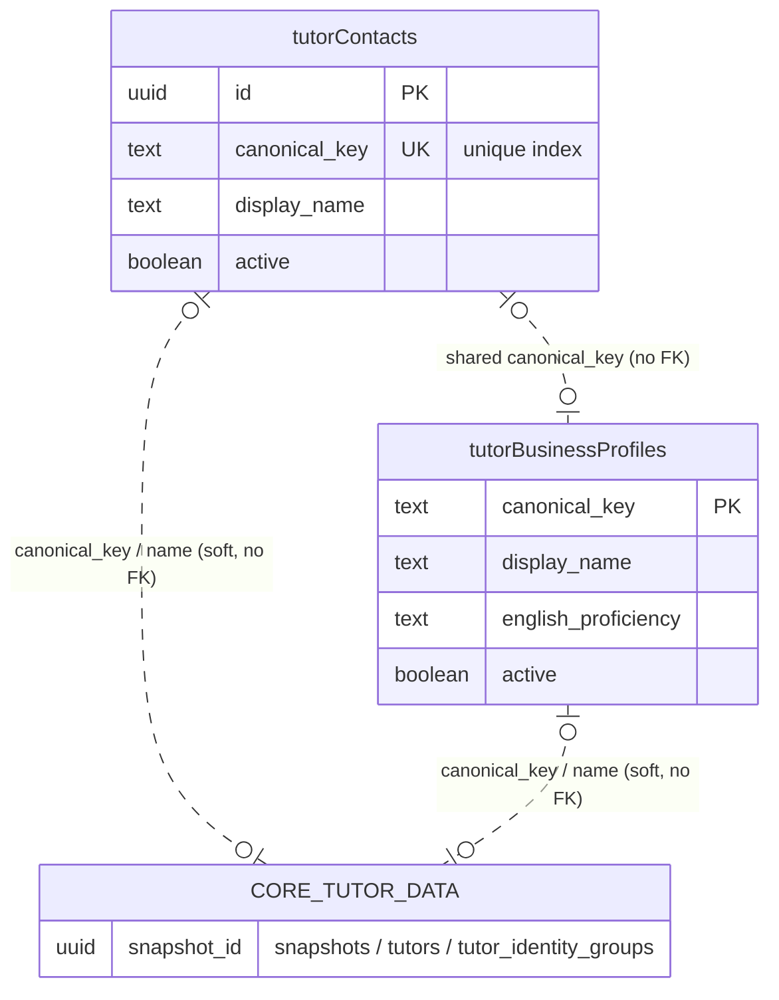

# Database Reference — Tutor Profiles

Scope: the two standalone tables that hold human-curated tutor metadata — contact details (`tutorContacts`) and the parent-facing / internal business profile (`tutorBusinessProfiles`). Both are keyed off a `canonicalKey` string rather than a foreign key, and neither is snapshot-scoped.

For the full column-by-column reference (types, defaults, indexes), see [docs/reference/database/index.md](./index.md). This page covers grain, key columns, and relationships only.

## ER Diagram

Both tables are independent of the snapshot-versioned core data model. They have no SQL foreign keys to `snapshots`, `tutors`, or `tutor_identity_groups`; the only linkage is the `canonicalKey` text value (and the `displayName`/`sourceNames` strings), which is correlated by application logic, not enforced at the database level. The core tables are shown as a single stub node to make that soft, non-FK relationship explicit.

## Tables

### `tutorContacts` — `tutor_contacts`

Source: `src/lib/db/schema.ts` lines 1057-1073.

Grain: one row per logical tutor contact record, identified by `canonicalKey`. Uniqueness is enforced by `tutor_contacts_canonical_key_idx`, a `uniqueIndex` on `canonicalKey` (schema.ts line 1070), so there is at most one contact row per canonical key.

Key columns:
- `id` — `uuid` primary key, `defaultRandom()` (line 1058). Surrogate PK; the natural key is `canonicalKey`.
- `canonicalKey` — `text`, `notNull`, carries the unique index (lines 1059, 1070). The application-level join key.
- `displayName` — `text`, `notNull` (line 1060).
- `onsiteEmail` / `onlineEmail` / `onsitePhone` / `onlinePhone` — nullable `text` (lines 1061-1064). Contact details are split by modality (onsite vs. online variant), mirroring the online/offline-pair identity model.
- `sourceNames` — `jsonb` typed `string[]`, `notNull`, defaults to `[]` (line 1065). Records the underlying name strings this contact was assembled from.
- `active` — `boolean`, `notNull`, defaults `true` (line 1066); indexed by `tutor_contacts_active_idx` (line 1071) for filtering live records.
- `createdAt` / `updatedAt` — timezone-aware `timestamp`, `notNull`, `defaultNow()` (lines 1067-1068).

Relationships: none enforced in SQL. The row is correlated to the snapshot-based core tutor data (`tutors`, `tutor_identity_groups`, and their `snapshots`) and to `tutorBusinessProfiles` only through the shared `canonicalKey` value (and `displayName` / `sourceNames` strings), resolved by application code rather than a database foreign key.

### `tutorBusinessProfiles` — `tutor_business_profiles`

Source: `src/lib/db/schema.ts` lines 1074-1109.

Grain: one row per tutor business profile, keyed directly on `canonicalKey` as the primary key (line 1075). Because `canonicalKey` is the PK, there is exactly one business profile per canonical key.

Key columns:
- `canonicalKey` — `text` primary key (line 1075). No separate surrogate id; the natural key is the PK.
- `displayName` — `text`, `notNull` (line 1076); indexed by `tutor_business_profiles_display_name_idx` (line 1106).
- `parentSafeSummary` / `internalNotes` — `text`, `notNull`, default `""` (lines 1077-1078). Split between parent-facing copy and internal-only notes.
- `education` — `jsonb` array of `{ institution, country?, program?, notes? }`, `notNull`, default `[]` (lines 1079-1084).
- `languages` — `jsonb` array of `{ language, proficiency, verificationSource? }`, `notNull`, default `[]` (lines 1085-1089).
- Young-learner fit fields: `englishProficiency`, `youngLearnerFit` (both `text`, default `"unknown"`, lines 1090-1091), `youngestComfortableAge` (nullable `integer`, line 1092), `youngLearnerNotes` (`text`, default `""`, line 1093).
- Tag/array columns (`jsonb` typed `string[]`, `notNull`, default `[]`): `teachingStyleTags` (1094), `strengthTags` (1096), `curriculumExperience` (1097).
- Free-text notes (`text`, `notNull`, default `""`): `teachingStyleNotes` (1095), `studentFitNotes` (1098), `doNotUseForNotes` (1099).
- Review/audit fields: `verifiedBy` (nullable `text`, line 1100), `lastReviewedAt` (nullable timezone-aware `timestamp`, line 1101).
- `active` — `boolean`, `notNull`, default `true` (line 1102); indexed by `tutor_business_profiles_active_idx` (line 1107).
- `createdAt` / `updatedAt` — timezone-aware `timestamp`, `notNull`, `defaultNow()` (lines 1103-1104).

Relationships: none enforced in SQL. Correlated to the core snapshot-based tutor data and to `tutorContacts` solely via the shared `canonicalKey` (and `displayName`), resolved in application code, not by a database foreign key.

_Verified against HEAD + uncommitted WIP on 2026-05-31._
