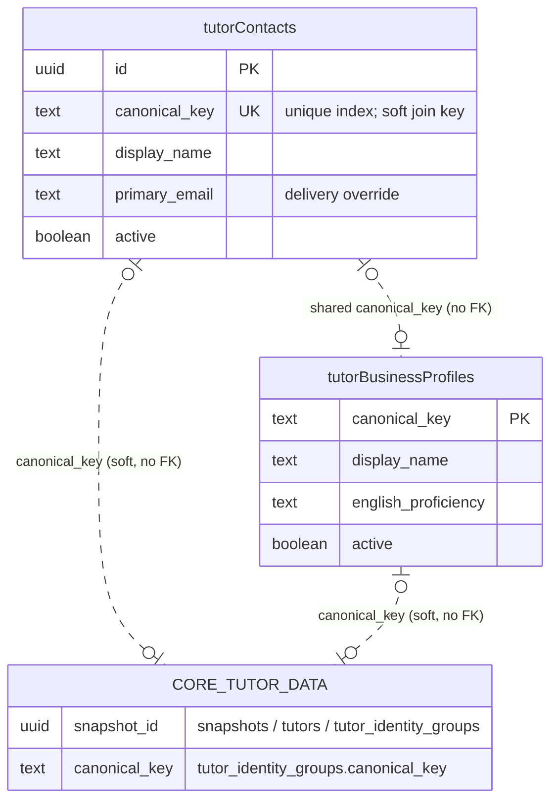

# Database Reference — Tutor Profiles

**Status: stable.**

Scope: the two standalone tables that hold human-curated tutor metadata Wise does not store — contact and delivery details (`tutorContacts`) and the editorial parent-safe / internal business profile (`tutorBusinessProfiles`).

Both are keyed off a `canonicalKey` **text** value rather than a foreign key, and neither carries a `snapshotId`, so both survive snapshot rotation while the snapshot-scoped tutor tables are rewritten underneath them.

| Table (varName) | SQL name | schema.ts lines |
|---|---|---|
| `tutorContacts` | `tutor_contacts` | 1965–1984 |
| `tutorBusinessProfiles` | `tutor_business_profiles` | 1985–2020 |

Full column lists live in [docs/reference/database/index.md](./index.md); enum values live in [enums.md](./enums.md). Purpose, editorial rules, and workflow live in the [Tutor Profiles feature doc](../../features/tutor-profiles.md). This page covers grain, keys, and relationships only.

## ER Diagram

Neither table declares a SQL foreign key — there is no `.references(...)` call anywhere in either definition (`src/lib/db/schema.ts:1965-1983`, `:1985-2019`). The only linkage to core tutor data is the shared `canonicalKey` string, which also appears on the snapshot-scoped `tutorIdentityGroups.canonicalKey` (`src/lib/db/schema.ts:1522`) and is correlated by application code. Core tutor data is therefore drawn as a single stub node to make that soft, non-FK relationship explicit.

```mermaid
erDiagram
    tutorContacts {
        uuid id PK
        text canonical_key UK "unique index; soft join key"
        text display_name
        text primary_email "delivery override"
        boolean active
    }

    tutorBusinessProfiles {
        text canonical_key PK
        text display_name
        text english_proficiency
        boolean active
    }

    CORE_TUTOR_DATA {
        uuid snapshot_id "snapshots / tutors / tutor_identity_groups"
        text canonical_key "tutor_identity_groups.canonical_key"
    }

    tutorContacts |o..o| CORE_TUTOR_DATA : "canonical_key (soft, no FK)"
    tutorBusinessProfiles |o..o| CORE_TUTOR_DATA : "canonical_key (soft, no FK)"
    tutorContacts |o..o| tutorBusinessProfiles : "shared canonical_key (no FK)"
```

## Tables

### `tutorContacts` — `tutor_contacts`

Source: `src/lib/db/schema.ts:1965-1983`.

**Grain**: one row per logical tutor contact record, identified by `canonicalKey`. Uniqueness is enforced by `tutor_contacts_canonical_key_idx`, a `uniqueIndex` on `canonicalKey` (`src/lib/db/schema.ts:1981`), so there is at most one contact row per canonical key. `id` is a surrogate `uuid` PK (`defaultRandom()`, line 1966); `canonicalKey` is the natural key.

**Key columns**:
- `canonicalKey` (`text`, not null, unique index, line 1967) — the application-level join key onto core tutor data.
- `displayName` (`text`, not null, line 1968).
- `primaryEmail` (nullable `text`, line 1971) — a feature-owned delivery override added for post-class feedback reminders. The schema comment at lines 1969–1970 states that existing consumers keep using `onsiteEmail`/`onlineEmail` unless they opt into it.
- `onsiteEmail` / `onlineEmail` / `onsitePhone` / `onlinePhone` (nullable `text`, lines 1972–1975) — contact details split by modality, mirroring the online/offline-pair identity model.
- `sourceNames` (`jsonb` typed `string[]`, not null, default `[]`, line 1976) — the underlying Wise name strings this contact was assembled from; used for name-based matching fallbacks.
- `active` (`boolean`, not null, default `true`, line 1977), indexed by `tutor_contacts_active_idx` (line 1982).
- `createdAt` / `updatedAt` (timezone-aware `timestamp`, not null, `defaultNow()`, lines 1978–1979).

**Email precedence is decided in application code, not the schema.** `resolvePostClassTutorRecipient` returns `primaryEmail` when set (`source: "primary"`), otherwise falls back to the de-duplicated set of `onsiteEmail`/`onlineEmail` only when exactly one distinct address remains (`source: "wise_fallback"`), and returns `null` with `source: "conflict"` when the two disagree — a fail-closed resolution (`src/lib/post-class-feedback/notifications.ts:200-213`).

**`updatedAt` doubles as an optimistic-concurrency token.** `PATCH /api/post-class-feedback/tutor-emails` compares `Math.floor(updatedAt.getTime() / 1000)` against the caller's `expectedVersion` and throws a conflict on mismatch (`src/app/api/post-class-feedback/tutor-emails/route.ts:23-30`); the writer re-checks under a transaction and deliberately advances `updatedAt` by at least one whole second so two rapid saves cannot share the same token (`src/lib/post-class-feedback/settings.ts:325-341`). An absent row is expressed as `expectedVersion === 0`, in which case the same call inserts the contact row using the tutor's `canonicalTutorName` from `postClassSessions` as `displayName` (`settings.ts:300-314`).

**Write paths**: seeded idempotently by the classroom schedule-email backfill, which selects existing canonical keys, inserts only the missing ones, and still guards the write with `.onConflictDoNothing({ target: schema.tutorContacts.canonicalKey })` (`src/lib/classrooms/schedule-email.ts:172-190`); the primary-email override is written only by `updatePostClassTutorPrimaryEmail`, which also appends a `postClassConfigAuditLog` row per change (`src/lib/post-class-feedback/settings.ts:279-346`).

**Read paths** (all but one filter on `active = true`): post-class feedback recipient resolution (`src/lib/post-class-feedback/notifications.ts:412-420` bulk, `:455-462` single), the post-class dashboard's contact map (`src/lib/post-class-feedback/dashboard.ts:184-186`), post-class AI participant naming (`src/lib/post-class-feedback/ai.ts:158-162` — the one read keyed only by `canonicalKey`, with no `active` filter), progress-test teacher identity resolution by email (`src/lib/progress-tests/teacher-access.ts:48-63`), learning-plan tutor authorization (`src/lib/learning-plans/access.ts:47-57`, which lowercases and trims both sides in SQL and matches `onsiteEmail`/`onlineEmail` only — not `primaryEmail`), the classroom schedule-email recipient lookup (`src/lib/classrooms/schedule-email.ts:448-457`, which filters `active` in JS after the query), and leave-request tutor matching (`src/lib/leave-requests/matching.ts:77-80`).

**Relationships**: none enforced in SQL. Correlated to snapshot-based core tutor data (`tutor_identity_groups` → `snapshots`) and to `tutorBusinessProfiles` only through the shared `canonicalKey` value. Note that `classroomScheduleEmailRecipients` also carries a `canonicalKey` `text` column (`src/lib/db/schema.ts:2042`), but its enforced FK is `groupId → tutorIdentityGroups.id` (line 2041), not a reference to `tutorContacts`.

### `tutorBusinessProfiles` — `tutor_business_profiles`

Source: `src/lib/db/schema.ts:1985-2019`.

**Grain**: one row per tutor business profile, keyed directly on `canonicalKey` as the primary key (line 1986) — there is no surrogate id, so there is exactly one profile per canonical key. Writes go through an upsert on that key: `.onConflictDoUpdate({ target: schema.tutorBusinessProfiles.canonicalKey, ... })` (`src/lib/tutor-business-profiles.ts:370-374`), and the patch is merged over the existing row in application code before the insert, so an omitted field keeps its stored value rather than reverting to the column default (`tutor-business-profiles.ts:335-368`).

**Key columns** (grouped; full types and defaults in [index.md](./index.md)):
- `canonicalKey` (`text` PK, line 1986) and `displayName` (`text`, not null, line 1987, indexed by `tutor_business_profiles_display_name_idx`, line 2017).
- Narrative copy, split parent-facing vs. internal: `parentSafeSummary`, `internalNotes` (`text`, not null, default `""`, lines 1988–1989).
- Structured `jsonb` arrays: `education` (`{ institution, country?, program?, notes? }`, lines 1990–1995) and `languages` (`{ language, proficiency, verificationSource? }`, lines 1996–2000), both not null with default `[]`.
- Young-learner fit: `englishProficiency` and `youngLearnerFit` (`text`, not null, default `"unknown"` — the fail-closed default, lines 2001–2002), `youngestComfortableAge` (nullable `integer`, line 2003), `youngLearnerNotes` (line 2004).
- Tag arrays (`jsonb` typed `string[]`, not null, default `[]`): `teachingStyleTags` (2005), `strengthTags` (2007), `curriculumExperience` (2008).
- Free-text notes (`text`, not null, default `""`): `teachingStyleNotes` (2006), `studentFitNotes` (2009), `doNotUseForNotes` (2010).
- Review/audit: `verifiedBy` (nullable `text`, line 2011), `lastReviewedAt` (nullable timezone-aware `timestamp`, line 2012).
- `active` (`boolean`, not null, default `true`, line 2013), indexed by `tutor_business_profiles_active_idx` (line 2018); active-only reads filter on it (`src/lib/tutor-business-profiles.ts:218-226`).
- `createdAt` / `updatedAt` (timezone-aware `timestamp`, not null, `defaultNow()`, lines 2014–2015).

**`updatedAt` is load-bearing beyond auditing**: the search index derives a profile version string from `count(*)` plus `max(updated_at)` over this table (`getTutorProfileVersion`, `src/lib/search/index.ts:128-137`), compares it against the cached index on every `ensureIndex` staleness check (`src/lib/search/index.ts:374-381`), and attaches the active profile map onto each indexed group as `businessProfile` (`src/lib/search/index.ts:220`, `:317`). Editing any profile therefore changes the version and triggers an in-memory index rebuild independently of snapshot promotion.

**This table is treated as optional at runtime.** Both read helpers catch a `42P01` (`relation does not exist`) error and return an empty result instead of throwing (`src/lib/tutor-business-profiles.ts:185-226`), so an environment whose migrations have not been applied degrades to "no profiles" rather than breaking search-index construction.

**Relationships**: none enforced in SQL. Correlated to core snapshot-based tutor data and to `tutorContacts` solely via the shared `canonicalKey`, resolved in application code rather than by a database foreign key.

## Open Questions

- [`docs/reference/database/index.md`](./index.md) lists these two tables at `schema.ts` lines `1962-1980` and `1982-2016`; the definitions are actually at `1965-1983` and `1985-2019` at this revision. The index's line ranges are stale by three lines and should be refreshed when that page is next regenerated.

_Verified against main@0cd1e81 (clean tree) on 2026-09-02._
