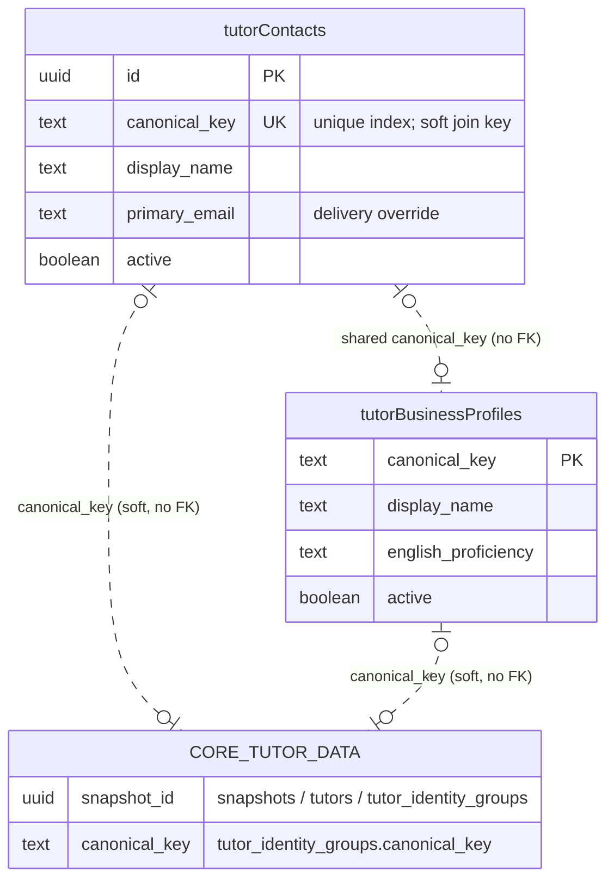

# Database Reference — Tutor Profiles

Scope: the two standalone tables that hold human-curated tutor metadata that Wise does not store — contact/delivery details (`tutorContacts`) and the parent-facing / internal business profile (`tutorBusinessProfiles`).

Both are keyed off a `canonicalKey` **text** value rather than a foreign key, and neither carries a `snapshotId`, so both survive snapshot rotation while the snapshot-scoped tutor tables are replaced underneath them.

| Table (varName) | SQL name | schema.ts lines |
|---|---|---|
| `tutorContacts` | `tutor_contacts` | 1962–1980 |
| `tutorBusinessProfiles` | `tutor_business_profiles` | 1982–2016 |

Full column lists live in [docs/reference/database/index.md](./index.md); enum values live in [enums.md](./enums.md). This page covers grain, keys, and relationships only.

## ER Diagram

Neither table declares a SQL foreign key — there is no `.references(...)` call anywhere in either definition (`src/lib/db/schema.ts:1962-1980`, `:1982-2016`). The only linkage to core tutor data is the shared `canonicalKey` string, which also appears on the snapshot-scoped `tutorIdentityGroups.canonicalKey` (`src/lib/db/schema.ts:1519`) and is correlated by application code. Core tutor data is therefore drawn as a single stub node to make that soft, non-FK relationship explicit.

```mermaid
erDiagram
    tutorContacts {
        uuid id PK
        text canonical_key UK "unique index; soft join key"
        text display_name
        text primary_email "delivery override"
        boolean active
    }

    tutorBusinessProfiles {
        text canonical_key PK
        text display_name
        text english_proficiency
        boolean active
    }

    CORE_TUTOR_DATA {
        uuid snapshot_id "snapshots / tutors / tutor_identity_groups"
        text canonical_key "tutor_identity_groups.canonical_key"
    }

    tutorContacts |o..o| CORE_TUTOR_DATA : "canonical_key (soft, no FK)"
    tutorBusinessProfiles |o..o| CORE_TUTOR_DATA : "canonical_key (soft, no FK)"
    tutorContacts |o..o| tutorBusinessProfiles : "shared canonical_key (no FK)"
```

## Tables

### `tutorContacts` — `tutor_contacts`

Source: `src/lib/db/schema.ts:1962-1980`.

**Grain**: one row per logical tutor contact record, identified by `canonicalKey`. Uniqueness is enforced by `tutor_contacts_canonical_key_idx`, a `uniqueIndex` on `canonicalKey` (`src/lib/db/schema.ts:1978`), so there is at most one contact row per canonical key. `id` is a surrogate `uuid` PK (`defaultRandom()`, line 1963); `canonicalKey` is the natural key.

**Key columns**:
- `canonicalKey` (`text`, not null, unique index) — the application-level join key onto core tutor data.
- `displayName` (`text`, not null, line 1965).
- `primaryEmail` (nullable `text`, line 1968) — a feature-owned delivery override added for post-class feedback reminders. The schema comment at lines 1966–1967 states that existing consumers keep using `onsiteEmail`/`onlineEmail` unless they opt into it.
- `onsiteEmail` / `onlineEmail` / `onsitePhone` / `onlinePhone` (nullable `text`, lines 1969–1972) — contact details split by modality, mirroring the online/offline-pair identity model.
- `sourceNames` (`jsonb` typed `string[]`, not null, default `[]`, line 1973) — the underlying Wise name strings this contact was assembled from; used for name-based matching fallbacks.
- `active` (`boolean`, not null, default `true`, line 1974), indexed by `tutor_contacts_active_idx` (line 1979).
- `createdAt` / `updatedAt` (timezone-aware `timestamp`, not null, `defaultNow()`, lines 1975–1976).

**Email precedence is decided in application code, not the schema.** `resolvePostClassTutorRecipient` returns `primaryEmail` when set (`source: "primary"`), otherwise falls back to the de-duplicated set of `onsiteEmail`/`onlineEmail` only when exactly one distinct address remains (`source: "wise_fallback"`), and returns `null` with `source: "conflict"` when the two disagree — a fail-closed resolution (`src/lib/post-class-feedback/notifications.ts:190-203`).

**Write path**: rows are seeded idempotently. The classroom schedule-email backfill selects existing canonical keys, inserts only the missing ones, and still guards the write with `.onConflictDoNothing({ target: schema.tutorContacts.canonicalKey })` (`src/lib/classrooms/schedule-email.ts:172-190`).

**Read paths** (all filter on `active = true`): post-class feedback recipient resolution (`src/lib/post-class-feedback/notifications.ts:402-408`), progress-test teacher identity resolution by email (`src/lib/progress-tests/teacher-access.ts:48-63`), learning-plan tutor authorization (`src/lib/learning-plans/access.ts:43-59`, which lowercases and trims both sides in SQL), and leave-request tutor matching (`src/lib/leave-requests/matching.ts:78-80`).

**Relationships**: none enforced in SQL. Correlated to snapshot-based core tutor data (`tutor_identity_groups` → `snapshots`) and to `tutorBusinessProfiles` only through the shared `canonicalKey` value. Note that `classroomScheduleEmailRecipients` also carries a `canonicalKey` `text` column (`src/lib/db/schema.ts:2039`), but its enforced FK is `groupId → tutorIdentityGroups.id` (line 2038), not a reference to `tutorContacts`.

### `tutorBusinessProfiles` — `tutor_business_profiles`

Source: `src/lib/db/schema.ts:1982-2016`.

**Grain**: one row per tutor business profile, keyed directly on `canonicalKey` as the primary key (line 1983) — there is no surrogate id, so there is exactly one profile per canonical key. Writes go through an upsert on that key: `.onConflictDoUpdate({ target: schema.tutorBusinessProfiles.canonicalKey, ... })` (`src/lib/tutor-business-profiles.ts:369-374`).

**Key columns** (grouped; full types and defaults in [index.md](./index.md)):
- `canonicalKey` (`text` PK) and `displayName` (`text`, not null, line 1984, indexed by `tutor_business_profiles_display_name_idx`, line 2014).
- Narrative copy, split parent-facing vs. internal: `parentSafeSummary`, `internalNotes` (`text`, not null, default `""`, lines 1985–1986).
- Structured `jsonb` arrays: `education` (`{ institution, country?, program?, notes? }`, lines 1987–1992) and `languages` (`{ language, proficiency, verificationSource? }`, lines 1993–1997), both not null with default `[]`.
- Young-learner fit: `englishProficiency` and `youngLearnerFit` (`text`, not null, default `"unknown"` — the fail-closed default, lines 1998–1999), `youngestComfortableAge` (nullable `integer`, line 2000), `youngLearnerNotes` (line 2001).
- Tag arrays (`jsonb` typed `string[]`, not null, default `[]`): `teachingStyleTags` (2002), `strengthTags` (2004), `curriculumExperience` (2005).
- Free-text notes (`text`, not null, default `""`): `teachingStyleNotes` (2003), `studentFitNotes` (2006), `doNotUseForNotes` (2007).
- Review/audit: `verifiedBy` (nullable `text`, line 2008), `lastReviewedAt` (nullable timezone-aware `timestamp`, line 2009).
- `active` (`boolean`, not null, default `true`, line 2010), indexed by `tutor_business_profiles_active_idx` (line 2015); active-only reads filter on it (`src/lib/tutor-business-profiles.ts:221-223`).
- `createdAt` / `updatedAt` (timezone-aware `timestamp`, not null, `defaultNow()`, lines 2011–2012).

**`updatedAt` is load-bearing beyond auditing**: the search index derives a profile version string from `count(*)` plus `max(updated_at)` over this table (`getTutorProfileVersion`, `src/lib/search/index.ts:128-137`), so editing any profile changes the version and triggers an in-memory index rebuild independently of snapshot promotion.

**Relationships**: none enforced in SQL. Correlated to core snapshot-based tutor data and to `tutorContacts` solely via the shared `canonicalKey`, resolved in application code rather than by a database foreign key.

_Verified against HEAD + uncommitted WIP on 2026-05-31._
