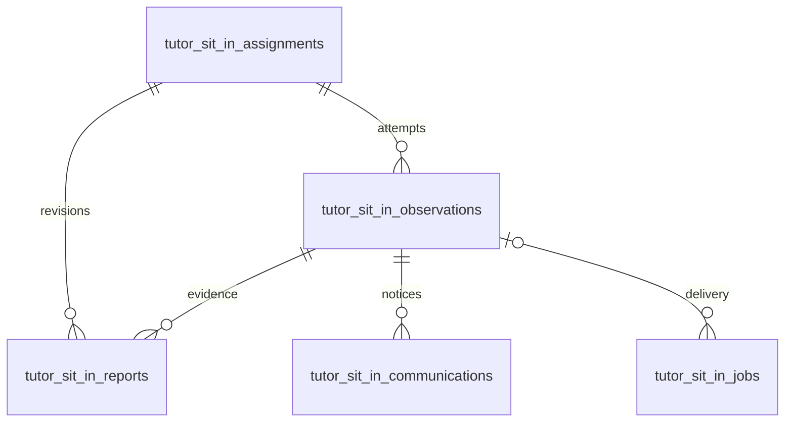

# Tutor Sit-ins persistence

Ten additive, snapshot-independent tables are declared in [`schema.ts`](../../../src/lib/db/schema.ts:5742), migrated by [`0089_tutor_sit_ins.sql`](../../../drizzle/0089_tutor_sit_ins.sql). Stable canonical tutor keys and Wise session IDs survive snapshot rotation. Exact fields and indexes are authoritative in the schema and migration.

| SQL table | Drizzle export | Row grain |
|---|---|---|
| `tutor_sit_in_grants` | `tutorSitInGrants` | One account; role, departments, coverage scopes, verified tutor binding, active status, revision, observer operation lease |
| `tutor_sit_in_mappings` | `tutorSitInMappings` | One Wise class mapped to zero or more coverage scopes |
| `tutor_sit_in_assignments` | `tutorSitInAssignments` | One active tutor + coverage scope + quarter obligation; allocation mode, observer, state, suggestions, structured readiness issues and revision |
| `tutor_sit_in_observations` | `tutorSitInObservations` | One scheduling attempt with frozen lesson/participants, current marker and separate Calendar delivery state |
| `tutor_sit_in_reports` | `tutorSitInReports` | One report version per assignment, pinned rubric, observer attribution, draft/submission state and score |
| `tutor_sit_in_calendar_connections` | `tutorSitInCalendarConnections` | One app account's separately consented Google or Microsoft identity, encrypted tokens and calendar selection |
| `tutor_sit_in_communications` | `tutorSitInCommunications` | One observation + family + notice kind; two acknowledgement actors/times, resolution and supersession history |
| `tutor_sit_in_jobs` | `tutorSitInJobs` | One idempotent Calendar/email delivery; lease, attempts, retry time, error and status |
| `tutor_sit_in_audit` | `tutorSitInAudit` | Append-only action with actor, assignment, details and timestamp |
| `tutor_sit_in_worker_state` | `tutorSitInWorkerState` | Single-flight background worker lease |

Grants, mappings and connections are looked up by durable natural keys, without snapshot FKs. Audit entries also preserve their assignment identifier without a cascade-delete relationship.

## Database invariants

- Unique active obligation `(quarter, canonical_key, coverage_scope)` excluding superseded rows; legacy null scopes coalesce to the department (`iseb` → `iseb_other`); unique current observation per assignment; unique persistent Calendar event, report version, family notice and job key.
- Quarter starts at Q4 2026; valid departments; observation end after start; score is null or within 10–100.
- Observation trigger takes an advisory transaction lock on the canonical observer, rejects self-observation and overlaps across email grants. Changing the tutor identity cannot bypass it.
- Submitted reports cannot be changed/deleted. Reopening inserts a new version with its original rubric. Audit rows cannot be changed/deleted.
- No deletion of report or communication history is part of cancellation or snapshot refresh.

_Verified against `codex/tutor-sit-ins` on 2026-09-16._

Migration `0090_sit_in_coverage_scopes.sql` adds scope, allocation mode and readiness fields and preserves manual provenance. `future_session_blocks.student_ids` stores the dated Wise roster independently of package joins: null means unknown, an empty array means known empty. No roster is backfilled from another occurrence.

Migration `0092_sit_in_calendar_providers.sql` adds provider/account identity to connections and observations. Existing rows are backfilled as Google without changing ciphertext, selected calendars, event IDs or grants. Microsoft event IDs are nullable until creation or recovery succeeds. The original Google identity columns remain for rolling-release compatibility; Microsoft leaves them null. Provider values are constrained to `google` / `microsoft`.

## Wise scheduling and optional delivery (0093)

Observation provider/account/calendar/event bindings remain null until export. Existing event bindings are preserved. `calendar_attempted_at` marks the first possible external create; `calendar_synced_at` records successful verification. These survive retries and distinguish a removed exported event from an unsent invitation. Existing bound rows conservatively retain possible-write evidence from their creation timestamp, including uncertain writes; existing synced rows also receive the synced timestamp. The migration clears only pending/replacement suggestion caches for fresh Wise-only calculation; no obligation, observation, report, acknowledgement or audit history is removed.
