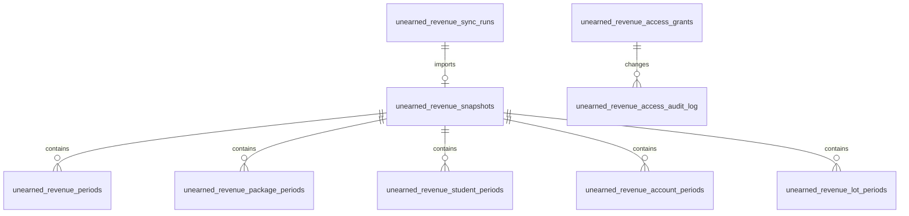

# Unearned Revenue Database

Nine tables own the dashboard's access policy, import lineage, immutable headers, and retained
reporting detail. Monetary, rate, and credit columns are `numeric(20,8)`.

## Access and audit

### `unearned_revenue_access_grants`

`schema.ts:4816–4827`. One row per normalized email and capability. The unique key is
`(email, capability)`; a check allows only `viewer` and `access_manager`. `granted_by_email` and the
timestamps record current provenance.

### `unearned_revenue_access_audit_log`

`schema.ts:4830–4843`. Immutable history for one target-email access replacement. It records actor,
before/after JSON, action, note, and monotonically increasing optimistic-lock `version`.

## Import lineage

### `unearned_revenue_sync_runs`

`schema.ts:4846–4870`. One row per cron or manual attempt. It records status, trigger/actor, workbook
identity, run/fingerprint/revision/cutoff, imported snapshot, counts, metadata, error, and timestamps.
The partial unique index on `status = 'running'` is the single-flight guard.

### `unearned_revenue_snapshots`

`schema.ts:4873–4902`. One immutable QA-passed workbook header. Its source contract is unique on
`(source_run_id, source_fingerprint, source_revision, cutoff)` and a partial unique index permits only
one `active` row. It retains the exact numeric generated-tab IDs and imported row counts.

## Reporting rows

### `unearned_revenue_periods`

One finance total per snapshot and reporting date. It carries period semantics, canonical/legacy/FIFO
balances, roll-forward components, paid credits, attribution, population and quality counts—including
composite-verified, receipt-candidate, reversal-conflict, and missing-receipt-evidence counts—plus the
exact formula anchor.

### `unearned_revenue_package_periods`

`schema.ts:4943–4976`. One formula-backed literal sales package per snapshot and reporting date. It
stores opening, deferred, recognized, and closing exact-package liability; splits closing value between
automatic and Finance-reviewed evidence; retains credits and population counts; and links directly to
the exact Google formula row.

### `unearned_revenue_student_periods`

`schema.ts:4979–5009`. One stable WISE student ID per snapshot and reporting date, aggregated across
class accounts. It stores both model values, canonical balance, attribution/residual amounts, review
state, and formula anchor. Liability and name indexes back dashboard sorting/search.

### `unearned_revenue_account_periods`

`schema.ts:5012–5043`. One WISE student/class account per snapshot and reporting date. It holds the
credit and THB roll-forward, both model closings, attribution/residual values, review state, and
formula anchor.

### `unearned_revenue_lot_periods`

`schema.ts:5046–5111`. One package lot per snapshot and reporting date. It records lot/match/review
classification, V3 match confidence/rule/JSON evidence (including normalized nickname and matching-date
source), package and credit-event lineage, candidate sales and receipt IDs,
receipt identity/amount/status, negative recovery, and the FIFO credit and THB roll-forward. Formula,
original sales-row, original credit-event, and normalized receipt-row anchors are stored independently;
synthetic or unresolved lots leave evidence anchors absent rather than inventing provenance.

All detail rows cascade from their snapshot. Operational retention keeps detail for the active and
immediately preceding successful snapshots while preserving every sync and snapshot header.
