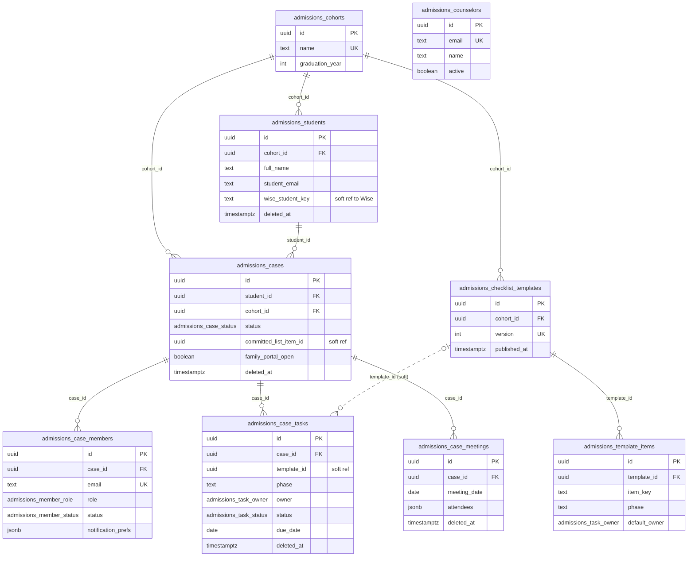
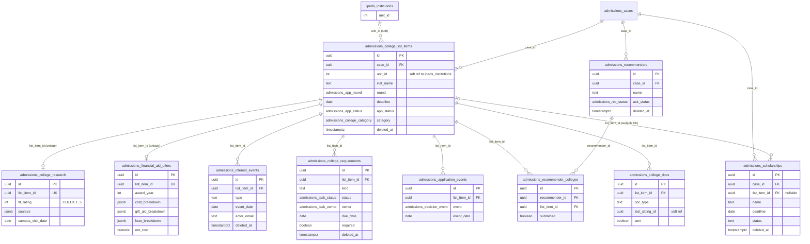
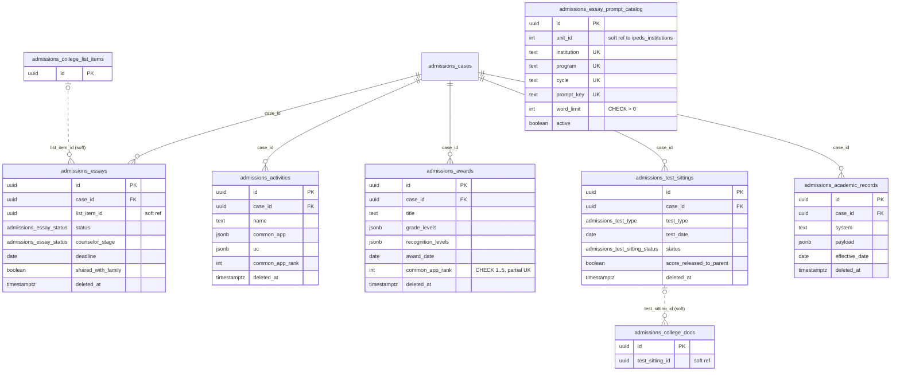
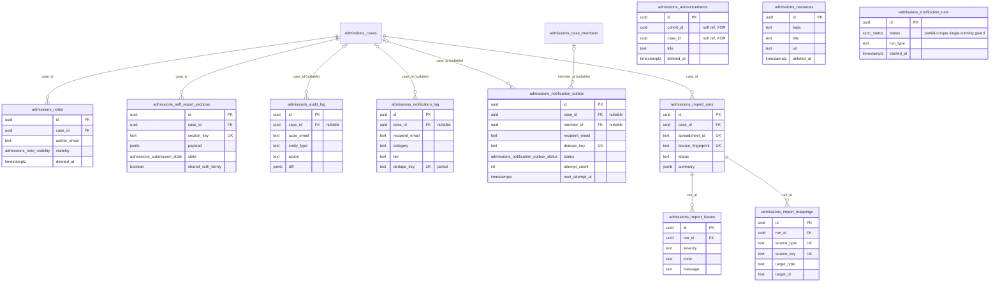

# Database Reference — University Admissions (ER Diagram)

Scope: the **36** tables backing University Admissions case management, all prefixed `admissions_`, declared contiguously at [`src/lib/db/schema.ts`](../../../src/lib/db/schema.ts)`:3965-4634`, with **16** domain enums at `schema.ts:337-452` plus the shared `sync_status`.

Structurally the domain is a strict tree: **cohort → student → case**, with `admissions_cases.id` as the hub every workspace table hangs from and `admissions_college_list_items.id` as the secondary hub for everything college-specific. Two further lineages sit off to the side — a notification pipeline (outbox → log, plus a run ledger) and a workbook-import pipeline (run → issues + mappings).

This page is the canonical home for admissions **column mechanics** — [`./erd-core.md`](./erd-core.md) delegates the whole `admissions_*` family here rather than enumerating it. The one-line inventory of every table in the schema lives in [`./index.md`](./index.md); enum value sets and their per-column usage in [`./enums.md`](./enums.md). For purpose, roles, and the parent-projection rules see [`../../features/university-admissions.md`](../../features/university-admissions.md); for endpoint signatures [`../api/university-admissions.md`](../api/university-admissions.md); for the original design intent [`../../casemanagementsystem_design.md`](../../casemanagementsystem_design.md) §3.

> **Counted at this revision, not carried forward.** `grep -c '= pgTable("admissions_' src/lib/db/schema.ts` → **36**. The schema's own comment block above the domain still reads "25 tables" (`schema.ts:3959-3963`); it predates migration `0053_nosy_spectrum` and is stale. The `pgTable` declarations are authoritative.

## Domain invariants

- **Snapshot-independent.** No admissions table carries a `snapshot_id`; the whole domain survives Wise snapshot rotation.
- **Soft references across domains, never FKs.** `admissions_students.wise_student_key` (Wise identity), `admissions_college_list_items.unit_id` and `admissions_essay_prompt_catalog.unit_id` (IPEDS institution — the `ipeds_*` tables are inventoried in [`./index.md`](./index.md)) are plain columns. So are four *intra*-domain pointers that deliberately skip the FK: `admissions_cases.committed_list_item_id`, `admissions_case_tasks.template_id`, `admissions_essays.list_item_id`, and `admissions_college_docs.test_sitting_id`.
- **Soft deletes on user-facing tables — 17 of 36.** `admissions_students`, `_cases`, `_case_tasks`, `_case_meetings`, `_college_list_items`, `_interest_events`, `_college_requirements`, `_scholarships`, `_recommenders`, `_essays`, `_activities`, `_awards`, `_test_sittings`, `_academic_records`, `_notes`, `_announcements`, `_resources` carry `deleted_at`; reads filter `deleted_at IS NULL`. (`admissions_test_sittings` and `admissions_academic_records` gained the column in migration `0053` and no code on `main` uses it yet — see [Schema on `main`, code on a branch](#schema-on-main-code-on-a-branch).)
- **Four tables have no `updated_at` at all.** `admissions_audit_log` and `admissions_import_mappings` are append-only (`created_at` only, no UPDATE/DELETE code path); `admissions_notification_log` and `admissions_notification_runs` track lifecycle through `sent_at` / `finished_at` instead.
- **Six CHECK constraints, five partial indexes.** The CHECKs are `admissions_college_research_fit_rating_check`, `admissions_essay_prompt_catalog_word_limit_check`, `admissions_awards_common_app_rank_check`, `admissions_awards_uc_eligibility_length_check`, `admissions_awards_uc_achievement_length_check`, and `admissions_announcements_target_check`. The partial (`.where(...)`) indexes are `admissions_cases_live_student_idx`, `admissions_awards_case_common_app_rank_idx`, `admissions_academic_records_case_system_date_idx`, `admissions_notification_log_dedupe_key_idx`, and `admissions_notification_runs_single_running_idx`.
- **No inbound FKs.** Nothing outside the domain references an `admissions_*` table; every `.references(...)` in the block points at another `admissions_*` table.

## Schema on `main`, code on a branch

**12 of the 36 tables are declared on `main` but read and written by nothing on `main`.** Grepping each Drizzle export across `src/` (excluding `schema.ts` itself) returns zero hits for `admissionsCollegeResearch`, `admissionsInterestEvents`, `admissionsCollegeRequirements`, `admissionsFinancialAidOffers`, `admissionsScholarships`, `admissionsEssayPromptCatalog`, `admissionsAwards`, `admissionsAcademicRecords`, `admissionsNotificationOutbox`, `admissionsImportRuns`, `admissionsImportIssues`, and `admissionsImportMappings`. The other 24 exports have 12–122 references each.

How that happened, verified from git:

- The tables and the two new enums arrived in [`drizzle/0053_nosy_spectrum.sql`](../../../drizzle/0053_nosy_spectrum.sql) (11 `CREATE TABLE`s, `CREATE TYPE admissions_notification_outbox_status`, `CREATE TYPE admissions_test_sitting_status`, plus 15 `ADD COLUMN`s on six existing tables), followed by the data backfill [`drizzle/0054_admissions_test_status_backfill.sql`](../../../drizzle/0054_admissions_test_status_backfill.sql). Both files reached `main` inside an unrelated commit — `a7c8ef8`, "Add Wise post-class feedback tracking (#39)".
- Their **handling code did not**. The authoring commit `a1db1d0` ("feat(admissions): harden rollout and reach worksheet parity") sits on **`origin/codex/admissions-parity-hardening`**, which `git merge-base --is-ancestor origin/codex/admissions-parity-hardening origin/main` reports is *not* an ancestor of `main`. The branch carries `src/lib/admissions/academics.ts`, `awards.ts`, `college-details.ts`, `communications.ts`, `essay-prompt-catalog.ts`, and a `workbook-import*.ts` pipeline — none of which exist on `main`.
- One concrete consequence visible in on-`main` code: `src/lib/admissions/testing.ts:28-33` and the JSDoc on `softDeleteSitting` (`testing.ts:441-447`) both state that `admissions_test_sittings` "carries NO `deletedAt` column", so the delete path is an audited **hard** delete. Migration `0053` added `deleted_at` to that table; the comment and the delete path are now behind the schema.

Everything documented below is the schema as `main` declares it. Where a table or column has no on-`main` consumer, its section says so. Whether these migrations have been applied to the production Neon database is a runtime fact this repo cannot attest. Why it has not been landed — the branch is far behind `main` — is discussed in the feature page's [open questions](../../features/university-admissions.md#open-questions).

## Scope

Exactly 36 tables (Drizzle export — Postgres table — `src/lib/db/schema.ts` line range — grain — whether any code on `main` touches it):

| Table (varName) | Postgres table | Lines | Grain | Code on `main` |
|---|---|---|---|---|
| `admissionsCohorts` | `admissions_cohorts` | 3965–3975 | one graduating class | yes |
| `admissionsStudents` | `admissions_students` | 3976–3994 | one student identity | yes |
| `admissionsCases` | `admissions_cases` | 3995–4019 | one counseling case | yes |
| `admissionsCaseMembers` | `admissions_case_members` | 4020–4045 | one email × case | yes |
| `admissionsCounselors` | `admissions_counselors` | 4046–4056 | global counselor registry | yes |
| `admissionsChecklistTemplates` | `admissions_checklist_templates` | 4057–4068 | one template version × cohort | yes |
| `admissionsTemplateItems` | `admissions_template_items` | 4069–4084 | one item in a template version | yes |
| `admissionsCaseTasks` | `admissions_case_tasks` | 4085–4108 | one task on a case | yes |
| `admissionsCaseMeetings` | `admissions_case_meetings` | 4109–4123 | one logged meeting | yes |
| `admissionsCollegeListItems` | `admissions_college_list_items` | 4124–4152 | one college on a case's list | yes |
| `admissionsCollegeResearch` | `admissions_college_research` | 4153–4173 | **one** research record per list item | — (branch) |
| `admissionsInterestEvents` | `admissions_interest_events` | 4174–4187 | one demonstrated-interest event | — (branch) |
| `admissionsCollegeRequirements` | `admissions_college_requirements` | 4188–4209 | one requirement on a list item | — (branch) |
| `admissionsFinancialAidOffers` | `admissions_financial_aid_offers` | 4210–4227 | **one** aid offer per list item | — (branch) |
| `admissionsScholarships` | `admissions_scholarships` | 4228–4248 | one scholarship pursued by a case | — (branch) |
| `admissionsApplicationEvents` | `admissions_application_events` | 4249–4260 | one decision event on a list item | yes |
| `admissionsRecommenders` | `admissions_recommenders` | 4261–4274 | one recommendation writer | yes |
| `admissionsRecommenderColleges` | `admissions_recommender_colleges` | 4275–4287 | recommender × college link | yes |
| `admissionsCollegeDocs` | `admissions_college_docs` | 4288–4300 | doc-send state per list item × type | yes |
| `admissionsEssays` | `admissions_essays` | 4301–4318 | one essay on a case | yes |
| `admissionsEssayPromptCatalog` | `admissions_essay_prompt_catalog` | 4319–4344 | global prompt catalog (case-independent) | — (branch) |
| `admissionsActivities` | `admissions_activities` | 4345–4360 | one activity on a case | yes |
| `admissionsAwards` | `admissions_awards` | 4361–4394 | one award on a case | — (branch) |
| `admissionsTestSittings` | `admissions_test_sittings` | 4395–4415 | one test sitting on a case | yes |
| `admissionsAcademicRecords` | `admissions_academic_records` | 4416–4431 | case × system × effective date | — (branch) |
| `admissionsNotes` | `admissions_notes` | 4432–4446 | one case note | yes |
| `admissionsAnnouncements` | `admissions_announcements` | 4447–4466 | cohort broadcast **xor** case note | yes |
| `admissionsResources` | `admissions_resources` | 4467–4479 | global resource library link | yes |
| `admissionsSelfReportSections` | `admissions_self_report_sections` | 4480–4495 | case × section key | yes |
| `admissionsAuditLog` | `admissions_audit_log` | 4496–4511 | one append-only audit entry | yes |
| `admissionsNotificationLog` | `admissions_notification_log` | 4512–4532 | one **sent** email | yes |
| `admissionsNotificationOutbox` | `admissions_notification_outbox` | 4533–4556 | one **queued** email | — (branch) |
| `admissionsNotificationRuns` | `admissions_notification_runs` | 4557–4573 | one notification-cron run | yes |
| `admissionsImportRuns` | `admissions_import_runs` | 4574–4595 | one workbook import of one case | — (branch) |
| `admissionsImportIssues` | `admissions_import_issues` | 4596–4611 | one issue raised by an import run | — (branch) |
| `admissionsImportMappings` | `admissions_import_mappings` | 4612–4634 | source key → target entity, per run | — (branch) |

The four groupings below follow declaration order exactly: the case spine, then the college hub, then the student-owned profile tables, then communication and the two pipelines.

## 1. Case spine, membership, checklist, meetings (9 tables)

> `admissions_counselors` has no FK edges — it is a standalone global registry, joined to nothing and matched by email at sign-in.

### `admissions_cohorts` — `admissionsCohorts`

One graduating-class cohort (e.g. "Class of 2027").

| Column | Type | Notes |
|---|---|---|
| `id` | `uuid` | PK, default random. |
| `name` | `text` | NOT NULL; unique (`admissions_cohorts_name_idx`). |
| `graduation_year` | `integer` | NOT NULL. |
| `created_at`, `updated_at` | `timestamptz` | NOT NULL, default now. |

Indexes: unique `admissions_cohorts_name_idx` on `name`; `admissions_cohorts_grad_year_idx` on `graduation_year`.

### `admissions_students` — `admissionsStudents`

One student identity record (may exist before/independent of a live case).

| Column | Type | Notes |
|---|---|---|
| `id` | `uuid` | PK. |
| `full_name` | `text` | NOT NULL. |
| `preferred_name` | `text` | Nullable. |
| `student_email` | `text` | NOT NULL. |
| `phone`, `school`, `school_counselor` | `text` | Nullable. |
| `cohort_id` | `uuid` | NOT NULL, FK → `admissions_cohorts.id`. |
| `wise_student_key` | `text` | Nullable **soft reference** to the Wise student identity — never an FK. |
| `external_links` | `jsonb` | NOT NULL, default `{}`. |
| `deleted_at` | `timestamptz` | Soft delete. |
| `created_at`, `updated_at` | `timestamptz` | |

Indexes: `admissions_students_cohort_idx` on `cohort_id`; `admissions_students_email_idx` on `student_email`.

### `admissions_cases` — `admissionsCases`

One admissions case per student journey; **at most one live case per student** via a partial unique index.

| Column | Type | Notes |
|---|---|---|
| `id` | `uuid` | PK. |
| `student_id` | `uuid` | NOT NULL, FK → `admissions_students.id`. |
| `cohort_id` | `uuid` | NOT NULL, FK → `admissions_cohorts.id`. |
| `status` | `admissions_case_status` | NOT NULL, default `active`. |
| `status_changed_at` | `timestamptz` | NOT NULL, default now. |
| `committed_list_item_id` | `uuid` | Nullable **soft pointer** to the committed `admissions_college_list_items` row (no FK). |
| `drive_folder` | `text` | Nullable. |
| `family_portal_open` | `boolean` | NOT NULL, default `false` — family access is opt-in per case (added by `0053`; no reader on `main`). |
| `family_portal_opened_at` | `timestamptz` | Nullable; preserves when the portal was opened. |
| `family_portal_opened_by_email` | `text` | Nullable; preserves who opened it (the schema comment calls opening an audited staff action). |
| `deleted_at` | `timestamptz` | Soft delete. |
| `created_at`, `updated_at` | `timestamptz` | |

Indexes: **partial unique** `admissions_cases_live_student_idx` on `student_id` `WHERE status IN ('active','committed')`; `admissions_cases_cohort_status_idx` on `(cohort_id, status)`; `admissions_cases_student_idx` on `student_id`.

### `admissions_case_members` — `admissionsCaseMembers`

One email's membership on one case (counselor/student/parent), with invite lifecycle. This is the row every request re-checks.

| Column | Type | Notes |
|---|---|---|
| `id` | `uuid` | PK. |
| `case_id` | `uuid` | NOT NULL, FK → `admissions_cases.id`. |
| `email` | `text` | NOT NULL (normalized lowercase). |
| `role` | `admissions_member_role` | NOT NULL. |
| `status` | `admissions_member_status` | NOT NULL, default `invited`. |
| `invited_at`, `activated_at`, `revoked_at` | `timestamptz` | Nullable lifecycle stamps. |
| `added_by_email` | `text` | Nullable. |
| `notification_prefs` | `jsonb` | Nullable per-category downgrades `{ announcements?, tasks?, comments?: "digest"\|"off" }`; deadline reminders have no key and can never be disabled (CM-112). |
| `created_at`, `updated_at` | `timestamptz` | |

Indexes: unique `admissions_case_members_case_email_idx` on `(case_id, email)`; `admissions_case_members_email_status_idx` on `(email, status)`; `admissions_case_members_case_status_idx` on `(case_id, status)`.

### `admissions_counselors` — `admissionsCounselors`

One global counselor registry row; an active row grants counselor sign-in capability.

| Column | Type | Notes |
|---|---|---|
| `id` | `uuid` | PK. |
| `email` | `text` | NOT NULL; unique (`admissions_counselors_email_idx`). |
| `name` | `text` | NOT NULL. |
| `active` | `boolean` | NOT NULL, default `true`; `false` revokes counselor rights everywhere (fail-closed). |
| `created_at`, `updated_at` | `timestamptz` | |

### `admissions_checklist_templates` — `admissionsChecklistTemplates`

One checklist-template **version** per cohort (immutability by versioning).

| Column | Type | Notes |
|---|---|---|
| `id` | `uuid` | PK. |
| `cohort_id` | `uuid` | NOT NULL, FK → `admissions_cohorts.id`. |
| `version` | `integer` | NOT NULL. |
| `published_at` | `timestamptz` | Nullable; null = draft. |
| `name` | `text` | NOT NULL. |
| `created_at`, `updated_at` | `timestamptz` | |

Indexes: unique `admissions_checklist_templates_cohort_version_idx` on `(cohort_id, version)`.

### `admissions_template_items` — `admissionsTemplateItems`

One checklist item within a template version.

| Column | Type | Notes |
|---|---|---|
| `id` | `uuid` | PK. |
| `template_id` | `uuid` | NOT NULL, FK → `admissions_checklist_templates.id`. |
| `item_key` | `text` | NOT NULL (snake_case key, stable across versions). |
| `phase` | `text` | NOT NULL (canonical phase key). |
| `title` | `text` | NOT NULL. |
| `description` | `text` | Nullable. |
| `default_owner` | `admissions_task_owner` | NOT NULL, default `student`. |
| `sort_order` | `integer` | NOT NULL, default 0. |
| `created_at`, `updated_at` | `timestamptz` | |

Indexes: `admissions_template_items_template_sort_idx` on `(template_id, sort_order)`; `admissions_template_items_template_key_idx` on `(template_id, item_key)`.

### `admissions_case_tasks` — `admissionsCaseTasks`

One checklist task on a case — instantiated from a template item (`template_id`/`template_version`/`item_key` set) or a custom/meeting-action task (all three null).

| Column | Type | Notes |
|---|---|---|
| `id` | `uuid` | PK. |
| `case_id` | `uuid` | NOT NULL, FK → `admissions_cases.id`. |
| `template_id` | `uuid` | Nullable **soft reference** to the source template (no FK). |
| `template_version` | `integer` | Nullable. |
| `item_key` | `text` | Nullable. |
| `phase` | `text` | NOT NULL (canonical phase or `custom`). |
| `title` | `text` | NOT NULL. |
| `description` | `text` | Nullable. |
| `owner` | `admissions_task_owner` | NOT NULL. |
| `status` | `admissions_task_status` | NOT NULL, default `not_started`. |
| `due_date` | `date` (string mode) | Nullable. |
| `verified_by_email`, `verified_at` | `text`, `timestamptz` | Counselor verification stamp. |
| `recurrence` | `jsonb` | Nullable recurrence config. |
| `sort_order` | `integer` | NOT NULL, default 0. |
| `deleted_at` | `timestamptz` | Soft delete. |
| `created_at`, `updated_at` | `timestamptz` | |

Indexes: `admissions_case_tasks_case_status_idx` on `(case_id, status)`; `admissions_case_tasks_case_due_idx` on `(case_id, due_date)`.

### `admissions_case_meetings` — `admissionsCaseMeetings`

One logged counselor meeting on a case.

| Column | Type | Notes |
|---|---|---|
| `id` | `uuid` | PK. |
| `case_id` | `uuid` | NOT NULL, FK → `admissions_cases.id`. |
| `meeting_date` | `date` (string mode) | NOT NULL. |
| `mode` | `text` | Nullable (e.g. in-person/online). |
| `attendees` | `jsonb` (`string[]`) | NOT NULL, default `[]`. |
| `notes` | `text` | Nullable. |
| `next_meeting_date` | `date` (string mode) | Nullable. |
| `deleted_at` | `timestamptz` | Soft delete. |
| `created_at`, `updated_at` | `timestamptz` | |

Indexes: `admissions_case_meetings_case_date_idx` on `(case_id, meeting_date)`.

## 2. College list and applications (10 tables)

`admissions_college_list_items` is the second hub: seven tables reference it, two of them with a **unique** index that makes the relationship one-to-one (research, financial aid).

### `admissions_college_list_items` — `admissionsCollegeListItems`

One college on a case's application list — IPEDS-backed (`unit_id` set) or manual (`is_manual`, free-text institution fields).

| Column | Type | Notes |
|---|---|---|
| `id` | `uuid` | PK. |
| `case_id` | `uuid` | NOT NULL, FK → `admissions_cases.id`. |
| `unit_id` | `integer` | Nullable **soft reference** into `ipeds_institutions` (dataYear, unitId) — never an FK. |
| `inst_name` | `text` | NOT NULL (denormalized display name). |
| `city`, `state_abbr` | `text` | Nullable. |
| `country` | `text` | NOT NULL. |
| `is_manual` | `boolean` | NOT NULL, default `false`. |
| `round` | `admissions_app_round` | NOT NULL. |
| `deadline` | `date` (string mode) | Nullable. |
| `app_status` | `admissions_app_status` | NOT NULL, default `researching`. |
| `category` | `admissions_college_category` | NOT NULL, default `unset`. |
| `first_choice_major`, `second_choice_major` | `text` | Nullable (added by `0053`; no reader on `main`). |
| `admissions_url`, `portal_url` | `text` | Nullable (added by `0053`; no reader on `main`). |
| `aid_offered` | `numeric` | Nullable. |
| `aid_notes` | `text` | Nullable. |
| `deleted_at` | `timestamptz` | Soft delete. |
| `created_at`, `updated_at` | `timestamptz` | |

Indexes: `admissions_college_list_items_case_idx` on `case_id`; `admissions_college_list_items_case_deadline_idx` on `(case_id, deadline)`; `admissions_college_list_items_unit_idx` on `unit_id`.

### `admissions_college_research` — `admissionsCollegeResearch`

**At most one** research record per college on the list — the unique index on `list_item_id` makes this a 1:1 extension table rather than a log. No soft delete: the row lives and dies with its list item.

| Column | Type | Notes |
|---|---|---|
| `id` | `uuid` | PK. |
| `list_item_id` | `uuid` | NOT NULL, FK → `admissions_college_list_items.id`; **unique**. |
| `fit_rating` | `integer` | Nullable, constrained by CHECK `admissions_college_research_fit_rating_check` — `IS NULL OR (>= 1 AND <= 5)`. |
| `sources` | `jsonb` (`Array<Record<string, unknown>>`) | NOT NULL, default `[]`. |
| `campus_visit_date` | `date` (string mode) | Nullable. |
| `campus_visit_notes`, `academic_notes`, `opportunities`, `questions`, `notes` | `text` | Nullable free-text panels. |
| `created_at`, `updated_at` | `timestamptz` | |

Indexes/constraints: unique `admissions_college_research_list_item_idx` on `list_item_id`; CHECK `admissions_college_research_fit_rating_check`.

No code on `main` reads or writes this table (see [Schema on `main`, code on a branch](#schema-on-main-code-on-a-branch)).

### `admissions_interest_events` — `admissionsInterestEvents`

One demonstrated-interest event on a list item (campus visit, info session, email contact — `type` is free text, not an enum). Unlike `admissions_application_events` this one is soft-deletable and records who logged it.

| Column | Type | Notes |
|---|---|---|
| `id` | `uuid` | PK. |
| `list_item_id` | `uuid` | NOT NULL, FK → `admissions_college_list_items.id`. |
| `type` | `text` | NOT NULL (event kind; no enum backs it). |
| `event_date` | `date` (string mode) | NOT NULL. |
| `notes` | `text` | Nullable. |
| `actor_email` | `text` | NOT NULL — who logged the event. |
| `deleted_at` | `timestamptz` | Soft delete. |
| `created_at`, `updated_at` | `timestamptz` | |

Indexes: `admissions_interest_events_item_date_idx` on `(list_item_id, event_date)`.

No code on `main` reads or writes this table.

### `admissions_college_requirements` — `admissionsCollegeRequirements`

One per-college requirement item (supplement, portfolio, interview, form). It is a task-shaped row that reuses the checklist enums — `admissions_task_status` and `admissions_task_owner` — but hangs off a college rather than a case, and carries its own counselor verification stamp.

| Column | Type | Notes |
|---|---|---|
| `id` | `uuid` | PK. |
| `list_item_id` | `uuid` | NOT NULL, FK → `admissions_college_list_items.id`. |
| `kind` | `text` | NOT NULL (requirement kind; free text). |
| `title` | `text` | NOT NULL. |
| `status` | `admissions_task_status` | NOT NULL, default `not_started`. |
| `owner` | `admissions_task_owner` | NOT NULL, default `student` (the case-task column has **no** default — this one does). |
| `due_date` | `date` (string mode) | Nullable. |
| `required` | `boolean` | NOT NULL, default `true`. |
| `source_url`, `notes` | `text` | Nullable. |
| `sort_order` | `integer` | NOT NULL, default 0. |
| `verified_by_email`, `verified_at` | `text`, `timestamptz` | Counselor verification stamp. |
| `deleted_at` | `timestamptz` | Soft delete. |
| `created_at`, `updated_at` | `timestamptz` | |

Indexes: `admissions_college_requirements_item_sort_idx` on `(list_item_id, sort_order)`; `admissions_college_requirements_item_due_idx` on `(list_item_id, due_date)`.

No code on `main` reads or writes this table.

### `admissions_financial_aid_offers` — `admissionsFinancialAidOffers`

**At most one** aid offer per college on the list (unique `list_item_id`). Money is split across three `jsonb` breakdown maps rather than fixed columns, with three `numeric` roll-ups alongside; `currency` defaults to USD, so a non-US offer stores its own code.

| Column | Type | Notes |
|---|---|---|
| `id` | `uuid` | PK. |
| `list_item_id` | `uuid` | NOT NULL, FK → `admissions_college_list_items.id`; **unique**. |
| `currency` | `text` | NOT NULL, default `USD`. |
| `award_year` | `integer` | NOT NULL. |
| `cost_breakdown` | `jsonb` (`Record<string, number \| null>`) | NOT NULL, default `{}`. |
| `gift_aid_breakdown` | `jsonb` (`Record<string, number \| null>`) | NOT NULL, default `{}`. |
| `loan_breakdown` | `jsonb` (`Record<string, number \| null>`) | NOT NULL, default `{}`. |
| `work_study_amount`, `net_cost`, `remaining_balance` | `numeric` | Nullable roll-ups. |
| `notes` | `text` | Nullable. |
| `created_at`, `updated_at` | `timestamptz` | |

Indexes: unique `admissions_financial_aid_offers_list_item_idx` on `list_item_id`.

No code on `main` reads or writes this table. Note the overlap with `admissions_college_list_items.aid_offered` / `aid_notes`, which the on-`main` college-list code does use — see [Open questions](#open-questions).

### `admissions_scholarships` — `admissionsScholarships`

One scholarship a case is pursuing, optionally tied to a specific college. This is the domain's only table with **two** enforced FKs to different parents, and the only place `list_item_id` is a real nullable FK rather than a soft pointer.

| Column | Type | Notes |
|---|---|---|
| `id` | `uuid` | PK. |
| `case_id` | `uuid` | NOT NULL, FK → `admissions_cases.id`. |
| `list_item_id` | `uuid` | Nullable **FK** → `admissions_college_list_items.id` (null = not college-specific). |
| `name` | `text` | NOT NULL. |
| `provider`, `url`, `requirements` | `text` | Nullable. |
| `deadline` | `date` (string mode) | Nullable. |
| `status` | `text` | NOT NULL, default `researching` — plain text, **not** the `admissions_app_status` enum. |
| `outcome` | `text` | Nullable. |
| `offered_amount` | `numeric` | Nullable. |
| `notes` | `text` | Nullable. |
| `deleted_at` | `timestamptz` | Soft delete. |
| `created_at`, `updated_at` | `timestamptz` | |

Indexes: `admissions_scholarships_case_deadline_idx` on `(case_id, deadline)`; `admissions_scholarships_list_item_idx` on `list_item_id`.

No code on `main` reads or writes this table, so nothing constrains the `status`/`outcome` vocabularies yet.

### `admissions_application_events` — `admissionsApplicationEvents`

One append-only decision event on a list item (submitted/deferred/waitlisted/accepted/denied/withdrawn/committed).

| Column | Type | Notes |
|---|---|---|
| `id` | `uuid` | PK. |
| `list_item_id` | `uuid` | NOT NULL, FK → `admissions_college_list_items.id`. |
| `event` | `admissions_decision_event` | NOT NULL. |
| `event_date` | `date` (string mode) | NOT NULL. |
| `notes` | `text` | Nullable. |
| `created_at`, `updated_at` | `timestamptz` | |

Indexes: `admissions_application_events_item_date_idx` on `(list_item_id, event_date)`.

### `admissions_recommenders` — `admissionsRecommenders`

One recommendation writer for a case, with the forward-only ask-status machine.

| Column | Type | Notes |
|---|---|---|
| `id` | `uuid` | PK. |
| `case_id` | `uuid` | NOT NULL, FK → `admissions_cases.id`. |
| `name` | `text` | NOT NULL. |
| `role_subject` | `text` | Nullable (e.g. "Math teacher"). |
| `contact` | `text` | Nullable. |
| `ask_status` | `admissions_rec_status` | NOT NULL, default `planned`. |
| `deleted_at` | `timestamptz` | Soft delete. |
| `created_at`, `updated_at` | `timestamptz` | |

Indexes: `admissions_recommenders_case_idx` on `case_id`.

### `admissions_recommender_colleges` — `admissionsRecommenderColleges`

One recommender ↔ college link with its per-college submission state (CM-51).

| Column | Type | Notes |
|---|---|---|
| `id` | `uuid` | PK. |
| `recommender_id` | `uuid` | NOT NULL, FK → `admissions_recommenders.id`. |
| `list_item_id` | `uuid` | NOT NULL, FK → `admissions_college_list_items.id`. |
| `submitted` | `boolean` | NOT NULL, default `false`. |
| `submitted_at` | `timestamptz` | Nullable. |
| `created_at`, `updated_at` | `timestamptz` | |

Indexes: unique `admissions_recommender_colleges_rec_item_idx` on `(recommender_id, list_item_id)`; `admissions_recommender_colleges_item_idx` on `list_item_id`.

### `admissions_college_docs` — `admissionsCollegeDocs`

One supporting-document send state per list item and doc type (transcript / school report / score send, CM-46).

| Column | Type | Notes |
|---|---|---|
| `id` | `uuid` | PK. |
| `list_item_id` | `uuid` | NOT NULL, FK → `admissions_college_list_items.id`. |
| `doc_type` | `text` | NOT NULL (`transcript` \| `school_report` \| `score_send` — validated in code by a Zod enum at `src/app/api/admissions/cases/[caseId]/recommenders/route.ts:49`, not by a `pgEnum`). |
| `test_sitting_id` | `uuid` | Nullable **soft reference** to `admissions_test_sittings` (required for `score_send`, rejected otherwise — same route, `:229-238`). |
| `sent` | `boolean` | NOT NULL, default `false`. |
| `sent_at` | `timestamptz` | Nullable. |
| `created_at`, `updated_at` | `timestamptz` | |

Indexes: `admissions_college_docs_item_type_idx` on `(list_item_id, doc_type)`.

## 3. Student profile: essays, activities, awards, testing, academics (6 tables)

> `admissions_essay_prompt_catalog` has no FK edges: it is a global, case-independent catalog keyed by institution text, and its `unit_id` is a soft IPEDS reference like the college list's.

### `admissions_essays` — `admissionsEssays`

One essay-tracker row (optionally tied to a college via a soft `list_item_id`). Content lives in Drive; only the URL and the status pair are stored here.

| Column | Type | Notes |
|---|---|---|
| `id` | `uuid` | PK. |
| `case_id` | `uuid` | NOT NULL, FK → `admissions_cases.id`. |
| `list_item_id` | `uuid` | Nullable **soft reference** to `admissions_college_list_items` (no FK). |
| `prompt` | `text` | NOT NULL. |
| `status` | `admissions_essay_status` | NOT NULL, default `not_started` (student-reported). |
| `counselor_stage` | `admissions_essay_status` | Nullable counselor-assessed stage. |
| `deadline` | `date` (string mode) | Nullable. |
| `drive_url` | `text` | Nullable. |
| `shared_with_family` | `boolean` | NOT NULL, default `false` (added by `0053`; no reader on `main`). |
| `last_student_update_at` | `timestamptz` | Nullable staleness stamp. |
| `deleted_at` | `timestamptz` | Soft delete. |
| `created_at`, `updated_at` | `timestamptz` | |

Indexes: `admissions_essays_case_status_idx` on `(case_id, status)`.

### `admissions_essay_prompt_catalog` — `admissionsEssayPromptCatalog`

One catalogued essay prompt, shared across every case — the only table in the domain with neither a `case_id` nor a `list_item_id`. Identity is the four-part `(institution, program, cycle, prompt_key)`; `program` defaults to `""` so a whole-institution prompt still has a unique key.

| Column | Type | Notes |
|---|---|---|
| `id` | `uuid` | PK. |
| `unit_id` | `integer` | Nullable **soft reference** into `ipeds_institutions` — never an FK. |
| `institution` | `text` | NOT NULL. |
| `program` | `text` | NOT NULL, default `""` (empty = applies to the whole institution). |
| `cycle` | `text` | NOT NULL (application cycle key). |
| `prompt_key` | `text` | NOT NULL (stable key within institution/program/cycle). |
| `prompt` | `text` | NOT NULL. |
| `word_limit` | `integer` | Nullable, constrained by CHECK `admissions_essay_prompt_catalog_word_limit_check` — `IS NULL OR > 0`. |
| `required` | `boolean` | NOT NULL, default `true`. |
| `source_url` | `text` | Nullable provenance. |
| `verified_at`, `verified_by_email` | `timestamptz`, `text` | Nullable staff verification stamp. |
| `active` | `boolean` | NOT NULL, default `true` — retirement is a flag, not a delete (there is no `deleted_at`). |
| `created_at`, `updated_at` | `timestamptz` | |

Indexes/constraints: unique `admissions_essay_prompt_catalog_identity_idx` on `(institution, program, cycle, prompt_key)`; `admissions_essay_prompt_catalog_unit_cycle_idx` on `(unit_id, cycle)`; CHECK `admissions_essay_prompt_catalog_word_limit_check`.

No code on `main` reads or writes this table.

### `admissions_activities` — `admissionsActivities`

One extracurricular activity on the student-owned master list, with Common App / UC platform blocks.

| Column | Type | Notes |
|---|---|---|
| `id` | `uuid` | PK. |
| `case_id` | `uuid` | NOT NULL, FK → `admissions_cases.id`. |
| `name` | `text` | NOT NULL. |
| `full_description` | `text` | Nullable. |
| `common_app` | `jsonb` | Nullable Common App block (char limits enforced in code). |
| `uc` | `jsonb` | Nullable UC block. |
| `common_app_rank` | `integer` | Nullable 1-based top-10 rank (CM-71, `src/lib/admissions/activities.ts:105`); managed only via the rank action (`activities.ts:464-490`), never by create/update. **No CHECK backs the range** — contrast `admissions_awards`. |
| `sort_order` | `integer` | NOT NULL, default 0. |
| `deleted_at` | `timestamptz` | Soft delete. |
| `created_at`, `updated_at` | `timestamptz` | |

Indexes: `admissions_activities_case_sort_idx` on `(case_id, sort_order)`.

### `admissions_awards` — `admissionsAwards`

One honour/award on a case. This is the most heavily constrained table in the domain: three CHECKs plus a partial unique index, encoding the Common App top-5 rank and the UC narrative character caps in Postgres rather than only in code.

| Column | Type | Notes |
|---|---|---|
| `id` | `uuid` | PK. |
| `case_id` | `uuid` | NOT NULL, FK → `admissions_cases.id`. |
| `title` | `text` | NOT NULL. |
| `organization` | `text` | Nullable. |
| `grade_levels` | `jsonb` (`string[]`) | NOT NULL, default `[]`. |
| `recognition_levels` | `jsonb` (`string[]`) | NOT NULL, default `[]` (school / regional / national / international). |
| `award_date` | `date` (string mode) | Nullable. |
| `common_app_rank` | `integer` | Nullable; CHECK `admissions_awards_common_app_rank_check` — `IS NULL OR (>= 1 AND <= 5)`. |
| `uc_eligibility_narrative` | `text` | Nullable; CHECK `admissions_awards_uc_eligibility_length_check` — `char_length <= 250`. |
| `uc_achievement_narrative` | `text` | Nullable; CHECK `admissions_awards_uc_achievement_length_check` — `char_length <= 350`. |
| `internal_notes` | `text` | Nullable staff notes. |
| `deleted_at` | `timestamptz` | Soft delete. |
| `created_at`, `updated_at` | `timestamptz` | |

Indexes/constraints: **partial unique** `admissions_awards_case_common_app_rank_idx` on `(case_id, common_app_rank)` `WHERE deleted_at IS NULL AND common_app_rank IS NOT NULL` — two live awards on one case can never hold the same rank, while soft-deleted and unranked rows are exempt; `admissions_awards_case_date_idx` on `(case_id, award_date)`; the three CHECKs above.

No code on `main` reads or writes this table.

### `admissions_test_sittings` — `admissionsTestSittings`

One standardized-test sitting (planned or completed) for a case.

| Column | Type | Notes |
|---|---|---|
| `id` | `uuid` | PK. |
| `case_id` | `uuid` | NOT NULL, FK → `admissions_cases.id`. |
| `test_type` | `admissions_test_type` | NOT NULL. |
| `test_date` | `date` (string mode) | NOT NULL. |
| `registration_deadline` | `date` (string mode) | Nullable. |
| `late_registration_deadline` | `date` (string mode) | Nullable (added by `0053`; no reader on `main`). |
| `status` | `admissions_test_sitting_status` | NOT NULL, default `planned` (added by `0053`; backfilled by `0054`, no reader on `main`). |
| `subject` | `text` | Nullable subject/section label (added by `0053`). |
| `target_score` | `text` | NOT NULL, default `""`. |
| `actual_score` | `text` | Nullable. |
| `score_details` | `jsonb` | Nullable structured section scores (added by `0053`). |
| `score_released_to_parent` | `boolean` | NOT NULL, default `false` (counselor-only flag, CM-83) — this is what gates parent visibility of raw scores. |
| `accommodations` | `text` | Nullable. |
| `deleted_at` | `timestamptz` | Soft delete (added by `0053`) — **not yet honoured by code on `main`**: `softDeleteSitting` still performs an audited HARD delete and removes dependent `score_send` doc rows in the same transaction (`src/lib/admissions/testing.ts:28-33`, `441-460`). |
| `created_at`, `updated_at` | `timestamptz` | |

Indexes: `admissions_test_sittings_case_date_idx` on `(case_id, test_date)`. Migration `0054_admissions_test_status_backfill.sql` reconstructs `status` for pre-`0053` rows: any sitting with a persisted score becomes `score_received`, and an unscored sitting already in the past (Asia/Bangkok) becomes `taken`.

### `admissions_academic_records` — `admissionsAcademicRecords`

One academic-record payload per case, grading system, and effective date (`jsonb` by design — grading systems vary).

| Column | Type | Notes |
|---|---|---|
| `id` | `uuid` | PK. |
| `case_id` | `uuid` | NOT NULL, FK → `admissions_cases.id`. |
| `system` | `text` | NOT NULL (grading system key). |
| `payload` | `jsonb` | NOT NULL, default `{}`. |
| `effective_date` | `date` (string mode) | NOT NULL. |
| `deleted_at` | `timestamptz` | Soft delete (added by `0053`). |
| `created_at`, `updated_at` | `timestamptz` | |

Indexes: `admissions_academic_records_case_system_idx` on `(case_id, system)`; **partial unique** `admissions_academic_records_case_system_date_idx` on `(case_id, system, effective_date)` `WHERE deleted_at IS NULL` (added by `0053`) — one live record per case × system × effective date, while soft-deleted history is exempt.

No code on `main` reads or writes this table.

## 4. Communication, audit, notifications, import (11 tables)

> `admissions_announcements`, `admissions_resources`, and `admissions_notification_runs` have no FK edges: announcements target `cohort_id` XOR `case_id` through plain columns guarded by a CHECK, and the other two are a standalone registry and a run ledger.

### `admissions_notes` — `admissionsNotes`

One case note with a **mandatory** audience choice.

| Column | Type | Notes |
|---|---|---|
| `id` | `uuid` | PK. |
| `case_id` | `uuid` | NOT NULL, FK → `admissions_cases.id`. |
| `author_email` | `text` | NOT NULL. |
| `body` | `text` | NOT NULL. |
| `visibility` | `admissions_note_visibility` | **NOT NULL with no default** — the UI must force an explicit visibility choice (CM-91). |
| `deleted_at` | `timestamptz` | Soft delete. |
| `created_at`, `updated_at` | `timestamptz` | |

Indexes: `admissions_notes_case_created_idx` on `(case_id, created_at)`; `admissions_notes_case_visibility_idx` on `(case_id, visibility)`.

### `admissions_announcements` — `admissionsAnnouncements`

One announcement targeting a cohort broadcast **xor** a single case.

| Column | Type | Notes |
|---|---|---|
| `id` | `uuid` | PK. |
| `cohort_id` | `uuid` | Nullable, no FK. |
| `case_id` | `uuid` | Nullable, no FK. |
| `title`, `body` | `text` | NOT NULL. |
| `author_email` | `text` | NOT NULL. |
| `deleted_at` | `timestamptz` | Soft delete. |
| `created_at`, `updated_at` | `timestamptz` | |

Constraints/indexes: CHECK `admissions_announcements_target_check` — `(cohort_id IS NULL) <> (case_id IS NULL)` (exactly one target); `admissions_announcements_cohort_idx` on `cohort_id`; `admissions_announcements_case_idx` on `case_id`.

### `admissions_resources` — `admissionsResources`

One link in the global resource library (no per-case scope).

| Column | Type | Notes |
|---|---|---|
| `id` | `uuid` | PK. |
| `topic` | `text` | NOT NULL — one of the canonical topic keys, guarded in code (`src/lib/admissions/resources.ts:5-7`), with rows whose topic is no longer known deliberately never dropped or re-bucketed. |
| `title` | `text` | NOT NULL. |
| `url` | `text` | NOT NULL (https-only schema in code). |
| `sort_order` | `integer` | NOT NULL, default 0. |
| `deleted_at` | `timestamptz` | Soft delete. |
| `created_at`, `updated_at` | `timestamptz` | |

Indexes: `admissions_resources_topic_sort_idx` on `(topic, sort_order)`.

### `admissions_self_report_sections` — `admissionsSelfReportSections`

One guided self-report section per case and section key; autosave upserts against the unique key.

| Column | Type | Notes |
|---|---|---|
| `id` | `uuid` | PK. |
| `case_id` | `uuid` | NOT NULL, FK → `admissions_cases.id`. |
| `section_key` | `text` | NOT NULL (canonical section key; definitions live in `src/lib/admissions/sections.ts`). |
| `payload` | `jsonb` | NOT NULL, default `{}` (answers keyed by field key). |
| `state` | `admissions_submission_state` | NOT NULL, default `draft`. |
| `shared_with_family` | `boolean` | NOT NULL, default `false` (added by `0053`; no reader on `main`). |
| `submitted_at` | `timestamptz` | Nullable. |
| `reviewed_by_email` | `text` | Nullable. |
| `created_at`, `updated_at` | `timestamptz` | |

Indexes: unique `admissions_self_report_sections_case_key_idx` on `(case_id, section_key)`.

### `admissions_audit_log` — `admissionsAuditLog`

One append-only audit entry per admissions write (`created_at` only; no UPDATE/DELETE code path).

| Column | Type | Notes |
|---|---|---|
| `id` | `uuid` | PK. |
| `case_id` | `uuid` | Nullable FK → `admissions_cases.id` (null for cross-case entities, e.g. cohort/counselor/resource writes). |
| `actor_email` | `text` | NOT NULL. |
| `actor_role` | `text` | NOT NULL. |
| `entity_type` | `text` | NOT NULL. |
| `entity_id` | `text` | NOT NULL. |
| `action` | `text` | NOT NULL. |
| `diff` | `jsonb` | Nullable `Record<field, { old, new }>`. |
| `created_at` | `timestamptz` | NOT NULL, default now. **No `updated_at`.** |

Indexes: `admissions_audit_log_case_created_idx` on `(case_id, created_at)`; `admissions_audit_log_entity_idx` on `(entity_type, entity_id)`.

### `admissions_notification_log` — `admissionsNotificationLog`

One **sent** email (deadline reminder / direct message / digest / invite / announcement), with exactly-once dedupe.

| Column | Type | Notes |
|---|---|---|
| `id` | `uuid` | PK. |
| `case_id` | `uuid` | Nullable FK → `admissions_cases.id`. |
| `recipient_email` | `text` | NOT NULL. |
| `category` | `text` | NOT NULL: `deadline_reminder` \| `direct_message` \| `digest` \| `invite` \| `announcement`. |
| `tier` | `text` | NOT NULL: `interrupt` \| `batch` (CM-110). |
| `subject` | `text` | NOT NULL. |
| `resend_email_id` | `text` | Nullable provider id. |
| `dedupe_key` | `text` | **Nullable** exactly-once key. |
| `sent_at` | `timestamptz` | NOT NULL, default now. |
| `created_at` | `timestamptz` | NOT NULL, default now. **No `updated_at`.** |

Indexes: `admissions_notification_log_recipient_sent_idx` on `(recipient_email, sent_at)`; **partial unique** `admissions_notification_log_dedupe_key_idx` on `dedupe_key` `WHERE dedupe_key IS NOT NULL` (keyed sends happen exactly once; keyless rows unconstrained).

### `admissions_notification_outbox` — `admissionsNotificationOutbox`

One **queued** email awaiting delivery — the durable half of the notification pipeline that `admissions_notification_log` only records the outcome of. Its `dedupe_key` is `NOT NULL` under a **total** unique index, a deliberately stricter contract than the log's partial one: a queued send cannot be keyless.

| Column | Type | Notes |
|---|---|---|
| `id` | `uuid` | PK. |
| `case_id` | `uuid` | Nullable FK → `admissions_cases.id`. |
| `member_id` | `uuid` | Nullable FK → `admissions_case_members.id` — the domain's only FK to the membership table. |
| `recipient_email` | `text` | NOT NULL. |
| `category` | `text` | NOT NULL (same vocabulary as the log; plain text). |
| `payload` | `jsonb` | NOT NULL, default `{}` (render inputs for the email). |
| `dedupe_key` | `text` | **NOT NULL**; unique. |
| `status` | `admissions_notification_outbox_status` | NOT NULL, default `pending` — `pending` \| `processing` \| `sent` \| `failed`. |
| `attempt_count` | `integer` | NOT NULL, default 0. |
| `next_attempt_at` | `timestamptz` | NOT NULL, default now — the backoff cursor the delivery index sorts on. |
| `last_attempt_at`, `sent_at` | `timestamptz` | Nullable. |
| `provider_message_id` | `text` | Nullable. |
| `last_error` | `text` | Nullable. |
| `created_at`, `updated_at` | `timestamptz` | |

Indexes: unique `admissions_notification_outbox_dedupe_key_idx` on `dedupe_key`; `admissions_notification_outbox_delivery_idx` on `(status, next_attempt_at)` (the claim query); `admissions_notification_outbox_case_idx` on `case_id`.

No code on `main` reads or writes this table — the on-`main` notification path in `src/lib/admissions/notifications.ts` sends and then writes `admissions_notification_log` directly, with no queue in between.

### `admissions_notification_runs` — `admissionsNotificationRuns`

One daily/weekly notification-cron run, with the standard single-flight guard. The cron is `12 1 * * *` (`vercel.json:64-67`, `/api/internal/admissions-notifications`).

| Column | Type | Notes |
|---|---|---|
| `id` | `uuid` | PK. |
| `status` | `sync_status` | NOT NULL, default `running` (shared core enum: `running` \| `success` \| `failed`). |
| `run_type` | `text` | NOT NULL: `daily` \| `weekly`. |
| `started_at` | `timestamptz` | NOT NULL, default now. |
| `finished_at` | `timestamptz` | Nullable. |
| `sent_count`, `skipped_count` | `integer` | NOT NULL, default 0. |
| `error_summary` | `text` | Nullable. **No `updated_at`.** |

Indexes: **partial unique** `admissions_notification_runs_single_running_idx` on `status` `WHERE status = 'running'` (single-flight — the unique violation is read as "skip", not "fail", at `src/lib/admissions/notifications.ts:910-914`); `admissions_notification_runs_status_started_idx` on `(status, started_at)`. Stale `running` rows are failed after 30 minutes by `markAbandonedNotificationRuns` (`notifications.ts:73`, `879-891`).

### `admissions_import_runs` — `admissionsImportRuns`

One workbook import of one case — the head of the three-table import lineage. Idempotence is structural: the unique `(case_id, spreadsheet_id, source_fingerprint)` means re-importing byte-identical content cannot produce a second run.

| Column | Type | Notes |
|---|---|---|
| `id` | `uuid` | PK. |
| `case_id` | `uuid` | NOT NULL, FK → `admissions_cases.id`. |
| `spreadsheet_id`, `spreadsheet_url` | `text` | NOT NULL — the source workbook. |
| `source_fingerprint` | `text` | NOT NULL content hash; third leg of the unique key. |
| `status` | `text` | NOT NULL, default `preview` — plain text, no enum. |
| `conflict_policy` | `text` | Nullable — how the commit resolves collisions with existing rows. |
| `source_metadata` | `jsonb` | NOT NULL, default `{}`. |
| `summary` | `jsonb` | NOT NULL, default `{}` (per-sheet counts of the preview/commit). |
| `created_by_email` | `text` | NOT NULL. |
| `committed_at`, `failed_at` | `timestamptz` | Nullable terminal stamps — preview → commit **or** failure. |
| `error_summary` | `text` | Nullable. |
| `created_at`, `updated_at` | `timestamptz` | |

Indexes: unique `admissions_import_runs_source_fingerprint_idx` on `(case_id, spreadsheet_id, source_fingerprint)`; `admissions_import_runs_case_created_idx` on `(case_id, created_at)`.

No code on `main` reads or writes this table; the workbook-import pipeline lives on the parity branch.

### `admissions_import_issues` — `admissionsImportIssues`

One issue raised while previewing or committing an import run — the human-readable half of the run's outcome. Every issue carries both a machine `code` and the sheet coordinates it came from, so a preview can be replayed against the source workbook.

| Column | Type | Notes |
|---|---|---|
| `id` | `uuid` | PK. |
| `run_id` | `uuid` | NOT NULL, FK → `admissions_import_runs.id`. |
| `severity` | `text` | NOT NULL (plain text, no enum). |
| `code` | `text` | NOT NULL machine code. |
| `sheet_name`, `source_ref` | `text` | Nullable source coordinates (tab, cell/row reference). |
| `message` | `text` | NOT NULL human-readable text. |
| `details` | `jsonb` | NOT NULL, default `{}`. |
| `resolution` | `text` | Nullable — how the issue was settled. |
| `created_at`, `updated_at` | `timestamptz` | |

Indexes: `admissions_import_issues_run_severity_idx` on `(run_id, severity)`.

No code on `main` reads or writes this table.

### `admissions_import_mappings` — `admissionsImportMappings`

One source key → target entity decision made by an import run: the provenance ledger that lets a second import recognize a row it already created. **Append-only** — `created_at` only, no `updated_at`, matching `admissions_audit_log`.

| Column | Type | Notes |
|---|---|---|
| `id` | `uuid` | PK. |
| `run_id` | `uuid` | NOT NULL, FK → `admissions_import_runs.id`. |
| `source_type`, `source_key` | `text` | NOT NULL — what the workbook called the entity. |
| `target_type`, `target_id` | `text` | NOT NULL — the admissions entity it resolved to. `target_id` is plain `text`, deliberately **not** a typed FK, because one column has to address rows in many different tables. |
| `source_value_fingerprint` | `text` | Nullable hash of the source row's values, for change detection on re-import. |
| `created_at` | `timestamptz` | NOT NULL, default now. **No `updated_at`.** |

Indexes: unique `admissions_import_mappings_source_idx` on `(run_id, source_type, source_key)` (one decision per source key per run); `admissions_import_mappings_target_idx` on `(target_type, target_id)` (reverse lookup: which imports touched this entity).

No code on `main` reads or writes this table.

## Enums

16 domain enums are declared together at `schema.ts:337-452`; `admissions_notification_runs.status` additionally reuses the shared core `sync_status`. Value sets and their per-column usage (with defaults and nullability) are catalogued in [`./enums.md`](./enums.md#university-admissions) — the table below is the domain-local index.

| Enum (varName) | SQL name | Used by | Values |
|---|---|---|---|
| `admissionsCaseStatusEnum` | [`admissions_case_status`](./enums.md#admissions_case_status) | `admissions_cases.status` | `active`, `committed`, `completed`, `withdrawn`, `archived` |
| `admissionsMemberRoleEnum` | [`admissions_member_role`](./enums.md#admissions_member_role) | `admissions_case_members.role` | `counselor`, `student`, `parent` |
| `admissionsMemberStatusEnum` | [`admissions_member_status`](./enums.md#admissions_member_status) | `admissions_case_members.status` | `invited`, `active`, `revoked`, `bounced` |
| `admissionsTaskStatusEnum` | [`admissions_task_status`](./enums.md#admissions_task_status) | `admissions_case_tasks.status`, `admissions_college_requirements.status` | `not_started`, `in_progress`, `done` |
| `admissionsTaskOwnerEnum` | [`admissions_task_owner`](./enums.md#admissions_task_owner) | `admissions_case_tasks.owner`, `admissions_college_requirements.owner`, `admissions_template_items.default_owner` | `student`, `counselor`, `parent` |
| `admissionsAppRoundEnum` | [`admissions_app_round`](./enums.md#admissions_app_round) | `admissions_college_list_items.round` | `ed`, `ed2`, `ea`, `rea`, `rd`, `rolling`, `priority`, `other` |
| `admissionsAppStatusEnum` | [`admissions_app_status`](./enums.md#admissions_app_status) | `admissions_college_list_items.app_status` | `researching`, `applying`, `submitted`, `complete` |
| `admissionsDecisionEventEnum` | [`admissions_decision_event`](./enums.md#admissions_decision_event) | `admissions_application_events.event` | `submitted`, `deferred`, `waitlisted`, `accepted`, `denied`, `withdrawn`, `committed` |
| `admissionsEssayStatusEnum` | [`admissions_essay_status`](./enums.md#admissions_essay_status) | `admissions_essays.status`, `admissions_essays.counselor_stage` | `not_started`, `brainstorming`, `drafting`, `feedback`, `final` |
| `admissionsTestTypeEnum` | [`admissions_test_type`](./enums.md#admissions_test_type) | `admissions_test_sittings.test_type` | `sat`, `act`, `ap`, `ib`, `toefl`, `ielts`, `other` |
| `admissionsTestSittingStatusEnum` | [`admissions_test_sitting_status`](./enums.md#admissions_test_sitting_status) | `admissions_test_sittings.status` | `planned`, `registered`, `taken`, `score_received`, `canceled` |
| `admissionsNotificationOutboxStatusEnum` | [`admissions_notification_outbox_status`](./enums.md#admissions_notification_outbox_status) | `admissions_notification_outbox.status` | `pending`, `processing`, `sent`, `failed` |
| `admissionsNoteVisibilityEnum` | [`admissions_note_visibility`](./enums.md#admissions_note_visibility) | `admissions_notes.visibility` | `staff_only`, `shared_with_family` |
| `admissionsRecStatusEnum` | [`admissions_rec_status`](./enums.md#admissions_rec_status) | `admissions_recommenders.ask_status` | `planned`, `asked`, `agreed`, `declined` |
| `admissionsSubmissionStateEnum` | [`admissions_submission_state`](./enums.md#admissions_submission_state) | `admissions_self_report_sections.state` | `draft`, `submitted`, `reviewed` |
| `admissionsCollegeCategoryEnum` | [`admissions_college_category`](./enums.md#admissions_college_category) | `admissions_college_list_items.category` | `reach`, `match`, `safety`, `unset` |
| `syncStatusEnum` (shared) | [`sync_status`](./enums.md#sync_status) | `admissions_notification_runs.status` | `running`, `success`, `failed` |

The last two enums were added by migration `0053` alongside their tables/columns. Note how much of the domain's vocabulary is *not* an enum: `admissions_college_docs.doc_type`, `admissions_scholarships.status`, `admissions_interest_events.type`, `admissions_college_requirements.kind`, `admissions_import_runs.status`, `admissions_import_issues.severity`, and both notification `category`/`tier` columns are plain `text`, validated (where anything validates them at all) in application code.

## Open questions

- **Two homes for financial aid.** `admissions_college_list_items` carries `aid_offered` / `aid_notes`, which on-`main` college-list code writes, while `admissions_financial_aid_offers` models the same fact in far more detail with a unique `list_item_id` — and has no reader. Whether the columns are meant to be superseded by the table or kept as a summary is not answerable from the code on `main`.
- **Two rank ceilings, one enforced.** `admissions_awards.common_app_rank` is bounded to 1–5 by a CHECK; `admissions_activities.common_app_rank` is documented as a top-**10** rank (`activities.ts:105`) with no CHECK and no partial unique. Whether the activities table should gain the same constraints, or the awards CHECK is the outlier, is a design question the schema does not settle.
- **`admissions_test_sittings.deleted_at` exists but is ignored.** The column landed in `0053`; `softDeleteSitting` still hard-deletes and still explains why in a comment that the migration has invalidated (`src/lib/admissions/testing.ts:28-33`). Until the parity branch lands, deleting a sitting destroys the row rather than tombstoning it.
- **The outbox is dead schema on `main`.** `admissions_notification_outbox` encodes retry, backoff, and a strict non-null dedupe key, but the live path sends first and logs after. Which of the two contracts production is meant to run under is a branch-landing decision, not a schema one.
- **Whether any of this is applied in production is unknowable from the repo.** `main` declares 36 tables; migrations `0053`/`0054` are present in `drizzle/` and journaled (`drizzle/meta/_journal.json`, entries 53–54 of 74). Whether they have been run against the Neon database is a runtime fact — see the feature page's [open questions](../../features/university-admissions.md#open-questions).

_Verified against main@0cd1e81 (clean tree) on 2026-09-02._
