# University Admissions ERD

Mechanical table reference for the University Admissions case-management domain: **36 tables**, all prefixed `admissions_`, defined in [`src/lib/db/schema.ts`](../../../src/lib/db/schema.ts). Migration `0053_nosy_spectrum.sql` adds worksheet-parity records, the family invitation outbox, and one-time import ledgers on top of migrations `0050–0052`. Migration `0054_admissions_test_status_backfill.sql` safely restores status implied by pre-0053 test data. Both `0053–0054` are applied in production. Feature behavior and rules live in the [feature guide](../../features/university-admissions.md); API mechanics live in [university-admissions.md](../api/university-admissions.md).

Domain-wide invariants (from the schema comment block, `schema.ts:2983-2988`):

- **Snapshot-independent.** No admissions table carries a `snapshot_id`; the whole domain survives Wise snapshot rotation.
- **Soft references only across domains.** `admissions_students.wise_student_key` (Wise identity) and `admissions_college_list_items.unit_id` (IPEDS institution) are plain columns — never FKs into Wise/snapshot or `ipeds_*` tables.
- **Soft deletes.** User-facing records that can be removed without losing history carry `deleted_at`, including tasks, meetings, list items, requirements, interest events, essays, activities, awards, test sittings, academic records, scholarships, notes, announcements, and resources.
- **Append-only audit.** `admissions_audit_log` has `created_at` only — no `updated_at` and no UPDATE/DELETE code path.

```mermaid
erDiagram
  admissions_cohorts ||--o{ admissions_students : "cohort_id"
  admissions_cohorts ||--o{ admissions_cases : "cohort_id"
  admissions_cohorts ||--o{ admissions_checklist_templates : "cohort_id"
  admissions_students ||--o{ admissions_cases : "student_id"
  admissions_cases ||--o{ admissions_case_members : "case_id"
  admissions_cases ||--o{ admissions_case_tasks : "case_id"
  admissions_cases ||--o{ admissions_case_meetings : "case_id"
  admissions_cases ||--o{ admissions_college_list_items : "case_id"
  admissions_cases ||--o{ admissions_awards : "case_id"
  admissions_cases ||--o{ admissions_scholarships : "case_id"
  admissions_cases ||--o{ admissions_import_runs : "case_id"
  admissions_cases ||--o{ admissions_recommenders : "case_id"
  admissions_cases ||--o{ admissions_essays : "case_id"
  admissions_cases ||--o{ admissions_activities : "case_id"
  admissions_cases ||--o{ admissions_test_sittings : "case_id"
  admissions_cases ||--o{ admissions_academic_records : "case_id"
  admissions_cases ||--o{ admissions_notes : "case_id"
  admissions_cases ||--o{ admissions_self_report_sections : "case_id"
  admissions_cases |o--o{ admissions_audit_log : "case_id (nullable)"
  admissions_cases |o--o{ admissions_notification_log : "case_id (nullable)"
  admissions_cases |o--o{ admissions_notification_outbox : "case_id (nullable)"
  admissions_checklist_templates ||--o{ admissions_template_items : "template_id"
  admissions_college_list_items ||--o{ admissions_application_events : "list_item_id"
  admissions_college_list_items ||--o| admissions_college_research : "list_item_id"
  admissions_college_list_items ||--o{ admissions_interest_events : "list_item_id"
  admissions_college_list_items ||--o{ admissions_college_requirements : "list_item_id"
  admissions_college_list_items ||--o| admissions_financial_aid_offers : "list_item_id"
  admissions_college_list_items |o--o{ admissions_scholarships : "list_item_id"
  admissions_college_list_items ||--o{ admissions_recommender_colleges : "list_item_id"
  admissions_college_list_items ||--o{ admissions_college_docs : "list_item_id"
  admissions_recommenders ||--o{ admissions_recommender_colleges : "recommender_id"
  admissions_case_members |o--o{ admissions_notification_outbox : "member_id"
  admissions_import_runs ||--o{ admissions_import_issues : "run_id"
  admissions_import_runs ||--o{ admissions_import_mappings : "run_id"

  admissions_cohorts {
    uuid id PK
    text name UK
    int graduation_year
  }
  admissions_students {
    uuid id PK
    uuid cohort_id FK
    text full_name
    text student_email
    text wise_student_key "soft ref to Wise"
    timestamptz deleted_at
  }
  admissions_cases {
    uuid id PK
    uuid student_id FK
    uuid cohort_id FK
    admissions_case_status status
    uuid committed_list_item_id "soft ref"
    boolean family_portal_open
    timestamptz family_portal_opened_at
    timestamptz deleted_at
  }
  admissions_case_members {
    uuid id PK
    uuid case_id FK
    text email
    admissions_member_role role
    admissions_member_status status
    jsonb notification_prefs
  }
  admissions_counselors {
    uuid id PK
    text email UK
    text name
    boolean active
  }
  admissions_checklist_templates {
    uuid id PK
    uuid cohort_id FK
    int version
    timestamptz published_at
  }
  admissions_template_items {
    uuid id PK
    uuid template_id FK
    text item_key
    text phase
    admissions_task_owner default_owner
  }
  admissions_case_tasks {
    uuid id PK
    uuid case_id FK
    uuid template_id "soft ref"
    text phase
    admissions_task_owner owner
    admissions_task_status status
    date due_date
    timestamptz deleted_at
  }
  admissions_case_meetings {
    uuid id PK
    uuid case_id FK
    date meeting_date
    jsonb attendees
    timestamptz deleted_at
  }
  admissions_college_list_items {
    uuid id PK
    uuid case_id FK
    int unit_id "soft ref to ipeds_institutions"
    text inst_name
    admissions_app_round round
    date deadline
    admissions_app_status app_status
    admissions_college_category category
    text first_choice_major
    text second_choice_major
    text admissions_url
    text portal_url
    timestamptz deleted_at
  }
  admissions_college_research {
    uuid id PK
    uuid list_item_id FK,UK
    int fit_rating
    jsonb sources
    date campus_visit_date
  }
  admissions_interest_events {
    uuid id PK
    uuid list_item_id FK
    text type
    date event_date
    timestamptz deleted_at
  }
  admissions_college_requirements {
    uuid id PK
    uuid list_item_id FK
    text kind
    admissions_task_status status
    admissions_task_owner owner
    timestamptz deleted_at
  }
  admissions_financial_aid_offers {
    uuid id PK
    uuid list_item_id FK,UK
    text currency
    int award_year
    jsonb cost_breakdown
    jsonb gift_aid_breakdown
    jsonb loan_breakdown
  }
  admissions_scholarships {
    uuid id PK
    uuid case_id FK
    uuid list_item_id FK
    text name
    text status
    numeric offered_amount
    timestamptz deleted_at
  }
  admissions_application_events {
    uuid id PK
    uuid list_item_id FK
    admissions_decision_event event
    date event_date
  }
  admissions_recommenders {
    uuid id PK
    uuid case_id FK
    text name
    admissions_rec_status ask_status
    timestamptz deleted_at
  }
  admissions_recommender_colleges {
    uuid id PK
    uuid recommender_id FK
    uuid list_item_id FK
    boolean submitted
  }
  admissions_college_docs {
    uuid id PK
    uuid list_item_id FK
    text doc_type
    uuid test_sitting_id "soft ref"
    boolean sent
  }
  admissions_essays {
    uuid id PK
    uuid case_id FK
    uuid list_item_id "soft ref"
    admissions_essay_status status
    admissions_essay_status counselor_stage
    date deadline
    boolean shared_with_family
    timestamptz deleted_at
  }
  admissions_essay_prompt_catalog {
    uuid id PK
    int unit_id "soft ref"
    text institution
    text cycle
    text prompt_key
    text prompt
    int word_limit
  }
  admissions_activities {
    uuid id PK
    uuid case_id FK
    text name
    jsonb common_app
    jsonb uc
    int common_app_rank
    timestamptz deleted_at
  }
  admissions_awards {
    uuid id PK
    uuid case_id FK
    text title
    jsonb grade_levels
    jsonb recognition_levels
    int common_app_rank
    timestamptz deleted_at
  }
  admissions_test_sittings {
    uuid id PK
    uuid case_id FK
    admissions_test_type test_type
    admissions_test_sitting_status status
    text subject
    date test_date
    date late_registration_deadline
    jsonb score_details
    boolean score_released_to_parent
    timestamptz deleted_at
  }
  admissions_academic_records {
    uuid id PK
    uuid case_id FK
    text system
    jsonb payload
    date effective_date
    timestamptz deleted_at
  }
  admissions_notes {
    uuid id PK
    uuid case_id FK
    text author_email
    admissions_note_visibility visibility
    timestamptz deleted_at
  }
  admissions_announcements {
    uuid id PK
    uuid cohort_id "soft ref, XOR"
    uuid case_id "soft ref, XOR"
    text title
    timestamptz deleted_at
  }
  admissions_resources {
    uuid id PK
    text topic
    text title
    text url
    timestamptz deleted_at
  }
  admissions_self_report_sections {
    uuid id PK
    uuid case_id FK
    text section_key
    jsonb payload
    admissions_submission_state state
    boolean shared_with_family
  }
  admissions_audit_log {
    uuid id PK
    uuid case_id FK "nullable"
    text actor_email
    text entity_type
    text action
    jsonb diff
  }
  admissions_notification_log {
    uuid id PK
    uuid case_id FK "nullable"
    text recipient_email
    text category
    text tier
    text dedupe_key UK "partial"
  }
  admissions_notification_outbox {
    uuid id PK
    uuid case_id FK
    uuid member_id FK
    text recipient_email
    text dedupe_key UK
    admissions_notification_outbox_status status
    int attempt_count
    timestamptz next_attempt_at
  }
  admissions_notification_runs {
    uuid id PK
    sync_status status
    text run_type
    timestamptz started_at
  }
  admissions_import_runs {
    uuid id PK
    uuid case_id FK
    text spreadsheet_id
    text source_fingerprint
    text status
    timestamptz committed_at
  }
  admissions_import_issues {
    uuid id PK
    uuid run_id FK
    text severity
    text code
    text source_ref
  }
  admissions_import_mappings {
    uuid id PK
    uuid run_id FK
    text source_type
    text source_key
    text target_type
    text target_id
  }
```

> `admissions_announcements`, `admissions_counselors`, `admissions_resources`, `admissions_essay_prompt_catalog`, and `admissions_notification_runs` have no FK edges. Announcements target `cohort_id` XOR `case_id` via plain columns guarded by a CHECK constraint; prompt `unit_id` is a cross-domain soft reference.

## Tables

### `admissions_cohorts` — `admissionsCohorts`

One graduating-class cohort (e.g. "Class of 2027").

| Column | Type | Notes |
|---|---|---|
| `id` | `uuid` | PK, default random. |
| `name` | `text` | NOT NULL; unique (`admissions_cohorts_name_idx`). |
| `graduation_year` | `integer` | NOT NULL. |
| `created_at`, `updated_at` | `timestamptz` | NOT NULL, default now. |

Indexes: unique `admissions_cohorts_name_idx` on `name`; `admissions_cohorts_grad_year_idx` on `graduation_year`.

### `admissions_students` — `admissionsStudents`

One student identity record (may exist before/independent of a live case).

| Column | Type | Notes |
|---|---|---|
| `id` | `uuid` | PK. |
| `full_name` | `text` | NOT NULL. |
| `preferred_name` | `text` | Nullable. |
| `student_email` | `text` | NOT NULL. |
| `phone`, `school`, `school_counselor` | `text` | Nullable. |
| `cohort_id` | `uuid` | NOT NULL, FK → `admissions_cohorts.id`. |
| `wise_student_key` | `text` | Nullable **soft reference** to the Wise student identity — never an FK. |
| `external_links` | `jsonb` | NOT NULL, default `{}`. |
| `deleted_at` | `timestamptz` | Soft delete. |
| `created_at`, `updated_at` | `timestamptz` | |

Indexes: `admissions_students_cohort_idx` on `cohort_id`; `admissions_students_email_idx` on `student_email`.

### `admissions_cases` — `admissionsCases`

One admissions case per student journey; **at most one live case per student** via a partial unique index.

| Column | Type | Notes |
|---|---|---|
| `id` | `uuid` | PK. |
| `student_id` | `uuid` | NOT NULL, FK → `admissions_students.id`. |
| `cohort_id` | `uuid` | NOT NULL, FK → `admissions_cohorts.id`. |
| `status` | `admissions_case_status` | NOT NULL, default `active`. |
| `status_changed_at` | `timestamptz` | NOT NULL, default now. |
| `committed_list_item_id` | `uuid` | Nullable **soft pointer** to the committed `admissions_college_list_items` row (no FK). |
| `drive_folder` | `text` | Nullable. |
| `family_portal_open` | `boolean` | NOT NULL, default `false`; family access is opt-in per case. |
| `family_portal_opened_at` | `timestamptz` | Nullable stamp set when staff open the portal. |
| `family_portal_opened_by_email` | `text` | Nullable staff attribution for the current/most recent opening. |
| `deleted_at` | `timestamptz` | Soft delete. |
| `created_at`, `updated_at` | `timestamptz` | |

Indexes: **partial unique** `admissions_cases_live_student_idx` on `student_id` `WHERE status IN ('active','committed')`; `admissions_cases_cohort_status_idx` on `(cohort_id, status)`; `admissions_cases_student_idx` on `student_id`.

### `admissions_case_members` — `admissionsCaseMembers`

One email's membership on one case (counselor/student/parent), with invite lifecycle.

| Column | Type | Notes |
|---|---|---|
| `id` | `uuid` | PK. |
| `case_id` | `uuid` | NOT NULL, FK → `admissions_cases.id`. |
| `email` | `text` | NOT NULL (normalized lowercase). |
| `role` | `admissions_member_role` | NOT NULL. |
| `status` | `admissions_member_status` | NOT NULL, default `invited`. |
| `invited_at`, `activated_at`, `revoked_at` | `timestamptz` | Nullable lifecycle stamps. |
| `added_by_email` | `text` | Nullable. |
| `notification_prefs` | `jsonb` | Nullable per-category downgrades `{ announcements?, tasks?, comments?: "digest"\|"off" }`; deadline reminders have no key and can never be disabled (CM-112). |
| `created_at`, `updated_at` | `timestamptz` | |

Indexes: unique `admissions_case_members_case_email_idx` on `(case_id, email)`; `admissions_case_members_email_status_idx` on `(email, status)`; `admissions_case_members_case_status_idx` on `(case_id, status)`.

### `admissions_counselors` — `admissionsCounselors`

One global counselor registry row; an active row grants counselor sign-in capability.

| Column | Type | Notes |
|---|---|---|
| `id` | `uuid` | PK. |
| `email` | `text` | NOT NULL; unique (`admissions_counselors_email_idx`). |
| `name` | `text` | NOT NULL. |
| `active` | `boolean` | NOT NULL, default `true`; `false` revokes counselor rights everywhere (fail-closed). |
| `created_at`, `updated_at` | `timestamptz` | |

### `admissions_checklist_templates` — `admissionsChecklistTemplates`

One checklist-template **version** per cohort (immutability by versioning).

| Column | Type | Notes |
|---|---|---|
| `id` | `uuid` | PK. |
| `cohort_id` | `uuid` | NOT NULL, FK → `admissions_cohorts.id`. |
| `version` | `integer` | NOT NULL. |
| `published_at` | `timestamptz` | Nullable; null = draft. |
| `name` | `text` | NOT NULL. |
| `created_at`, `updated_at` | `timestamptz` | |

Indexes: unique `admissions_checklist_templates_cohort_version_idx` on `(cohort_id, version)`.

### `admissions_template_items` — `admissionsTemplateItems`

One checklist item within a template version.

| Column | Type | Notes |
|---|---|---|
| `id` | `uuid` | PK. |
| `template_id` | `uuid` | NOT NULL, FK → `admissions_checklist_templates.id`. |
| `item_key` | `text` | NOT NULL (snake_case key, stable across versions). |
| `phase` | `text` | NOT NULL (canonical phase key). |
| `title` | `text` | NOT NULL. |
| `description` | `text` | Nullable. |
| `default_owner` | `admissions_task_owner` | NOT NULL, default `student`. |
| `sort_order` | `integer` | NOT NULL, default 0. |
| `created_at`, `updated_at` | `timestamptz` | |

Indexes: `admissions_template_items_template_sort_idx` on `(template_id, sort_order)`; `admissions_template_items_template_key_idx` on `(template_id, item_key)`.

### `admissions_case_tasks` — `admissionsCaseTasks`

One checklist task on a case — instantiated from a template item (`template_id`/`template_version`/`item_key` set) or a custom/meeting-action task (all three null).

| Column | Type | Notes |
|---|---|---|
| `id` | `uuid` | PK. |
| `case_id` | `uuid` | NOT NULL, FK → `admissions_cases.id`. |
| `template_id` | `uuid` | Nullable **soft reference** to the source template (no FK). |
| `template_version` | `integer` | Nullable. |
| `item_key` | `text` | Nullable. |
| `phase` | `text` | NOT NULL (canonical phase or `custom`). |
| `title` | `text` | NOT NULL. |
| `description` | `text` | Nullable. |
| `owner` | `admissions_task_owner` | NOT NULL. |
| `status` | `admissions_task_status` | NOT NULL, default `not_started`. |
| `due_date` | `date` (string mode) | Nullable. |
| `verified_by_email`, `verified_at` | `text`, `timestamptz` | Counselor verification stamp. |
| `recurrence` | `jsonb` | Nullable recurrence config. |
| `sort_order` | `integer` | NOT NULL, default 0. |
| `deleted_at` | `timestamptz` | Soft delete. |
| `created_at`, `updated_at` | `timestamptz` | |

Indexes: `admissions_case_tasks_case_status_idx` on `(case_id, status)`; `admissions_case_tasks_case_due_idx` on `(case_id, due_date)`.

### `admissions_case_meetings` — `admissionsCaseMeetings`

One logged counselor meeting on a case.

| Column | Type | Notes |
|---|---|---|
| `id` | `uuid` | PK. |
| `case_id` | `uuid` | NOT NULL, FK → `admissions_cases.id`. |
| `meeting_date` | `date` (string mode) | NOT NULL. |
| `mode` | `text` | Nullable (e.g. in-person/online). |
| `attendees` | `jsonb` (`string[]`) | NOT NULL, default `[]`. |
| `notes` | `text` | Nullable. |
| `next_meeting_date` | `date` | Nullable. |
| `deleted_at` | `timestamptz` | Soft delete. |
| `created_at`, `updated_at` | `timestamptz` | |

Indexes: `admissions_case_meetings_case_date_idx` on `(case_id, meeting_date)`.

### `admissions_college_list_items` — `admissionsCollegeListItems`

One college on a case's application list — IPEDS-backed (`unit_id` set) or manual (`is_manual`, free-text institution fields).

| Column | Type | Notes |
|---|---|---|
| `id` | `uuid` | PK. |
| `case_id` | `uuid` | NOT NULL, FK → `admissions_cases.id`. |
| `unit_id` | `integer` | Nullable **soft reference** into `ipeds_institutions` (dataYear, unitId) — never an FK. |
| `inst_name` | `text` | NOT NULL (denormalized display name). |
| `city`, `state_abbr` | `text` | Nullable. |
| `country` | `text` | NOT NULL. |
| `is_manual` | `boolean` | NOT NULL, default `false`. |
| `round` | `admissions_app_round` | NOT NULL. |
| `deadline` | `date` (string mode) | Nullable. |
| `app_status` | `admissions_app_status` | NOT NULL, default `researching`. |
| `category` | `admissions_college_category` | NOT NULL, default `unset`. |
| `first_choice_major`, `second_choice_major` | `text` | Nullable intended majors. |
| `admissions_url`, `portal_url` | `text` | Nullable public/portal links. Passwords are never stored. |
| `aid_offered` | `numeric` | Nullable. |
| `aid_notes` | `text` | Nullable. |
| `deleted_at` | `timestamptz` | Soft delete. |
| `created_at`, `updated_at` | `timestamptz` | |

Indexes: `admissions_college_list_items_case_idx` on `case_id`; `admissions_college_list_items_case_deadline_idx` on `(case_id, deadline)`; `admissions_college_list_items_unit_idx` on `unit_id`.

### `admissions_college_research` — `admissionsCollegeResearch`

At most one structured research record per college-list item.

| Column | Type | Notes |
|---|---|---|
| `id` | `uuid` | PK. |
| `list_item_id` | `uuid` | NOT NULL, FK → `admissions_college_list_items.id`; unique. |
| `fit_rating` | `integer` | Nullable; CHECK 1–5. |
| `sources` | `jsonb` | NOT NULL, default `[]`; validated label/URL objects. |
| `campus_visit_date` | `date` | Nullable. |
| `campus_visit_notes`, `academic_notes`, `opportunities`, `questions`, `notes` | `text` | Nullable research fields. |
| `created_at`, `updated_at` | `timestamptz` | |

Unique index `admissions_college_research_list_item_idx` on `list_item_id`.

### `admissions_interest_events` — `admissionsInterestEvents`

One demonstrated-interest event for a college.

| Column | Type | Notes |
|---|---|---|
| `id` | `uuid` | PK. |
| `list_item_id` | `uuid` | NOT NULL, FK → list item. |
| `type` | `text` | NOT NULL; validated in code (`information_session`, `campus_visit`, `college_fair`, `interview`, `email`, `webinar`, `other`). |
| `event_date` | `date` | NOT NULL. |
| `notes` | `text` | Nullable. |
| `actor_email` | `text` | NOT NULL attribution. |
| `deleted_at` | `timestamptz` | Soft delete. |
| `created_at`, `updated_at` | `timestamptz` | |

Index `admissions_interest_events_item_date_idx` on `(list_item_id, event_date)`.

### `admissions_college_requirements` — `admissionsCollegeRequirements`

One non-canonical application requirement. Essays, recommenders, transcript/school-report sends, and score sends stay in their existing canonical tables.

| Column | Type | Notes |
|---|---|---|
| `id` | `uuid` | PK. |
| `list_item_id` | `uuid` | NOT NULL, FK → list item. |
| `kind` | `text` | NOT NULL; code validates college questions, honors, interview, portfolio, SRAR, FAFSA, CSS Profile, scholarship, or other. |
| `title` | `text` | NOT NULL. |
| `status` | `admissions_task_status` | NOT NULL, default `not_started`. |
| `owner` | `admissions_task_owner` | NOT NULL, default `student`; new API values are student/counselor. |
| `due_date`, `source_url`, `notes` | `date`, `text`, `text` | Nullable. |
| `required` | `boolean` | NOT NULL, default true. |
| `sort_order` | `integer` | NOT NULL, default 0. |
| `verified_by_email`, `verified_at` | `text`, `timestamptz` | Counselor verification. |
| `deleted_at` | `timestamptz` | Soft delete. |
| `created_at`, `updated_at` | `timestamptz` | |

Indexes on `(list_item_id, sort_order)` and `(list_item_id, due_date)`.

### `admissions_financial_aid_offers` — `admissionsFinancialAidOffers`

At most one aid comparison record per college-list item.

| Column | Type | Notes |
|---|---|---|
| `id` | `uuid` | PK. |
| `list_item_id` | `uuid` | NOT NULL, FK → list item; unique. |
| `currency` | `text` | NOT NULL, default `USD`. |
| `award_year` | `integer` | NOT NULL. |
| `cost_breakdown`, `gift_aid_breakdown`, `loan_breakdown` | `jsonb` | NOT NULL, default `{}`; numeric amount maps. |
| `work_study_amount`, `net_cost`, `remaining_balance` | `numeric` | Nullable. |
| `notes` | `text` | Nullable; excluded from the parent projection. |
| `created_at`, `updated_at` | `timestamptz` | |

Unique index `admissions_financial_aid_offers_list_item_idx` on `list_item_id`.

### `admissions_scholarships` — `admissionsScholarships`

One scholarship tracked for a case, optionally linked to a college-list item.

| Column | Type | Notes |
|---|---|---|
| `id` | `uuid` | PK. |
| `case_id` | `uuid` | NOT NULL, FK → case. |
| `list_item_id` | `uuid` | Nullable FK → list item. |
| `name` | `text` | NOT NULL. |
| `provider`, `url`, `requirements`, `outcome`, `notes` | `text` | Nullable. Outcome/amount are staff-authoritative. |
| `deadline` | `date` | Nullable. |
| `status` | `text` | NOT NULL, default `researching`; validated in code. |
| `offered_amount` | `numeric` | Nullable. |
| `deleted_at` | `timestamptz` | Soft delete. |
| `created_at`, `updated_at` | `timestamptz` | |

Indexes on `(case_id, deadline)` and `list_item_id`.

### `admissions_application_events` — `admissionsApplicationEvents`

One append-only decision event on a list item (submitted/deferred/waitlisted/accepted/denied/withdrawn/committed).

| Column | Type | Notes |
|---|---|---|
| `id` | `uuid` | PK. |
| `list_item_id` | `uuid` | NOT NULL, FK → `admissions_college_list_items.id`. |
| `event` | `admissions_decision_event` | NOT NULL. |
| `event_date` | `date` (string mode) | NOT NULL. |
| `notes` | `text` | Nullable. |
| `created_at`, `updated_at` | `timestamptz` | |

Indexes: `admissions_application_events_item_date_idx` on `(list_item_id, event_date)`.

### `admissions_recommenders` — `admissionsRecommenders`

One recommendation writer for a case, with the forward-only ask-status machine.

| Column | Type | Notes |
|---|---|---|
| `id` | `uuid` | PK. |
| `case_id` | `uuid` | NOT NULL, FK → `admissions_cases.id`. |
| `name` | `text` | NOT NULL. |
| `role_subject` | `text` | Nullable (e.g. "Math teacher"). |
| `contact` | `text` | Nullable. |
| `ask_status` | `admissions_rec_status` | NOT NULL, default `planned`. |
| `deleted_at` | `timestamptz` | Soft delete. |
| `created_at`, `updated_at` | `timestamptz` | |

Indexes: `admissions_recommenders_case_idx` on `case_id`.

### `admissions_recommender_colleges` — `admissionsRecommenderColleges`

One recommender ↔ college link with its per-college submission state (CM-51).

| Column | Type | Notes |
|---|---|---|
| `id` | `uuid` | PK. |
| `recommender_id` | `uuid` | NOT NULL, FK → `admissions_recommenders.id`. |
| `list_item_id` | `uuid` | NOT NULL, FK → `admissions_college_list_items.id`. |
| `submitted` | `boolean` | NOT NULL, default `false`. |
| `submitted_at` | `timestamptz` | Nullable. |
| `created_at`, `updated_at` | `timestamptz` | |

Indexes: unique `admissions_recommender_colleges_rec_item_idx` on `(recommender_id, list_item_id)`; `admissions_recommender_colleges_item_idx` on `list_item_id`.

### `admissions_college_docs` — `admissionsCollegeDocs`

One supporting-document send state per list item and doc type (transcript / school report / score send, CM-46).

| Column | Type | Notes |
|---|---|---|
| `id` | `uuid` | PK. |
| `list_item_id` | `uuid` | NOT NULL, FK → `admissions_college_list_items.id`. |
| `doc_type` | `text` | NOT NULL (`transcript` \| `school_report` \| `score_send` — validated in code, not an enum). |
| `test_sitting_id` | `uuid` | Nullable **soft reference** to `admissions_test_sittings` (set only for `score_send`). |
| `sent` | `boolean` | NOT NULL, default `false`. |
| `sent_at` | `timestamptz` | Nullable. |
| `created_at`, `updated_at` | `timestamptz` | |

Indexes: `admissions_college_docs_item_type_idx` on `(list_item_id, doc_type)`.

### `admissions_essays` — `admissionsEssays`

One essay-tracker row (optionally tied to a college via a soft `list_item_id`).

| Column | Type | Notes |
|---|---|---|
| `id` | `uuid` | PK. |
| `case_id` | `uuid` | NOT NULL, FK → `admissions_cases.id`. |
| `list_item_id` | `uuid` | Nullable **soft reference** to `admissions_college_list_items` (no FK). |
| `prompt` | `text` | NOT NULL. |
| `status` | `admissions_essay_status` | NOT NULL, default `not_started` (student-reported). |
| `counselor_stage` | `admissions_essay_status` | Nullable counselor-assessed stage. |
| `deadline` | `date` (string mode) | Nullable. |
| `drive_url` | `text` | Nullable. |
| `shared_with_family` | `boolean` | NOT NULL, default `false`; gates the Google Docs link in the parent projection. |
| `last_student_update_at` | `timestamptz` | Nullable staleness stamp. |
| `deleted_at` | `timestamptz` | Soft delete. |
| `created_at`, `updated_at` | `timestamptz` | |

Indexes: `admissions_essays_case_status_idx` on `(case_id, status)`.

### `admissions_essay_prompt_catalog` — `admissionsEssayPromptCatalog`

One annual-cycle prompt keyed by institution, program, cycle, and prompt key.

| Column | Type | Notes |
|---|---|---|
| `id` | `uuid` | PK. |
| `unit_id` | `integer` | Nullable IPEDS soft reference. |
| `institution`, `cycle`, `prompt_key`, `prompt` | `text` | NOT NULL. |
| `program` | `text` | NOT NULL, default empty string. |
| `word_limit` | `integer` | Nullable; CHECK positive. |
| `required`, `active` | `boolean` | NOT NULL, both default true. |
| `source_url` | `text` | Nullable. |
| `verified_at`, `verified_by_email` | `timestamptz`, `text` | Nullable verification attribution. |
| `created_at`, `updated_at` | `timestamptz` | |

Unique identity index on `(institution, program, cycle, prompt_key)`; lookup index on `(unit_id, cycle)`.

### `admissions_activities` — `admissionsActivities`

One extracurricular activity on the student-owned master list, with Common App / UC platform blocks.

| Column | Type | Notes |
|---|---|---|
| `id` | `uuid` | PK. |
| `case_id` | `uuid` | NOT NULL, FK → `admissions_cases.id`. |
| `name` | `text` | NOT NULL. |
| `full_description` | `text` | Nullable. |
| `common_app` | `jsonb` | Nullable Common App block (char limits enforced in code). |
| `uc` | `jsonb` | Nullable UC block. |
| `common_app_rank` | `integer` | Nullable 1–10 rank (CM-71); managed only via the rank action. |
| `sort_order` | `integer` | NOT NULL, default 0. |
| `deleted_at` | `timestamptz` | Soft delete. |
| `created_at`, `updated_at` | `timestamptz` | |

Indexes: `admissions_activities_case_sort_idx` on `(case_id, sort_order)`.

### `admissions_awards` — `admissionsAwards`

One honors/award record, separate from activities.

| Column | Type | Notes |
|---|---|---|
| `id` | `uuid` | PK. |
| `case_id` | `uuid` | NOT NULL, FK → case. |
| `title` | `text` | NOT NULL. |
| `organization` | `text` | Nullable. |
| `grade_levels`, `recognition_levels` | `jsonb` | NOT NULL, default `[]`; strict value sets in the shared Zod contract. |
| `award_date` | `date` | Nullable. |
| `common_app_rank` | `integer` | Nullable; CHECK 1–5 and unique per live case/rank. |
| `uc_eligibility_narrative` | `text` | Nullable; CHECK ≤250 characters. |
| `uc_achievement_narrative` | `text` | Nullable; CHECK ≤350 characters. |
| `internal_notes` | `text` | Nullable; staff-only and excluded from family data. |
| `deleted_at` | `timestamptz` | Soft delete. |
| `created_at`, `updated_at` | `timestamptz` | |

Partial unique index on `(case_id, common_app_rank)` for live ranked rows; index on `(case_id, award_date)`.

### `admissions_test_sittings` — `admissionsTestSittings`

One standardized-test sitting (planned or completed) for a case.

| Column | Type | Notes |
|---|---|---|
| `id` | `uuid` | PK. |
| `case_id` | `uuid` | NOT NULL, FK → `admissions_cases.id`. |
| `test_type` | `admissions_test_type` | NOT NULL. |
| `test_date` | `date` (string mode) | NOT NULL. |
| `registration_deadline`, `late_registration_deadline` | `date` | Nullable regular/late registration deadlines. |
| `status` | `admissions_test_sitting_status` | NOT NULL, default `planned`. |
| `subject` | `text` | Nullable subject for AP/IB/other subject tests. |
| `target_score` | `text` | NOT NULL, default `""`. |
| `actual_score` | `text` | Nullable. |
| `score_details` | `jsonb` | Nullable discriminated typed score payload; aggregates are derived/validated in domain code. |
| `score_released_to_parent` | `boolean` | NOT NULL, default `false` (counselor-only flag, CM-83). |
| `accommodations` | `text` | Nullable. |
| `deleted_at` | `timestamptz` | Soft delete. |
| `created_at`, `updated_at` | `timestamptz` | |

Indexes: `admissions_test_sittings_case_date_idx` on `(case_id, test_date)`.

Migration `0054` is a data-only backfill: for non-deleted rows still marked
`planned`, a persisted typed or legacy score becomes `score_received`; a
remaining unscored sitting before the current Asia/Bangkok date becomes
`taken`. Future unscored and deleted rows are unchanged.

### `admissions_academic_records` — `admissionsAcademicRecords`

One academic-record payload per case, grading system, and effective date (jsonb by design — systems vary).

| Column | Type | Notes |
|---|---|---|
| `id` | `uuid` | PK. |
| `case_id` | `uuid` | NOT NULL, FK → `admissions_cases.id`. |
| `system` | `text` | NOT NULL (grading system key). |
| `payload` | `jsonb` | NOT NULL, default `{}`. |
| `effective_date` | `date` (string mode) | NOT NULL. |
| `deleted_at` | `timestamptz` | Soft delete. |
| `created_at`, `updated_at` | `timestamptz` | |

Indexes: `admissions_academic_records_case_system_idx` on `(case_id, system)`; partial unique `admissions_academic_records_case_system_date_idx` on `(case_id, system, effective_date)` where not deleted.

### `admissions_notes` — `admissionsNotes`

One case note with a **mandatory** audience choice.

| Column | Type | Notes |
|---|---|---|
| `id` | `uuid` | PK. |
| `case_id` | `uuid` | NOT NULL, FK → `admissions_cases.id`. |
| `author_email` | `text` | NOT NULL. |
| `body` | `text` | NOT NULL. |
| `visibility` | `admissions_note_visibility` | **NOT NULL with no default** — the UI must force an explicit visibility choice (CM-91). |
| `deleted_at` | `timestamptz` | Soft delete. |
| `created_at`, `updated_at` | `timestamptz` | |

Indexes: `admissions_notes_case_created_idx` on `(case_id, created_at)`; `admissions_notes_case_visibility_idx` on `(case_id, visibility)`.

### `admissions_announcements` — `admissionsAnnouncements`

One announcement targeting a cohort broadcast **xor** a single case.

| Column | Type | Notes |
|---|---|---|
| `id` | `uuid` | PK. |
| `cohort_id` | `uuid` | Nullable, no FK. |
| `case_id` | `uuid` | Nullable, no FK. |
| `title`, `body` | `text` | NOT NULL. |
| `author_email` | `text` | NOT NULL. |
| `deleted_at` | `timestamptz` | Soft delete. |
| `created_at`, `updated_at` | `timestamptz` | |

Constraints/indexes: CHECK `admissions_announcements_target_check` — `(cohort_id IS NULL) <> (case_id IS NULL)` (exactly one target); `admissions_announcements_cohort_idx` on `cohort_id`; `admissions_announcements_case_idx` on `case_id`.

### `admissions_resources` — `admissionsResources`

One link in the global resource library (no per-case scope).

| Column | Type | Notes |
|---|---|---|
| `id` | `uuid` | PK. |
| `topic` | `text` | NOT NULL (checklist phase key or `general`; validated in code). |
| `title` | `text` | NOT NULL. |
| `url` | `text` | NOT NULL. |
| `sort_order` | `integer` | NOT NULL, default 0. |
| `deleted_at` | `timestamptz` | Soft delete. |
| `created_at`, `updated_at` | `timestamptz` | |

Indexes: `admissions_resources_topic_sort_idx` on `(topic, sort_order)`.

### `admissions_self_report_sections` — `admissionsSelfReportSections`

One guided self-report section per case and section key; autosave upserts against the unique key.

| Column | Type | Notes |
|---|---|---|
| `id` | `uuid` | PK. |
| `case_id` | `uuid` | NOT NULL, FK → `admissions_cases.id`. |
| `section_key` | `text` | NOT NULL (canonical section key; definitions live in `src/lib/admissions/sections.ts`). |
| `payload` | `jsonb` | NOT NULL, default `{}` (answers keyed by field key). |
| `state` | `admissions_submission_state` | NOT NULL, default `draft`. |
| `submitted_at` | `timestamptz` | Nullable. |
| `reviewed_by_email` | `text` | Nullable. |
| `shared_with_family` | `boolean` | NOT NULL, default `false`; only approved fields from a shared section enter the family projection. |
| `created_at`, `updated_at` | `timestamptz` | |

Indexes: unique `admissions_self_report_sections_case_key_idx` on `(case_id, section_key)`.

### `admissions_audit_log` — `admissionsAuditLog`

One append-only audit entry per admissions write (created_at only; no UPDATE/DELETE code path).

| Column | Type | Notes |
|---|---|---|
| `id` | `uuid` | PK. |
| `case_id` | `uuid` | Nullable FK → `admissions_cases.id` (null for cross-case entities, e.g. cohort/counselor/resource writes). |
| `actor_email` | `text` | NOT NULL. |
| `actor_role` | `text` | NOT NULL. |
| `entity_type` | `text` | NOT NULL. |
| `entity_id` | `text` | NOT NULL. |
| `action` | `text` | NOT NULL. |
| `diff` | `jsonb` | Nullable `Record<field, { old, new }>`. |
| `created_at` | `timestamptz` | NOT NULL, default now. **No `updated_at`.** |

Indexes: `admissions_audit_log_case_created_idx` on `(case_id, created_at)`; `admissions_audit_log_entity_idx` on `(entity_type, entity_id)`.

### `admissions_notification_log` — `admissionsNotificationLog`

One sent email (deadline reminder / direct message / digest / invite / announcement), with exactly-once dedupe.

| Column | Type | Notes |
|---|---|---|
| `id` | `uuid` | PK. |
| `case_id` | `uuid` | Nullable FK → `admissions_cases.id`. |
| `recipient_email` | `text` | NOT NULL. |
| `category` | `text` | NOT NULL: `deadline_reminder` \| `direct_message` \| `digest` \| `invite` \| `announcement`. |
| `tier` | `text` | NOT NULL: `interrupt` \| `batch` (CM-110). |
| `subject` | `text` | NOT NULL. |
| `resend_email_id` | `text` | Nullable provider id. |
| `dedupe_key` | `text` | Nullable exactly-once key. |
| `sent_at` | `timestamptz` | NOT NULL, default now. |
| `created_at` | `timestamptz` | NOT NULL, default now. |

Indexes: `admissions_notification_log_recipient_sent_idx` on `(recipient_email, sent_at)`; **partial unique** `admissions_notification_log_dedupe_key_idx` on `dedupe_key` `WHERE dedupe_key IS NOT NULL` (keyed sends happen exactly once; keyless rows unconstrained).

### `admissions_notification_outbox` — `admissionsNotificationOutbox`

One transactionally queued notification. Family invitations and counselor
direct messages both use this durable delivery ledger.

| Column | Type | Notes |
|---|---|---|
| `id` | `uuid` | PK. |
| `case_id`, `member_id` | `uuid` | Nullable FKs → case/member. Invite and direct-message rows require both in domain code. |
| `recipient_email`, `category`, `dedupe_key` | `text` | NOT NULL. `dedupe_key` is unique. |
| `payload` | `jsonb` | NOT NULL, default `{}`; invite payload contains only the student's first name; direct-message payload contains sender display name, subject, and body. |
| `status` | `admissions_notification_outbox_status` | NOT NULL, default `pending`. |
| `attempt_count` | `integer` | NOT NULL, default 0. |
| `next_attempt_at` | `timestamptz` | NOT NULL, default now. |
| `last_attempt_at`, `sent_at` | `timestamptz` | Nullable. |
| `provider_message_id`, `last_error` | `text` | Nullable delivery diagnostics. |
| `created_at`, `updated_at` | `timestamptz` | |

Unique index on `dedupe_key`; delivery index on `(status, next_attempt_at)`; case index on `case_id`.

### `admissions_notification_runs` — `admissionsNotificationRuns`

One daily/weekly notification-cron run, with the standard single-flight guard.

| Column | Type | Notes |
|---|---|---|
| `id` | `uuid` | PK. |
| `status` | `sync_status` | NOT NULL, default `running` (shared core enum: `running` \| `success` \| `failed`). |
| `run_type` | `text` | NOT NULL: `daily` \| `weekly`. |
| `started_at` | `timestamptz` | NOT NULL, default now. |
| `finished_at` | `timestamptz` | Nullable. |
| `sent_count`, `skipped_count` | `integer` | NOT NULL, default 0. |
| `error_summary` | `text` | Nullable. |

Indexes: **partial unique** `admissions_notification_runs_single_running_idx` on `status` `WHERE status = 'running'` (single-flight); `admissions_notification_runs_status_started_idx` on `(status, started_at)`. Stale `running` rows are failed after 30 minutes by the orchestrator (`src/lib/admissions/notifications.ts:792-804`).

### `admissions_import_runs` — `admissionsImportRuns`

One preview/commit ledger for a case + source workbook fingerprint.

| Column | Type | Notes |
|---|---|---|
| `id` | `uuid` | PK. |
| `case_id` | `uuid` | NOT NULL, FK → case. |
| `spreadsheet_id`, `spreadsheet_url`, `source_fingerprint` | `text` | NOT NULL source identity. |
| `status` | `text` | NOT NULL, default `preview`; domain records committing/committed/failed states. |
| `conflict_policy` | `text` | Nullable explicit preserve/overwrite choice. |
| `source_metadata`, `summary` | `jsonb` | NOT NULL, default `{}`. |
| `created_by_email` | `text` | NOT NULL. |
| `committed_at`, `failed_at` | `timestamptz` | Nullable terminal stamps. |
| `error_summary` | `text` | Nullable. |
| `created_at`, `updated_at` | `timestamptz` | |

Unique idempotency index on `(case_id, spreadsheet_id, source_fingerprint)`; history index on `(case_id, created_at)`.

### `admissions_import_issues` — `admissionsImportIssues`

One preview/commit validation issue for an import run.

| Column | Type | Notes |
|---|---|---|
| `id` | `uuid` | PK. |
| `run_id` | `uuid` | NOT NULL, FK → import run. |
| `severity`, `code`, `message` | `text` | NOT NULL. |
| `sheet_name`, `source_ref`, `resolution` | `text` | Nullable source and resolution context. |
| `details` | `jsonb` | NOT NULL, default `{}`. |
| `created_at`, `updated_at` | `timestamptz` | |

Index on `(run_id, severity)`.

### `admissions_import_mappings` — `admissionsImportMappings`

One source-to-target mapping created by a committed import.

| Column | Type | Notes |
|---|---|---|
| `id` | `uuid` | PK. |
| `run_id` | `uuid` | NOT NULL, FK → import run. |
| `source_type`, `source_key`, `target_type`, `target_id` | `text` | NOT NULL. |
| `source_value_fingerprint` | `text` | Nullable per-value fingerprint. |
| `created_at` | `timestamptz` | NOT NULL, default now. |

Unique index on `(run_id, source_type, source_key)`; target lookup index on `(target_type, target_id)`.

## Enums

All declared at `schema.ts:233-334` (plus the shared `sync_status`):

- `admissions_case_status`: `active`, `committed`, `completed`, `withdrawn`, `archived`
- `admissions_member_role`: `counselor`, `student`, `parent`
- `admissions_member_status`: `invited`, `active`, `revoked`, `bounced`
- `admissions_task_status`: `not_started`, `in_progress`, `done`
- `admissions_task_owner`: `student`, `counselor`, `parent`
- `admissions_app_round`: `ed`, `ed2`, `ea`, `rea`, `rd`, `rolling`, `priority`, `other`
- `admissions_app_status`: `researching`, `applying`, `submitted`, `complete`
- `admissions_decision_event`: `submitted`, `deferred`, `waitlisted`, `accepted`, `denied`, `withdrawn`, `committed`
- `admissions_essay_status`: `not_started`, `brainstorming`, `drafting`, `feedback`, `final`
- `admissions_test_type`: `sat`, `act`, `ap`, `ib`, `toefl`, `ielts`, `other`
- `admissions_test_sitting_status`: `planned`, `registered`, `taken`, `score_received`, `canceled`
- `admissions_notification_outbox_status`: `pending`, `processing`, `sent`, `failed`
- `admissions_note_visibility`: `staff_only`, `shared_with_family`
- `admissions_rec_status`: `planned`, `asked`, `agreed`, `declined`
- `admissions_submission_state`: `draft`, `submitted`, `reviewed`
- `admissions_college_category`: `reach`, `match`, `safety`, `unset`
- `sync_status` (shared, used by `admissions_notification_runs.status`): `running`, `success`, `failed`

_Verified against migrations `0053_nosy_spectrum.sql` and
`0054_admissions_test_status_backfill.sql`, both live in production, and the
parity schema on 2026-07-10._
