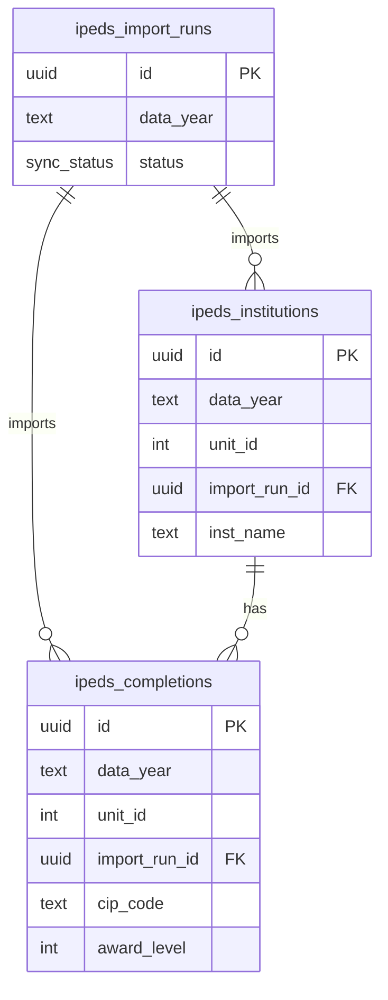

# US Universities ERD

Mechanical table reference for the US Universities/IPEDS research-console domain. The
runtime reads a curated IPEDS slice imported by local scripts; these tables are not
part of the Wise snapshot model.

## Tables

| Table | Grain |
|---|---|
| `ipeds_import_runs` | One IPEDS import run for a data year. |
| `ipeds_institutions` | One institution per IPEDS data year and unit id. |
| `ipeds_completions` | One completion/CIP/award-level row per institution and data year. |

`ipeds_institutions` and `ipeds_completions` share the natural key pair
`data_year` + `unit_id`; only `import_run_id` is an enforced foreign key.

_Verified against HEAD + uncommitted WIP on 2026-07-02._
