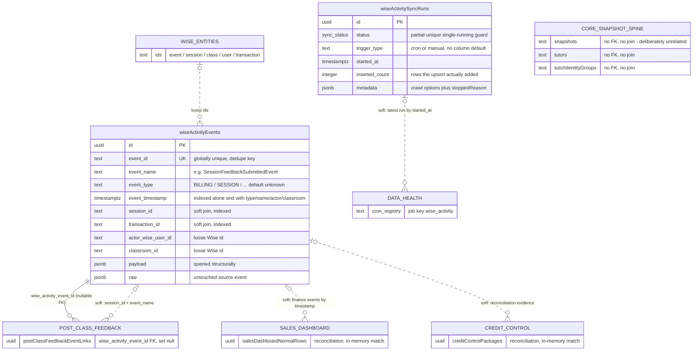

# Database Reference — Wise Activity Audit (ER Diagram)

Scope: the 2 tables backing the Wise Activity Audit feature (**stable**). The domain keeps a **persisted, append-only mirror of the Wise institute event feed** — `GET /institutes/{id}/events`, crawled 50 rows per page (`src/lib/wise/fetchers.ts:498-517`) — so the app can answer "what changed in Wise, when, and who did it" without re-querying a slow, paginated API.

Two structural facts set this domain apart from every other sync lineage in the schema:

1. **Events carry no run id.** `wise_activity_sync_runs` is pure observability — nothing points at a run, and no row is ever rewritten by a later one. Contrast the payroll and credit-control lineages, where a run id is the write scope ([`./erd-payroll.md`](./erd-payroll.md)).
2. **The mirror is append-only and snapshot-independent.** There is no `snapshot_id`, no `UPDATE`, and no `DELETE` — the sole production write is one conflict-tolerant `INSERT` (`src/lib/wise-activity/sync.ts:225-229`). Rows therefore survive Wise snapshot rotation and accumulate indefinitely.

Full column-by-column detail (types, defaults, every index) lives in [`./index.md`](./index.md); enum value sets live in [`./enums.md`](./enums.md). This page covers grain, keys, and relationships only. For purpose, business rules, and flows see [`../../features/wise-activity-audit.md`](../../features/wise-activity-audit.md); for the HTTP surface see [`../api/wise-activity.md`](../api/wise-activity.md).

## Scope

Exactly 2 tables (Drizzle export — Postgres table — `src/lib/db/schema.ts` line range):

| Table (varName) | Postgres table | Lines | Grain scope |
|---|---|---|---|
| `wiseActivityEvents` | `wise_activity_events` | 518–551 | one row per Wise event, forever |
| `wiseActivitySyncRuns` | `wise_activity_sync_runs` | 553–571 | one row per ingest attempt |

Both landed together in `drizzle/0027_wise_activity_audit.sql` and the DDL there still matches the Drizzle declaration column for column — no later migration alters either table — the only other DDL to name them is `drizzle/0055_post_class_feedback.sql:228`, which adds the one inbound foreign key described below (`drizzle/0062_post_class_deleted_sessions.sql:16` mentions the mirror in a comment only).

## Relationship model

**Enforced foreign keys — one, and it points inward.** Neither table declares a `.references(...)` of its own; the entire domain has zero outbound FKs. The single `.references(() => wiseActivityEvents.…)` anywhere in the schema is:

- `postClassFeedbackEventLinks.wiseActivityEventId` → `wiseActivityEvents.id`, **nullable**, `ON DELETE SET NULL` (`schema.ts:3361`)

Nothing at all references `wiseActivitySyncRuns`.

**Soft keys, no FK.** Every other consumer joins on a loose Wise string, resolved at read time:

- **Post-Class Feedback ⋈ events on `session_id`**, always narrowed by `event_name = 'SessionFeedbackSubmittedEvent'` — the candidate lane (`src/lib/post-class-feedback/repository.ts:928-932`), the per-session detail fetch (`repository.ts:1114-1117`, `src/lib/post-class-feedback/detail.ts:141-144`), the dashboard's Submitted column (`src/lib/post-class-feedback/dashboard.ts:299-305`), and the evidence floor `min(event_timestamp)` (`repository.ts:1123-1125`).
- **The deletion probe.** `SessionDeletedEvent` rows are used as an anti-join to stop the collector re-asking Wise about a session Wise has destroyed: `exists (select 1 from wise_activity_events as deletion_event where deletion_event.event_name = 'SessionDeletedEvent' and deletion_event.session_id = …)` (`repository.ts:56-60`). **The alias is load-bearing** — the highest-priority candidate lane itself selects `FROM wise_activity_events`, so an unaliased correlated subquery would bind both sides to the inner instance and silently match every row (the comment at `repository.ts:51-55` records exactly this).
- **Package-sales reconciliation ⋈ `salesDashboardNormalRows` + `creditControlPackages`**, matched entirely in memory after three independent `SELECT`s (`src/lib/wise-activity/reconciliation.ts:862-879` for the report, `:950-966` for the summary). The finance predicate is duplicated verbatim in both: `event_type = 'BILLING' OR transaction_id IS NOT NULL OR event_name ILIKE '%invoice%'/'%payment%'/'%transaction%'`, minus anything matching `'%payout%'`.
- **Data Health ⋈ the run ledger** — the freshness panel simply takes the most recent runs by `started_at` (`src/lib/data-health/dashboard.ts:770`), keyed to registry job `wise_activity` (`src/lib/data-health/cron-registry.ts:64-77`).

**No relationship to the core snapshot spine.** `wise_activity_events` has no `snapshot_id` column and is never joined to `snapshots`, `tutors`, or the tutor identity-group tables. Its `actor_wise_user_id`, `classroom_id`, `session_id`, and `transaction_id` are opaque Wise strings, indexed but unconstrained. The core spine appears in the diagram below only to record that absence.

## ER diagram

`wiseActivityEvents` and `wiseActivitySyncRuns` are drawn unconnected because they genuinely are: the ledger records that a crawl happened, not which rows it produced.

## Tables

### `wiseActivityEvents` (`wise_activity_events`, lines 518–551)

**Grain:** one row per Wise institute event, deduped for all time on the Wise-supplied `event_id` — `wise_activity_events_event_id_idx` is UNIQUE on that column alone (`schema.ts:543`). Not scoped to a month, a run, or a snapshot.

Columns group into five facets plus provenance: **event identity** (`eventId`, `eventType` default `"unknown"`, `eventName`, `eventTimestamp`), **actor** (`actorWiseUserId`, `actorName`, `actorRole`), **classroom** (`classroomId`, `classroomName`, `classroomSubject`), **session** (`sessionId`, `sessionStartTime`, `sessionEndTime`), **transaction** (`transactionId`, `transactionType`, `transactionStatus`, `transactionAmount` as `double precision`, `transactionCurrency`), and two jsonb blobs — `payload` (the flattened `event.payload`) and `raw` (the whole source object, untouched).

**Seven secondary indexes** back the console's filter set (`schema.ts:544-550`): `event_timestamp` alone; `(event_type, event_timestamp)`; `(event_name, event_timestamp)`; `(actor_wise_user_id, event_timestamp)`; `(classroom_id, event_timestamp)`; `session_id`; `transaction_id`. The two single-column ones exist for the cross-domain probes, not the console — `session_id` carries the Post-Class deletion anti-join and the feedback-evidence lookups.

**The two `notNull` timestamps are enforced upstream, not by luck.** `normalizeWiseActivityEvent` returns `null` when either `event.eventId` or `event.eventTimestamp` is missing or unparseable, and the caller filters nulls out before the insert (`sync.ts:103`, `:209-211`). A malformed event is dropped, never stored with a guessed key. Missing-but-optional fields degrade instead: `eventType` falls back to `"unknown"` and `eventName` to `"UnknownEvent"` (`sync.ts:106-107`).

**`payload` is queried, not merely archived.** The dashboard reads into it with jsonb path operators — `coalesce(payload -> 'session' ->> 'autoSubmitted', 'false') <> 'true'` — to separate genuine tutor submissions from Wise's auto-submissions (`dashboard.ts:303`; the same flag is read in TypeScript at `detail.ts:40-44`). There is no index supporting that predicate; it rides on the `session_id` / `event_name` narrowing that precedes it.

**Append-only in the strict sense.** The only write in `src/` is `INSERT … ON CONFLICT (event_id) DO NOTHING … RETURNING id` (`sync.ts:225-229`); no `UPDATE` and no `DELETE` against this table exists outside integration-test fixtures. A consequence worth naming: `updatedAt` is stamped once at first insert (`sync.ts:126`) and can never move, so it is effectively a second `createdAt` rather than a change marker. A re-observed event keeps whatever Wise said the first time.

The `RETURNING` clause does double duty — a page whose upsert inserted zero rows *is*, by definition, a page of already-known events, which is how the incremental crawl decides to stop (`sync.ts:232`, `:242-244`).

### `wiseActivitySyncRuns` (`wise_activity_sync_runs`, lines 553–571)

**Grain:** one row per attempted crawl. Purely a ledger — it is not the write scope for anything, and no table carries a `wise_activity_sync_run_id`.

Carries `status` ([`sync_status`](./enums.md#sync_status): `running` / `success` / `failed`, default `running`), `triggerType`, the `startedAt` / `finishedAt` pair, three counters (`pagesFetched`, `eventsFetched`, `insertedCount`), the observed event window (`oldestEventTimestamp` / `newestEventTimestamp`), an `errorSummary`, and a `metadata` jsonb.

**`triggerType` is `notNull` with no column default** — unlike the payroll ledger's `"manual"` default. Every insert must state its trigger, and `syncWiseActivityEvents` defaults it to `"cron"` when the caller omits it (`sync.ts:159`). The cron route passes `"cron"` explicitly (`src/app/api/internal/sync-wise-activity/route.ts:24`); both admin routes pass `"manual"` (`src/app/api/wise-activity/sync/route.ts:44`, `src/app/api/wise-activity/reconciliation/backfill/route.ts:43`).

**Single-flight lives in Postgres, not application code.** `wise_activity_sync_runs_single_running_idx` is a unique index on `status` filtered to `status = 'running'` (`schema.ts:567-569`), so a second concurrent run fails its `INSERT` with SQLSTATE `23505`; `isUniqueViolation` recognises it — including by matching the index name in the driver message — and it is rethrown as `WiseActivitySyncAlreadyRunningError` (`sync.ts:57-65`, `:182`), which all three routes translate to **HTTP 409**. A `markAbandonedRuns` sweep runs before each attempt and flips any `running` row older than 20 minutes to `failed`, stamping the reason into `errorSummary` (`sync.ts:13`, `:130-141`, called at `:167`).

**`metadata` is the crawl's audit trail.** It is written twice: at insert with the resolved options (`lookbackDays`, `maxPages`, `startPage`, `eventName`, `stopOnKnownEvents` — `sync.ts:176`), and again on completion with `stoppedReason` appended (`sync.ts:258`). That reason is one of `max_pages`, `empty_page`, `short_page`, `lookback_reached`, or `known_events` (`sync.ts:191`, `:205`, `:235`, `:239`, `:243`) and is the only record of *why* a crawl ended where it did — the counters alone cannot distinguish "caught up" from "hit the page cap".

The second index, `wise_activity_sync_runs_status_started_idx` on `(status, startedAt)`, serves both the abandoned-run sweep and Data Health's most-recent-runs read.

## Cross-domain notes

- **Post-Class Feedback → `wiseActivityEvents`** — the heaviest consumer, and the reason this mirror is load-bearing rather than merely informational. `postClassFeedbackEventLinks` holds the hard FK (`schema.ts:3361`) while the collector, dashboard, detail view, and payout writer all re-join on `session_id` + `event_name`. The payout path inner-joins `postClassFeedbackEventLinks → wiseActivityEvents` **on that FK**, so a link whose mirror row has gone contributes no submission timestamp (`src/lib/post-class-feedback/payout-repository.ts:168-189`, `:531-550`). See [`../../features/post-class-feedback.md`](../../features/post-class-feedback.md); its tables are diagrammed in [`./erd-core.md`](./erd-core.md).
- **Sales Dashboard + Credit Control → `wiseActivityEvents`** — read-only, at report time, for package-sales reconciliation ([`./erd-sales-dashboard.md`](./erd-sales-dashboard.md), [`./erd-credit-control.md`](./erd-credit-control.md)). No row is written back to either domain.
- **Data Health → `wiseActivitySyncRuns`** — cron freshness only.
- **Nothing writes toward Wise.** The domain is a one-way mirror; there is no writeback path from these tables to the Wise API.

## Write-path note

Ingest is deliberately *not* transactional, and does not need to be. Each page is upserted on its own (`sync.ts:224-230`), so a crawl that dies mid-run leaves every page it already committed in place — correct, because the unique `event_id` makes re-ingest idempotent. The run row is then flipped to `failed` with the error message in `errorSummary` and the partial counters preserved (`sync.ts:273-289`).

Crawl depth is set by the trigger rather than the table: cron runs 3 days back over at most 20 pages, manual runs 30 days over at most 500 (`sync.ts:9-12`), and the loop also stops early on an empty page, a short page, reaching the lookback cutoff, or a fully-known page. `stopOnKnownEvents` must be disabled for a deep backfill — on a re-run, page one is already known and would halt the crawl immediately (`sync.ts:26-32`). The admin sync route additionally restricts server-side `eventName` targeting to an allowlist of exactly one name, `SessionFeedbackSubmittedEvent`, so a caller cannot steer the crawl at an arbitrary feed (`src/app/api/wise-activity/sync/route.ts:11-13`).

Scheduling: `vercel.json:29-30` runs `/api/internal/sync-wise-activity` at `2,17,32,47 * * * *` (every 15 minutes), matched by registry job `wise_activity` with `maxDurationSeconds: 800` and `lateAfterMinutes: 30` (`src/lib/data-health/cron-registry.ts:64-77`). Full table: [`../crons.md`](../crons.md).

## Open questions

- **The mirror has no retention policy.** `wise_activity_events` is append-only with no pruning path anywhere in `src/`, no `snapshot_id` to rotate, and a `raw` jsonb copy of every source event alongside the flattened `payload`. Growth is bounded only by Wise's event volume. Whether that is a deliberate keep-forever audit decision or simply unaddressed is not answerable from the code.
- **Coverage before the mirror's floor is unknowable from the schema.** Post-Class Feedback works around this explicitly — a comment records that the `SessionDeletedEvent` mirror only reaches back to a fixed date and that earlier sessions get a time-based grace window instead of a deletion verdict (`src/lib/post-class-feedback/repository.ts:72-77`). Nothing in the tables themselves records how far back the crawl has ever reached; the per-run `oldestEventTimestamp` is the closest proxy and only covers one run.
- **`updatedAt` never updates.** Given `ON CONFLICT DO NOTHING` and no `UPDATE` path, the column is indistinguishable from `createdAt` in practice. Whether a re-observed event was ever meant to refresh its stored `payload` / `raw` — Wise events are immutable, so plausibly not — is not stated in code.
- **Two finance predicates, two definitions.** `buildConditions`' `financeOnly` filter matches `'%payout%'` (`src/lib/wise-activity/data.ts:108-116`) while reconciliation matches `'%transaction%'` and explicitly *excludes* `'%payout%'` (`reconciliation.ts:870-877`). Both are hand-maintained SQL rather than a shared helper — and neither matches `isWiseFinanceEvent`, the TypeScript predicate used for the summary cards (`src/lib/wise-activity/format.ts:57-66`). Whether the divergence is intentional scoping or drift is not determinable from the code.

_Verified against main@0cd1e81 (clean tree) on 2026-09-02._
