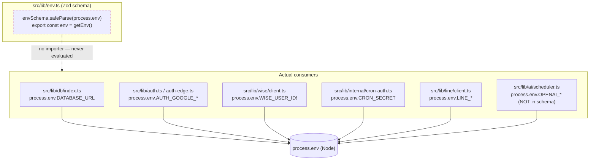
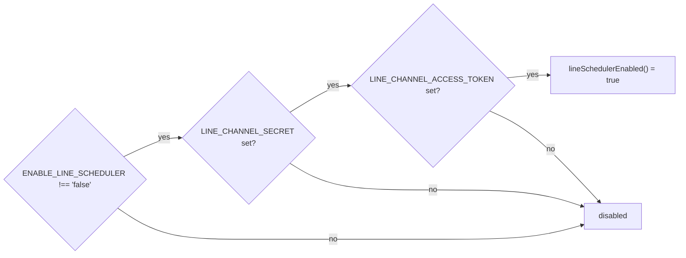
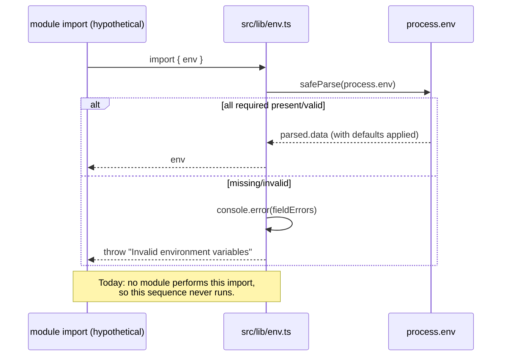

# Environment Variables

Canonical reference for every environment variable BGScheduler reads. The
**source of truth for declared, validated variables** is the Zod schema in
`src/lib/env.ts:3`. This document reconciles that schema against the prose claim
of "9 required" variables, then catalogs the larger set of variables that the
running code reads directly from `process.env` *without* going through the
schema.

> **Maturity:** Stable mechanism (Zod-validated env module), but see the
> [Critical caveat](#critical-caveat-the-validated-env-object-is-never-imported)
> — the validation layer is currently dormant, and most variables are read
> outside it.

---

## TL;DR — the precise Zod truth vs. the "9 required" claim

`README.md` / `AGENTS.md` / `CLAUDE.md` all repeat a table titled
**"Environment Variables (9 required)"**. That count does not match the literal
Zod schema. Here is the exact reconciliation, derived from `src/lib/env.ts:3-16`:

| Bucket | Zod modifier | Count | Variables |
|---|---|---|---|
| **Hard-required** (fails parse if unset/empty) | `.url()` or `.min(1)` | **7** | `DATABASE_URL`, `AUTH_GOOGLE_ID`, `AUTH_GOOGLE_SECRET`, `AUTH_SECRET`, `WISE_USER_ID`, `WISE_API_KEY`, `CRON_SECRET` |
| **Defaulted** (parses fine when unset; falls back to a literal) | `.default(...)` | **2** | `WISE_NAMESPACE` → `"begifted-education"`, `WISE_INSTITUTE_ID` → `"696e1f4d90102225641cc413"` |
| **Optional** (may be absent; if present must be non-empty for the two `.min(1)` ones) | `.optional()` | **3** | `LINE_CHANNEL_SECRET`, `LINE_CHANNEL_ACCESS_TOKEN`, `ENABLE_LINE_SCHEDULER` |
| **Total declared in schema** | | **12** | |

So the **strict Zod truth is 7 hard-required variables**, not 9. The "9" in the
prose is the count of the *nine documented operational variables* — the 7
hard-required ones plus the 2 `WISE_*` variables that carry `.default(...)`
literals. The two defaulted variables are documented as "required" because
production overrides them, but the schema will happily parse without them.

The three optional LINE/feature-flag variables in the schema
(`src/lib/env.ts:13-15`) are omitted from the prose "9" entirely.

---

## Critical caveat: the validated `env` object is never imported

`src/lib/env.ts:29` eagerly runs validation at module-eval time:

```ts
export const env = getEnv(); // safeParse(process.env); throws on failure
```

**However, no file in the repository imports `@/lib/env` or the exported `env`
object.** A repo-wide search for any import of `lib/env` (excluding
`node_modules` and `.next`) returns zero matches. Consequences:

- The Zod schema in `src/lib/env.ts` is **effectively dead code at runtime** —
  `getEnv()` only executes if something imports the module, and nothing does.
- The fail-fast "missing env vars throw at startup via Zod validation"
  guarantee described in the conventions docs **does not actually fire**, because
  the throwing module is never loaded.
- Every real consumer reads `process.env.*` **directly**, each applying its own
  ad-hoc fallback or guard. This means the *de facto* required/optional status
  of a variable is determined by its **consumption site**, not by the schema.

This is the single most important fact in this document. The tables below
therefore distinguish **"in schema"** (what Zod declares) from **"runtime
behavior"** (what the consuming code actually does when the variable is absent).



---

## Schema-declared variables (`src/lib/env.ts`)

These are the 12 variables the Zod schema knows about. "Runtime guard" describes
what the *actual consumer* does on absence (since the schema validation never
runs).

### Hard-required (7)

| Variable | Schema (`src/lib/env.ts`) | Purpose | Consumed at | Runtime guard on absence |
|---|---|---|---|---|
| `DATABASE_URL` | `.url()` (line 4) | Neon Postgres connection string. The single backing store for snapshots, sync runs, activity events, payroll, etc. | `src/lib/db/index.ts:6`; `src/lib/db/seed.ts:6`; `src/lib/payroll/sync.ts:94` | `createDb()` throws `"DATABASE_URL is not set"` (`src/lib/db/index.ts:7-9`) |
| `AUTH_GOOGLE_ID` | `.min(1)` (line 5) | Google OAuth client ID for Auth.js sign-in. | `src/lib/auth.ts:28`; `src/lib/auth-edge.ts:7`; also reused for Sales Dashboard OAuth at `src/lib/sales-dashboard/google-oauth.ts:142` | None at read site; Auth.js fails the OAuth flow if unset |
| `AUTH_GOOGLE_SECRET` | `.min(1)` (line 6) | Google OAuth client secret. | `src/lib/auth.ts:29`; `src/lib/auth-edge.ts:8`; `src/lib/sales-dashboard/google-oauth.ts:143` | None at read site (falls back to `""` in google-oauth) |
| `AUTH_SECRET` | `.min(1)` (line 7) | Auth.js session/JWT encryption key. Also used to sign Sales Dashboard OAuth state. | `src/lib/sales-dashboard/google-oauth.ts:38` (and implicitly by Auth.js core via `process.env`) | `google-oauth` reads it into `secret` (line 38) — see source for its own guard |
| `WISE_USER_ID` | `.min(1)` (line 8) | Wise API user ID; half of the Basic-Auth credential pair. | `src/lib/wise/client.ts:161` (non-null `!`); `src/lib/classrooms/data.ts:1133`; guarded in `src/lib/wise-activity/reconciliation.ts:729,756` | `createWiseClient` uses `!` (no throw); reconciliation **does** guard: bails if `WISE_USER_ID` or `WISE_API_KEY` missing (`reconciliation.ts:729`) |
| `WISE_API_KEY` | `.min(1)` (line 9) | Wise API key; the other half of the credential pair. | `src/lib/wise/client.ts:162` (non-null `!`); `src/lib/classrooms/data.ts:1134`; `reconciliation.ts:729,756` | Same as `WISE_USER_ID` — `!` at client, explicit guard in reconciliation |
| `CRON_SECRET` | `.min(1)` (line 12) | Bearer secret protecting every internal cron/sync endpoint. | Central helper `src/lib/internal/cron-auth.ts:8`; also read directly in `src/app/api/internal/sync-wise/route.ts:16`, `sync-sales-dashboard/route.ts:16`, `sync-credit-control/route.ts:12`, `sync-room-utilization/route.ts:13` | `getCronSecretStatus` returns `"missing-secret"` → endpoint responds **500 "Server misconfigured"** (`cron-auth.ts:10,22-24`) |

> **`CRON_SECRET` is compared with a constant-time check.** `cron-auth.ts:14`
> uses `timingSafeEqual` against `Bearer ${cronSecret}`, with a length check to
> avoid the `timingSafeEqual` length-mismatch throw. See the Cron/sync
> reference for which endpoints gate on it.

### Defaulted (2)

| Variable | Schema (`src/lib/env.ts`) | Default literal | Purpose | Consumed at |
|---|---|---|---|---|
| `WISE_NAMESPACE` | `.default(...)` (line 10) | `"begifted-education"` | Wise tenant namespace; sent as `x-wise-namespace` header. | `src/lib/wise/client.ts:163` (`?? "begifted-education"`); `src/lib/classrooms/data.ts:1135` |
| `WISE_INSTITUTE_ID` | `.default(...)` (line 11) | `"696e1f4d90102225641cc413"` | Wise institute ID; path segment for institute-scoped Wise calls. | Many sites, each with its own inline default: `src/lib/sync/run-wise-sync.ts:145`, `src/lib/classrooms/data.ts:874,973,1450,1770`, `morning-automation.ts:188`, `credit-control/run-sync-request.ts:141`, `wise-activity/reconciliation.ts:740,767`, and route handlers `sync-wise-activity/route.ts:19`, `wise-activity/sync/route.ts:34`, `wise-activity/reconciliation/backfill/route.ts:41`, `payroll/sync/route.ts:37` |

> **The schema defaults are redundant in practice.** Because consumers read
> `process.env.WISE_INSTITUTE_ID` directly, they each re-apply the literal
> `?? "696e1f4d90102225641cc413"` at the call site (e.g.
> `run-wise-sync.ts:145`). The schema's `.default()` would only matter if code
> read the `env` object — which it does not. One exception:
> `src/lib/room-capacity/utilization.ts:433` reads `process.env.WISE_INSTITUTE_ID`
> with **no fallback**, so for that path the variable is effectively required.

### Optional — LINE feature flag + credentials (3)

| Variable | Schema (`src/lib/env.ts`) | Purpose | Consumed at | Behavior |
|---|---|---|---|---|
| `LINE_CHANNEL_SECRET` | `.min(1).optional()` (line 13) | LINE Messaging API channel secret; used to verify inbound webhook signatures and as a feature gate. | `src/lib/line/client.ts:21,26` | Part of the `lineSchedulerEnabled()` AND-gate (`client.ts:19-23`); exposed via `lineChannelSecret()` |
| `LINE_CHANNEL_ACCESS_TOKEN` | `.min(1).optional()` (line 14) | LINE Messaging API bot access token; used as `Authorization: Bearer` for outbound LINE calls. | `src/lib/line/client.ts:22,30` | Part of the same AND-gate; `lineAccessToken()` **throws** `"LINE_CHANNEL_ACCESS_TOKEN is not configured"` if read while unset (`client.ts:31`) |
| `ENABLE_LINE_SCHEDULER` | `.optional()` (line 15) | Feature flag for the LINE scheduler. **Opt-out**, not opt-in. | `src/lib/line/client.ts:20` | `lineSchedulerEnabled()` is true unless this is exactly the string `"false"` **and** both LINE credentials are present (`client.ts:20-22`) |



---

## Variables read at runtime but **not** in the Zod schema

These variables are consumed by `process.env.*` reads in shipping code but are
**absent from `src/lib/env.ts`**, so they receive **no validation** and no
schema default. The project-level `.env.example` now lists every non-injected
variable in this section; Vercel, GitHub, and local-shell variables are called
out separately.

### AI scheduler (OpenAI)

| Variable | In `.env.example`? | Purpose | Consumed at | Default / guard |
|---|---|---|---|---|
| `OPENAI_API_KEY` | Yes (line 19) | OpenAI API key for the AI scheduler + LINE classifier. Also doubles as a feature gate. | `src/lib/ai/scheduler.ts:479,539`; `scheduler-conversation.ts:2341`; `src/lib/line/classifier.ts:93`; `src/lib/line/contact-aliases.ts:363` | `isAiSchedulerConfigured()` requires a non-empty trimmed value (`scheduler.ts:477-480`); `runAiScheduler` no-ops if missing (`scheduler.ts:539-540`) |
| `OPENAI_SCHEDULER_MODEL` | Yes (line 20) | Model name for the AI scheduler. | `src/lib/ai/scheduler.ts:462` | Falls back to `DEFAULT_AI_SCHEDULER_MODEL = "gpt-5.4-mini"` (`scheduler.ts:8,462`) |
| `OPENAI_SCHEDULER_SHADOW_MODEL` | Yes | Optional secondary "shadow" model run alongside the primary. | `src/lib/ai/scheduler.ts:466` | `undefined` when unset (no shadow run) |
| `OPENAI_SCHEDULER_REASONING_EFFORT` | Yes | Reasoning-effort tier (`none`/`low`/`medium`/`high`/`xhigh`). | `src/lib/ai/scheduler.ts:470` | Invalid/unset → `DEFAULT_AI_SCHEDULER_REASONING_EFFORT` (`scheduler.ts:474`) |
| `ENABLE_AI_SCHEDULER` | Yes (line 21) | Opt-out feature flag for the AI scheduler. | `src/lib/ai/scheduler.ts:478,540` | Disabled only when exactly `"false"`; otherwise enabled if `OPENAI_API_KEY` present (`scheduler.ts:477-480`) |

### Progress tests

| Variable | In `.env.example`? | Purpose | Consumed at | Default / guard |
|---|---|---|---|---|
| `OPENAI_PROGRESS_TEST_MODEL` | Yes | Optional model override for progress-test teacher-summary generation. | `src/lib/progress-tests/ai-summary.ts:88` | Falls back to the AI-scheduler default model. |
| `WISE_SESSION_CREATE_VERIFIED` | Yes | Hard kill-switch for creating Wise progress-test sessions. | `src/lib/progress-tests/config.ts:50` | Enabled only when exactly `"true"`; otherwise bookings stay local/manual-required. |

### LINE auxiliary

| Variable | In `.env.example`? | Purpose | Consumed at | Default / guard |
|---|---|---|---|---|
| `LINE_VALIDATION_LEAD_EMAILS` | Yes | Comma-separated allowlist of lead reviewer emails for LINE link-validation. | `src/lib/line/link-validation.ts:221` | Falls back to `DEFAULT_LINE_VALIDATION_LEAD_EMAILS` (`link-validation.ts:112-115`) |

> Note: `WISE_SESSION_OPERATIONS_VERIFIED` (below) also gates LINE-driven Wise
> writeback via `src/lib/line/operational.ts:21`.

### Classroom schedule emails (Google Apps Script bridge)

All read with `?.trim()` and no schema entry; consumed in
`src/lib/classrooms/schedule-email.ts`.

| Variable | In `.env.example`? | Purpose | Consumed at | Default / guard |
|---|---|---|---|---|
| `SCHEDULE_EMAIL_APPS_SCRIPT_URL` | Yes (line 29) | Primary Apps Script web-app URL that actually sends the email. | `schedule-email.ts:299` | None — primary transport endpoint |
| `SCHEDULE_EMAIL_APPS_SCRIPT_SECRET` | Yes (line 30) | Shared secret authenticating to the primary Apps Script. | `schedule-email.ts:300` | None |
| `SCHEDULE_EMAIL_BACKUP_APPS_SCRIPT_URL` | Yes (line 31) | Fallback Apps Script URL. | `schedule-email.ts:291` | Optional backup transport |
| `SCHEDULE_EMAIL_BACKUP_APPS_SCRIPT_SECRET` | Yes (line 32) | Shared secret for the backup Apps Script. | `schedule-email.ts:292` | Optional |
| `SCHEDULE_EMAIL_SENDER_NAME` | Yes (line 33) | Display name for the sender. | `schedule-email.ts:606` | Defaults to `"BeGifted"` |
| `SCHEDULE_EMAIL_REPLY_TO` | Yes (line 34) | Reply-to address. | `schedule-email.ts:607` | Defaults to hard-coded `"kevhsh7@gmail.com"` |
| `SCHEDULE_EMAIL_PUBLIC_BASE_URL` | Yes | Override for the public base URL used in email links. | `schedule-email.ts:266`; also `src/lib/leave-requests/config.ts:19` | First in a cascade (see below) |

### Tutor leave requests (Google Sheets bridge)

Consumed in `src/lib/leave-requests/config.ts`.

| Variable | In `.env.example`? | Purpose | Consumed at | Default / guard |
|---|---|---|---|---|
| `LEAVE_REQUESTS_SPREADSHEET_ID` | Yes (line 37) | Google Sheet ID holding form responses. | `config.ts:2` | Defaults to a hard-coded sheet ID literal |
| `LEAVE_REQUESTS_SHEET_NAME` | Yes (line 38) | Worksheet/tab name. | `config.ts:5` | Defaults to `"Form Responses 1"` |
| `LEAVE_REQUESTS_CONNECTED_EMAIL` | Yes (line 39) | Google account with Sheets write scope. | `config.ts:13` | Falls back to `SALES_DASHBOARD_CONNECTED_EMAIL`, then `""` |
| `SALES_DASHBOARD_CONNECTED_EMAIL` | Yes | Google account for the Sales Dashboard sync; also the fallback for the leave-requests connected email. | `src/lib/leave-requests/config.ts:13` | Falls back to `""` |
| `NEXT_PUBLIC_APP_URL` | Yes (line 40) | Public app base URL (client-exposed `NEXT_PUBLIC_*`). | `config.ts:18` | First in the leave-requests base-URL cascade |

### Competitor intelligence

These variables control the competitor-intelligence sync and its optional paid
providers. Missing provider credentials do not fail the whole app: the provider
path skips with a `skippedReason`, and website/manual sources can still run.

| Variable | In `.env.example`? | Purpose | Consumed at | Default / guard |
|---|---|---|---|---|
| `ENABLE_COMPETITOR_AI` | Yes | Opt-out flag for AI-generated competitor briefs and War Room insights. | `src/lib/competitor-intelligence/ai.ts:71` | Disabled only when exactly `"false"`; also requires `OPENAI_API_KEY`. |
| `OPENAI_COMPETITOR_INTEL_MODEL` | Yes | Optional model override for competitor-intelligence AI. | `src/lib/competitor-intelligence/ai.ts:65` | Falls back to `OPENAI_SCHEDULER_MODEL`, then `"gpt-5.4-mini"`. |
| `APIFY_API_TOKEN` | Yes | Apify API token for Instagram/Facebook source captures. | `src/lib/competitor-intelligence/providers.ts:70,93` | Missing token skips Apify social sources. |
| `APIFY_INSTAGRAM_ACTOR` | Yes | Apify actor id for Instagram scraping. | `src/lib/competitor-intelligence/providers.ts:17` | Defaults to `"apify/instagram-scraper"`. |
| `APIFY_FACEBOOK_ACTOR` | Yes | Apify actor id for Facebook scraping. | `src/lib/competitor-intelligence/providers.ts:18` | Defaults to `"apify/facebook-posts-scraper"`. |
| `DATAFORSEO_LOGIN` | Yes | DataForSEO login for SERP captures. | `src/lib/competitor-intelligence/providers.ts:130` | Missing login/password skips SERP sources. |
| `DATAFORSEO_PASSWORD` | Yes | DataForSEO password for SERP captures. | `src/lib/competitor-intelligence/providers.ts:131` | Missing login/password skips SERP sources. |
| `COMPETITOR_APIFY_COST_PER_ITEM_USD` | Yes | Estimated Apify cost per returned social item for budget tracking. | `src/lib/competitor-intelligence/providers.ts:119` | Invalid/unset → `0.01`. |
| `COMPETITOR_DATAFORSEO_COST_PER_QUERY_USD` | Yes | Estimated DataForSEO cost per SERP query for budget tracking. | `src/lib/competitor-intelligence/providers.ts:164` | Invalid/unset → `0.002`. |
| `COMPETITOR_INTEL_MONTHLY_CAP_USD` | Yes | Global monthly hard cap for paid competitor-intelligence providers. | `src/lib/competitor-intelligence/budget.ts:20` | Invalid/unset paid providers default to `250`; website/manual sources are uncapped. |
| `COMPETITOR_<PROVIDER>_MONTHLY_CAP_USD` | Pattern | Provider-specific monthly hard cap; for example `COMPETITOR_DATAFORSEO_MONTHLY_CAP_USD`. | `src/lib/competitor-intelligence/budget.ts:19` | Overrides `COMPETITOR_INTEL_MONTHLY_CAP_USD` for that normalized provider key. |
| `COMPETITOR_DATAFORSEO_MONTHLY_CAP_USD` | Yes | Concrete provider-specific cap for DataForSEO. | `src/lib/competitor-intelligence/budget.ts:19` | Optional; falls back to the global cap. |

### Wise writeback safety + seed + platform-injected

| Variable | In `.env.example`? | Purpose | Consumed at | Default / guard |
|---|---|---|---|---|
| `WISE_SESSION_OPERATIONS_VERIFIED` | Yes | Hard kill-switch for **writing back to Wise** (session location updates). Writeback is enabled **only** when this equals the string `"true"`. | `src/lib/wise/operations.ts:11`; `src/lib/line/operational.ts:21` | Defaults to *disabled* (anything but `"true"`) — fail-closed |
| `SEED_ADMIN_EMAILS` | Yes | Comma-separated admin emails for the one-off DB seed script. | `src/lib/db/seed.ts:31` | Empty → seed logs "No SEED_ADMIN_EMAILS set, skipping admin user seed" (`seed.ts:42`) |
| `VERCEL_PROJECT_PRODUCTION_URL` | No (injected by Vercel) | Production hostname, used to derive the email public base URL on Vercel. | `src/lib/classrooms/schedule-email.ts:269` | Vercel-provided; part of cascade |
| `VERCEL_URL` | No (injected by Vercel) | Per-deployment hostname fallback for base-URL derivation. | `src/lib/classrooms/schedule-email.ts:272`; `src/lib/leave-requests/config.ts:15` | Vercel-provided; last-resort in cascade |
| `GITHUB_ACTOR` | No (injected by GitHub Actions) | Used by the Sales Dashboard scope guard to bypass local-only behavior for Dependabot. | `scripts/check-sales-dashboard-scope.mjs:14` | Empty outside GitHub Actions. |
| `USER` | No (local shell) | Records the local user as `createdBy` when importing the room-capacity model. | `scripts/import-room-capacity-model.ts:303` | Falls back to `null`. |

### Local scripts / release guard

| Variable | In `.env.example`? | Purpose | Consumed at | Default / guard |
|---|---|---|---|---|
| `PRODUCTION_BRANCH` | Yes | Overrides the branch expected by the production-deploy guard. | `scripts/assert-production-deploy-ready.mjs:5` | Defaults to `"main"`. |
| `CONFIRM_DELETE_LINE_TEST_DATA` | Yes | Confirmation guard for the destructive LINE test-data cleanup script. | `scripts/delete-line-test-data.ts:34` | Cleanup refuses to run unless the script-specific confirmation is set as required by that script. |

> **Base-URL cascades.** Two independent fallback chains derive a public URL:
> - schedule-email (`schedule-email.ts:266-272`): `SCHEDULE_EMAIL_PUBLIC_BASE_URL`
>   → `VERCEL_PROJECT_PRODUCTION_URL` → `VERCEL_URL`.
> - leave-requests (`config.ts:15-19`): `NEXT_PUBLIC_APP_URL` →
>   `SCHEDULE_EMAIL_PUBLIC_BASE_URL` → derived from `VERCEL_URL`.

---

## How validation *would* work (if `env` were imported)

For completeness, the schema's mechanics (`src/lib/env.ts:20-29`):

- `getEnv()` runs `envSchema.safeParse(process.env)` (line 21).
- On failure it logs the **flattened field errors** via `console.error` and
  throws `Error("Invalid environment variables")` (lines 22-25) — a fail-fast
  pattern, but only if the module is loaded.
- The inferred TypeScript type is exported as `type Env = z.infer<typeof envSchema>`
  (`src/lib/env.ts:18`).



---

## Open questions / drift flags

- **Dead validation layer.** `src/lib/env.ts` is never imported, so its Zod
  validation never executes. Either wire it in (e.g. import `env` from a root
  layout or instrumentation hook) or document it as advisory-only. Until then,
  the schema does not enforce anything at runtime.
- **Prose says "9 required"; Zod says 7.** The discrepancy is explained above
  (the 2 `.default()` `WISE_*` vars are counted as required in prose). Worth
  aligning the prose to say "7 hard-required + 2 defaulted".
- **Schema is missing many live optional variables.** `OPENAI_*`,
  `ENABLE_AI_SCHEDULER`, `ENABLE_COMPETITOR_AI`, provider credentials/caps,
  `SCHEDULE_EMAIL_*`, `LEAVE_REQUESTS_*`, progress-test switches,
  `WISE_SESSION_OPERATIONS_VERIFIED`, `LINE_VALIDATION_LEAD_EMAILS`,
  `SALES_DASHBOARD_CONNECTED_EMAIL`, `NEXT_PUBLIC_APP_URL`, and
  `SEED_ADMIN_EMAILS` are all read from `process.env` but absent from
  `src/lib/env.ts`. The schema is no longer a complete inventory.
- **`.env.example` is now a broader inventory than the schema.** It includes the
  optional AI, LINE, schedule-email, leave-request, progress-test, competitor,
  and local-script variables tracked by `npm run docs:audit`, while the Zod
  schema still covers only the original core Auth/Wise/Cron/LINE set. Decide
  whether that split is intentional or whether the schema should grow a
  non-fail-fast optional inventory.
- **Redundant inline defaults.** `WISE_INSTITUTE_ID` / `WISE_NAMESPACE` literals
  are duplicated across ~12 call sites instead of being centralized — and
  `room-capacity/utilization.ts:433` reads `WISE_INSTITUTE_ID` with no fallback,
  diverging from every other consumer.
- **`createWiseClient` uses non-null `!`.** `src/lib/wise/client.ts:161-162`
  asserts `WISE_USER_ID!` / `WISE_API_KEY!`; if these are unset, the client is
  constructed with `undefined` credentials and fails at request time rather than
  at construction — unlike `reconciliation.ts:729`, which guards explicitly.

_Verified against HEAD + uncommitted WIP on 2026-05-31._
