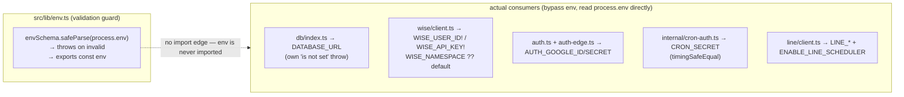
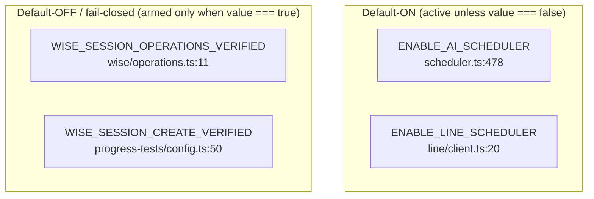

# Environment Variables

> **Canonical reference.** This page is the mechanical source of truth for every environment variable BGScheduler reads. The Zod schema in [`src/lib/env.ts`](../../src/lib/env.ts) is the validation contract; the rest of the variables are read directly from `process.env` by the code that needs them, with no central schema. Feature docs that mention a variable should **link here** rather than restate its rules.

## TL;DR — the precise Zod truth vs. the "9 required" prose

The README/AGENTS prose says "9 required" environment variables. The Zod schema is stricter and more nuanced than that round number. There are **12 keys in the schema** (`src/lib/env.ts:3-16`), in three tiers:

| Zod tier | Count | Keys |
|---|---:|---|
| **Strictly required** (`.url()` / `.min(1)`, no default, no `.optional()`) — startup throws if missing/empty | **7** | `DATABASE_URL`, `AUTH_GOOGLE_ID`, `AUTH_GOOGLE_SECRET`, `AUTH_SECRET`, `WISE_USER_ID`, `WISE_API_KEY`, `CRON_SECRET` |
| **Defaulted** (`.default(...)`) — always satisfied; a hardcoded value fills in when unset | 2 | `WISE_NAMESPACE` → `"begifted-education"`, `WISE_INSTITUTE_ID` → `"696e1f4d90102225641cc413"` |
| **Optional** (`.optional()`) — may be entirely absent | 3 | `LINE_CHANNEL_SECRET`, `LINE_CHANNEL_ACCESS_TOKEN`, `ENABLE_LINE_SCHEDULER` |

**Reconciliation:** the "9 required" figure equals the **7 strictly-required keys plus the 2 defaulted Wise keys** (`WISE_NAMESPACE`, `WISE_INSTITUTE_ID`). The two Wise keys are listed as "required" in the env table in [`AGENTS.md`](../../AGENTS.md), but the Zod schema does **not** require them — it supplies a production default (`src/lib/env.ts:10-11`), so a deploy with both unset still boots and still targets the `begifted-education` tenant. The exact Zod truth is therefore **7 required, 2 defaulted, 3 optional** — not "9 required, 3 optional LINE".

> Note: even the AGENTS env table is internally inconsistent — its prose header says "9 required" but the table itself also lists the three `LEAVE_REQUESTS_*` variables (which have code defaults, are not in the Zod schema, and are not validated at startup). Those, and ~20 other variables, are read straight from `process.env` and never pass through `src/lib/env.ts`. See [Unvalidated runtime variables](#unvalidated-runtime-variables-not-in-the-zod-schema).

## How env validation actually works (and what it does NOT guard)

`src/lib/env.ts` does three things and only three things:

1. Declares `envSchema` (`src/lib/env.ts:3-16`).
2. Defines `getEnv()`, which calls `envSchema.safeParse(process.env)`; on failure it logs **only** `parsed.error.flatten().fieldErrors` (never values) and throws `"Invalid environment variables"` (`src/lib/env.ts:20-27`).
3. Runs `getEnv()` at **module load** and exports the result as `const env` (`src/lib/env.ts:29`).

The throw-on-import is the entire enforcement mechanism: any module that transitively imports `@/lib/env` triggers the validation, and a bad/missing required var crashes that module's load.

**Load-bearing, non-obvious fact:** nothing in `src/` imports `@/lib/env`. A repo-wide search for importers of the validated `env` object returns zero hits outside `src/lib/env.ts` itself. Every real consumer — the DB driver, the Wise client, Auth.js, the cron guard — reads `process.env.*` **directly** and re-implements its own presence check or default:

Consequences worth understanding:

- The Zod guard fires **only if some loaded module imports `@/lib/env`**. Because no app/lib code does, the guard's protection in production depends on the import graph that actually executes. In practice the direct consumers each fail loudly on their own (e.g. `db/index.ts:7-9` throws `"DATABASE_URL is not set"`; `wise/client.ts:161-162` uses non-null assertions `WISE_USER_ID!` / `WISE_API_KEY!` that yield `undefined` Basic-Auth credentials if unset).
- The schema validates `DATABASE_URL` with `z.string().url()` — must be a URL (`src/lib/env.ts:4`) — but the live consumer `db/index.ts:6-9` only checks truthiness, so the URL-shape guarantee is theoretical unless `env.ts` is in the import chain.
- The schema's `.min(1)` on the Wise keys (`src/lib/env.ts:8-9`) is **stricter** than the consumer, which trusts a non-null assertion (`src/lib/wise/client.ts:161-162`).

This split (Zod schema as a documented contract, `process.env` reads as the runtime path) is the single most important thing to know about env handling here.

## Schema variables (the 12 keys in `src/lib/env.ts`)

Citations are to `src/lib/env.ts` for the schema rule and to the primary consumer for runtime use.

### Strictly required (7)

| Variable | Zod rule (`env.ts`) | Purpose | Primary consumer(s) |
|---|---|---|---|
| `DATABASE_URL` | `z.string().url()` — L4 | Neon Postgres connection string; the entire data layer. | `src/lib/db/index.ts:6` (`neon(databaseUrl)`); `src/lib/db/seed.ts:6`; `src/lib/payroll/sync.ts:94` (the `pg` transactional driver used only for payroll). |
| `AUTH_GOOGLE_ID` | `z.string().min(1)` — L5 | Google OAuth client ID for Auth.js sign-in. | `src/lib/auth.ts:19`; edge variant `src/lib/auth-edge.ts:7`; reused as the Sheets OAuth `client_id` at `src/lib/sales-dashboard/google-oauth.ts:142`. |
| `AUTH_GOOGLE_SECRET` | `z.string().min(1)` — L6 | Google OAuth client secret. | `src/lib/auth.ts:20`; `src/lib/auth-edge.ts:8`; Sheets OAuth `client_secret` at `src/lib/sales-dashboard/google-oauth.ts:143`. |
| `AUTH_SECRET` | `z.string().min(1)` — L7 | Auth.js session encryption / JWT signing key. | Read by Auth.js implicitly; also read explicitly for the Google-token store at `src/lib/sales-dashboard/google-oauth.ts:38`. |
| `WISE_USER_ID` | `z.string().min(1)` — L8 | Wise API user ID; half of the Basic-Auth pair to Wise. | `src/lib/wise/client.ts:161` (`WISE_USER_ID!`); `src/lib/classrooms/data.ts:1152`; `src/lib/student-promotions/data.ts:105`; presence-gated in `src/lib/wise-activity/reconciliation.ts:729,756`. |
| `WISE_API_KEY` | `z.string().min(1)` — L9 | Wise API key; other half of the Basic-Auth pair (+ `x-api-key`). | `src/lib/wise/client.ts:162` (`WISE_API_KEY!`); `src/lib/classrooms/data.ts:1153`; `src/lib/student-promotions/data.ts:106`. |
| `CRON_SECRET` | `z.string().min(1)` — L12 | Bearer secret protecting all internal cron routes; compared **constant-time**. | `src/lib/internal/cron-auth.ts:8` (`timingSafeEqual`, REL-07). Also read directly in several cron route handlers, e.g. `src/app/api/internal/sync-wise/route.ts:17`, `.../sync-sales-dashboard/route.ts:17`, `.../sync-credit-control/route.ts:13`, `.../sync-room-utilization/route.ts:14`, `.../student-promotions/july-1/route.ts:11`. |

### Defaulted (2) — present-or-default, never block startup

| Variable | Zod rule (`env.ts`) | Default | Purpose | Primary consumer(s) |
|---|---|---|---|---|
| `WISE_NAMESPACE` | `z.string().default("begifted-education")` — L10 | `begifted-education` | Wise tenant namespace (`x-wise-namespace` header + user-agent). | `src/lib/wise/client.ts:163` (`?? "begifted-education"`); `src/lib/classrooms/data.ts:1154`; `src/lib/student-promotions/data.ts:107`. |
| `WISE_INSTITUTE_ID` | `z.string().default("696e1f4d90102225641cc413")` — L11 | `696e1f4d90102225641cc413` | Wise institute scoping most session/analytics fetchers and writebacks. | Most-referenced env var in the tree (~18 reads). Examples: `src/lib/sync/run-wise-sync.ts:145`, `src/lib/classrooms/data.ts:887,992,1469,1834`, `src/lib/credit-control/run-sync-request.ts:141`, `src/lib/progress-tests/booking.ts:102`, `src/lib/room-capacity/utilization.ts:433`, and route handlers `src/app/api/payroll/sync/route.ts:37`, `.../wise-activity/sync/route.ts:34`, `.../internal/sync-wise-activity/route.ts:23`. Most consumers re-default with `?? "696e1f4d90102225641cc413"` (or a `DEFAULT_INSTITUTE_ID` constant). |

> Because both Wise-scoping keys carry hardcoded production defaults in **two** places (the schema and each consumer's `??`), a misconfigured environment silently targets the production `begifted-education` tenant rather than failing. This is intentional for the single-tenant deployment but means these vars give no protection against accidentally running against prod data.

### Optional (3) — may be entirely absent

| Variable | Zod rule (`env.ts`) | Purpose | Gating behavior |
|---|---|---|---|
| `LINE_CHANNEL_SECRET` | `z.string().min(1).optional()` — L13 | LINE OA channel secret; verifies inbound webhook signatures. | Read at `src/lib/line/client.ts:26`; required-presence is part of `lineSchedulerEnabled()` (`src/lib/line/client.ts:21`). |
| `LINE_CHANNEL_ACCESS_TOKEN` | `z.string().min(1).optional()` — L14 | LINE Messaging API bearer token for replies/pushes. | Read at `src/lib/line/client.ts:30`; absence throws **only when a send is attempted** (`src/lib/line/client.ts:31`). Also part of `lineSchedulerEnabled()` (L22). |
| `ENABLE_LINE_SCHEDULER` | `z.string().optional()` — L15 | Feature flag for the LINE reply / Wise-writeback path. **Tri-state string, default-on.** | `src/lib/line/client.ts:20`: enabled unless the value is exactly `"false"` **and** both LINE creds are present. Unset ⇒ treated as enabled (but still requires the two creds). |

> `ENABLE_LINE_SCHEDULER` is a string flag, not a boolean: the check is `!== "false"` (`src/lib/line/client.ts:20`). Any value other than the literal `"false"` — including `"true"`, `"1"`, or empty — leaves the scheduler **on** (subject to creds). This default-on-unless-`"false"` idiom is shared with `ENABLE_AI_SCHEDULER` below.

## Unvalidated runtime variables (NOT in the Zod schema)

These are read directly from `process.env` and never pass through `src/lib/env.ts`. They are grouped by the subsystem that owns them. None are validated at startup; each consumer applies its own default or guard. `.env.example` documents most (but not all) of them.

### AI scheduler / OpenAI (gated by `ENABLE_AI_SCHEDULER`)

The app calls OpenAI's Responses API over `fetch` with no SDK; all config is `process.env`.

| Variable | In `.env.example`? | Purpose | Consumer + default |
|---|---|---|---|
| `OPENAI_API_KEY` | yes (L19) | OpenAI bearer key. Presence is half the "AI configured" gate. | `src/lib/ai/scheduler.ts:479,539`; `src/lib/ai/scheduler-conversation.ts:2341`; `src/lib/line/classifier.ts:93`; `src/lib/line/contact-aliases.ts:363`; `src/lib/progress-tests/ai-summary.ts:78,164`. No default — features no-op when unset. |
| `ENABLE_AI_SCHEDULER` | yes (L21) | Master AI feature flag (string, default-on). | `src/lib/ai/scheduler.ts:478,540` and `src/lib/progress-tests/ai-summary.ts:77`: AI active unless value is exactly `"false"`. Same tri-state idiom as `ENABLE_LINE_SCHEDULER`. |
| `OPENAI_SCHEDULER_MODEL` | yes (L20) | Model id for the AI scheduler. | `src/lib/ai/scheduler.ts:462`; falls back to `DEFAULT_AI_SCHEDULER_MODEL = "gpt-5.4-mini"` (`src/lib/ai/scheduler.ts:8`). |
| `OPENAI_SCHEDULER_SHADOW_MODEL` | no | Optional second model for shadow/eval comparison. | `src/lib/ai/scheduler.ts:466`; `undefined` when unset. |
| `OPENAI_SCHEDULER_REASONING_EFFORT` | no | Reasoning-effort level; only `none\|low\|medium\|high\|xhigh` accepted, else default. | `src/lib/ai/scheduler.ts:470-474`. |
| `OPENAI_PROGRESS_TEST_MODEL` | no | Model override for Progress-Tests AI summaries. | `src/lib/progress-tests/ai-summary.ts:88`; falls back to the scheduler default model. |

### Schedule emails (classroom-assignment teacher/admin emails)

Routed through a Google Apps Script web app; secrets are shared with that script.

| Variable | In `.env.example`? | Purpose | Consumer + default |
|---|---|---|---|
| `SCHEDULE_EMAIL_APPS_SCRIPT_URL` | yes (L29) | Primary Apps Script deployment URL (email transport). | `src/lib/classrooms/schedule-email.ts:299`. |
| `SCHEDULE_EMAIL_APPS_SCRIPT_SECRET` | yes (L30) | Shared secret authenticating to the primary script. | `src/lib/classrooms/schedule-email.ts:300`. |
| `SCHEDULE_EMAIL_BACKUP_APPS_SCRIPT_URL` | yes (L31) | Fallback Apps Script deployment URL. | `src/lib/classrooms/schedule-email.ts:291`. |
| `SCHEDULE_EMAIL_BACKUP_APPS_SCRIPT_SECRET` | yes (L32) | Shared secret for the fallback script. | `src/lib/classrooms/schedule-email.ts:292`. |
| `SCHEDULE_EMAIL_SENDER_NAME` | yes (L33) | Display "from" name on outbound schedule emails. | `src/lib/classrooms/schedule-email.ts:606`; defaults to `"BeGifted"`. |
| `SCHEDULE_EMAIL_REPLY_TO` | yes (L34) | Reply-to address on schedule emails. | `src/lib/classrooms/schedule-email.ts:607`; **hardcoded fallback `"kevhsh7@gmail.com"`** when unset. |
| `SCHEDULE_EMAIL_PUBLIC_BASE_URL` | no | Overrides the public base URL used to build links inside emails. | `src/lib/classrooms/schedule-email.ts:266` (first choice in the base-URL cascade); also a fallback in `src/lib/leave-requests/config.ts:19`. |

### Public base-URL resolution (Vercel-provided + overrides)

Two different cascades resolve "what is my public URL"; both are unvalidated and lean on Vercel-injected vars.

| Variable | In `.env.example`? | Purpose | Where resolved |
|---|---|---|---|
| `NEXT_PUBLIC_APP_URL` | yes (L40) | Explicit app base URL (leave-requests links). | First choice in `src/lib/leave-requests/config.ts:18`; cascade ends at literal `"https://bgscheduler.vercel.app"` (L21). |
| `VERCEL_PROJECT_PRODUCTION_URL` | no | Vercel-injected production domain. | Second choice in the schedule-email cascade, `src/lib/classrooms/schedule-email.ts:269`. |
| `VERCEL_URL` | no | Vercel-injected per-deployment domain. | `src/lib/classrooms/schedule-email.ts:272` and `src/lib/leave-requests/config.ts:15,20`. Vercel sets this automatically; not user-configured. |

> Two independent base-URL helpers exist with **different precedence**: schedule-email prefers `SCHEDULE_EMAIL_PUBLIC_BASE_URL` → `VERCEL_PROJECT_PRODUCTION_URL` → `VERCEL_URL` → hardcoded default (`schedule-email.ts:265-276`), while leave-requests prefers `NEXT_PUBLIC_APP_URL` → `SCHEDULE_EMAIL_PUBLIC_BASE_URL` → `VERCEL_URL` → hardcoded default (`leave-requests/config.ts:17-21`). They are not unified.

### Leave Requests (Google Sheet ingest — uncommitted feature)

Owned by `src/lib/leave-requests/` (an in-flight, uncommitted subsystem). Documented here for completeness; the source is not edited by this pass.

| Variable | In `.env.example`? | Purpose | Consumer + default |
|---|---|---|---|
| `LEAVE_REQUESTS_SPREADSHEET_ID` | yes (L37) | Google Sheet ID holding leave-form responses. | `src/lib/leave-requests/config.ts:1-2`; defaults to `109o2vbmxlJ-l2U18Rs_WrjD7TMF5b6h__GiNkkQIfS8`. |
| `LEAVE_REQUESTS_SHEET_NAME` | yes (L38) | Tab name within that sheet. | `src/lib/leave-requests/config.ts:4-5`; defaults to `Form Responses 1`. |
| `LEAVE_REQUESTS_CONNECTED_EMAIL` | yes (L39) | Google OAuth-token owner used for cron read + status writeback (needs full Sheets scope). | `src/lib/leave-requests/config.ts:12-13`; falls back to `SALES_DASHBOARD_CONNECTED_EMAIL`, then `""`. |
| `SALES_DASHBOARD_CONNECTED_EMAIL` | no | Sales-dashboard's connected Google account; **reused as the leave-requests fallback** (its only reference in the tree). | `src/lib/leave-requests/config.ts:13`. |

### LINE review tooling & Wise writeback safety flags

| Variable | In `.env.example`? | Purpose | Consumer + default |
|---|---|---|---|
| `LINE_VALIDATION_LEAD_EMAILS` | no | Comma-separated allowlist of reviewers who may view the LINE link-validation tracker. | `src/lib/line/link-validation.ts:218`; falls back to `["kevhsh7@gmail.com","kevinhsieh711@gmail.com"]` (`link-validation.ts:119-122`). |
| `WISE_SESSION_OPERATIONS_VERIFIED` | no | Hard kill-switch for LINE Wise-writeback operations; must equal `"true"` to arm. | `src/lib/wise/operations.ts:11` and `src/lib/line/operational.ts:21` (`=== "true"`). Default (unset) ⇒ writeback disabled / dry-run. |
| `WISE_SESSION_CREATE_VERIFIED` | no | Hard kill-switch for Progress-Tests session **creation** in Wise; must equal `"true"` to arm. | `src/lib/progress-tests/config.ts:50` (`=== "true"`). Default ⇒ booking finalizes as `manual_required` instead of writing to Wise. |

> Both `WISE_SESSION_*_VERIFIED` flags are **fail-closed**: they default to off and require the exact literal `"true"`. Any other value (including unset, `"1"`, `"yes"`) keeps Wise mutations in dry-run. This is the opposite default direction from the `ENABLE_*` flags, which default **on** unless set to `"false"`.

### Seed-only

| Variable | In `.env.example`? | Purpose | Consumer + default |
|---|---|---|---|
| `SEED_ADMIN_EMAILS` | no (passed inline to `db:seed`) | Comma-separated admin emails to insert into `admin_users` during seeding. | `src/lib/db/seed.ts:31`; empty ⇒ admin seed skipped (`seed.ts:42`). Not read at runtime. |

## Flag-direction cheat sheet

When adding a new boolean-ish flag, match the safety direction of its neighbors: feature-enable flags use `!== "false"` (default on); anything that writes back to Wise uses `=== "true"` (default off).

## Maintenance notes

- **The schema is the contract; `.env.example` is the onboarding doc; `process.env` reads are the runtime.** When the three drift, treat `src/lib/env.ts` as authoritative for *what is validated* and the consumer call-site as authoritative for *what actually happens at runtime*.
- Variables absent from both `src/lib/env.ts` and `.env.example` (e.g. `WISE_SESSION_*_VERIFIED`, `LINE_VALIDATION_LEAD_EMAILS`, `OPENAI_SCHEDULER_SHADOW_MODEL`, `SALES_DASHBOARD_CONNECTED_EMAIL`, `VERCEL_*`) are discoverable **only** by grepping `process.env` — there is no single declaration site. This page is intended to be that index.
- Per project convention, env handling logs only `fieldErrors`, never values (`src/lib/env.ts:23`); keep new consumers from logging secret values.

## See also

- Schema source: [`src/lib/env.ts`](../../src/lib/env.ts)
- Local template: [`.env.example`](../../.env.example)
- Cron auth (consumes `CRON_SECRET`): [`src/lib/internal/cron-auth.ts`](../../src/lib/internal/cron-auth.ts) and [crons reference](./crons.md)
- Feature meaning (LINE flags, AI flags): [`docs/features/line-integration.md`](../features/line-integration.md), [`docs/features/ai-scheduler.md`](../features/ai-scheduler.md), [`docs/features/leave-requests.md`](../features/leave-requests.md)

_Verified against HEAD `d4fe6d3` on 2026-06-05._
