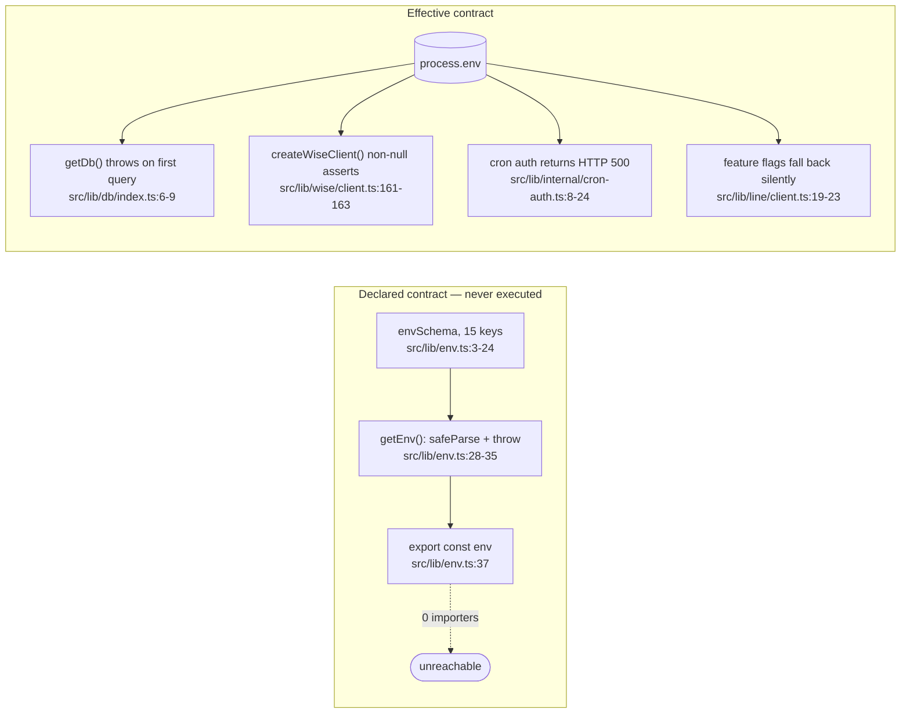

# Environment Variables

**Authoritative sources:** the Zod object in [`src/lib/env.ts`](../../src/lib/env.ts) for the *declared* contract, and the `process.env` reads inventoried below for the *effective* one. [`.env.example`](../../.env.example) is a partial template, not a contract.

This page is the canonical home for the **mechanics** of configuration: exact Zod modifier, the literal default, every consumption site with `file:line`, and what actually happens when a variable is absent. Feature docs under [`features/`](../features/) explain *why* a flag exists and link here instead of restating variable lists.

Three inventories are reconciled here, and none of them agree:

| Inventory | Count | Source |
|---|---|---|
| Declared in the Zod schema | **15** keys | [`src/lib/env.ts:3`–`24`](../../src/lib/env.ts) |
| Documented in `.env.example` | **37** keys | [`.env.example`](../../.env.example) |
| Actually read from `process.env` by non-test code | **71** named keys, plus 1 dynamically-named family | `src/**`, `scripts/**`, `drizzle.config.ts`, `vitest.config.ts` |

---

## TL;DR — the precise Zod truth vs. the "9 required" claim

`AGENTS.md:287` heads its table "Environment Variables (9 required)", and `CLAUDE.md:104` / `CLAUDE.md:120` repeat "9 required env vars at startup (+ 3 optional LINE vars)". Neither matches the literal schema.

`src/lib/env.ts:3`–`24` declares **15** keys in three buckets:

| Bucket | Zod modifier | Count | Variables |
|---|---|---|---|
| **Hard-required** — `safeParse` fails when unset or empty | `.url()` ×1, `.min(1)` ×6 | **7** | `DATABASE_URL`, `AUTH_GOOGLE_ID`, `AUTH_GOOGLE_SECRET`, `AUTH_SECRET`, `WISE_USER_ID`, `WISE_API_KEY`, `CRON_SECRET` |
| **Defaulted** — parse succeeds when unset; a source literal is substituted | `.default(…)` | **2** | `WISE_NAMESPACE` → `"begifted-education"`, `WISE_INSTITUTE_ID` → `"696e1f4d90102225641cc413"` |
| **Optional** — may be absent entirely | `.optional()` | **6** | `LINE_CHANNEL_SECRET`, `LINE_CHANNEL_ACCESS_TOKEN`, `ENABLE_LINE_SCHEDULER`, `LINE_SCHEDULE_BOT_ADMIN_IDS`, `STUDENT_SCHEDULE_LINK_TTL_DAYS`, `APP_BASE_URL` |
| **Total declared** | | **15** | |

**The strict Zod truth is 7 hard-required keys, not 9.** The prose "9" is the 7 hard-required keys *plus* the 2 `WISE_*` keys carrying `.default(…)` literals (`src/lib/env.ts:10`–`11`). Those two are operationally expected in production, but the schema parses without them.

The prose also undercounts the optional tail. It says "3 optional LINE vars"; the schema declares **6** optional keys (`src/lib/env.ts:13`–`23`). The three omitted — `LINE_SCHEDULE_BOT_ADMIN_IDS`, `STUDENT_SCHEDULE_LINK_TTL_DAYS`, `APP_BASE_URL` — belong to the student-schedule / LINE schedule-bot feature.

Accurate phrasing: **7 hard-required + 2 defaulted + 6 optional = 15 declared; 71 named keys read at runtime.**

`README.md:172`–`179` already carries the corrected 7/2/6 breakdown, but states that `src/lib/env.ts` "throws at startup if they don't parse". That is the one claim in the repo that the next section contradicts.

---

## Critical caveat: the validated `env` object is never imported

`src/lib/env.ts:37` runs validation eagerly at module-evaluation time:

```ts
export const env = getEnv();
```

`getEnv()` (`src/lib/env.ts:28`–`35`) `safeParse`s `process.env`, logs `parsed.error.flatten().fieldErrors` on failure, then throws `Invalid environment variables`. That is the documented "validated at startup" behaviour.

**It never executes.** No file in the repository imports the module:

```
$ grep -rn '"@/lib/env"|/lib/env"|/lib/env'"'"'|require\(.*lib/env' \
    --include=*.ts --include=*.tsx --include=*.mjs src scripts
(no matches — exit status 1)
```

There is no `instrumentation.ts` anywhere in the repo, and `next.config.ts` contains only `cacheComponents: true`, so nothing pulls the module in as a side effect either. `src/lib/env.ts:29` is the *only* line in the file that mentions `process.env`, and it is unreachable. Every real consumer reads `process.env.<NAME>` directly.


```mermaid
flowchart LR
  subgraph Declared["Declared contract — never executed"]
    ENV["envSchema, 15 keys<br/>src/lib/env.ts:3-24"]
    GET["getEnv(): safeParse + throw<br/>src/lib/env.ts:28-35"]
    EXP["export const env<br/>src/lib/env.ts:37"]
    ENV --> GET --> EXP
    EXP -. "0 importers" .-> DEAD(["unreachable"])
  end
  subgraph Actual["Effective contract"]
    PE[("process.env")]
    PE --> DB["getDb() throws on first query<br/>src/lib/db/index.ts:6-9"]
    PE --> WISE["createWiseClient() non-null asserts<br/>src/lib/wise/client.ts:161-163"]
    PE --> CRON["cron auth returns HTTP 500<br/>src/lib/internal/cron-auth.ts:8-24"]
    PE --> FLAG["feature flags fall back silently<br/>src/lib/line/client.ts:19-23"]
  end
```

Operational consequences:

1. **No fail-fast.** A deployment missing `DATABASE_URL` boots successfully and fails on the first query (`src/lib/db/index.ts:7`–`9`), not at startup.
2. **The `WISE_*` defaults come from call sites, not the schema.** Each consumer repeats its own literal: `?? "begifted-education"` (`src/lib/wise/client.ts:163`) and `?? "696e1f4d90102225641cc413"` (`src/lib/sync/run-wise-sync.ts:145` and ~10 other sites). Editing the schema default changes nothing.
3. **`z.coerce` and range constraints never apply.** `STUDENT_SCHEDULE_LINK_TTL_DAYS` is declared `z.coerce.number().int().positive().optional()` (`src/lib/env.ts:21`), but the three real consumers each do their own `Number(...) || DEFAULT` (`src/app/api/student-schedule/link/route.ts:55`).

Treat the **"If unset"** column in the tables below — not the schema — as the operative contract.

---

## 1. Schema-declared variables (15)

Ordered as declared.

### 1.1 Hard-required (7)

| Variable | Zod (`src/lib/env.ts`) | Purpose | Consumed at | If unset |
|---|---|---|---|---|
| `DATABASE_URL` | `.url()` — L4 | Neon Postgres connection string (ap-southeast-1) | `src/lib/db/index.ts:6`; `src/lib/db/seed.ts:6`; `drizzle.config.ts:8`; three `node-postgres` transaction pools that neon-http cannot serve — `src/lib/payroll/sync.ts:94`, `src/lib/post-class-feedback/transaction.ts:16`, `src/lib/admissions/audit.ts:44` | Throws `DATABASE_URL is not set` on the first `getDb()` call (`src/lib/db/index.ts:7`–`9`) |
| `AUTH_GOOGLE_ID` | `.min(1)` — L5 | Google OAuth client ID | `src/lib/auth.ts:35`; `src/lib/auth-edge.ts:7`; Sheets token refresh `src/lib/sales-dashboard/google-oauth.ts:150` | Auth.js provider misconfigured, sign-in fails. The refresh path coerces to `""` (`?? ""`), so token refresh returns a Google error rather than a config error |
| `AUTH_GOOGLE_SECRET` | `.min(1)` — L6 | Google OAuth client secret | `src/lib/auth.ts:36`; `src/lib/auth-edge.ts:8`; `src/lib/sales-dashboard/google-oauth.ts:151` | as above |
| `AUTH_SECRET` | `.min(1)` — L7 | Auth.js session/JWT key; also the KDF input for at-rest Google-token encryption | Read implicitly by Auth.js — neither `src/lib/auth.ts` nor `src/lib/auth-edge.ts` passes a `secret:` option. Read explicitly at `src/lib/sales-dashboard/google-oauth.ts:42`–`44`, where it is SHA-256'd into an AES-256-GCM key | Auth.js cannot issue sessions; `encryptToken`/`decryptToken` throw `AUTH_SECRET is required to encrypt Google tokens`. **Rotating it invalidates every stored `google_oauth_tokens` row** |
| `WISE_USER_ID` | `.min(1)` — L8 | Wise API user ID (Basic-auth username half) | `src/lib/wise/client.ts:161` (non-null assertion `!`); guarded reads at `src/lib/classrooms/data.ts:1151`, `src/lib/student-promotions/data.ts:299`, `src/lib/wise-activity/reconciliation.ts:770,797` | `createWiseClient()` builds a client with `undefined` credentials and every Wise call 401s. The guarded sites throw a named error instead — see [drift flag 5](#5-drift-flags-and-open-questions) |
| `WISE_API_KEY` | `.min(1)` — L9 | Wise API key (Basic-auth password half + `x-api-key` header) | `src/lib/wise/client.ts:162`; same guarded sites | as above |
| `CRON_SECRET` | `.min(1)` — L12 | Bearer token protecting all 21 internal handlers under `src/app/api/internal/` | Shared helper `src/lib/internal/cron-auth.ts:8`, imported by 15 route files; 6 internal routes inline an equivalent check — `sync-wise/route.ts:17`, `sync-credit-control/route.ts:20`, `sync-sales-dashboard/route.ts:17`, `sync-room-utilization/route.ts:14`, `sync-competitor-intelligence/route.ts:13`, `student-promotions/july-1/route.ts:11` | **Fail-closed:** the helper returns `missing-secret` → HTTP 500 `Server misconfigured` (`src/lib/internal/cron-auth.ts:22`–`24`). No cron can run. Comparison is constant-time (`timingSafeEqual` with a length pre-check, REL-07 — `cron-auth.ts:12`–`14`) |

### 1.2 Defaulted (2)

| Variable | Zod (`src/lib/env.ts`) | Schema default | Effective default | Consumed at |
|---|---|---|---|---|
| `WISE_NAMESPACE` | `.default(…)` — L10 | `begifted-education` | `?? "begifted-education"` repeated per call site | `src/lib/wise/client.ts:163`; `src/lib/classrooms/data.ts:1154`; `src/lib/student-promotions/data.ts:301` |
| `WISE_INSTITUTE_ID` | `.default(…)` — L11 | `696e1f4d90102225641cc413` | mixed — see note | 40 reads across `src/`. Inline literal fallback at `src/lib/sync/run-wise-sync.ts:145`, `src/lib/classrooms/data.ts:887,992,1469,1834`, `src/lib/classrooms/morning-automation.ts:191`, `src/lib/credit-control/run-sync-request.ts:141`, `src/lib/progress-tests/booking.ts:102`, `src/lib/progress-tests/run-sync-request.ts:142`, `src/lib/student-promotions/data.ts:309`. Via a module `DEFAULT_INSTITUTE_ID` const at `src/lib/wise-activity/reconciliation.ts:17`, `src/lib/data-health/run-job.ts:26`, `src/app/api/payroll/sync/route.ts:11`, `src/app/api/wise-activity/sync/route.ts:9`, `src/app/api/wise-activity/reconciliation/backfill/route.ts:10`, `src/app/api/internal/sync-wise-activity/route.ts:10` |

> **Two `WISE_INSTITUTE_ID` consumers deliberately have no fallback and throw:** `src/lib/room-capacity/utilization.ts:433`–`434` (`WISE_INSTITUTE_ID is required to sync room utilization`) and `src/lib/post-class-feedback/sync.ts:1053`–`1054` (`WISE_INSTITUTE_ID is not configured`). Every other consumer silently assumes the BeGifted tenant, so the institute id is effectively hard-coded in ~38 places rather than configured in one.

### 1.3 Optional (6)

| Variable | Zod (`src/lib/env.ts`) | Purpose | Consumed at | If unset |
|---|---|---|---|---|
| `LINE_CHANNEL_SECRET` | `.min(1).optional()` — L13 | LINE Messaging API channel secret; verifies inbound webhook signatures | `src/lib/line/client.ts:21,26` | `lineSchedulerEnabled()` returns `false` (`src/lib/line/client.ts:19`–`23`); the LINE integration is off |
| `LINE_CHANNEL_ACCESS_TOKEN` | `.min(1).optional()` — L14 | LINE channel access token for profile fetch and push/reply | `src/lib/line/client.ts:22,30`–`32` | Same gate. If a push is attempted regardless, `lineAccessToken()` throws `LINE_CHANNEL_ACCESS_TOKEN is not configured` |
| `ENABLE_LINE_SCHEDULER` | `.optional()` — L15 | Kill switch for the LINE integration | `src/lib/line/client.ts:20` | **Enabled by default.** The test is `!== "false"`, so only the literal string `false` disables it — provided both LINE credentials are present |
| `LINE_SCHEDULE_BOT_ADMIN_IDS` | `.optional()` — L19 | Comma-separated LINE user IDs allowed to drive the student schedule bot | `src/lib/line/schedule-bot.ts:112`–`124` | **Fail-closed (SCHED-BOT-01):** unset or empty yields an empty `Set`, and `isScheduleBotAdmin` requires `ids.size > 0` (`schedule-bot.ts:121`–`124`), so a parent messaging the OA can never reach the bot. Documented at `src/lib/env.ts:16`–`18` |
| `STUDENT_SCHEDULE_LINK_TTL_DAYS` | `z.coerce.number().int().positive().optional()` — L21 | Days a parent schedule link stays live | `src/app/api/student-schedule/link/route.ts:55`; `src/lib/line/schedule-bot.ts:134`; `src/lib/line/schedule-bot-group.ts:124` | `DEFAULT_LINK_TTL_DAYS = 30` (`src/lib/student-schedule/links.ts:27`). All three consumers use `Number(...) || DEFAULT`, so `0` and non-numeric values also land on 30 — the `.int().positive()` guard never runs |
| `APP_BASE_URL` | `.url().optional()` — L23 | Absolute origin used to build parent-facing schedule links | `src/app/api/student-schedule/link/route.ts:19`; `src/lib/line/schedule-bot.ts:131`; `src/lib/line/schedule-bot-group.ts:121` | The API route falls back to `request.nextUrl.origin`, so previews link to themselves (`src/lib/env.ts:22`). The two bot paths fall back to `DEFAULT_BASE_URL = "https://bgscheduler.vercel.app"` (`src/lib/line/schedule-bot.ts:78`, `src/lib/line/schedule-bot-group.ts:87`) |

---

## 2. Undeclared variables read at runtime (56 named + 1 dynamic family)

None of the following appear in `src/lib/env.ts`. Grouped by owning subsystem.

### 2.1 OpenAI and AI features (9)

| Variable | Purpose | Consumed at | If unset |
|---|---|---|---|
| `OPENAI_API_KEY` | Bearer token for OpenAI's Responses API (called over bare `fetch`; no vendor SDK) | `src/lib/ai/scheduler.ts:479,539`; `src/lib/ai/scheduler-conversation.ts:2341`; `src/lib/line/classifier.ts:93`; `src/lib/line/contact-aliases.ts:363`; `src/lib/post-class-feedback/ai.ts:59`; `src/lib/progress-tests/ai-summary.ts:78,164`; `src/lib/competitor-intelligence/ai.ts:158,297` | Every `is*AiConfigured()` gate returns `false`; features degrade to deterministic paths rather than erroring |
| `ENABLE_AI_SCHEDULER` | Kill switch for the AI scheduler **and** the progress-test AI summary | `src/lib/ai/scheduler.ts:478,540`; `src/lib/progress-tests/ai-summary.ts:77` | **Enabled by default** — `!== "false"` |
| `OPENAI_SCHEDULER_MODEL` | Primary model id; also the second-choice model for competitor intel | `src/lib/ai/scheduler.ts:462`; `src/lib/competitor-intelligence/ai.ts:66` | `DEFAULT_AI_SCHEDULER_MODEL = "gpt-5.4-mini"` (`src/lib/ai/scheduler.ts:8`) |
| `OPENAI_SCHEDULER_SHADOW_MODEL` | Optional second model run in shadow for comparison | `src/lib/ai/scheduler.ts:466` | `undefined` — no shadow run |
| `OPENAI_SCHEDULER_REASONING_EFFORT` | One of `none｜low｜medium｜high｜xhigh` | `src/lib/ai/scheduler.ts:470`–`474` | `DEFAULT_AI_SCHEDULER_REASONING_EFFORT = "low"` (`src/lib/ai/scheduler.ts:9`). Unrecognised values fall back silently |
| `OPENAI_PROGRESS_TEST_MODEL` | Model for progress-test summaries | `src/lib/progress-tests/ai-summary.ts:88` | `DEFAULT_AI_SCHEDULER_MODEL` |
| `OPENAI_POST_CLASS_FEEDBACK_MODEL` | Model for post-class feedback analysis | `src/lib/post-class-feedback/ai.ts:297` | inline literal `"gpt-5.4-mini"` |
| `OPENAI_COMPETITOR_INTEL_MODEL` | Model for the competitor brief | `src/lib/competitor-intelligence/ai.ts:65` | `OPENAI_SCHEDULER_MODEL`, then `DEFAULT_COMPETITOR_AI_MODEL = "gpt-5.4-mini"` (`src/lib/competitor-intelligence/ai.ts:5`) |
| `ENABLE_COMPETITOR_AI` | Kill switch for the competitor-intelligence brief | `src/lib/competitor-intelligence/ai.ts:71` | **Enabled by default** — `!== "false"` |

### 2.2 Competitor intelligence — external providers (8 named + 1 dynamic)

| Variable | Purpose | Consumed at | If unset |
|---|---|---|---|
| `APIFY_API_TOKEN` | Apify actor-run token (Instagram / Facebook scrapes) | `src/lib/competitor-intelligence/providers.ts:70,93` | Social collection is skipped |
| `APIFY_INSTAGRAM_ACTOR` | Actor slug override | `src/lib/competitor-intelligence/providers.ts:17` | `"apify/instagram-scraper"` |
| `APIFY_FACEBOOK_ACTOR` | Actor slug override | `src/lib/competitor-intelligence/providers.ts:18` | `"apify/facebook-posts-scraper"` |
| `DATAFORSEO_LOGIN` | DataForSEO basic-auth login | `src/lib/competitor-intelligence/providers.ts:130` | SERP collection is skipped |
| `DATAFORSEO_PASSWORD` | DataForSEO basic-auth password | `src/lib/competitor-intelligence/providers.ts:131` | as above |
| `COMPETITOR_APIFY_COST_PER_ITEM_USD` | Cost model for spend estimation | `src/lib/competitor-intelligence/providers.ts:124`; `src/lib/competitor-intelligence/sync.ts:129` | `0.01` |
| `COMPETITOR_DATAFORSEO_COST_PER_QUERY_USD` | Cost model for spend estimation | `src/lib/competitor-intelligence/providers.ts:179`; `src/lib/competitor-intelligence/sync.ts:136` | `0.002` |
| `COMPETITOR_INTEL_MONTHLY_CAP_USD` | Global monthly hard spend cap | `src/lib/competitor-intelligence/budget.ts:20` | `250` for paid source types, `0` for `website` / `manual` (`budget.ts:23`–`24`) |
| **`COMPETITOR_<PROVIDER>_MONTHLY_CAP_USD`** *(dynamic name)* | Per-provider cap; the key is computed from the provider slug — upper-cased, non-alphanumerics → `_` | `src/lib/competitor-intelligence/budget.ts:19` | Falls through to the global cap. **Invisible to a literal grep**; concrete members include `COMPETITOR_APIFY_MONTHLY_CAP_USD` and `COMPETITOR_DATAFORSEO_MONTHLY_CAP_USD` |

### 2.3 Classroom schedule email (7)

| Variable | Purpose | Consumed at | If unset |
|---|---|---|---|
| `SCHEDULE_EMAIL_APPS_SCRIPT_URL` | Google Apps Script webhook that sends tutor schedule emails (primary sender) | `src/lib/classrooms/schedule-email.ts:299` | Sender config resolves to `undefined`; the send path surfaces the missing env-var name it carries alongside the value (`urlEnvName`, `schedule-email.ts:301`) |
| `SCHEDULE_EMAIL_APPS_SCRIPT_SECRET` | Shared secret for that webhook | `src/lib/classrooms/schedule-email.ts:300` | as above |
| `SCHEDULE_EMAIL_BACKUP_APPS_SCRIPT_URL` | Backup sender webhook | `src/lib/classrooms/schedule-email.ts:291` | Backup sender unavailable |
| `SCHEDULE_EMAIL_BACKUP_APPS_SCRIPT_SECRET` | Backup shared secret | `src/lib/classrooms/schedule-email.ts:292` | as above |
| `SCHEDULE_EMAIL_SENDER_NAME` | Display name on outgoing schedule mail | `src/lib/classrooms/schedule-email.ts:606` | `"BeGifted"` |
| `SCHEDULE_EMAIL_REPLY_TO` | Reply-to address | `src/lib/classrooms/schedule-email.ts:607` | a personal gmail address hard-coded in source |
| `SCHEDULE_EMAIL_PUBLIC_BASE_URL` | Absolute origin for the floor-plan-map image embedded in the email | `src/lib/classrooms/schedule-email.ts:266`; also a base-URL fallback for leave requests (`src/lib/leave-requests/config.ts:19`) | Falls through `VERCEL_PROJECT_PRODUCTION_URL` → `VERCEL_URL` → `DEFAULT_PUBLIC_BASE_URL = "https://bgscheduler.vercel.app"` (`schedule-email.ts:265`–`275`, `schedule-email.ts:13`) |

### 2.4 Post-class feedback payouts (10)

Nine `POST_CLASS_PAYOUT_*` keys plus one grace-period knob. Eight are read through a helper (`value(env, "NAME")`, `src/lib/post-class-feedback/payout-config.ts:11`–`13`) and one through a property access on an env record, so **none of them appear in a `process.env.NAME` grep**.

| Variable | Purpose | Consumed at | If unset |
|---|---|---|---|
| `POST_CLASS_PAYOUT_TARGET` | `scratch` or `production` — which Google workspace payouts touch | `payout-config.ts:44,79` | `requirePayoutGoogleTarget()` throws `POST_CLASS_PAYOUT_TARGET must be scratch or production` (`payout-config.ts:112`) |
| `POST_CLASS_PAYOUT_CONNECTED_EMAIL` | Google account whose stored OAuth token performs Sheets/Drive calls | `payout-config.ts:38,80` | Named in the `Payout Google target is incomplete: …` error (`payout-config.ts:103`–`108`) |
| `POST_CLASS_PAYOUT_DRIVE_FOLDER_ID` | Drive folder for generated payout artefacts | `payout-config.ts:16,81` | as above |
| `POST_CLASS_PAYOUT_WORKBOOKS_FOLDER_ID` | Folder recursively inventoried for tutor-facing payout workbooks | `payout-config.ts:20,82` | as above |
| `POST_CLASS_PAYOUT_MASTER_SPREADSHEET_ID` | The Begifted Payouts master workbook | `payout-config.ts:23,86` | as above |
| `POST_CLASS_PAYOUT_SOURCE_SHEET_NAME` | Externally refreshed source tab; never written by the app | `payout-config.ts:27,90` | as above |
| `POST_CLASS_PAYOUT_DEDUCTIONS_SHEET_NAME` | App-owned append-only `A:H` tab | `payout-config.ts:31,94` | as above |
| `POST_CLASS_PAYOUT_COMPOSITE_SHEET_NAME` | Formula-backed union tab imported by tutor workbooks | `payout-config.ts:35,98` | as above |
| `POST_CLASS_PAYOUT_WRITES_ENABLED` | Master write gate — **only the exact string `true`** enables app-originated payout writes | `payout-config.ts:50` | Writes disabled; `requirePayoutGoogleTarget({ forWrite: true })` throws (`payout-config.ts:126`–`130`) |
| `POST_CLASS_AUTO_APPROVE_GRACE_HOURS` | Hours a `pending_review` deduction waits before auto-approval | `src/lib/post-class-feedback/auto-approval.ts:31` | `24` |

> **Deployment cross-check.** `requirePayoutGoogleTarget` compares `POST_CLASS_PAYOUT_TARGET` against Vercel's injected `VERCEL_ENV` (`payout-config.ts:115`–`123`): a `production` deployment must target `production`, a `preview` deployment must target `scratch`. Both mismatches throw. There are deliberately no live spreadsheet, folder, tab, or account fallbacks in source — the module says so in its header comment (`payout-config.ts:1`–`5`).

### 2.5 Wise writeback verification gates (3)

Three independent gates, each requiring the exact string `"true"`. They exist so a Wise write contract that has not been validated against the `begifted-education` tenant cannot fire.

| Variable | Gate | Consumed at | If unset |
|---|---|---|---|
| `WISE_SESSION_OPERATIONS_VERIFIED` | LINE-originated session operations (cancel / reschedule writeback) | `src/lib/wise/operations.ts:11` (function); `src/lib/line/operational.ts:21` (**module-level `const`**, captured once at import) | Writeback stays dry-run |
| `WISE_SESSION_CREATE_VERIFIED` | Real Wise session creation for progress-test bookings | `src/lib/progress-tests/config.ts:50` | Bookings record locally and require a manual Wise booking (`src/lib/progress-tests/config.ts:40`–`47`) |
| `WISE_SESSION_SUBJECT_UPDATE_VERIFIED` | Future-session subject rewrite during the student-promotion run. The name lives in a `const` (`src/lib/student-promotions/data.ts:201`) and is read via computed access, so a literal grep misses it | `src/lib/student-promotions/data.ts:450` | Course-action eligibility gate stays closed |

### 2.6 Leave requests (4)

All read at module scope in `src/lib/leave-requests/config.ts`, so values are frozen at first import.

| Variable | Purpose | Consumed at | If unset |
|---|---|---|---|
| `LEAVE_REQUESTS_SPREADSHEET_ID` | Source Google Sheet | `src/lib/leave-requests/config.ts:1`–`2` | literal `109o2vbmxlJ-l2U18Rs_WrjD7TMF5b6h__GiNkkQIfS8` |
| `LEAVE_REQUESTS_SHEET_NAME` | Source tab | `src/lib/leave-requests/config.ts:4`–`5` | `"Form Responses 1"` |
| `LEAVE_REQUESTS_CONNECTED_EMAIL` | Google OAuth token owner used for cron reads and status writeback; needs full Sheets scope, not `readonly` | `src/lib/leave-requests/config.ts:12`–`13` | Falls back to `SALES_DASHBOARD_CONNECTED_EMAIL`, then `""` — an empty owner, so the token lookup finds nothing |
| `NEXT_PUBLIC_APP_URL` | Absolute app origin used in leave-request notifications | `src/lib/leave-requests/config.ts:18` | Falls through `SCHEDULE_EMAIL_PUBLIC_BASE_URL` → `VERCEL_URL` (protocol-prefixed) → `"https://bgscheduler.vercel.app"` (`config.ts:15`–`21`). The only `NEXT_PUBLIC_*` variable in the codebase, and it is read server-side only |

### 2.7 Admissions notifications (3)

| Variable | Purpose | Consumed at | If unset |
|---|---|---|---|
| `RESEND_API_KEY` | Resend API key for admissions email | `src/lib/admissions/notifications.ts:299`–`300` | Throws `RESEND_API_KEY is not configured` at send time |
| `ADMISSIONS_EMAIL_FROM` | From header | `src/lib/admissions/notifications.ts:301` | `DEFAULT_FROM` at `notifications.ts:46` — the Resend sandbox sender (`onboarding@resend.dev`) |
| `ADMISSIONS_EMAIL_REPLY_TO` | Reply-to header | `src/lib/admissions/notifications.ts:302` | `DEFAULT_REPLY_TO` at `notifications.ts:49` — a personal gmail address |

### 2.8 LINE operations, seeding, and one-offs (3)

| Variable | Purpose | Consumed at | If unset |
|---|---|---|---|
| `LINE_VALIDATION_LEAD_EMAILS` | Comma-separated admins allowed to act as LINE link-validation leads | `src/lib/line/link-validation.ts:221`–`228` | Falls back to `DEFAULT_LINE_VALIDATION_LEAD_EMAILS`, a hard-coded allowlist at `src/lib/line/link-validation.ts:122` |
| `SEED_ADMIN_EMAILS` | Comma-separated emails inserted into `admin_users` by the seed script | `src/lib/db/seed.ts:31` | Empty list — no admins seeded |
| `SALES_DASHBOARD_CONNECTED_EMAIL` | **Vestigial.** Its only reader is the leave-requests fallback chain; the sales dashboard stores `connectedEmail` per source row in Postgres instead (`src/lib/sales-dashboard/data.ts:195,210`) | `src/lib/leave-requests/config.ts:13` | No effect unless `LEAVE_REQUESTS_CONNECTED_EMAIL` is also unset |

### 2.9 Platform-injected (4) — set by Vercel or the shell, never by you

| Variable | Read at | Notes |
|---|---|---|
| `VERCEL_ENV` | `src/lib/post-class-feedback/payout-config.ts:116` | `production` / `preview` / `development`; drives the payout-target cross-check |
| `VERCEL_URL` | `src/lib/classrooms/schedule-email.ts:272`; `src/lib/leave-requests/config.ts:15` | Per-deployment hostname without protocol — both readers prepend `https://` |
| `VERCEL_PROJECT_PRODUCTION_URL` | `src/lib/classrooms/schedule-email.ts:269` | Stable production hostname; preferred over `VERCEL_URL` |
| `USER` | `scripts/import-room-capacity-model.ts:303` | Local shell user, recorded as `createdBy` on imported model runs |

### 2.10 Test and script-only (6)

Not part of the deployed contract.

| Variable | Read at | Purpose |
|---|---|---|
| `TEST_DATABASE_URL` | `src/tests/integration/db-helper.ts:24` | Points integration tests at an existing Postgres instead of starting a Testcontainer |
| `TZ` | `vitest.config.ts:4` | **Written**, not read — pins the test process to `Asia/Bangkok` |
| `CONFIRM_DELETE_LINE_TEST_DATA` | `scripts/delete-line-test-data.ts:34` | Destructive-script confirmation guard |
| `PRODUCTION_BRANCH` | `scripts/assert-production-deploy-ready.mjs:5` | Branch the guarded deploy refuses to deviate from; defaults to `main` |
| `GITHUB_ACTOR` | `scripts/check-sales-dashboard-scope.mjs:14` | CI actor identity for the Sheets-scope check |
| *(dotenv loaders)* | `scripts/lib/payout-script.ts:9`–`10` and 6 sibling scripts | Several scripts hand-parse `.env.local` into `process.env` before running, because they execute outside the Next runtime. Not distinct variables — a mini dotenv shim |

---

## 3. Flag idioms — three conventions that do not mean the same thing

| Idiom | Variables | Semantics |
|---|---|---|
| `X !== "false"` | `ENABLE_LINE_SCHEDULER` (`src/lib/line/client.ts:20`), `ENABLE_AI_SCHEDULER` (`src/lib/ai/scheduler.ts:478`), `ENABLE_COMPETITOR_AI` (`src/lib/competitor-intelligence/ai.ts:71`) | **Opt-out.** Unset means enabled. Only the literal lowercase `false` disables. `0`, `no`, and `FALSE` do not |
| `X === "true"` | `WISE_SESSION_OPERATIONS_VERIFIED` (`src/lib/wise/operations.ts:11`), `WISE_SESSION_CREATE_VERIFIED` (`src/lib/progress-tests/config.ts:50`), `WISE_SESSION_SUBJECT_UPDATE_VERIFIED` (`src/lib/student-promotions/data.ts:450`), `POST_CLASS_PAYOUT_WRITES_ENABLED` (`src/lib/post-class-feedback/payout-config.ts:50`) | **Opt-in, fail-closed.** Unset means disabled. Every one of these guards a write to an external system |
| Non-empty comma list | `LINE_SCHEDULE_BOT_ADMIN_IDS`, `LINE_VALIDATION_LEAD_EMAILS`, `SEED_ADMIN_EMAILS` | Split on `,`, trimmed, blanks dropped. `LINE_SCHEDULE_BOT_ADMIN_IDS` is fail-closed on empty (`src/lib/line/schedule-bot.ts:121`–`124`); the other two fall back to a hard-coded list or a no-op |

Base-URL resolution is a fourth pattern — three independent cascades that can disagree within one deployment:


```mermaid
flowchart TD
  subgraph SL["Parent schedule links"]
    A1["APP_BASE_URL"] --> A2["request.nextUrl.origin<br/>(API route only)"] --> A3["https://bgscheduler.vercel.app"]
  end
  subgraph SE["Schedule emails"]
    B1["SCHEDULE_EMAIL_PUBLIC_BASE_URL"] --> B2["VERCEL_PROJECT_PRODUCTION_URL"] --> B3["VERCEL_URL"] --> B4["https://bgscheduler.vercel.app"]
  end
  subgraph LR2["Leave-request notifications"]
    C1["NEXT_PUBLIC_APP_URL"] --> C2["SCHEDULE_EMAIL_PUBLIC_BASE_URL"] --> C3["VERCEL_URL"] --> C4["https://bgscheduler.vercel.app"]
  end
```

---

## 4. `.env.example` reconciliation

`.env.example` lists **37** keys. Every one is genuinely read somewhere — there are no dead entries. But **34** keys read by non-test code are missing from it:

- **AI models and flags (6):** `OPENAI_SCHEDULER_SHADOW_MODEL`, `OPENAI_SCHEDULER_REASONING_EFFORT`, `OPENAI_PROGRESS_TEST_MODEL`, `OPENAI_POST_CLASS_FEEDBACK_MODEL`, `OPENAI_COMPETITOR_INTEL_MODEL`, `ENABLE_COMPETITOR_AI`
- **Competitor providers (8):** `APIFY_API_TOKEN`, `APIFY_INSTAGRAM_ACTOR`, `APIFY_FACEBOOK_ACTOR`, `DATAFORSEO_LOGIN`, `DATAFORSEO_PASSWORD`, `COMPETITOR_APIFY_COST_PER_ITEM_USD`, `COMPETITOR_DATAFORSEO_COST_PER_QUERY_USD`, `COMPETITOR_INTEL_MONTHLY_CAP_USD`
- **Wise writeback gates (3):** `WISE_SESSION_OPERATIONS_VERIFIED`, `WISE_SESSION_CREATE_VERIFIED`, `WISE_SESSION_SUBJECT_UPDATE_VERIFIED`
- **Admissions email (3):** `RESEND_API_KEY`, `ADMISSIONS_EMAIL_FROM`, `ADMISSIONS_EMAIL_REPLY_TO`
- **Ops and misc (5):** `SCHEDULE_EMAIL_PUBLIC_BASE_URL`, `LINE_VALIDATION_LEAD_EMAILS`, `POST_CLASS_AUTO_APPROVE_GRACE_HOURS`, `SEED_ADMIN_EMAILS`, `SALES_DASHBOARD_CONNECTED_EMAIL`
- **Platform-injected (4), correctly omitted:** `VERCEL_ENV`, `VERCEL_URL`, `VERCEL_PROJECT_PRODUCTION_URL`, `USER`
- **Test / script-only (5), reasonably omitted:** `TEST_DATABASE_URL`, `TZ`, `CONFIRM_DELETE_LINE_TEST_DATA`, `PRODUCTION_BRANCH`, `GITHUB_ACTOR`

The actionable gap is the first five groups — **25 keys** that change production behaviour and are discoverable only by reading source.

The `COMPETITOR_<PROVIDER>_MONTHLY_CAP_USD` family cannot be listed in `.env.example` at all, because the key name is computed at call time (`src/lib/competitor-intelligence/budget.ts:19`).

---

## 5. Drift flags and open questions

1. **The schema is dead code.** Nothing imports `src/lib/env.ts`, so its validation never runs and its `.default()` values never apply. Either wire it into a startup path (root layout or a new `instrumentation.ts`) or relabel it as advisory. `README.md:172`–`179` currently claims it "throws at startup".
2. **Prose counts are wrong in two places.** `AGENTS.md:287` ("9 required") and `CLAUDE.md:104` / `CLAUDE.md:120` ("9 required + 3 optional LINE vars") should read 7 hard-required + 2 defaulted + 6 optional. `AGENTS.md:303` also says "roughly 50 environment variables are read across the codebase"; the measured figure is 71 named keys.
3. **The schema covers 15 of 71 live keys.** Is direct `process.env` access with per-call-site guards the intended pattern, or should the schema become the inventory? Every `OPENAI_*`, `POST_CLASS_PAYOUT_*`, `SCHEDULE_EMAIL_*`, `LEAVE_REQUESTS_*`, `WISE_SESSION_*_VERIFIED`, `APIFY_*`, `DATAFORSEO_*`, `COMPETITOR_*`, `RESEND_API_KEY`, and `ADMISSIONS_EMAIL_*` key sits outside it.
4. **`WISE_INSTITUTE_ID` is effectively hard-coded 38 times.** The literal `696e1f4d90102225641cc413` appears as an inline fallback or module const at ~14 distinct sites. Only `src/lib/room-capacity/utilization.ts:433` and `src/lib/post-class-feedback/sync.ts:1053` refuse to guess.
5. **Three different failure modes for the same Wise credentials.** `createWiseClient()` (`src/lib/wise/client.ts:159`–`166`) asserts `WISE_USER_ID!` / `WISE_API_KEY!` and builds a client with `undefined` credentials that 401s at request time; `createWiseClientFromEnv()` (`src/lib/classrooms/data.ts:1150`–`1158`) and `createPromotionWiseClient()` (`src/lib/student-promotions/data.ts:298`–`306`) throw immediately with named errors.
6. **`CRON_SECRET` checking is duplicated six times.** `src/lib/internal/cron-auth.ts` is the shared helper (15 importers), yet six internal routes reimplement the identical constant-time comparison inline. A change to the algorithm would need seven edits.
7. **Personal gmail addresses as production fallbacks.** `SCHEDULE_EMAIL_REPLY_TO` (`src/lib/classrooms/schedule-email.ts:607`), `ADMISSIONS_EMAIL_REPLY_TO` (`src/lib/admissions/notifications.ts:49`), and `LINE_VALIDATION_LEAD_EMAILS` (`src/lib/line/link-validation.ts:122`) all default to individual addresses baked into source. Intentional, or should these be required?
8. **`ADMISSIONS_EMAIL_FROM` defaults to the Resend sandbox sender** (`onboarding@resend.dev`, `src/lib/admissions/notifications.ts:46`). If it is unset in production, admissions mail ships from a sandbox domain rather than failing loudly.
9. **`WISE_SESSION_OPERATIONS_VERIFIED` is captured at module load** in `src/lib/line/operational.ts:21`, unlike the function-based readers elsewhere. Toggling it requires a redeploy on that code path but not on `src/lib/wise/operations.ts:11`.
10. **`APP_BASE_URL` naming collision.** `src/lib/leave-requests/config.ts:17` exports a constant literally named `APP_BASE_URL` that is sourced from a different cascade than the `APP_BASE_URL` env var. Two things with one name.
11. **`SALES_DASHBOARD_CONNECTED_EMAIL` has no owner.** Its only reader is the leave-requests fallback (`src/lib/leave-requests/config.ts:13`); the sales dashboard itself resolves `connectedEmail` from Postgres. Should it be renamed or removed?
12. **`STUDENT_SCHEDULE_LINK_TTL_DAYS` loses its declared validation.** All three consumers use `Number(x) || 30`, so `0` and non-numeric strings silently become 30 — the `.int().positive()` constraint at `src/lib/env.ts:21` would have rejected them, but it never runs.

---

## 6. Where values live

| Surface | How to set | Notes |
|---|---|---|
| Vercel (preview + production) | Project → Settings → Environment Variables | `VERCEL_ENV`, `VERCEL_URL`, and `VERCEL_PROJECT_PRODUCTION_URL` are injected automatically. `POST_CLASS_PAYOUT_TARGET` **must** differ per environment (`production` vs `scratch`) or `requirePayoutGoogleTarget` throws |
| Local dev | `.env.local` (git-ignored) | Next.js loads it automatically. Several `scripts/*.ts` hand-parse it themselves because they run outside the Next runtime (`scripts/lib/payout-script.ts:9`–`10`) |
| Cron invocations | `Authorization: Bearer $CRON_SECRET` | Vercel injects the header from the project's `CRON_SECRET`. See [`crons.md`](./crons.md) |
| Tests | `vitest.config.ts:4` pins `TZ`; `TEST_DATABASE_URL` optionally replaces Testcontainers | |

Never log values. `src/lib/env.ts:31` logs only `fieldErrors` (key names), and the project convention keeps bodies, secrets, and env values out of `console.*` entirely.

---

## Related references

- [`crons.md`](./crons.md) — the cron entries `CRON_SECRET` protects and the internal handlers behind them
- [`api/index.md`](./api/index.md) — which endpoints gate on `CRON_SECRET` vs. an admin session
- [`wise-api.md`](./wise-api.md) — what the `WISE_*` credentials authenticate against
- [`../operations/auth-and-access.md`](../operations/auth-and-access.md) — how `AUTH_*` feeds the Auth.js allowlist
- [`../OPEN-QUESTIONS.md`](../OPEN-QUESTIONS.md) — unresolved configuration questions

---

_Verified against HEAD + uncommitted WIP on 2026-05-31._
