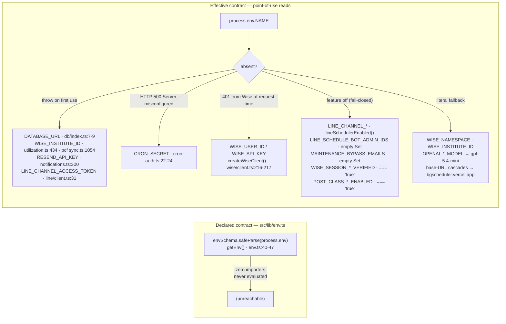

# Environment Variables

**Authoritative sources:** the Zod object in [`src/lib/env.ts`](../../src/lib/env.ts) for the *declared* contract, and the `process.env` reads inventoried below for the *effective* one. [`.env.example`](../../.env.example) is a partial operator template, not a contract.

This page is the canonical home for the **mechanics** of configuration: the exact Zod modifier, the literal default, every consumption site with `file:line`, and what actually happens when a variable is absent. Feature docs under [`features/`](../features/) explain *why* a flag exists and link here rather than restating variable lists.

Four inventories are reconciled here, and none of them agree:

| Inventory | Count | Source |
|---|---|---|
| Declared in the Zod schema | **20** keys | [`src/lib/env.ts:3`–`46`](../../src/lib/env.ts) |
| Documented in `.env.example` | **43** keys | [`.env.example`](../../.env.example) — `grep -cE '^[A-Z_][A-Z0-9_]*=' .env.example` |
| Read by non-test `src/` at runtime | **79** named keys + 1 dynamically-named family | includes the Onsite Foot Traffic HMAC and PDF-runtime keys |
| Read anywhere in the repo (`src/`, `scripts/`, root config) | **85** named keys | the 79 above + 6 test/script-only keys (§2.10). `TZ` is *written*, not read |

> **Counting method.** A literal `process.env.NAME` scan of non-test `src/` yields 68 runtime names after excluding `TEST_DATABASE_URL`. Eleven more never appear in that form: nine `POST_CLASS_PAYOUT_*` keys read through `value(env, "NAME")` or `env.POST_CLASS_PAYOUT_WRITES_ENABLED`, `VERCEL_ENV` through the same helper, and `WISE_SESSION_SUBJECT_UPDATE_VERIFIED` through computed access on a constant. That produces 79 named runtime keys; the computed `COMPETITOR_<PROVIDER>_MONTHLY_CAP_USD` family is listed separately rather than guessed.

---

## TL;DR — the precise Zod truth vs. the "9 required" claim

[`src/lib/env.ts:3`–`46`](../../src/lib/env.ts) declares **20** keys in three buckets:

| Bucket | Zod modifier | Count | Variables |
|---|---|---|---|
| **Hard-required** — `safeParse` fails when unset *or* empty | `.url()` ×1 (`DATABASE_URL`, L4); `.min(1)` ×6 (L5–L9, L12) | **7** | `DATABASE_URL`, `AUTH_GOOGLE_ID`, `AUTH_GOOGLE_SECRET`, `AUTH_SECRET`, `WISE_USER_ID`, `WISE_API_KEY`, `CRON_SECRET` |
| **Defaulted** — parse succeeds when unset; a source literal is substituted | `.default(…)` (L10–L11) | **2** | `WISE_NAMESPACE` → `"begifted-education"`, `WISE_INSTITUTE_ID` → `"696e1f4d90102225641cc413"` |
| **Optional** — may be absent entirely | `.optional()` | **11** | `FOOT_TRAFFIC_PSEUDONYM_SECRET`, `LINE_CHANNEL_SECRET`, `LINE_CHANNEL_ACCESS_TOKEN`, `ENABLE_LINE_SCHEDULER`, `LINE_SCHEDULE_BOT_ADMIN_IDS`, `ENABLE_STUDENT_SCHEDULE_LIVE`, `STUDENT_SCHEDULE_LINK_TTL_DAYS`, `APP_BASE_URL`, `MAINTENANCE_MODE`, `MAINTENANCE_BYPASS_EMAILS`, `CREDIT_REFRESH_MAX_AGE_MINUTES` |
| **Total declared** | | **20** | |

### Wise traffic controls (AVAIL-01 / CRED-01, added 2026-09-04)

Four knobs govern how hard the app hits the Wise API. Only the last is declared in
`src/lib/env.ts`; the other three are read straight from `process.env` at call time
so they can be changed without a module reload. Each has a safe default and an
off-switch, and all four exist because Wise began rate-limiting the institute on
2026-09-02 — see [`wise-api.md`](./wise-api.md#nearfar-tiering-avail-01-2026-09-04).

| Variable | Default | Effect | Read at |
|---|---|---|---|
| `WISE_FAR_HORIZON_MAX_AGE_MINUTES` | `360` | How long a cached far-horizon (days 28–182) leave set may be reused. `0` = always fetch live. Junk or negative falls back to the default. | `src/lib/wise/fetchers.ts` |
| `WISE_AVAILABILITY_HORIZON_DAYS` | `180` | Shrinks the availability horizon outright. **Blunt emergency valve** — leaves past the horizon are simply not fetched, so the search engine has no leave data there. Prefer the tiering above. | `src/lib/wise/fetchers.ts` |
| `WISE_MAX_CONCURRENCY` | `15` | In-flight cap per `WiseClient`. Lowering it converts `429 RATE_LIMITED` failures into slower successful runs — the opposite of the usual instinct. | `src/lib/wise/client.ts` |
| `CREDIT_REFRESH_MAX_AGE_MINUTES` | `180` | How long a quiet credit-control pair's balance may be carried forward instead of refetched. `0` = refetch every pair (feature off). Pairs at or near the alert band are **never** reused regardless. | `src/lib/credit-control/refresh-policy.ts` |

**The strict Zod truth is 7 hard-required keys, not 9.** The prose "9" is the 7 hard-required keys *plus* the 2 `WISE_*` keys carrying `.default(…)` literals — that is, the nine keys with no `.optional()` modifier. Those two are operationally expected in production, but the schema parses without them.

The shorthand "required means `.min(1)`" is slightly loose in one place: `DATABASE_URL` is required through `.url()` rather than `.min(1)` (L4), and rejects both `undefined` and `""`. The two `LINE_CHANNEL_*` keys combine `.min(1).optional()` (L13–L14), which accepts `undefined` but **rejects an empty string** — see [§4](#4-envexample-reconciliation) for why that matters.

Where the repo's prose stands against this table:

| Source | Claim | Zod truth |
|---|---|---|
| [`AGENTS.md:291`](../../AGENTS.md) | heading "Environment Variables (9 required)" over a 12-row table that includes the three `LEAVE_REQUESTS_*` vars | 7 hard-required + 2 defaulted; the `LEAVE_REQUESTS_*` vars are **not** in the schema — they are read at [`src/lib/leave-requests/config.ts:1`–`5`](../../src/lib/leave-requests/config.ts) |
| [`AGENTS.md`](../../AGENTS.md) | Historical environment inventory | 7 required + 2 defaulted + 11 optional = 20 declared; **79** runtime names read; and schema validation never executes (next section) |
| [`README.md`](../../README.md) | Historical environment inventory | This page is canonical; the root README is not the effective contract |
| [`CLAUDE.md`](../../CLAUDE.md) | Historical environment inventory | This page is canonical; counts can drift whenever a point-of-use read is added |
| [`docs/OPEN-QUESTIONS.md`](../OPEN-QUESTIONS.md) (DEF-2 / ENV items) | Earlier counts retained in dated questions | 20 declared; 79 runtime names |

Accurate phrasing: **7 hard-required + 2 defaulted + 11 optional = 20 declared; 79 named keys (+ 1 dynamic family) read at runtime by `src/`.**

---

## Critical caveat: the validated `env` object has no importers

[`src/lib/env.ts:49`](../../src/lib/env.ts) runs validation eagerly at module-evaluation time:

```ts
export const env = getEnv();
```

`getEnv()` ([`env.ts:40`–`47`](../../src/lib/env.ts)) `safeParse`s `process.env`, logs `parsed.error.flatten().fieldErrors` — key names only, never values — on failure, then throws `Invalid environment variables`. That is the "environment validated at startup" behaviour several docs describe.

**It never executes.** No file in the repository imports the module:

```
$ grep -rnE "lib/env['\"]" src scripts --include='*.ts' --include='*.tsx' --include='*.mjs'
(no matches — exit status 1)
```

There is no `instrumentation.ts` outside `node_modules/`, and [`next.config.ts:3`–`5`](../../next.config.ts) contains only `cacheComponents: true`, so nothing pulls the module in as a side effect. [`env.ts:41`](../../src/lib/env.ts) is the one line in the file that touches `process.env`, and it is unreachable. The file's own header explains why at least one consumer *cannot* use it: `src/middleware.ts` runs on the edge and "this module throws on a partial env" ([`env.ts:28`–`31`](../../src/lib/env.ts)), so `MAINTENANCE_MODE` is declared "for inventory parity only".

Every real consumer therefore reads `process.env.<NAME>` at its own call site, and the failure mode is whatever that call site chose. The diagram below is the effective contract:


```mermaid
flowchart LR
  subgraph Declared["Declared contract — src/lib/env.ts"]
    Z["envSchema.safeParse(process.env)<br/>getEnv() · env.ts:40-47"] -->|"zero importers<br/>never evaluated"| X["(unreachable)"]
  end
  subgraph Actual["Effective contract — point-of-use reads"]
    P["process.env.NAME"] --> T{"absent?"}
    T -->|"throw on first use"| A["DATABASE_URL · db/index.ts:7-9<br/>WISE_INSTITUTE_ID · utilization.ts:434 · pcf sync.ts:1054<br/>RESEND_API_KEY · notifications.ts:300<br/>LINE_CHANNEL_ACCESS_TOKEN · line/client.ts:31"]
    T -->|"HTTP 500 Server misconfigured"| D["CRON_SECRET · cron-auth.ts:22-24"]
    T -->|"401 from Wise at request time"| E["WISE_USER_ID / WISE_API_KEY<br/>createWiseClient() · wise/client.ts:216-217"]
    T -->|"feature off (fail-closed)"| B["LINE_CHANNEL_* · lineSchedulerEnabled()<br/>LINE_SCHEDULE_BOT_ADMIN_IDS · empty Set<br/>MAINTENANCE_BYPASS_EMAILS · empty Set<br/>WISE_SESSION_*_VERIFIED · === 'true'<br/>POST_CLASS_*_ENABLED · === 'true'"]
    T -->|"literal fallback"| C["WISE_NAMESPACE · WISE_INSTITUTE_ID<br/>OPENAI_*_MODEL → gpt-5.4-mini<br/>base-URL cascades → bgscheduler.vercel.app"]
  end
```

---

## 1. Schema-declared variables (20)

Ordered as declared. "Consumed at" lists non-test `src/` sites, plus root config and committed scripts where relevant.

### 1.1 Hard-required (7)

| Variable | Zod (`src/lib/env.ts`) | Purpose | Consumed at | If unset |
|---|---|---|---|---|
| `DATABASE_URL` | `.url()` — L4 | Neon Postgres connection string (ap-southeast-1) | [`src/lib/db/index.ts:6`](../../src/lib/db/index.ts) (neon-http singleton); [`src/lib/db/seed.ts:6`](../../src/lib/db/seed.ts); [`drizzle.config.ts:8`](../../drizzle.config.ts) (`!` assertion); three `node-postgres` transaction pools that neon-http cannot serve — [`payroll/sync.ts:94`](../../src/lib/payroll/sync.ts), [`post-class-feedback/transaction.ts:16`](../../src/lib/post-class-feedback/transaction.ts), [`admissions/audit.ts:44`](../../src/lib/admissions/audit.ts); [`scripts/ipeds-import.ts:21`](../../scripts/ipeds-import.ts) (triggers its `.env.local` shim) | Throws `DATABASE_URL is not set` on the first `getDb()` call ([`db/index.ts:7`–`9`](../../src/lib/db/index.ts)); each `pg` pool throws the same message at its first use |
| `AUTH_GOOGLE_ID` | `.min(1)` — L5 | Google OAuth client ID | [`src/lib/auth.ts:35`](../../src/lib/auth.ts); [`src/lib/auth-edge.ts:7`](../../src/lib/auth-edge.ts); Sheets token refresh [`sales-dashboard/google-oauth.ts:150`](../../src/lib/sales-dashboard/google-oauth.ts) | The Auth.js provider is constructed with `undefined` and sign-in fails. The refresh path coerces to `""` (`?? ""`), so a token refresh returns a Google error rather than a config error |
| `AUTH_GOOGLE_SECRET` | `.min(1)` — L6 | Google OAuth client secret | [`auth.ts:36`](../../src/lib/auth.ts); [`auth-edge.ts:8`](../../src/lib/auth-edge.ts); [`google-oauth.ts:151`](../../src/lib/sales-dashboard/google-oauth.ts) | as above |
| `AUTH_SECRET` | `.min(1)` — L7 | Auth.js session/JWT key; also the KDF input for at-rest Google-token encryption | Read implicitly by Auth.js — neither `auth.ts` nor `auth-edge.ts` passes a `secret:` option. Read explicitly at [`google-oauth.ts:42`–`44`](../../src/lib/sales-dashboard/google-oauth.ts), where it is SHA-256'd into an AES key | Auth.js cannot issue sessions; `encryptionKey()` throws `AUTH_SECRET is required to encrypt Google tokens` ([`google-oauth.ts:43`](../../src/lib/sales-dashboard/google-oauth.ts)). **Rotating it invalidates every stored Google OAuth token row** |
| `WISE_USER_ID` | `.min(1)` — L8 | Wise API user ID — the Basic-auth username half | [`wise/client.ts:216`](../../src/lib/wise/client.ts) (non-null assertion `!`); guarded reads at [`classrooms/data.ts:1152`](../../src/lib/classrooms/data.ts), [`student-promotions/data.ts:299`](../../src/lib/student-promotions/data.ts), [`wise-activity/reconciliation.ts:770`, `:797`](../../src/lib/wise-activity/reconciliation.ts) | `createWiseClient()` builds `Authorization: Basic` from the string `"undefined:undefined"` ([`client.ts:70`–`71`](../../src/lib/wise/client.ts)) and every Wise call 401s at request time. `classrooms/data.ts:1155`–`1157` and `student-promotions/data.ts:302`–`304` throw a named error instead; `reconciliation.ts:770`, `:797` return a typed error result — see [drift flag 5](#5-drift-flags-and-open-questions) |
| `WISE_API_KEY` | `.min(1)` — L9 | Wise API key — Basic-auth password half **and** the `x-api-key` header ([`client.ts:73`](../../src/lib/wise/client.ts)) | [`wise/client.ts:217`](../../src/lib/wise/client.ts); the same guarded sites | as above |
| `CRON_SECRET` | `.min(1)` — L12 | Bearer token protecting all **24** route files under `src/app/api/internal/` | Most routes use [`src/lib/internal/cron-auth.ts`](../../src/lib/internal/cron-auth.ts); older routes retain behaviourally equivalent local checks. The complete route inventory is in [`crons.md`](./crons.md). | **Fail-closed:** a missing secret produces HTTP 500 `Server misconfigured`, while a mismatch produces 401. Comparisons use `timingSafeEqual` behind a length pre-check. |

### 1.2 Defaulted (2)

| Variable | Zod (`src/lib/env.ts`) | Schema default | Effective default | Consumed at |
|---|---|---|---|---|
| `WISE_NAMESPACE` | `.default(…)` — L10 | `begifted-education` | `?? "begifted-education"` repeated at every call site | [`wise/client.ts:218`](../../src/lib/wise/client.ts); [`classrooms/data.ts:1154`](../../src/lib/classrooms/data.ts); [`student-promotions/data.ts:301`](../../src/lib/student-promotions/data.ts) |
| `WISE_INSTITUTE_ID` | `.default(…)` — L11 | `696e1f4d90102225641cc413` | mixed — see the note below | **20** read sites in `src/`. Inline literal fallback (11): [`sync/run-wise-sync.ts:145`](../../src/lib/sync/run-wise-sync.ts), [`classrooms/data.ts:887`, `:992`, `:1469`, `:1834`](../../src/lib/classrooms/data.ts), [`classrooms/morning-automation.ts:191`](../../src/lib/classrooms/morning-automation.ts), [`credit-control/run-sync-request.ts:141`](../../src/lib/credit-control/run-sync-request.ts), [`progress-tests/booking.ts:102`](../../src/lib/progress-tests/booking.ts), [`progress-tests/run-sync-request.ts:142`](../../src/lib/progress-tests/run-sync-request.ts), [`student-promotions/data.ts:309`](../../src/lib/student-promotions/data.ts), [`student-schedule/live.ts:111`](../../src/lib/student-schedule/live.ts). Via a module-level `DEFAULT_INSTITUTE_ID` const (7 reads across 6 definitions): [`wise-activity/reconciliation.ts:17`](../../src/lib/wise-activity/reconciliation.ts) → `:781`, `:808`; [`data-health/run-job.ts:27`](../../src/lib/data-health/run-job.ts) → `:52`; [`api/payroll/sync/route.ts:11`](../../src/app/api/payroll/sync/route.ts) → `:37`; [`api/wise-activity/sync/route.ts:9`](../../src/app/api/wise-activity/sync/route.ts) → `:42`; [`api/wise-activity/reconciliation/backfill/route.ts:10`](../../src/app/api/wise-activity/reconciliation/backfill/route.ts) → `:41`; [`api/internal/sync-wise-activity/route.ts:10`](../../src/app/api/internal/sync-wise-activity/route.ts) → `:23`. Plus [`scripts/probe-wise-availability-range.ts:159`](../../scripts/probe-wise-availability-range.ts) |

> **Two `WISE_INSTITUTE_ID` consumers deliberately have no fallback and throw:** [`room-capacity/utilization.ts:433`–`434`](../../src/lib/room-capacity/utilization.ts) (`WISE_INSTITUTE_ID is required to sync room utilization`) and [`post-class-feedback/sync.ts:1053`–`1054`](../../src/lib/post-class-feedback/sync.ts) (`WISE_INSTITUTE_ID is not configured`). Every other consumer silently assumes the BeGifted tenant: the literal `696e1f4d90102225641cc413` appears **18** times in non-test `src/`, so the institute id is effectively hard-coded rather than configured, and the schema's `.default()` on L11 is never the source of that value.

### 1.3 Optional (11)

| Variable | Zod (`src/lib/env.ts`) | Purpose | Consumed at | If unset |
|---|---|---|---|---|
| `FOOT_TRAFFIC_PSEUDONYM_SECRET` | `.min(32).optional()` — L15 | HMAC key for stable, non-reversible student fingerprints in Onsite Foot Traffic | [`onsite-foot-traffic/sync.ts:187`–`189`](../../src/lib/onsite-foot-traffic/sync.ts) | **Fail-closed at the operation boundary:** the dashboard can render existing data, but every sync/backfill records a failed run before any Wise fetch or canonical-data replacement. Generate once and never rotate; rotation splits one student's identity across historical windows. See [`features/onsite-foot-traffic.md`](../features/onsite-foot-traffic.md) |
| `LINE_CHANNEL_SECRET` | `.min(1).optional()` — L13 | LINE Messaging API channel secret; verifies inbound webhook signatures | [`line/client.ts:21`, `:26`](../../src/lib/line/client.ts) | `lineSchedulerEnabled()` returns `false` ([`client.ts:19`–`23`](../../src/lib/line/client.ts)) and the LINE integration is off. Note `.min(1).optional()` rejects `""` |
| `LINE_CHANNEL_ACCESS_TOKEN` | `.min(1).optional()` — L14 | LINE channel access token for profile fetch and push/reply | [`line/client.ts:22`, `:30`–`31`](../../src/lib/line/client.ts) | The same gate. If a push is attempted anyway, `lineAccessToken()` throws `LINE_CHANNEL_ACCESS_TOKEN is not configured` ([`:31`](../../src/lib/line/client.ts)) |
| `ENABLE_LINE_SCHEDULER` | `.optional()` — L15 | Kill switch for LINE webhook **ingest** (not for sending) | [`line/client.ts:20`](../../src/lib/line/client.ts) | **Enabled by default.** The test is `!== "false"`, so only the literal lowercase `false` disables it — and only when both LINE credentials are present. LINE integration is *stable (scheduler write-path flag-gated)*; see [`features/line-integration.md`](../features/line-integration.md) |
| `LINE_SCHEDULE_BOT_ADMIN_IDS` | `.optional()` — L19 | Comma-separated LINE user IDs allowed to drive the admin schedule bot | [`line/schedule-bot.ts:116`–`122`](../../src/lib/line/schedule-bot.ts) | **Fail-closed (SCHED-BOT-01):** unset or empty yields an empty `Set`, and `isScheduleBotAdmin` requires `ids.size > 0` ([`schedule-bot.ts:125`–`128`](../../src/lib/line/schedule-bot.ts)), so a parent messaging the OA can never reach the bot. Rationale at [`env.ts:16`–`18`](../../src/lib/env.ts) |
| `ENABLE_STUDENT_SCHEDULE_LIVE` | `.optional()` — L23 | Opt-out kill switch for the live Wise overlay on `/schedule/{token}` | [`student-schedule/live.ts:66`–`68`](../../src/lib/student-schedule/live.ts) | **Enabled by default** — `!== "false"`. Off means the parent page renders the snapshot unchanged; the LINE schedule-bot paths sweep only in "rescue" mode ([`env.ts:20`–`22`](../../src/lib/env.ts)). Pinned by [`live.test.ts:32`–`45`](../../src/lib/student-schedule/__tests__/live.test.ts), which asserts `"0"` is *still on* |
| `STUDENT_SCHEDULE_LINK_TTL_DAYS` | `z.coerce.number().int().positive().optional()` — L25 | Days a parent schedule link stays live | [`api/student-schedule/link/route.ts:55`](../../src/app/api/student-schedule/link/route.ts); [`line/schedule-bot.ts:138`](../../src/lib/line/schedule-bot.ts); [`line/schedule-bot-group.ts:137`](../../src/lib/line/schedule-bot-group.ts) | `DEFAULT_LINK_TTL_DAYS = 30` ([`student-schedule/links.ts:27`](../../src/lib/student-schedule/links.ts)). All three consumers use `Number(x) \|\| DEFAULT`, so `0`, `""`, and non-numeric values also land on 30 — the declared `.int().positive()` guard never runs |
| `APP_BASE_URL` | `.url().optional()` — L27 | Absolute origin used to build parent-facing schedule links and the credit-digest report link | [`api/student-schedule/link/route.ts:19`](../../src/app/api/student-schedule/link/route.ts); [`line/schedule-bot.ts:135`](../../src/lib/line/schedule-bot.ts); [`line/schedule-bot-group.ts:134`](../../src/lib/line/schedule-bot-group.ts); [`line/credit-digest.ts:354`](../../src/lib/line/credit-digest.ts) | The API route falls back to `request.nextUrl.origin`, so previews link to themselves ([`env.ts:26`](../../src/lib/env.ts)). The three LINE paths fall back to a `DEFAULT_BASE_URL` const of `https://bgscheduler.vercel.app`. Note `.url().optional()` rejects `""` |
| `MAINTENANCE_MODE` | `.optional()` — L32 | Takes the staff UI offline while every `vercel.json` cron keeps running | [`maintenance.ts:59`–`61`](../../src/lib/maintenance.ts) → [`middleware.ts:77`–`81`](../../src/middleware.ts) | **Fail-open (MAINT-01):** the test is `=== "true"`, so unset, empty, `"TRUE"`, or a typo all leave the site serving. Deliberately the inverse polarity of `ENABLE_STUDENT_SCHEDULE_LIVE` ([`maintenance.ts:9`–`14`](../../src/lib/maintenance.ts)). Middleware reads `process.env` directly because it runs on the edge; the declaration is inventory parity only ([`env.ts:28`–`31`](../../src/lib/env.ts)). Changing it needs a redeploy. Procedure: [runbook §4.6](../operations/runbook.md#46-kill-switches) |
| `MAINTENANCE_BYPASS_EMAILS` | `.optional()` — L35 | Comma-separated emails admitted through the maintenance gate | [`maintenance.ts:79`–`88`, `:95`–`101`](../../src/lib/maintenance.ts) → [`middleware.ts:79`](../../src/middleware.ts) | **Fail-closed (MAINT-03):** unset or empty yields an empty `Set`, so nobody bypasses. Matched case-insensitively against `req.auth.user.email` after trimming. Mirrors `LINE_SCHEDULE_BOT_ADMIN_IDS` ([`maintenance.ts:19`–`21`](../../src/lib/maintenance.ts)) |

---

## 2. Undeclared variables read at runtime or by committed scripts (65 named + 1 dynamic family)

None of the following appear in `src/lib/env.ts`. Grouped by owning subsystem; 20 declared + 65 undeclared = 85 named runtime/script variables.

### 2.1 OpenAI and AI features (9)

| Variable | Purpose | Consumed at | If unset |
|---|---|---|---|
| `OPENAI_API_KEY` | Bearer token for OpenAI's Responses API, called over bare `fetch` — there is no vendor SDK | 11 read sites: [`ai/scheduler.ts:479`, `:539`](../../src/lib/ai/scheduler.ts); [`ai/scheduler-conversation.ts:2341`](../../src/lib/ai/scheduler-conversation.ts); [`line/classifier.ts:93`](../../src/lib/line/classifier.ts); [`line/contact-aliases.ts:363`](../../src/lib/line/contact-aliases.ts); [`post-class-feedback/ai.ts:59`](../../src/lib/post-class-feedback/ai.ts); [`progress-tests/ai-summary.ts:78`, `:164`](../../src/lib/progress-tests/ai-summary.ts); [`competitor-intelligence/ai.ts:71`, `:158`, `:297`](../../src/lib/competitor-intelligence/ai.ts) | Every `is*AiConfigured()` gate returns `false`. Scheduler/classifier/alias paths throw; progress-test summaries skip; competitor briefs fall back to deterministic output; post-class AI throws `OPENAI_API_KEY is not configured` ([`ai.ts:60`](../../src/lib/post-class-feedback/ai.ts)) |
| `ENABLE_AI_SCHEDULER` | Kill switch for the AI scheduler **and** the progress-test AI summary | [`ai/scheduler.ts:478`](../../src/lib/ai/scheduler.ts); [`progress-tests/ai-summary.ts:77`](../../src/lib/progress-tests/ai-summary.ts) | **Enabled by default** — `!== "false"`. The AI scheduler itself is *experimental* ([`features/ai-scheduler.md`](../features/ai-scheduler.md)) |
| `OPENAI_SCHEDULER_MODEL` | Primary model id; also the second-choice model for competitor intel | [`ai/scheduler.ts:462`](../../src/lib/ai/scheduler.ts); [`competitor-intelligence/ai.ts:66`](../../src/lib/competitor-intelligence/ai.ts); [`scripts/compare-ai-scheduler-models.ts:42`](../../scripts/compare-ai-scheduler-models.ts). Two eval scripts *set* it: [`evaluate-ai-scheduler-2026-05-21.ts:813`](../../scripts/evaluate-ai-scheduler-2026-05-21.ts), [`replay-ai-scheduler-runs.ts:549`](../../scripts/replay-ai-scheduler-runs.ts) | `DEFAULT_AI_SCHEDULER_MODEL = "gpt-5.4-mini"` ([`scheduler.ts:8`](../../src/lib/ai/scheduler.ts)) |
| `OPENAI_SCHEDULER_SHADOW_MODEL` | Optional second model run in shadow for comparison | [`ai/scheduler.ts:466`](../../src/lib/ai/scheduler.ts) | `undefined` — no shadow run |
| `OPENAI_SCHEDULER_REASONING_EFFORT` | One of `none`, `low`, `medium`, `high`, `xhigh` | [`ai/scheduler.ts:469`–`475`](../../src/lib/ai/scheduler.ts) | `DEFAULT_AI_SCHEDULER_REASONING_EFFORT = "low"` ([`scheduler.ts:9`](../../src/lib/ai/scheduler.ts)). Unrecognised values fall back silently |
| `OPENAI_PROGRESS_TEST_MODEL` | Model for progress-test feedback summaries | [`progress-tests/ai-summary.ts:88`](../../src/lib/progress-tests/ai-summary.ts) | `DEFAULT_AI_SCHEDULER_MODEL` |
| `OPENAI_POST_CLASS_FEEDBACK_MODEL` | Model for post-class feedback authorship analysis | [`post-class-feedback/ai.ts:297`](../../src/lib/post-class-feedback/ai.ts) | inline literal `"gpt-5.4-mini"` |
| `OPENAI_COMPETITOR_INTEL_MODEL` | Model for the competitor brief and war-room insights | [`competitor-intelligence/ai.ts:65`](../../src/lib/competitor-intelligence/ai.ts) | `OPENAI_SCHEDULER_MODEL`, then `DEFAULT_COMPETITOR_AI_MODEL = "gpt-5.4-mini"` ([`ai.ts:5`](../../src/lib/competitor-intelligence/ai.ts)) |
| `ENABLE_COMPETITOR_AI` | Kill switch for the competitor-intelligence AI read-outs | [`competitor-intelligence/ai.ts:71`](../../src/lib/competitor-intelligence/ai.ts) | **Enabled by default** — `!== "false"`; a deterministic brief still ships |

### 2.2 Competitor intelligence — external providers (8 named + 1 dynamic)

| Variable | Purpose | Consumed at | If unset |
|---|---|---|---|
| `APIFY_API_TOKEN` | Apify actor-run token (Instagram / Facebook scrapes) | [`providers.ts:70`, `:93`](../../src/lib/competitor-intelligence/providers.ts) | Social collection returns an empty result with zero items fetched |
| `APIFY_INSTAGRAM_ACTOR` | Actor slug override | [`providers.ts:17`](../../src/lib/competitor-intelligence/providers.ts) — module const, captured at import | `"apify/instagram-scraper"` |
| `APIFY_FACEBOOK_ACTOR` | Actor slug override | [`providers.ts:18`](../../src/lib/competitor-intelligence/providers.ts) — module const | `"apify/facebook-posts-scraper"` |
| `DATAFORSEO_LOGIN` | DataForSEO basic-auth login | [`providers.ts:130`](../../src/lib/competitor-intelligence/providers.ts) | SERP collection returns an empty result |
| `DATAFORSEO_PASSWORD` | DataForSEO basic-auth password | [`providers.ts:131`](../../src/lib/competitor-intelligence/providers.ts) | as above |
| `COMPETITOR_APIFY_COST_PER_ITEM_USD` | Cost model for spend estimation | [`providers.ts:124`](../../src/lib/competitor-intelligence/providers.ts) via `envNumber()` ([`:21`–`24`](../../src/lib/competitor-intelligence/providers.ts), computed access); [`sync.ts:129`](../../src/lib/competitor-intelligence/sync.ts) | `0.01`; negative or non-numeric values also fall back |
| `COMPETITOR_DATAFORSEO_COST_PER_QUERY_USD` | Cost model for spend estimation | [`providers.ts:179`](../../src/lib/competitor-intelligence/providers.ts) via `envNumber()`; [`sync.ts:136`](../../src/lib/competitor-intelligence/sync.ts) | `0.002` |
| `COMPETITOR_INTEL_MONTHLY_CAP_USD` | Global monthly hard spend cap | [`budget.ts:20`](../../src/lib/competitor-intelligence/budget.ts) | `250` for paid source types, `0` for `website` / `manual` ([`budget.ts:22`–`24`](../../src/lib/competitor-intelligence/budget.ts)) |
| **`COMPETITOR_<PROVIDER>_MONTHLY_CAP_USD`** *(dynamic name)* | Per-provider cap; the key is computed from the provider slug — upper-cased, non-alphanumerics → `_` | [`budget.ts:19`](../../src/lib/competitor-intelligence/budget.ts) | Falls through to the global cap. **Invisible to a literal grep.** Concrete members include `COMPETITOR_APIFY_MONTHLY_CAP_USD` and `COMPETITOR_DATAFORSEO_MONTHLY_CAP_USD` |

### 2.3 Classroom schedule email (7)

| Variable | Purpose | Consumed at | If unset |
|---|---|---|---|
| `SCHEDULE_EMAIL_APPS_SCRIPT_URL` | Google Apps Script webhook that sends tutor schedule emails (primary sender) | [`classrooms/schedule-email.ts:299`](../../src/lib/classrooms/schedule-email.ts) | The sender config resolves to `undefined` and the send path throws naming the variable ([`schedule-email.ts:603`–`604`](../../src/lib/classrooms/schedule-email.ts); the env names ride alongside the values at [`:293`–`294`, `:301`–`302`](../../src/lib/classrooms/schedule-email.ts)) |
| `SCHEDULE_EMAIL_APPS_SCRIPT_SECRET` | Shared secret for that webhook | [`schedule-email.ts:300`](../../src/lib/classrooms/schedule-email.ts) | as above |
| `SCHEDULE_EMAIL_BACKUP_APPS_SCRIPT_URL` | Backup sender webhook | [`schedule-email.ts:291`](../../src/lib/classrooms/schedule-email.ts) | Backup sender unavailable |
| `SCHEDULE_EMAIL_BACKUP_APPS_SCRIPT_SECRET` | Backup shared secret | [`schedule-email.ts:292`](../../src/lib/classrooms/schedule-email.ts) | as above |
| `SCHEDULE_EMAIL_SENDER_NAME` | Display name on outgoing schedule mail | [`schedule-email.ts:606`](../../src/lib/classrooms/schedule-email.ts) | `"BeGifted"` |
| `SCHEDULE_EMAIL_REPLY_TO` | Reply-to address | [`schedule-email.ts:607`](../../src/lib/classrooms/schedule-email.ts) | a personal Gmail address hard-coded in source |
| `SCHEDULE_EMAIL_PUBLIC_BASE_URL` | Absolute origin for the floor-plan-map image embedded in the email | [`schedule-email.ts:266`](../../src/lib/classrooms/schedule-email.ts); also a base-URL fallback for leave requests ([`leave-requests/config.ts:19`](../../src/lib/leave-requests/config.ts)) | Falls through `VERCEL_PROJECT_PRODUCTION_URL` → `VERCEL_URL` → `DEFAULT_PUBLIC_BASE_URL = "https://bgscheduler.vercel.app"` ([`schedule-email.ts:265`–`276`](../../src/lib/classrooms/schedule-email.ts), const at [`:13`](../../src/lib/classrooms/schedule-email.ts)) |

### 2.4 Post-class feedback payouts and unattended charging (11)

Nine `POST_CLASS_PAYOUT_*` keys plus the two unattended-charging knobs. The nine are read through a helper (`value(env, "NAME")`, [`payout-config.ts:11`–`13`](../../src/lib/post-class-feedback/payout-config.ts)) or a property access on an env record ([`:50`](../../src/lib/post-class-feedback/payout-config.ts)), so **none appears in a `process.env.NAME` grep**. Validation happens at the operation boundary, not at module load, so the dashboard can report an incomplete setup without crashing ([`payout-config.ts:65`–`71`](../../src/lib/post-class-feedback/payout-config.ts)).

The payout path is *stable, with writes flag-gated by `POST_CLASS_PAYOUT_WRITES_ENABLED` / `POST_CLASS_AUTO_APPROVE_ENABLED`* — see [`features/post-class-feedback.md`](../features/post-class-feedback.md).

| Variable | Purpose | Consumed at | If unset |
|---|---|---|---|
| `POST_CLASS_PAYOUT_TARGET` | `scratch` or `production` — which Google workspace payouts touch | [`payout-config.ts:44`, `:79`](../../src/lib/post-class-feedback/payout-config.ts) | `requirePayoutGoogleTarget()` lists it as missing ([`:102`–`108`](../../src/lib/post-class-feedback/payout-config.ts)), then throws `POST_CLASS_PAYOUT_TARGET must be scratch or production.` ([`:112`](../../src/lib/post-class-feedback/payout-config.ts)) |
| `POST_CLASS_PAYOUT_CONNECTED_EMAIL` | Google account whose stored OAuth token performs Sheets/Drive calls (lower-cased) | [`payout-config.ts:38`, `:80`](../../src/lib/post-class-feedback/payout-config.ts); indirectly via `payoutConnectedEmail()` at [`scripts/verify-drive-upload.ts:58`](../../scripts/verify-drive-upload.ts) | Named in the `Payout Google target is incomplete: …` error ([`:102`–`108`](../../src/lib/post-class-feedback/payout-config.ts)) |
| `POST_CLASS_PAYOUT_DRIVE_FOLDER_ID` | Drive folder for generated payout artefacts | [`payout-config.ts:16`](../../src/lib/post-class-feedback/payout-config.ts) (module const), `:81` | as above |
| `POST_CLASS_PAYOUT_WORKBOOKS_FOLDER_ID` | Folder recursively inventoried for tutor-facing payout workbooks | [`payout-config.ts:20`](../../src/lib/post-class-feedback/payout-config.ts), `:82` | as above |
| `POST_CLASS_PAYOUT_MASTER_SPREADSHEET_ID` | The Begifted Payouts master workbook | [`payout-config.ts:23`](../../src/lib/post-class-feedback/payout-config.ts), `:86` | as above |
| `POST_CLASS_PAYOUT_SOURCE_SHEET_NAME` | Externally refreshed source tab; never written by the app | [`payout-config.ts:27`](../../src/lib/post-class-feedback/payout-config.ts), `:90` | as above |
| `POST_CLASS_PAYOUT_DEDUCTIONS_SHEET_NAME` | App-owned append-only `A:H` tab | [`payout-config.ts:31`](../../src/lib/post-class-feedback/payout-config.ts), `:94` | as above |
| `POST_CLASS_PAYOUT_COMPOSITE_SHEET_NAME` | Formula-backed union tab imported by tutor workbooks | [`payout-config.ts:35`](../../src/lib/post-class-feedback/payout-config.ts), `:98` | as above |
| `POST_CLASS_PAYOUT_WRITES_ENABLED` | Master write gate — **only the exact string `true`** enables app-originated payout writes | [`payout-config.ts:49`–`51`](../../src/lib/post-class-feedback/payout-config.ts) | Writes disabled; `requirePayoutGoogleTarget({ forWrite: true })` throws ([`:126`–`130`](../../src/lib/post-class-feedback/payout-config.ts)). Does **not** gate the read-only sheet verify |
| `POST_CLASS_AUTO_APPROVE_ENABLED` | Single opt-in for unattended charging (INC-260829): the approve sweep, the payout-candidate carve-out for the `system:post-class-auto-approve` actor, and the ledger-retirement pass all key on it | [`payout-config.ts:164`–`168`](../../src/lib/post-class-feedback/payout-config.ts) — `raw?.trim() === "true"` | **Off** — approvals are human-only. The *reopen* sweep is deliberately not behind this flag ([`:157`–`163`](../../src/lib/post-class-feedback/payout-config.ts)) |
| `POST_CLASS_AUTO_APPROVE_GRACE_HOURS` | Hours a `pending_review` deduction waits past its deadline before the sweep approves it | [`payout-config.ts:183`–`190`](../../src/lib/post-class-feedback/payout-config.ts) | `24` ([`:170`](../../src/lib/post-class-feedback/payout-config.ts)). Blank, non-numeric, or negative → 24; an explicit `"0"` is the deliberate charge-at-deadline mode ([`:172`–`181`](../../src/lib/post-class-feedback/payout-config.ts)) |

> **Deployment cross-check.** `requirePayoutGoogleTarget` compares `POST_CLASS_PAYOUT_TARGET` against Vercel's injected `VERCEL_ENV` ([`payout-config.ts:115`–`123`](../../src/lib/post-class-feedback/payout-config.ts)): a `production` deployment must target `production`, a `preview` deployment must target `scratch`. Both mismatches throw. Because `value()` returns `""` rather than `undefined`, an unset `VERCEL_ENV` (local dev) resolves to `""` and neither check fires. There are deliberately no live spreadsheet, folder, tab, or account fallbacks in source ([`payout-config.ts:1`–`5`](../../src/lib/post-class-feedback/payout-config.ts)).

### 2.5 Wise writeback verification gates (3)

Three independent gates, each requiring the exact string `"true"`. They exist so a Wise write contract that has not been validated against the `begifted-education` tenant cannot fire.

| Variable | Gate | Consumed at | If unset |
|---|---|---|---|
| `WISE_SESSION_OPERATIONS_VERIFIED` | LINE-originated session operations (cancel / reschedule writeback) | [`wise/operations.ts:10`–`12`](../../src/lib/wise/operations.ts) (function); [`line/operational.ts:21`](../../src/lib/line/operational.ts) — a **module-level `const`**, captured once at import | Writeback stays dry-run |
| `WISE_SESSION_CREATE_VERIFIED` | Real Wise session creation for progress-test bookings | [`progress-tests/config.ts:49`–`51`](../../src/lib/progress-tests/config.ts) | Bookings record locally and require a manual Wise booking ([`config.ts:40`–`47`](../../src/lib/progress-tests/config.ts)) |
| `WISE_SESSION_SUBJECT_UPDATE_VERIFIED` | Future-session subject rewrite during the student-promotion run. The name lives in a `const` ([`student-promotions/data.ts:201`](../../src/lib/student-promotions/data.ts)) and is read via computed access ([`:450`](../../src/lib/student-promotions/data.ts)), so a literal grep finds the `const`, not the read | [`data.ts:449`–`451`](../../src/lib/student-promotions/data.ts); enforced at [`:2412`](../../src/lib/student-promotions/data.ts) | Throws `WISE_SESSION_SUBJECT_UPDATE_VERIFIED=true is required before Wise session subject writes` |

### 2.6 Leave requests (4)

All read at module scope in [`src/lib/leave-requests/config.ts`](../../src/lib/leave-requests/config.ts), so the values are frozen at first import.

| Variable | Purpose | Consumed at | If unset |
|---|---|---|---|
| `LEAVE_REQUESTS_SPREADSHEET_ID` | Source Google Sheet | [`config.ts:1`–`2`](../../src/lib/leave-requests/config.ts) | literal `109o2vbmxlJ-l2U18Rs_WrjD7TMF5b6h__GiNkkQIfS8` |
| `LEAVE_REQUESTS_SHEET_NAME` | Source tab | [`config.ts:4`–`5`](../../src/lib/leave-requests/config.ts) | `"Form Responses 1"` |
| `LEAVE_REQUESTS_CONNECTED_EMAIL` | Google OAuth token owner used for cron reads and status writeback; needs full Sheets scope, not `readonly` | [`config.ts:12`–`13`](../../src/lib/leave-requests/config.ts) | Falls back to `SALES_DASHBOARD_CONNECTED_EMAIL`, then `""` — an empty owner, so the token lookup finds nothing |
| `NEXT_PUBLIC_APP_URL` | Absolute app origin used in leave-request notifications | [`config.ts:18`](../../src/lib/leave-requests/config.ts) | Falls through `SCHEDULE_EMAIL_PUBLIC_BASE_URL` → `VERCEL_URL` (protocol-prefixed) → `"https://bgscheduler.vercel.app"` ([`config.ts:15`–`21`](../../src/lib/leave-requests/config.ts)). The only `NEXT_PUBLIC_*` variable in the codebase, and it is read server-side only |

### 2.6a Unearned revenue (2)

Both variables are resolved at call time by [`src/lib/unearned-revenue/sync.ts`](../../src/lib/unearned-revenue/sync.ts).

| Variable | Purpose | If unset |
|---|---|---|
| `UNEARNED_REVENUE_SPREADSHEET_ID` | Formula-backed accounting workbook imported by the dashboard sync | Falls back to `1AY6sAjw3rwAhdJCzMWR6qW0utBU91sv-JZWH1223mZc` |
| `UNEARNED_REVENUE_CONNECTED_EMAIL` | Normalized email whose stored Google OAuth token reads the workbook | Falls back to `kevhsh7@gmail.com`; import fails closed when that account has no usable token or sheet access |

### 2.7 Admissions notifications (3)

| Variable | Purpose | Consumed at | If unset |
|---|---|---|---|
| `RESEND_API_KEY` | Resend API key for admissions email (`RESEND_ENDPOINT`, [`admissions/notifications.ts:43`](../../src/lib/admissions/notifications.ts)) | [`notifications.ts:299`–`300`](../../src/lib/admissions/notifications.ts) | Throws `RESEND_API_KEY is not configured` at send time |
| `ADMISSIONS_EMAIL_FROM` | From header | [`notifications.ts:301`](../../src/lib/admissions/notifications.ts) | `DEFAULT_FROM` at [`:46`](../../src/lib/admissions/notifications.ts) — `BeGifted Admissions <onboarding@resend.dev>`, the Resend sandbox sender |
| `ADMISSIONS_EMAIL_REPLY_TO` | Reply-to header | [`notifications.ts:302`](../../src/lib/admissions/notifications.ts) | `DEFAULT_REPLY_TO` at [`:49`](../../src/lib/admissions/notifications.ts) — a personal Gmail address |

### 2.8 LINE operations, seeding, and one-offs (3)

| Variable | Purpose | Consumed at | If unset |
|---|---|---|---|
| `LINE_VALIDATION_LEAD_EMAILS` | Comma-separated admins allowed to act as LINE link-validation leads | [`line/link-validation.ts:220`–`228`](../../src/lib/line/link-validation.ts) | Falls back to `DEFAULT_LINE_VALIDATION_LEAD_EMAILS`, a two-address hard-coded allowlist at [`:122`–`125`](../../src/lib/line/link-validation.ts) |
| `SEED_ADMIN_EMAILS` | Comma-separated emails inserted into `admin_users` by the seed script | [`db/seed.ts:31`](../../src/lib/db/seed.ts) | Empty list — no admins seeded. Seed-time only; at runtime the allowlist is the `admin_users` table |
| `SALES_DASHBOARD_CONNECTED_EMAIL` | **Vestigial.** Its only reader is the leave-requests fallback chain; the sales dashboard stores `connectedEmail` per source row in Postgres instead ([`sales-dashboard/data.ts:195`](../../src/lib/sales-dashboard/data.ts)) | [`leave-requests/config.ts:13`](../../src/lib/leave-requests/config.ts) | No effect unless `LEAVE_REQUESTS_CONNECTED_EMAIL` is also unset |

### 2.9 PDF runtime and platform-injected values (6)

| Variable | Read at | Notes |
|---|---|---|
| `CHROME_EXECUTABLE_PATH` | [`onsite-foot-traffic/pdf.ts`](../../src/lib/onsite-foot-traffic/pdf.ts) | Optional local-development override. Production uses the traced `@sparticuz/chromium` executable instead. |
| `VERCEL` | [`onsite-foot-traffic/pdf.ts`](../../src/lib/onsite-foot-traffic/pdf.ts) | Vercel platform marker used to select serverless Chromium. |
| `AWS_LAMBDA_FUNCTION_NAME` | [`onsite-foot-traffic/pdf.ts`](../../src/lib/onsite-foot-traffic/pdf.ts) | Secondary Lambda marker outside Vercel Fluid Compute; `VERCEL` is the production discriminator on Vercel. |
| `VERCEL_ENV` | [`post-class-feedback/payout-config.ts:116`](../../src/lib/post-class-feedback/payout-config.ts) via `value()`, so a literal grep misses it | `production` / `preview` / `development`; drives the payout-target cross-check in §2.4 |
| `VERCEL_URL` | [`classrooms/schedule-email.ts:272`](../../src/lib/classrooms/schedule-email.ts); [`leave-requests/config.ts:15`](../../src/lib/leave-requests/config.ts) | Per-deployment hostname without protocol — both readers prepend `https://` |
| `VERCEL_PROJECT_PRODUCTION_URL` | [`classrooms/schedule-email.ts:269`](../../src/lib/classrooms/schedule-email.ts) | Stable production hostname; preferred over `VERCEL_URL` |

### 2.10 Test and script-only (6 named, plus `TZ`)

Not part of the deployed contract.

| Variable | Read at | Purpose |
|---|---|---|
| `TEST_DATABASE_URL` | [`src/tests/integration/db-helper.ts:24`](../../src/tests/integration/db-helper.ts) | Points integration tests at an existing scratch Postgres instead of starting a Testcontainer |
| `TZ` | [`vitest.config.ts:4`](../../vitest.config.ts) | **Written**, not read — pins the test process to `Asia/Bangkok` |
| `CONFIRM_DELETE_LINE_TEST_DATA` | [`scripts/delete-line-test-data.ts:34`](../../scripts/delete-line-test-data.ts) | Destructive-script confirmation guard |
| `PRODUCTION_BRANCH` | [`scripts/assert-production-deploy-ready.mjs:5`](../../scripts/assert-production-deploy-ready.mjs) | Branch the guarded `deploy:prod` refuses to deviate from; defaults to `main` |
| `GITHUB_ACTOR` | [`scripts/check-sales-dashboard-scope.mjs:14`](../../scripts/check-sales-dashboard-scope.mjs) | CI actor identity for the sales-dashboard scope guard |
| `USER` | [`scripts/import-room-capacity-model.ts:303`](../../scripts/import-room-capacity-model.ts) | Local shell user, recorded as `createdBy` on imported capacity-model runs |
| `FOOT_TRAFFIC_BACKFILL_ACTOR_EMAIL` | [`scripts/sync-onsite-foot-traffic.ts:26`](../../scripts/sync-onsite-foot-traffic.ts) | Optional audit actor stored on a manual foot-traffic backfill run |

Several `scripts/*.ts` additionally hand-parse `.env.local` into `process.env` before running, because they execute outside the Next runtime — e.g. [`ipeds-import.ts:19`–`24`](../../scripts/ipeds-import.ts) and [`verify-drive-upload.ts:56`](../../scripts/verify-drive-upload.ts); others use `@next/env`'s `loadEnvConfig` ([`find-line-user-ids.ts:1`](../../scripts/find-line-user-ids.ts)). That is a dotenv shim, not a distinct variable.

---

## 3. Flag idioms — three conventions that do not mean the same thing

| Idiom | Variables | Semantics |
|---|---|---|
| `X !== "false"` | `ENABLE_LINE_SCHEDULER` ([`line/client.ts:20`](../../src/lib/line/client.ts)), `ENABLE_AI_SCHEDULER` ([`ai/scheduler.ts:478`](../../src/lib/ai/scheduler.ts)), `ENABLE_COMPETITOR_AI` ([`competitor-intelligence/ai.ts:71`](../../src/lib/competitor-intelligence/ai.ts)), `ENABLE_STUDENT_SCHEDULE_LIVE` ([`student-schedule/live.ts:67`](../../src/lib/student-schedule/live.ts)) | **Opt-out.** Unset means enabled. Only the literal lowercase `false` disables — `0`, `no`, and `FALSE` do not; [`live.test.ts:37`–`40`](../../src/lib/student-schedule/__tests__/live.test.ts) pins `"0"` as *still on* |
| `X === "true"` | `WISE_SESSION_OPERATIONS_VERIFIED` ([`wise/operations.ts:11`](../../src/lib/wise/operations.ts)), `WISE_SESSION_CREATE_VERIFIED` ([`progress-tests/config.ts:50`](../../src/lib/progress-tests/config.ts)), `WISE_SESSION_SUBJECT_UPDATE_VERIFIED` ([`student-promotions/data.ts:450`](../../src/lib/student-promotions/data.ts)), `POST_CLASS_PAYOUT_WRITES_ENABLED` ([`payout-config.ts:50`](../../src/lib/post-class-feedback/payout-config.ts)), `POST_CLASS_AUTO_APPROVE_ENABLED` ([`payout-config.ts:167`](../../src/lib/post-class-feedback/payout-config.ts) — the only one that `.trim()`s first), `MAINTENANCE_MODE` ([`maintenance.ts:60`](../../src/lib/maintenance.ts)) | **Opt-in.** Unset means off. For the five write gates that is fail-*closed*: no external write can happen by accident. For `MAINTENANCE_MODE` the identical idiom is fail-*open* — the site stays up by accident. Same polarity, inverted safety reading, and [`maintenance.ts:9`–`14`](../../src/lib/maintenance.ts) explains why |
| Non-empty comma list | `LINE_SCHEDULE_BOT_ADMIN_IDS` ([`schedule-bot.ts:116`–`122`](../../src/lib/line/schedule-bot.ts)), `MAINTENANCE_BYPASS_EMAILS` ([`maintenance.ts:79`–`88`](../../src/lib/maintenance.ts)), `LINE_VALIDATION_LEAD_EMAILS` ([`link-validation.ts:220`–`228`](../../src/lib/line/link-validation.ts)), `SEED_ADMIN_EMAILS` ([`seed.ts:31`](../../src/lib/db/seed.ts)) | Split on `,`, trimmed, blanks dropped. The first two are fail-closed on empty (nobody qualifies); the last two fall back to a hard-coded list or a no-op |

Base-URL resolution is a fourth pattern — four independent cascades that can disagree inside one deployment:


```mermaid
flowchart TD
  subgraph SL["Parent schedule link · POST /api/student-schedule/link"]
    A1["APP_BASE_URL"] --> A2["request.nextUrl.origin<br/>link/route.ts:19"]
  end
  subgraph LB["LINE schedule bots + credit digest"]
    L1["APP_BASE_URL"] --> L2["https://bgscheduler.vercel.app<br/>schedule-bot.ts:135 · schedule-bot-group.ts:134 · credit-digest.ts:354"]
  end
  subgraph SE["Schedule emails · floor-plan image"]
    B1["SCHEDULE_EMAIL_PUBLIC_BASE_URL"] --> B2["VERCEL_PROJECT_PRODUCTION_URL"] --> B3["VERCEL_URL"] --> B4["https://bgscheduler.vercel.app<br/>schedule-email.ts:265-276"]
  end
  subgraph LR2["Leave-request notifications"]
    C1["NEXT_PUBLIC_APP_URL"] --> C2["SCHEDULE_EMAIL_PUBLIC_BASE_URL"] --> C3["VERCEL_URL"] --> C4["https://bgscheduler.vercel.app<br/>leave-requests/config.ts:15-21"]
  end
```

---

## 4. `.env.example` reconciliation

`.env.example` lists **43** keys. Every one is genuinely read somewhere — there are no dead entries. It carries 19 of the 20 schema-declared keys; `CREDIT_REFRESH_MAX_AGE_MINUTES` is the declared omission. **Thirty-six** named keys read by non-test runtime code are missing from it:

- **AI models and flags (6):** `OPENAI_SCHEDULER_SHADOW_MODEL`, `OPENAI_SCHEDULER_REASONING_EFFORT`, `OPENAI_PROGRESS_TEST_MODEL`, `OPENAI_POST_CLASS_FEEDBACK_MODEL`, `OPENAI_COMPETITOR_INTEL_MODEL`, `ENABLE_COMPETITOR_AI`
- **Competitor providers (8):** `APIFY_API_TOKEN`, `APIFY_INSTAGRAM_ACTOR`, `APIFY_FACEBOOK_ACTOR`, `DATAFORSEO_LOGIN`, `DATAFORSEO_PASSWORD`, `COMPETITOR_APIFY_COST_PER_ITEM_USD`, `COMPETITOR_DATAFORSEO_COST_PER_QUERY_USD`, `COMPETITOR_INTEL_MONTHLY_CAP_USD`
- **Wise writeback gates (3):** `WISE_SESSION_OPERATIONS_VERIFIED`, `WISE_SESSION_CREATE_VERIFIED`, `WISE_SESSION_SUBJECT_UPDATE_VERIFIED`
- **Admissions email (3):** `RESEND_API_KEY`, `ADMISSIONS_EMAIL_FROM`, `ADMISSIONS_EMAIL_REPLY_TO`
- **Unattended charging (2):** `POST_CLASS_AUTO_APPROVE_ENABLED`, `POST_CLASS_AUTO_APPROVE_GRACE_HOURS` — the two knobs that decide whether money moves without a human
- **Ops and misc (4):** `SCHEDULE_EMAIL_PUBLIC_BASE_URL`, `LINE_VALIDATION_LEAD_EMAILS`, `SEED_ADMIN_EMAILS`, `SALES_DASHBOARD_CONNECTED_EMAIL`
- **Wise traffic controls (4):** `WISE_FAR_HORIZON_MAX_AGE_MINUTES`, `WISE_AVAILABILITY_HORIZON_DAYS`, `WISE_MAX_CONCURRENCY`, `CREDIT_REFRESH_MAX_AGE_MINUTES`
- **Local PDF runtime (1):** `CHROME_EXECUTABLE_PATH`
- **Platform-injected (5), correctly omitted:** `VERCEL`, `VERCEL_ENV`, `VERCEL_URL`, `VERCEL_PROJECT_PRODUCTION_URL`, `AWS_LAMBDA_FUNCTION_NAME`

The actionable production gap is the first seven groups — **30 keys** that change application behaviour and are discoverable only by reading source. The local Chrome override, platform-injected keys, and 6 test/script-only keys (§2.10) are reasonably omitted. The `COMPETITOR_<PROVIDER>_MONTHLY_CAP_USD` family cannot be listed at all, because the key name is computed at call time ([`budget.ts:19`](../../src/lib/competitor-intelligence/budget.ts)).

**Three blank placeholders would fail the declared schema.** `.env.example:24`–`25` ship `LINE_CHANNEL_SECRET=` and `LINE_CHANNEL_ACCESS_TOKEN=`, and `.env.example:45` ships `APP_BASE_URL=`. A dotenv loader sets those to `""`, not `undefined`, and `z.string().min(1).optional()` / `z.string().url().optional()` reject `""`. Today this is harmless because the schema never runs and every consumer `.trim()`s and treats `""` as unset ([`line/client.ts:21`–`22`](../../src/lib/line/client.ts), [`link/route.ts:19`](../../src/app/api/student-schedule/link/route.ts)). If `src/lib/env.ts` is ever wired into a boot path, a `.env.local` copied verbatim from the template will throw on those three lines. `MAINTENANCE_MODE=`, `MAINTENANCE_BYPASS_EMAILS=`, and `LINE_SCHEDULE_BOT_ADMIN_IDS=` are plain `.optional()` strings and parse fine when blank.

Two comments in the repo historically carried stale cron counts. The current source of truth is **19** entries in `vercel.json` — see [`crons.md`](./crons.md).

---

## 5. Drift flags and open questions

1. **The schema is dead code.** Nothing imports `src/lib/env.ts`, so its validation never runs and its `.default()` values never apply. Either wire it into a startup path (root layout, or a new `instrumentation.ts`) or relabel it as advisory. Tracked as DEF-2 / DEAD-1 / ENV-1 in [`OPEN-QUESTIONS.md`](../OPEN-QUESTIONS.md).
2. **Secondary prose inventories drift.** This page and [`docs/README.md`](../README.md) carry the mechanical counts. Older orientation files and open questions still contain historical totals and should not be used as an environment contract.
3. **The schema covers 20 of 79 live keys.** Is direct `process.env` access with per-call-site guards the intended pattern, or should the schema become the inventory? Every `OPENAI_*`, `POST_CLASS_*`, `SCHEDULE_EMAIL_*`, `LEAVE_REQUESTS_*`, `UNEARNED_REVENUE_*`, `WISE_SESSION_*_VERIFIED`, `APIFY_*`, `DATAFORSEO_*`, `COMPETITOR_*`, `RESEND_API_KEY`, and `ADMISSIONS_EMAIL_*` key sits outside it. The `POST_CLASS_*` module argues for operation-boundary validation explicitly ([`payout-config.ts:65`–`71`](../../src/lib/post-class-feedback/payout-config.ts)); the others are silent.
4. **`WISE_INSTITUTE_ID` is effectively hard-coded.** The literal `696e1f4d90102225641cc413` appears 18 times in non-test `src/` — 11 inline fallbacks plus 6 `DEFAULT_INSTITUTE_ID` consts. Only [`room-capacity/utilization.ts:433`](../../src/lib/room-capacity/utilization.ts) and [`post-class-feedback/sync.ts:1053`](../../src/lib/post-class-feedback/sync.ts) refuse to guess.
5. **Three different failure modes for the same Wise credentials.** `createWiseClient()` ([`wise/client.ts:215`–`221`](../../src/lib/wise/client.ts)) asserts `WISE_USER_ID!` / `WISE_API_KEY!` and builds a client whose Basic header encodes `"undefined:undefined"` ([`:70`](../../src/lib/wise/client.ts)), 401ing at request time; `createWiseClientFromEnv()` ([`classrooms/data.ts:1151`–`1159`](../../src/lib/classrooms/data.ts)) and `createPromotionWiseClient()` ([`student-promotions/data.ts:298`–`306`](../../src/lib/student-promotions/data.ts)) throw immediately with named errors; [`wise-activity/reconciliation.ts:770`, `:797`](../../src/lib/wise-activity/reconciliation.ts) return a typed error result.
6. **`CRON_SECRET` checking is duplicated six times.** [`cron-auth.ts`](../../src/lib/internal/cron-auth.ts) is the shared helper with 16 route importers, yet six internal routes reimplement the identical constant-time comparison inline. A change to the algorithm needs seven edits.
7. **Personal Gmail addresses as production fallbacks.** `SCHEDULE_EMAIL_REPLY_TO` ([`schedule-email.ts:607`](../../src/lib/classrooms/schedule-email.ts)), `ADMISSIONS_EMAIL_REPLY_TO` ([`notifications.ts:49`](../../src/lib/admissions/notifications.ts)), and `LINE_VALIDATION_LEAD_EMAILS` ([`link-validation.ts:122`–`125`](../../src/lib/line/link-validation.ts)) all default to individual addresses baked into source. Intentional, or should these be required?
8. **`ADMISSIONS_EMAIL_FROM` defaults to the Resend sandbox sender** (`onboarding@resend.dev`, [`notifications.ts:46`](../../src/lib/admissions/notifications.ts)). Unset in production, admissions mail ships from a sandbox domain rather than failing loudly.
9. **Several flags are captured at module load, not per call.** `WISE_SESSION_OPERATIONS_VERIFIED` in [`line/operational.ts:21`](../../src/lib/line/operational.ts) (unlike the function reader at [`wise/operations.ts:11`](../../src/lib/wise/operations.ts)); the six `POST_CLASS_PAYOUT_*` module consts at [`payout-config.ts:15`–`35`](../../src/lib/post-class-feedback/payout-config.ts) (unlike `requirePayoutGoogleTarget`, which re-reads); the `APIFY_*_ACTOR` slugs ([`providers.ts:17`–`18`](../../src/lib/competitor-intelligence/providers.ts)); and all four `LEAVE_REQUESTS_*` values ([`config.ts:1`–`21`](../../src/lib/leave-requests/config.ts)). Toggling any of these needs a redeploy on that code path.
10. **`APP_BASE_URL` naming collision.** [`leave-requests/config.ts:17`](../../src/lib/leave-requests/config.ts) exports a constant literally named `APP_BASE_URL` sourced from `NEXT_PUBLIC_APP_URL` — a different cascade from the `APP_BASE_URL` env var (§3 diagram). Two things, one name.
11. **`SALES_DASHBOARD_CONNECTED_EMAIL` has no owner.** Its only reader is the leave-requests fallback ([`config.ts:13`](../../src/lib/leave-requests/config.ts)); the sales dashboard resolves `connectedEmail` from Postgres. Rename or remove?
12. **`STUDENT_SCHEDULE_LINK_TTL_DAYS` loses its declared validation.** All three consumers use `Number(x) || 30`, so `0`, `""`, and non-numeric strings silently become 30 — the `.int().positive()` constraint at [`env.ts:25`](../../src/lib/env.ts) would have rejected them, but it never runs.
13. **`.env.example` blanks contradict the schema** for `LINE_CHANNEL_SECRET`, `LINE_CHANNEL_ACCESS_TOKEN`, and `APP_BASE_URL` (§4). Either the template should omit those keys rather than ship them blank, or the schema should tolerate `""` — but only once it actually executes.
14. **Whether `POST_CLASS_AUTO_APPROVE_ENABLED` and `POST_CLASS_PAYOUT_WRITES_ENABLED` are set in production is a runtime fact** the repository cannot attest. Both default off in code; [`features/post-class-feedback.md`](../features/post-class-feedback.md) carries the same caveat.

---

## 6. Where values live

| Surface | How to set | Notes |
|---|---|---|
| Vercel (preview + production) | Project → Settings → Environment Variables | `VERCEL_ENV`, `VERCEL_URL`, and `VERCEL_PROJECT_PRODUCTION_URL` are injected automatically. `POST_CLASS_PAYOUT_TARGET` **must** differ per environment (`production` vs `scratch`) or `requirePayoutGoogleTarget` throws ([`payout-config.ts:118`–`123`](../../src/lib/post-class-feedback/payout-config.ts)). Module-load captures (drift flag 9) need a redeploy to pick up a change |
| Local dev | `.env.local` (git-ignored) | Next.js loads it automatically. Several `scripts/*.ts` hand-parse it themselves because they run outside the Next runtime (§2.10) |
| Cron invocations | `Authorization: Bearer $CRON_SECRET` | Vercel injects the header from the project's `CRON_SECRET`. See [runbook §4.1](../operations/runbook.md#41-how-the-auth-check-works) and [`crons.md`](./crons.md) |
| Tests | [`vitest.config.ts:4`](../../vitest.config.ts) pins `TZ`; `TEST_DATABASE_URL` optionally replaces Testcontainers; unit tests set or stub individual keys directly on `process.env` | |

Never log values. [`env.ts:43`](../../src/lib/env.ts) logs only `fieldErrors` (key names), and the project convention keeps bodies, secrets, and env values out of `console.*` entirely.

---

## Related references

- [`crons.md`](./crons.md) — the cron entries `CRON_SECRET` protects, and the internal handlers behind them
- [`api/index.md`](./api/index.md) — which endpoints gate on `CRON_SECRET` vs. an admin session
- [`wise-api.md`](./wise-api.md) — what the `WISE_*` credentials authenticate against
- [`../operations/runbook.md`](../operations/runbook.md) — cron auth (§4.1) and the kill-switch table (§4.6)
- [`../operations/auth-and-access.md`](../operations/auth-and-access.md) — how `AUTH_*` feeds the Auth.js allowlist
- [`../features/post-class-feedback.md`](../features/post-class-feedback.md) — why the `POST_CLASS_*` gates exist
- [`../OPEN-QUESTIONS.md`](../OPEN-QUESTIONS.md) — unresolved configuration questions (DEF-2, DEAD-1, ENV-1 … ENV-10)

---

_Verified against main@0cd1e81 (clean tree) on 2026-09-02._
