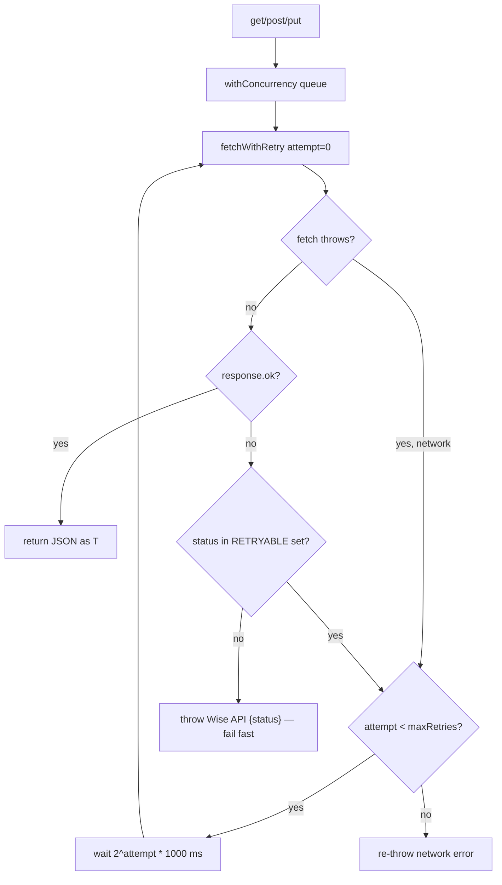

# Wise API Reference

How BGScheduler talks to the external **Wise** scheduling platform — the single
production source of truth (tenant `begifted-education`, institute
`696e1f4d90102225641cc413`). This page is the canonical contract for the transport
client, every domain fetcher, the read-only helpers (locations / availability
check / activity events / analytics / fees), the writeback operations, and the
`WISE_*` environment variables.

The **source of truth** is the code under `src/lib/wise/`:

| File | Role |
|---|---|
| `src/lib/wise/client.ts` | `WiseClient` transport — auth headers, retry/backoff, concurrency limiter |
| `src/lib/wise/fetchers.ts` | Domain fetchers + read helpers + verified Wise writeback helpers |
| `src/lib/wise/types.ts` | Wise request/response shapes and field accessors |
| `src/lib/wise/operations.ts` | LINE-scheduler Wise *cancel/reschedule* actions (currently dry-run only) |
| `src/lib/env.ts` | Zod declarations for `WISE_USER_ID` / `WISE_API_KEY` / `WISE_NAMESPACE` / `WISE_INSTITUTE_ID` |

> **Maturity:** The transport client, the read fetchers, the
> `updateSessionLocation` writeback, and the Student Promotions write helpers are live production code. The LINE
> cancel/reschedule path in `operations.ts` is **not** a verified Wise mutation —
> it records dry-run logs and never sends a request (see
> [Writeback operations](#writeback-operations)).

> **Naming caution.** "Wise" here is the *scheduling platform* `api.wiseapp.live`.
> It is unrelated to the Wise money-transfer product. The fee/receipt fetchers
> below read tuition transactions out of this same scheduling platform.

---

## TL;DR

- **Base URL:** `https://api.wiseapp.live` (`client.ts:47`). Override per-instance
  via `WiseClientConfig.baseUrl`.
- **Auth:** every request carries HTTP Basic `base64(userId:apiKey)` **plus**
  `x-api-key`, `x-wise-namespace`, and `user-agent: VendorIntegrations/{namespace}`
  (`client.ts:52`–`61`).
- **Retry/backoff:** up to 3 retries, exponential `1s / 2s / 4s`, but **only** for
  network errors and the transient status set `{408, 429, 500, 502, 503, 504}`.
  Permanent 4xx (401/403/404/422 and any other non-listed status) fail fast
  (`client.ts:23`–`30`, `91`–`134`).
- **Concurrency:** a FIFO queue caps in-flight requests. Production factory
  `createWiseClient()` sets **15**; the class default and the ad-hoc classroom
  factory use **5** (`client.ts:48`, `159`–`166`; `classrooms/data.ts:1139`).
- **Institute scoping:** nearly every endpoint is nested under
  `/institutes/{instituteId}`; callers pass `WISE_INSTITUTE_ID`
  (default `696e1f4d90102225641cc413`).
- **Writeback:** production mutations are narrowly scoped: classroom assignments write
  only OFFLINE session `location`; Student Promotions writes only registration field
  `if89sblj`, verified class `subject` transitions, and gated single-session
  subject updates for July 1+ school-curriculum payroll pay-band readiness.

---

## The transport client (`WiseClient`)

`WiseClient` (`client.ts:16`) is a thin `fetch` wrapper adding three cross-cutting
behaviors: a computed auth header set, retry/backoff on transient failures, and a
concurrency limiter. It exposes `get<T>()`, `post<T>()`, and `put<T>()`
(`client.ts:63`–`89`).

### Construction

```ts
interface WiseClientConfig {
  userId: string;
  apiKey: string;
  namespace: string;
  baseUrl?: string;        // default "https://api.wiseapp.live"
  maxConcurrency?: number; // default 5
  maxRetries?: number;     // default 3
}
```

Source: `client.ts:1`–`8`, defaults applied at `client.ts:43`–`50`.

The production factory injects credentials from the environment and raises
concurrency to 15:

```ts
export function createWiseClient(): WiseClient {
  return new WiseClient({
    userId: process.env.WISE_USER_ID!,
    apiKey: process.env.WISE_API_KEY!,
    namespace: process.env.WISE_NAMESPACE ?? "begifted-education",
    maxConcurrency: 15,
  });
}
```

Source: `client.ts:159`–`166`. The `!` non-null assertions mean a missing
`WISE_USER_ID`/`WISE_API_KEY` does **not** throw here — it produces `undefined`
credentials and the request fails at the API. (The classroom publish path uses a
separate guarded factory, `createWiseClientFromEnv()`, that throws a clear error
when either var is missing — `classrooms/data.ts:1132`–`1140`.)

### Auth header scheme

Headers are recomputed on every request from a private getter (`client.ts:52`–`61`):

| Header | Value | Notes |
|---|---|---|
| `Content-Type` | `application/json` | Always sent, including on GET |
| `Authorization` | `Basic {base64(userId:apiKey)}` | `Buffer.from(`${userId}:${apiKey}`).toString("base64")` (`client.ts:53`) |
| `x-api-key` | `apiKey` | Raw API key, **also** sent alongside Basic auth |
| `x-wise-namespace` | `namespace` | Tenant slug, e.g. `begifted-education` |
| `user-agent` | `VendorIntegrations/{namespace}` | e.g. `VendorIntegrations/begifted-education` |

Per-request `init.headers` are spread **after** the base headers (`client.ts:100`–
`103`), so individual fetchers can add headers (and would override on collision).
Two fetchers exercise this to pass tenant context for fee/trend endpoints:
`x-wise-timezone: Asia/Bangkok` and `x-wise-platform: web`
(`fetchers.ts:310`–`315`, `474`–`479`).

### Retry and backoff

`fetchWithRetry` (`client.ts:91`–`134`) implements bounded exponential backoff.
The delay is `Math.pow(2, attempt) * 1000` → **1s, 2s, 4s** across attempts 0/1/2
(`client.ts:108`, `129`). Two distinct retry triggers:

1. **Network-level failure** (DNS / `ECONNRESET` / `fetch` `TypeError`) — the
   `fetch` call itself throws; retried until `maxRetries` is exhausted, then the
   original error is re-thrown (`client.ts:105`–`113`).
2. **Transient HTTP status** — only the codes in `RETRYABLE_STATUS_CODES` are
   retried (`client.ts:23`–`30`, `127`–`133`):

   | Code | Meaning |
   |---|---|
   | 408 | Request Timeout |
   | 429 | Too Many Requests |
   | 500 | Internal Server Error |
   | 502 | Bad Gateway |
   | 503 | Service Unavailable |
   | 504 | Gateway Timeout |

**Permanent failures fail fast.** Any non-OK status *not* in that set — notably
401/403/404/422 — throws immediately with `Wise API {status}: {body} ({url})` and
burns no retry budget (`client.ts:121`–`124`). This is the REL-05 fail-fast rule.
After retries are exhausted on a transient status, the same `Wise API {status}`
error is thrown (`client.ts:133`).

A successful (`response.ok`) call returns `await response.json()` cast to the
caller's `T` — there is no runtime schema validation at this layer
(`client.ts:115`–`117`); the response interfaces in `types.ts` are compile-time
only, which is why nearly every field is optional (`?`) and envelopes are
`data?`-wrapped.



### Concurrency limiter

A single FIFO queue bounds simultaneous in-flight requests at `maxConcurrency`
(`client.ts:136`–`156`). `withConcurrency` enqueues a thunk; `processQueue` drains
it while `activeRequests < maxConcurrency`, decrementing and re-draining in a
`finally` so a failed request still frees its slot (`client.ts:151`–`154`).

This is what lets the per-teacher availability fan-out stay inside the sync
function timeout: a `WiseClient` instance is shared across all fetchers for one
sync run, so the limit is global to that run, not per-call. Production sets 15 for
the snapshot sync; other call sites that build their own client (e.g. the
classroom publish path) inherit the default of 5.

### Where the client is constructed

`createWiseClient()` (concurrency 15) is the standard factory; non-test call sites:

| Call site | Purpose |
|---|---|
| `src/lib/sync/run-wise-sync.ts:144` | Snapshot sync (teachers, availability, sessions) |
| `src/app/api/internal/sync-wise-activity/route.ts:18` | Activity audit cron |
| `src/app/api/wise-activity/sync/route.ts:33` | Manual activity backfill |
| `src/app/api/wise-activity/reconciliation/backfill/route.ts:40`, `src/lib/wise-activity/reconciliation.ts:739`,`766` | Activity reconciliation |
| `src/app/api/payroll/sync/route.ts:36` | Payroll sync |
| `src/lib/credit-control/run-sync-request.ts:140` | Credit-control sync |
| `src/lib/room-capacity/utilization.ts:436` | Room utilization (all institute sessions) |
| `src/lib/classrooms/morning-automation.ts:187` | Morning auto-assignment |

The classroom **publish** writeback instead uses `createWiseClientFromEnv()`
(default concurrency 5, throws on missing creds) — `classrooms/data.ts:1132`.

---

## Domain fetchers

All fetchers live in `src/lib/wise/fetchers.ts` and take `(client, instituteId, …)`.
Each returns already-unwrapped data (the `data?` envelope and inner arrays are
defaulted to `[]`/`{}` so callers never touch the wrapper). Module constants:
`PAGE_LIMIT = 1000`, `RECEIPT_PAGE_SIZE = 50`, `RECEIPT_MAX_PAGES = 200`
(`fetchers.ts:22`–`24`).

### Teachers — `fetchAllTeachers`

`fetchers.ts:29`–`35`.

- **Endpoint:** `GET /institutes/{instituteId}/teachers`
- **Params:** none
- **Pagination:** none — the full roster returns in one call
- **Returns:** `WiseTeacher[]` from `res.data.teachers` (default `[]`)

A `WiseTeacher` (`types.ts:9`–`15`) carries `_id`, an optional `userId` (string **or**
nested `{ _id, name }`), `name`, and `tags` (each tag a string **or**
`{ _id, name }`). Resolve the real user id with `getWiseTeacherUserId()` and the
display name with `getWiseTeacherDisplayName()` (`types.ts:264`–`270`). Each real
person is split by Wise into separate online/onsite teacher rows; identity
resolution collapses them downstream.

### Availability (one window) — `fetchTeacherAvailability`

`fetchers.ts:40`–`55`.

- **Endpoint:** `GET /institutes/{instituteId}/teachers/{teacherUserId}/availability`
- **Params:** `startTime`, `endTime` — **ISO-8601 UTC** (`Date.toISOString()`)
- **Pagination:** none (a single time window per call)
- **Returns:** `WiseAvailabilityResponse` = `{ workingHours?: { slots[] }, leaves?: [] }`
  (`types.ts:25`–`45`)

`workingHours.slots[]` are recurring weekly windows: `day` (numeric `0=Sun..6=Sat`
**or** a Wise weekday name), `startTime`, `endTime`. `leaves[]` are dated
exceptions with ISO-UTC `startTime`/`endTime`.

### Availability (180-day horizon) — `fetchTeacherFullAvailability`

`fetchers.ts:61`–`103`.

This is the fetcher the sync actually uses per teacher. It assembles the full leave
horizon by **windowing**:

- `horizonDays` defaults to **180** → `windowCount = ceil(180 / 7) = 26` windows.
- The **first** 7-day window (now → now+7) yields `workingHours` *and* the first
  batch of `leaves`.
- The remaining **25** windows (`Promise.all`, leaning on the concurrency limiter)
  are fetched **for leaves only**; their `workingHours` are discarded.
- Returns `{ workingHours, leaves }` with leaves concatenated across all windows
  (not de-duplicated here — overlap merging happens in normalization).

So one teacher = **26** availability GETs. With ~131 teachers this is the dominant
request volume of a sync and the reason `createWiseClient()` raises concurrency to
15.

### Future sessions — `fetchAllFutureSessions` / `fetchAllInstituteSessions`

`fetchers.ts:108`–`145`.

`fetchAllFutureSessions` is a thin wrapper that calls
`fetchAllInstituteSessions(client, instituteId, { status: "FUTURE" })`.

- **Endpoint:** `GET /institutes/{instituteId}/sessions`
- **Params (per page):**
  - `paginateBy=COUNT`
  - `page_number` — 1-based, incremented per loop
  - `page_size` — `PAGE_LIMIT` = `1000`
  - `status` — only sent when provided (`"FUTURE"` for the sync; omitted by the
    room-utilization caller, which wants all sessions)
- **Pagination:** loop while `page <= pageCount`. `pageCount` is read from
  `res.data.page_count` (falling back to the current page). The loop also breaks
  early if a page returns **zero** sessions (`fetchers.ts:140`).
- **Returns:** `WiseSession[]` accumulated across pages.

A `WiseSession` (`types.ts:55`–`70`) carries `_id`, `userId`/`teacherId`,
`scheduledStartTime`/`scheduledEndTime` (ISO UTC), `meetingStatus`, `type`,
`location`, `classId` (string **or** `{ _id, name, subject, classType }`),
`studentCount`, and `metadata.recurrenceId`. Use the accessors in `types.ts`
(`getWiseSessionTeacherUserId`, `getWiseSessionClassId`, `getWiseSessionClassName`,
`getWiseSessionClassSubject`, `getWiseSessionClassType` — `types.ts:272`–`296`)
rather than reading the polymorphic fields directly.

> **Known data limitation:** the `status: "FUTURE"` filter means this endpoint does
> **not** return past sessions. Historical compare views fall back to the nearest
> future occurrence (deduped by `recurrenceId`). See `handbook/data-flow.md` and the
> "Known Issues" notes in the root docs.

### Accepted students — `fetchWiseAcceptedStudents`

Returns accepted Wise students for Student Promotions audit generation.

- **Endpoint:** `GET /institutes/v3/{instituteId}/students`
- **Params:** `status=ACCEPTED`, `page_number`, `page_size=100`, plus Wise UI flags
  `showParents=true`, `showFeedbackData=true`, `showContractStatus=true`.
- **Pagination:** loops until the returned `page_count` is reached, or until a page
  returns no students.
- **Returns:** flattened student rows from `res.data.students`.

### Student registration — `fetchWiseStudentRegistrationData`

Reads a single student's Wise registration answers, including the Student
Promotions grade source field.

- **Endpoint:** `GET /institutes/{instituteId}/participants/{studentId}`
- **Params:** `showRegistrationData=true`
- **Returns:** participant payload with `registrationData.fields[]`.

Student Promotions reads field id `if89sblj`, label `Current Year/Grade level`.

### Course detail and participants

These helpers support Student Promotions course-action planning and apply-time
roster revalidation.

| Fetcher | Endpoint | Purpose |
|---|---|---|
| `fetchWiseCourse` | `GET /user/v2/classes/{classId}?full=true` | Reads current class/course subject before planning and before apply. |
| `fetchWiseCourseParticipants` | `GET /user/classes/{classId}/participants?showCoTeachers=true` | Reads the current class roster before applying a class-level subject update. |

---

## Read-only helpers

### Locations — `fetchInstituteLocations`

`fetchers.ts:150`–`156`.

- **Endpoint:** `GET /institutes/{instituteId}/locations`
- **Params:** none
- **Returns:** `string[]` of the room/venue labels Wise's own webapp offers
  (`res.data.locations`, default `[]`)

These strings are the catalog the classroom-assignment publish path validates a
desired room against before writing it back as a session `location`.

### Session availability check — `checkTeacherAvailabilityForSessions`

`fetchers.ts:158`–`204`.

Mirrors the conflict pre-check the Wise webapp runs before scheduling/editing an
offline session. **This is a POST but is read-only** — it validates, it does not
mutate.

- **Endpoint:** `POST /institutes/{instituteId}/checkSessionsAvailability`
- **Body** (`WiseSessionAvailabilityInput`, `fetchers.ts:158`–`181`):
  - `teacherId?`
  - `sessions[]` — each `{ teacherId?, classId?, sessionId?, scheduledStartTime,
    scheduledEndTime, type? }` (times accept `string | Date`)
  - `locationToCheck?` — to detect room (location) collisions
  - `studentId?`
  - `sessionsToSkip?` — a single `{ sessionId, skipUpcoming, classId?, startTime? }`
    object **or** an array of them (so an in-progress edit can exclude itself)
- **Returns** (`WiseSessionAvailabilityResponse`, `fetchers.ts:183`–`188`):
  loosely typed — `sessions[]` (each with `conflict?`/`hasConflict?`),
  `availability?`, `totalSessions?`, plus arbitrary passthrough keys.

### Activity events — `fetchWiseActivityEvents`

`fetchers.ts:222`–`250`.

- **Endpoint:** `GET /institutes/{instituteId}/events`
- **Params** (`WiseActivityEventsParams`):
  - `page_number` — from `pageNumber`, default `1`
  - `page_size` — from `pageSize`, **clamped to `1..50`**: `Math.max(1, Math.min(pageSize ?? 50, 50))` (`fetchers.ts:238`)
  - `type?`, `eventName?`, `userId?` — sent only when provided
  - `classIds?` — array, joined with commas into a single `classIds` param
- **Pagination:** the fetcher returns **one page**; the caller drives the page
  loop and stop conditions.
- **Returns:** `WiseActivityEvent[]` from `res.data.events`.

A `WiseActivityEvent` (`types.ts:132`–`138`) is `{ user?, event?, classroom?,
participant? }` where `event` holds `{ eventId, eventName, eventTimestamp, payload,
type }` (`types.ts:123`–`130`).

> **Date params are deliberately not sent.** AGENTS.md records that the live
> `/events` endpoint *ignores* date filters, so the sync does not trust them.
> Instead, the activity sync (`src/lib/wise-activity/sync.ts`) walks newest-first
> and stops on a client-side **lookback cutoff** combined with a page cap:
>
> | Trigger | Lookback | Max pages |
> |---|---|---|
> | `cron` | 3 days (`CRON_LOOKBACK_DAYS`) | 20 (`CRON_MAX_PAGES`) |
> | `manual` | 30 days (`MANUAL_LOOKBACK_DAYS`) | 500 (`MANUAL_MAX_PAGES`) |
>
> Source: `wise-activity/sync.ts:9`–`12`, `147`–`149`. Page size there is fixed at
> `PAGE_SIZE` (the endpoint's 50-row ceiling).

### Analytics — session / classroom stats and trends

`fetchers.ts:252`–`286`.

| Fetcher | Endpoint | Params | Returns (`res.data`) |
|---|---|---|---|
| `fetchWiseSessionStats` | `GET /institutes/{id}/analytics/sessionStats` | `from?`, `to?` (ISO UTC, sent only when set) | `{ sessionStats: { totalScheduled, totalLive, totalLate, totalCompleted, … } }` |
| `fetchWiseClassroomStats` | `GET /institutes/{id}/analytics/classroomStats` | none | `{ courseStats, classroomStats }` |
| `fetchWiseClassroomTrends` | `GET /institutes/{id}/analytics/classroomTrends` | none | `{ courseTrends, classroomTrends }` |

The stats/trends payload shapes are intentionally loose (`Record<string, unknown>`
in `types.ts:147`–`174`); only `sessionStats` has named counters.

### Fees-paid trends — `fetchWiseFeesPaidTrends`

`fetchers.ts:300`–`334`.

- **Endpoint:** `GET /institutes/{instituteId}/trends`
- **Params:** `showFeeCollectionTrends=true`, `showPayoutTrends=true`
- **Extra headers:** `x-wise-timezone: Asia/Bangkok`, `x-wise-platform: web`
  (`fetchers.ts:310`–`315`)
- **Returns:** `WiseFeesPaidTrend[]` — each point normalized to
  `{ timestamp, count, amountMinor, amount, currency }`. Empty timestamps are
  filtered out.

**Currency note:** Wise returns money in **minor units**. `amountMinorToMajor`
divides by 100 for `THB` and passes other currencies through unchanged
(`fetchers.ts:296`–`298`), so `amount` is major units and `amountMinor` is the raw
value.

### Fee/receipt transactions — `fetchWiseReceiptTransactions`

`fetchers.ts:452`–`492`.

- **Endpoint:** `GET /institutes/{instituteId}/fees/transactions`
- **Params (per page):**
  - `type=PAYMENT,OFFLINE_PAYMENT,DISBURSAL`
  - `status=CHARGED,PENDING_CONFIRMATION`
  - `populateParticipant=true`, `populateClassroom=true`
  - `page_size` — `options.pageSize ?? 50`
  - `page_number` — 1-based
  - `startDate` / `endDate` — derived from the caller's `YYYY-MM-DD` strings via
    `bangkokDateStartIso` / `bangkokDateEndIso`, which build the **Asia/Bangkok**
    day boundaries as UTC instants (Bangkok = UTC+7, so start-of-day uses hour
    `-7`; `fetchers.ts:364`–`372`)
- **Extra headers:** `x-wise-timezone: Asia/Bangkok`, `x-wise-platform: web`
- **Pagination:** loop to `maxPages` (`options.maxPages ?? 200`); break when
  `pageNumber >= page_count`, or when `page_count` is absent and the page is
  short (`fetchers.ts:487`–`488`).
- **Returns:** `WiseReceiptTransaction[]` — each raw `WiseFeeTransaction`
  (`types.ts:216`–`237`) is flattened by `normalizeWiseReceipt` (`fetchers.ts:401`–
  `450`) into id, type, status, charged/created timestamps, minor+major amount,
  currency, class/classroom/student/parent fields, a deduped `identifiers[]` list
  (pulled from many possible id locations for cross-system reconciliation), and the
  full `raw` payload. Rows with no id or no `chargedAt` are dropped.

---

## Writeback operations

BGScheduler is **read-mostly**. Wise mutations are limited to verified workflows
with narrow field scopes.

### Session location update — `updateSessionLocation`

`fetchers.ts:210`–`220`.

- **Endpoint:** `PUT /teacher/classes/{classId}/sessions/{sessionId}?updateType=SINGLE`
  — note this is under `/teacher/...`, **not** `/institutes/...`.
- **Body:** `{ location }` — a single field; nothing else is written.
- **`updateType=SINGLE`:** edits this one occurrence only, never the recurring
  series.
- **Returns:** `WiseSessionUpdateResponse` = `{ status?, message?, data? }`
  (`types.ts:101`–`106`).

Online room/booth assignments stay local in v1.

#### Eligibility policy

The classroom publish flow calls `updateSessionLocation` for each row only after
`isClassroomPublishEligible` returns `{ eligible: true }`
(`classrooms/data.ts:1194`–`1215`; invoked at `classrooms/data.ts:1423`, `1668`).
A row is **rejected** (with the stated reason) if any of these hold:

| Guard | Reason returned |
|---|---|
| `status === "remote"` or `assignedRoom === REMOTE_NO_ROOM_NEEDED` | Remote online session has no Wise location to publish |
| `status !== "assigned"` | Only assigned rows can publish |
| no `assignedRoom` or `assignedRoom === NO_ROOM_AVAILABLE` | No assigned room to publish |
| **not** an OFFLINE session (`!isOfflineSession(sessionType)`) | V1 publishes Wise locations for OFFLINE sessions only |
| missing `wiseClassId` | Missing Wise class id |
| missing `wiseSessionId` | Missing Wise session id |
| `warnings` includes `needs_review_missing_capacity` | Missing reliable group capacity |

So the writeback fires only for an **assigned, OFFLINE** session that has both a
Wise class id and session id and a clean capacity signal. Publishing is also an
explicit admin action (`POST /api/class-assignments/runs/{runId}/publish`) — local
run generation never writes to Wise.

### Student registration update — `updateWiseStudentRegistrationAnswers`

Used only by Student Promotions after a dry-run plan has been verified and the
apply window has opened.

- **Endpoint:** `PUT /institutes/{instituteId}/students/{studentId}/registration`
- **Body:** `{ answers }`, where Student Promotions sends only the verified target
  for field `if89sblj`.
- **Returns:** loose Wise response payload retained on the action row.

Before writing, the service re-fetches the participant registration data and skips
the action if the current grade no longer matches the verified plan.

### Session subject update — `updateSessionSubject`

Used only by Student Promotions future-session pay-band guardrails after the
grade/class promotion run is terminal and the session-subject verification gate is
enabled.

- **Endpoint:** `PUT /teacher/classes/{classId}/sessions/{sessionId}?updateType=SINGLE`
  — same single-occurrence Wise endpoint as room writeback.
- **Body:** `{ subject }` — a single field; nothing else is written.
- **Gate:** the application refuses this write unless
  `WISE_SESSION_SUBJECT_UPDATE_VERIFIED=true` and the admin route receives exact
  confirmation `apply-future-session-subjects`.
- **Scope:** only mapped UK/US/IB school-curriculum future sessions starting on or
  after `2026-07-01T00:00:00+07:00`.
- **Returns:** `WiseSessionUpdateResponse`; request and response payloads are
  retained on `student_promotion_future_session_actions`.

Readback/refresh uses live FUTURE sessions first. Already-target or payroll-key
equivalent subjects are marked idempotent and are not written again; drifted
subjects are surfaced as exceptions.

### Course subject update — `updateWiseCourseSubject`

Used only by Student Promotions for verified class-level course transitions.

- **Endpoint:** `PUT /teacher/editClass`
- **Body:** `{ classId, subject }`
- **Returns:** loose Wise response payload retained on the action row.

Before writing, the service re-fetches the class detail and class roster. It skips
the action if the current subject drifted or if the live roster no longer matches
the verified all-students-qualify guard.

### LINE cancel / reschedule — dry-run only (`operations.ts`)

`src/lib/wise/operations.ts` handles the LINE-scheduler's *proposed* Wise actions
(cancel / move sessions). Despite the filename, **it does not call any Wise mutating
endpoint.** `confirmLineWiseAction` (`operations.ts:26`–`95`):

- If `WISE_SESSION_OPERATIONS_VERIFIED !== "true"` (`operations.ts:10`–`12`), it logs
  the action as `manual_required` / `dryRun: true` and marks the review
  `writebackStatus: "manual_required"` (`operations.ts:49`–`69`).
- Even when that flag *is* set, it deliberately stays a recorded **dry run** — "no
  Wise mutation was sent" — because the cancel/move request shape is not yet
  verified against production-safe Wise docs (`operations.ts:71`–`94`).

Treat this path as **not yet a live writeback**.

---

## Environment variables

The four `WISE_*` variables are declared in the Zod schema at `src/lib/env.ts:8`–`11`:

| Variable | Schema | Default | Used for |
|---|---|---|---|
| `WISE_USER_ID` | `.string().min(1)` (hard-required) | — | Basic-auth username half (`base64(userId:apiKey)`); read at `client.ts:161`, `classrooms/data.ts:1133` |
| `WISE_API_KEY` | `.string().min(1)` (hard-required) | — | Basic-auth password half **and** the `x-api-key` header; read at `client.ts:162`, `classrooms/data.ts:1134` |
| `WISE_NAMESPACE` | `.string().default(...)` | `"begifted-education"` | `x-wise-namespace` header and the `user-agent` suffix; read at `client.ts:163`, `classrooms/data.ts:1135` |
| `WISE_INSTITUTE_ID` | `.string().default(...)` | `"696e1f4d90102225641cc413"` | The `{instituteId}` path segment for every institute-scoped endpoint |

> **Caveat (see `docs/reference/env.md`):** the exported `env` object in
> `src/lib/env.ts` is never imported, so the Zod validation is effectively dormant.
> Wise consumers read `process.env.WISE_*` **directly** and apply their own
> fallbacks: `createWiseClient()` uses `!` assertions (no throw on missing creds —
> the request just fails at the API), while the classroom factory
> `createWiseClientFromEnv()` throws "WISE_USER_ID and WISE_API_KEY are required to
> publish assignments" (`classrooms/data.ts:1136`–`1138`). `WISE_INSTITUTE_ID` and
> `WISE_NAMESPACE` fall back to the documented literals at their call sites even
> though the schema also defaults them.

`WISE_SESSION_OPERATIONS_VERIFIED` (read at `operations.ts:11`) is **not** in the
env schema; it is an undeclared feature flag gating the LINE dry-run path described
above.

---

## Endpoint summary

| Method | Path | Helper | Type |
|---|---|---|---|
| GET | `/institutes/{id}/teachers` | `fetchAllTeachers` | read |
| GET | `/institutes/{id}/teachers/{userId}/availability` | `fetchTeacherAvailability` / `fetchTeacherFullAvailability` | read |
| GET | `/institutes/{id}/sessions` | `fetchAllFutureSessions` / `fetchAllInstituteSessions` | read (paginated) |
| GET | `/institutes/v3/{id}/students` | `fetchWiseAcceptedStudents` | read (paginated) |
| GET | `/institutes/{id}/participants/{studentId}?showRegistrationData=true` | `fetchWiseStudentRegistrationData` | read |
| GET | `/user/v2/classes/{classId}?full=true` | `fetchWiseCourse` | read |
| GET | `/user/classes/{classId}/participants?showCoTeachers=true` | `fetchWiseCourseParticipants` | read |
| GET | `/institutes/{id}/locations` | `fetchInstituteLocations` | read |
| POST | `/institutes/{id}/checkSessionsAvailability` | `checkTeacherAvailabilityForSessions` | read (validation) |
| GET | `/institutes/{id}/events` | `fetchWiseActivityEvents` | read (paginated) |
| GET | `/institutes/{id}/analytics/sessionStats` | `fetchWiseSessionStats` | read |
| GET | `/institutes/{id}/analytics/classroomStats` | `fetchWiseClassroomStats` | read |
| GET | `/institutes/{id}/analytics/classroomTrends` | `fetchWiseClassroomTrends` | read |
| GET | `/institutes/{id}/trends` | `fetchWiseFeesPaidTrends` | read |
| GET | `/institutes/{id}/fees/transactions` | `fetchWiseReceiptTransactions` | read (paginated) |
| PUT | `/teacher/classes/{classId}/sessions/{sessionId}?updateType=SINGLE` | `updateSessionLocation` | **write** (OFFLINE only) |
| PUT | `/teacher/classes/{classId}/sessions/{sessionId}?updateType=SINGLE` | `updateSessionSubject` | **write** (gated Student Promotions only) |
| PUT | `/institutes/{id}/students/{studentId}/registration` | `updateWiseStudentRegistrationAnswers` | **write** (Student Promotions only) |
| PUT | `/teacher/editClass` | `updateWiseCourseSubject` | **write** (Student Promotions only) |

## See also

- [`docs/handbook/data-flow.md`](../handbook/data-flow.md) — where these fetchers sit
  in the sync ETL pipeline and how client errors propagate.
- [`docs/reference/env.md`](./env.md) — full env-var reference and the dormant-Zod caveat.
- [`docs/reference/crons.md`](./crons.md) — the cron schedules that drive the syncs.
- `AGENTS.md` — the live Wise contract description this page was cross-checked against.

_Verified against d56f8c6 + uncommitted WIP on 2026-05-31._
