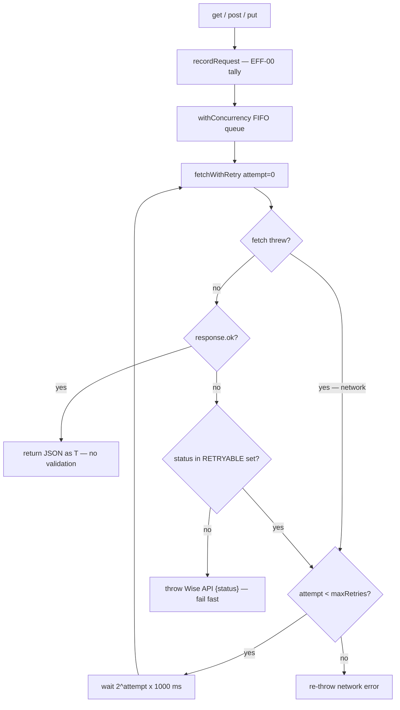

# Wise API Reference

How BGScheduler talks to the external **Wise** scheduling platform — the single
production source of truth (tenant `begifted-education`, institute
`696e1f4d90102225641cc413`). This page is the canonical contract for the transport
client, every domain fetcher, the per-invocation request counter, the read-only
helpers (locations / availability check / activity events / analytics / fees /
credits), the four writeback operations, and the `WISE_*` environment variables.
Feature meaning — why a subsystem polls Wise at all, and what it does with the
answer — lives in the matching [`docs/features/*`](../features/) page.

**Authoritative source** is the code, not this page:

| File | Role |
|---|---|
| [`src/lib/wise/client.ts`](../../src/lib/wise/client.ts) | `WiseClient` transport — auth headers, retry/backoff, FIFO concurrency limiter, EFF-00 request tally |
| [`src/lib/wise/fetchers.ts`](../../src/lib/wise/fetchers.ts) | 22 domain fetchers + read helpers + the four verified writeback helpers |
| [`src/lib/wise/types.ts`](../../src/lib/wise/types.ts) | Wise request/response shapes and the polymorphic-field accessors |
| [`src/lib/wise/operations.ts`](../../src/lib/wise/operations.ts) | LINE-scheduler Wise *cancel/reschedule* actions — dry-run only, no request is ever sent |
| [`src/lib/credit-control/wise.ts`](../../src/lib/credit-control/wise.ts) | Credit Control's own Zod-validated fetchers; **five endpoints that exist nowhere in `fetchers.ts`** |
| [`src/lib/env.ts`](../../src/lib/env.ts) | Zod declarations for `WISE_USER_ID` / `WISE_API_KEY` / `WISE_NAMESPACE` / `WISE_INSTITUTE_ID` |

> **Naming caution.** "Wise" here is the *scheduling platform* `api.wiseapp.live`.
> It is unrelated to the Wise money-transfer product. The fee/receipt/credit
> fetchers below read tuition transactions out of this same scheduling platform.

---

## TL;DR

- **Base URL:** `https://api.wiseapp.live` ([`client.ts:64`](../../src/lib/wise/client.ts)). Override per-instance via `WiseClientConfig.baseUrl`.
- **Auth:** every request carries HTTP Basic `base64(userId:apiKey)` **plus** `x-api-key`, `x-wise-namespace`, and `user-agent: VendorIntegrations/{namespace}` ([`client.ts:69-78`](../../src/lib/wise/client.ts)).
- **Retry/backoff:** up to 3 retries, exponential `1s / 2s / 4s`, but **only** for network errors and the transient status set `{408, 429, 500, 502, 503, 504}`. Permanent 4xx (401/403/404/422 and any other unlisted status) fail fast ([`client.ts:37-44`](../../src/lib/wise/client.ts), [`:158-177`](../../src/lib/wise/client.ts)).
- **Concurrency:** a FIFO queue caps in-flight requests **per client instance**. The production factory `createWiseClient()` sets **15** ([`client.ts:214-221`](../../src/lib/wise/client.ts)); the class default is **5** ([`client.ts:65`](../../src/lib/wise/client.ts)); Student Promotions builds its own at **6** ([`student-promotions/data.ts:305`](../../src/lib/student-promotions/data.ts)). There is no global limiter, which is why cron stagger is load-bearing (see [`crons.md`](./crons.md)).
- **Request counting (new):** every `get`/`post`/`put` is tallied by normalized path on the client instance and persisted per run — `sync_runs.metadata.wiseCallCount` / `.wiseTopPaths` and `credit_control_sync_runs.metadata`. See [The EFF-00 request counter](#the-eff-00-request-counter).
- **Availability is stitched, and must be:** the 180-day leave horizon is assembled from **26 seven-day windows** per teacher. A probe run on **2026-09-02** confirmed Wise **rejects any wider span with HTTP 400** — see [The 7-day availability ceiling](#the-7-day-availability-ceiling).
- **Institute scoping:** most endpoints nest under `/institutes/{instituteId}`; callers pass `WISE_INSTITUTE_ID` (default `696e1f4d90102225641cc413`). A minority sit under `/user/...` or `/teacher/...`.
- **Writeback is narrow and gated:** four mutating helpers exist. Classroom assignment writes only OFFLINE session `location`; Student Promotions writes registration answers, class `subject`, and (behind a flag + typed confirmation) single-session `subject`; Progress Tests creates a session behind `WISE_SESSION_CREATE_VERIFIED`. **Post-Class Feedback performs no Wise mutation at all.**

---

## The transport client (`WiseClient`)

`WiseClient` ([`client.ts:30`](../../src/lib/wise/client.ts)) is a thin `fetch` wrapper adding four cross-cutting
behaviors: a computed auth header set, retry/backoff on transient failures, a
concurrency limiter, and a request tally. It exposes `get<T>()`, `post<T>()`,
`put<T>()`, and `getStats()` ([`client.ts:99-132`](../../src/lib/wise/client.ts)). There is no `DELETE`.

### Construction

```ts
interface WiseClientConfig {
  userId: string;
  apiKey: string;
  namespace: string;
  baseUrl?: string;        // default "https://api.wiseapp.live"
  maxConcurrency?: number; // default 5
  maxRetries?: number;     // default 3
}
```

Source: [`client.ts:1-8`](../../src/lib/wise/client.ts); defaults applied at [`client.ts:60-67`](../../src/lib/wise/client.ts).

The production factory injects credentials from the environment and raises
concurrency to 15 ([`client.ts:214-221`](../../src/lib/wise/client.ts)):

```ts
export function createWiseClient(): WiseClient {
  return new WiseClient({
    userId: process.env.WISE_USER_ID!,
    apiKey: process.env.WISE_API_KEY!,
    namespace: process.env.WISE_NAMESPACE ?? "begifted-education",
    maxConcurrency: 15,
  });
}
```

The `!` non-null assertions mean a missing `WISE_USER_ID`/`WISE_API_KEY` does
**not** throw here — it produces `undefined` credentials and the request fails at
the API with a 401. Two call sites deliberately refuse to do that and validate
first:

| Guarded factory | Concurrency | Throws |
|---|---:|---|
| `createWiseClientFromEnv()` — [`classrooms/data.ts:1151-1159`](../../src/lib/classrooms/data.ts) | 5 (class default) | `WISE_USER_ID and WISE_API_KEY are required to publish assignments` |
| `createPromotionWiseClient()` — [`student-promotions/data.ts:298-306`](../../src/lib/student-promotions/data.ts) | **6** | `WISE_USER_ID and WISE_API_KEY are required for student promotions` |

Both are on write paths, which is the pattern: a read may degrade, a mutation may not.

### Auth header scheme

Headers are recomputed on every request from a private getter ([`client.ts:69-78`](../../src/lib/wise/client.ts)):

| Header | Value | Notes |
|---|---|---|
| `Content-Type` | `application/json` | Always sent, including on GET |
| `Authorization` | `Basic {base64(userId:apiKey)}` | `Buffer.from(userId + ":" + apiKey).toString("base64")` ([`client.ts:70`](../../src/lib/wise/client.ts)) |
| `x-api-key` | `apiKey` | Raw API key, **also** sent alongside Basic auth |
| `x-wise-namespace` | `namespace` | Tenant slug, e.g. `begifted-education` |
| `user-agent` | `VendorIntegrations/{namespace}` | e.g. `VendorIntegrations/begifted-education` |

Per-request `init.headers` are spread **after** the base headers
([`client.ts:143-146`](../../src/lib/wise/client.ts)), so an individual fetcher can add headers (and would override
on collision). Only two fetchers use this, both passing tenant context for the
money endpoints: `x-wise-timezone: Asia/Bangkok` and `x-wise-platform: web`
([`fetchers.ts:577-582`](../../src/lib/wise/fetchers.ts), [`:741-746`](../../src/lib/wise/fetchers.ts)).

### Retry and backoff

`fetchWithRetry` ([`client.ts:134-177`](../../src/lib/wise/client.ts)) implements bounded exponential backoff. The delay
is `Math.pow(2, attempt) * 1000` → **1s, 2s, 4s** across attempts 0/1/2
([`client.ts:151`](../../src/lib/wise/client.ts), [`:172`](../../src/lib/wise/client.ts)). Two distinct retry triggers:

1. **Network-level failure** (DNS / `ECONNRESET` / `fetch` `TypeError`) — the
   `fetch` call itself throws; retried until `maxRetries` is exhausted, then the
   original error is re-thrown ([`client.ts:148-156`](../../src/lib/wise/client.ts)).
2. **Transient HTTP status** — only the codes in the private static
   `RETRYABLE_STATUS_CODES` set are retried ([`client.ts:37-44`](../../src/lib/wise/client.ts), [`:170-176`](../../src/lib/wise/client.ts)):

   | Code | Meaning |
   |---|---|
   | 408 | Request Timeout |
   | 429 | Too Many Requests |
   | 500 | Internal Server Error |
   | 502 | Bad Gateway |
   | 503 | Service Unavailable |
   | 504 | Gateway Timeout |

**Permanent failures fail fast.** Any non-OK status *not* in that set — notably
401/403/404/422 — throws immediately with `Wise API {status}: {body} ({url})` and
burns no retry budget ([`client.ts:162-168`](../../src/lib/wise/client.ts)). This is the REL-05 fail-fast rule
named in the code comment. After retries are exhausted on a transient status, the
same `Wise API {status}` message is thrown ([`client.ts:176`](../../src/lib/wise/client.ts)).

A successful (`response.ok`) call returns `await response.json()` cast to the
caller's `T` — **there is no runtime schema validation at this layer**
([`client.ts:158-160`](../../src/lib/wise/client.ts)). The interfaces in `types.ts` are compile-time only, which is
why nearly every field is optional (`?`) and envelopes are `data?`-wrapped. Two
subsystems opt back in to runtime validation on top of the client: Credit Control
parses every envelope with Zod ([`credit-control/wise.ts:7-99`](../../src/lib/credit-control/wise.ts)), and
`fetchWiseSessionDetail` throws when the `data` envelope is missing or not an
object ([`fetchers.ts:200-202`](../../src/lib/wise/fetchers.ts)).


```mermaid
flowchart TD
  A["get / post / put"] --> R[recordRequest — EFF-00 tally]
  R --> B[withConcurrency FIFO queue]
  B --> C["fetchWithRetry attempt=0"]
  C --> D{fetch threw?}
  D -->|"yes — network"| E{attempt < maxRetries?}
  E -->|yes| W["wait 2^attempt x 1000 ms"] --> C
  E -->|no| X[re-throw network error]
  D -->|no| F{response.ok?}
  F -->|yes| G["return JSON as T — no validation"]
  F -->|no| H{status in RETRYABLE set?}
  H -->|no| Y["throw Wise API {status} — fail fast"]
  H -->|yes| E
```

### Concurrency limiter

A single FIFO queue bounds simultaneous in-flight requests at `maxConcurrency`
([`client.ts:179-199`](../../src/lib/wise/client.ts)). `withConcurrency` enqueues a thunk; `processQueue` drains it
while `activeRequests < maxConcurrency`, decrementing and re-draining in a
`finally` so a failed request still frees its slot ([`client.ts:194-197`](../../src/lib/wise/client.ts)).

The limit is **per `WiseClient` instance**, not per process and not per tenant. A
client is normally constructed once per sync invocation and shared across every
fetcher in that run, so the cap is effectively "per run". Two consequences worth
stating plainly:

- The per-teacher availability fan-out stays inside the function timeout because
  the 26 windows of one teacher are issued with `Promise.all` and throttled by the
  queue ([`fetchers.ts:88-97`](../../src/lib/wise/fetchers.ts)).
- Two crons firing in the same minute each get their own 15-slot budget, so the
  only defence against contention is schedule stagger — which is why a regression
  test forbids same-minute collisions ([`vercel-crons.test.ts`](../../src/__tests__/vercel-crons.test.ts), documented in [`crons.md`](./crons.md)).

### The EFF-00 request counter

Added in the Tier 1 cron-efficiency pass. Wise is the slowest dependency in every
sync, but until now no run recorded how many calls it actually made, so "is this
sync API-bound?" could only be guessed ([`client.ts:16-25`](../../src/lib/wise/client.ts)).

```ts
export interface WiseClientStats {
  requests: number;
  byPath: Record<string, number>;
}
```

**How it counts.** `recordRequest(path)` is the first statement of `get`, `post`
and `put` ([`client.ts:104`](../../src/lib/wise/client.ts), [`:115`](../../src/lib/wise/client.ts), [`:125`](../../src/lib/wise/client.ts)) — before the queue and before
`fetchWithRetry`. So the tally is **one per logical call**: a request that retries
three times still increments by one, and a request that fails still counts.

**How paths are bucketed.** `WiseClient.normalizeStatsPath` splits on `/` and
replaces any segment matching `/^[0-9a-f]{24}$/i` with `{id}`
([`client.ts:27-28`](../../src/lib/wise/client.ts), [`:85-90`](../../src/lib/wise/client.ts)), so one bucket exists per endpoint *shape* rather than per
teacher: `/institutes/{id}/teachers/{id}/availability`. The institute id is itself
a 24-hex object id, so it collapses too.

> **Caveat — query strings defeat the collapse.** Only the path is normalized, and
> two write helpers embed a query string in the path they pass
> ([`fetchers.ts:417`](../../src/lib/wise/fetchers.ts), [`:433`](../../src/lib/wise/fetchers.ts)). The final segment becomes
> `{sessionId}?updateType=SINGLE`, which no longer matches the 24-hex regex, so
> **every published session gets its own bucket**. `topWisePaths` keeps the JSON
> bounded either way, but a publish-heavy run can crowd the real buckets out of
> the top ten.

**Where it lands.** `getStats()` returns a defensive copy ([`client.ts:99-101`](../../src/lib/wise/client.ts));
`topWisePaths(stats, limit = 10)` returns the busiest normalized paths, sorted
descending and sliced, so an unexpectedly wide histogram can never bloat persisted
JSON ([`client.ts:206-212`](../../src/lib/wise/client.ts)).

| Consumer | Persisted to | Fields |
|---|---|---|
| Snapshot sync, success path — [`orchestrator.ts:505-512`](../../src/lib/sync/orchestrator.ts) | `sync_runs.metadata` | `wiseCallCount`, `wiseTopPaths`, alongside `durationMs`, `diffHookDurationMs`, `pastSessionsCapturedCount` |
| Snapshot sync, failure path — [`orchestrator.ts:571-583`](../../src/lib/sync/orchestrator.ts) | `sync_runs.metadata` | `wiseCallCount` + `durationMs` only |
| Credit-control sync — [`credit-control/sync.ts:730`](../../src/lib/credit-control/sync.ts), [`:744-747`](../../src/lib/credit-control/sync.ts) | `credit_control_sync_runs.metadata` | `wiseCallCount`, `wiseTopPaths`, alongside `failedCreditPairs`, `creditHistoryRows` |

The snapshot sync re-writes `sync_runs.metadata` once more after pruning, spreading
`successMetadata` so the call count survives that second update
([`orchestrator.ts:543-546`](../../src/lib/sync/orchestrator.ts)). No other subsystem records the tally yet — payroll,
progress-tests, post-class feedback and wise-activity runs still leave no Wise cost
trace.

### Where the client is constructed

`createWiseClient()` (concurrency 15) is the standard factory. Non-test call sites:

| Call site | Purpose | Trigger |
|---|---|---|
| [`sync/run-wise-sync.ts:144`](../../src/lib/sync/run-wise-sync.ts) | Snapshot sync (teachers, availability, FUTURE sessions) | cron `*/30 * * * *` |
| [`app/api/internal/sync-wise-activity/route.ts:22`](../../src/app/api/internal/sync-wise-activity/route.ts) | Activity audit sync | cron `2,17,32,47 * * * *` |
| [`app/api/wise-activity/sync/route.ts:41`](../../src/app/api/wise-activity/sync/route.ts) | Manual activity backfill | admin |
| [`app/api/wise-activity/reconciliation/backfill/route.ts:40`](../../src/app/api/wise-activity/reconciliation/backfill/route.ts), [`wise-activity/reconciliation.ts:780`](../../src/lib/wise-activity/reconciliation.ts), [`:807`](../../src/lib/wise-activity/reconciliation.ts) | Package-sales reconciliation (trends + receipts) | admin / request path |
| [`app/api/payroll/sync/route.ts:36`](../../src/app/api/payroll/sync/route.ts) | Payroll month reconciliation | admin — **no cron exists** |
| [`credit-control/run-sync-request.ts:140`](../../src/lib/credit-control/run-sync-request.ts) | Credit-control snapshot | cron `20,50 * * * *` |
| [`progress-tests/run-sync-request.ts:141`](../../src/lib/progress-tests/run-sync-request.ts) | Progress-test cycle recount | cron `25,55 * * * *` |
| [`progress-tests/booking.ts:263`](../../src/lib/progress-tests/booking.ts), [`:310`](../../src/lib/progress-tests/booking.ts) | Availability pre-check + gated session create | admin action |
| [`post-class-feedback/sync.ts:1058`](../../src/lib/post-class-feedback/sync.ts) | PAST-window discovery + canonical session detail | crons `13,43` and `23,53` |
| [`room-capacity/utilization.ts:436`](../../src/lib/room-capacity/utilization.ts) | All institute sessions for room utilization | `manualOnly` — no `vercel.json` entry |
| [`classrooms/morning-automation.ts:190`](../../src/lib/classrooms/morning-automation.ts) | Morning auto-assignment live session pull | cron `41 23 * * *` |
| [`student-schedule/live.ts:110`](../../src/lib/student-schedule/live.ts) | Live month overlay for the public parent page | **request path**, memoized |
| [`data-health/run-job.ts:51`](../../src/lib/data-health/run-job.ts) | Manual "run now" for the activity job | admin |

The classroom **publish** writeback and the Student Promotions write path use their
own guarded factories instead (see [Construction](#construction)).

---

## Domain fetchers

All fetchers in [`src/lib/wise/fetchers.ts`](../../src/lib/wise/fetchers.ts) take `(client, …)` and return
already-unwrapped data — the `data?` envelope and inner arrays are defaulted to
`[]`/`{}` so callers never touch the wrapper. Module constants: `PAGE_LIMIT = 1000`,
`RECEIPT_PAGE_SIZE = 50`, `RECEIPT_MAX_PAGES = 200` ([`fetchers.ts:24-26`](../../src/lib/wise/fetchers.ts)).

### Teachers — `fetchAllTeachers`

[`fetchers.ts:31-37`](../../src/lib/wise/fetchers.ts).

- **Endpoint:** `GET /institutes/{instituteId}/teachers`
- **Params:** none. **Pagination:** none — the full roster returns in one call.
- **Returns:** `WiseTeacher[]` from `res.data.teachers` (default `[]`)

A `WiseTeacher` ([`types.ts:9-15`](../../src/lib/wise/types.ts)) carries `_id`, an optional `userId` (string **or**
nested `{ _id, name }`), `name`, and `tags` (each tag a string **or** `{ _id, name }`).
Resolve the real user id with `getWiseTeacherUserId()` and the display name with
`getWiseTeacherDisplayName()` ([`types.ts:314-320`](../../src/lib/wise/types.ts)). Each real person is split by
Wise into separate online/onsite teacher rows; identity resolution collapses them
downstream. Three subsystems pull this same roster independently: the snapshot sync
([`orchestrator.ts:84`](../../src/lib/sync/orchestrator.ts)), progress tests ([`progress-tests/sync.ts:504`](../../src/lib/progress-tests/sync.ts)) and
payroll ([`payroll/sync.ts:277`](../../src/lib/payroll/sync.ts)).

### Availability (one window) — `fetchTeacherAvailability`

[`fetchers.ts:42-57`](../../src/lib/wise/fetchers.ts).

- **Endpoint:** `GET /institutes/{instituteId}/teachers/{teacherUserId}/availability`
- **Params:** `startTime`, `endTime` — **ISO-8601 UTC** (`Date.toISOString()`)
- **Returns:** `WiseAvailabilityResponse` = `{ workingHours?: { slots[] }, leaves?: [] }` ([`types.ts:25-45`](../../src/lib/wise/types.ts))

`workingHours.slots[]` are recurring weekly windows: `day` (numeric `0=Sun..6=Sat`
**or** a Wise weekday name), `startTime`, `endTime`. `leaves[]` are dated exceptions
with ISO-UTC `startTime`/`endTime`.

### Availability (180-day horizon) — `fetchTeacherFullAvailability`

[`fetchers.ts:63-105`](../../src/lib/wise/fetchers.ts). This is the fetcher the snapshot sync actually uses, once
per teacher ([`orchestrator.ts:176`](../../src/lib/sync/orchestrator.ts)). It assembles the full leave horizon by
**windowing**:

- `horizonDays` defaults to **180** → `windowCount = Math.ceil(180 / 7) = 26` windows.
- The **first** 7-day window (`now` → `now + 7d`) yields `workingHours` *and* the
  first batch of `leaves`.
- The remaining **25** windows are issued with `Promise.all`, leaning on the
  concurrency limiter, and are kept **for leaves only** — their `workingHours` are
  discarded.
- Returns `{ workingHours, leaves }` with leaves concatenated across all windows,
  **not** de-duplicated here; overlap merging happens in `normalizeLeaves`.

So one teacher = **26** availability GETs, and the outer per-teacher loop is
sequential (`for … await`) even though the limiter allows 15 in flight
([`orchestrator.ts:175-180`](../../src/lib/sync/orchestrator.ts)). This is by far the dominant request volume of a
snapshot sync — roughly 82% of all Wise traffic on the derived estimate in
[`docs/proposals/2026-09-02-cron-efficiency-and-wise-webhooks.md`](../proposals/2026-09-02-cron-efficiency-and-wise-webhooks.md).

#### The 7-day availability ceiling

**The stitch is mandatory, not incidental.** On **2026-09-02** the EFF-09 probe
([`scripts/probe-wise-availability-range.ts`](../../scripts/probe-wise-availability-range.ts)) fetched the same 180-day horizon
three ways per teacher — `26 × 7d` (the current strategy), `1 × 180d`, and
`6 × 30d` — and compared the *normalized* leave sets and working hours, not the raw
payloads. Result:

> Wise rejects **any** availability span longer than seven days with
> **HTTP 400 — `"Difference between end date and start date should not be more then a week"`** (Wise's spelling).

Both wide strategies failed on every teacher probed, so 0/5 matched the baseline
and no window-width optimisation exists. Because 400 is not in `RETRYABLE_STATUS_CODES`,
such a call fails fast rather than burning the retry budget — the fail-fast rule
doing exactly its job. The probe is read-only (GET-only, no database writes, no
Wise writes) and can be re-run:

```bash
npx tsx --tsconfig scripts/tsconfig.json scripts/probe-wise-availability-range.ts \
  --limit=5 --concurrency=5 --out=/tmp/probe.json
```

Any future attempt to cut the availability fan-out has to change *how often* the
far windows are fetched, not how wide they are.

### Sessions (count-paginated) — `fetchAllFutureSessions` / `fetchAllInstituteSessions`

[`fetchers.ts:110-147`](../../src/lib/wise/fetchers.ts). `fetchAllFutureSessions` is a thin wrapper that calls
`fetchAllInstituteSessions(client, instituteId, { status: "FUTURE" })`.

- **Endpoint:** `GET /institutes/{instituteId}/sessions`
- **Params per page:** `paginateBy=COUNT`, 1-based `page_number`, `page_size = PAGE_LIMIT = 1000`, and `status` **only when provided** (`"FUTURE"` for the sync; omitted by the room-utilization caller, which wants everything).
- **Pagination:** loop while `page <= pageCount`, where `pageCount` comes from `res.data.page_count` (falling back to the current page). The loop also breaks early when a page returns **zero** sessions ([`fetchers.ts:142`](../../src/lib/wise/fetchers.ts)).
- **Returns:** `WiseSession[]` accumulated across pages.

A `WiseSession` ([`types.ts:55-74`](../../src/lib/wise/types.ts)) carries `_id`, `userId`/`teacherId`,
`scheduledStartTime`/`scheduledEndTime` (ISO UTC), `meetingStatus`, `type`, `title`,
`location`, `classId` (string **or** `{ _id, name, subject, classType }`),
`studentCount`, `students`/`participants`, `duration`, and `metadata.recurrenceId`.
Use the accessors ([`types.ts:322-346`](../../src/lib/wise/types.ts)) rather than reading the polymorphic fields
directly.

> **Known data limitation.** `status: "FUTURE"` means this endpoint does **not**
> return past sessions. Compare views fall back to the nearest future occurrence
> of a recurring session, deduped by `recurrenceId`; one-time past sessions cannot
> be recovered. See [`handbook/data-flow.md`](../handbook/data-flow.md) and [`features/tutor-compare.md`](../features/tutor-compare.md).

Callers: the snapshot sync ([`orchestrator.ts:263`](../../src/lib/sync/orchestrator.ts)), room utilization with no
`status` at all ([`room-capacity/utilization.ts:436`](../../src/lib/room-capacity/utilization.ts)), classroom assignment on
the **request path** of a run ([`classrooms/data.ts:889`](../../src/lib/classrooms/data.ts), [`:993`](../../src/lib/classrooms/data.ts)), the
classroom publish job ([`classrooms/data.ts:1496`](../../src/lib/classrooms/data.ts)), morning automation
([`morning-automation.ts:192`](../../src/lib/classrooms/morning-automation.ts)) and Student Promotions future-session planning.

### Past sessions by Bangkok date — `fetchWisePastSessionsByBangkokDate`

[`fetchers.ts:153-181`](../../src/lib/wise/fetchers.ts). Owned by the Post-Class Feedback collector, deliberately
separate from the snapshot sync's FUTURE fetch.

- **Endpoint:** `GET /institutes/{instituteId}/sessions`
- **Params:** `status=PAST`, `paginateBy=DATE`, inclusive `startDate`/`endDate` in `YYYY-MM-DD` **Bangkok calendar** form (Wise's date-window mode expects calendar dates, not UTC instants), 1-based `page_number`, `page_size` (default `100`).
- **Pagination:** follows `data.page_count` when it is a number; otherwise stops on a short page ([`fetchers.ts:176`](../../src/lib/wise/fetchers.ts)).
- **Returns:** every `WiseSession` across the inclusive window.

Normal collection supplies a rolling **4**-Bangkok-date window
(`ROLLING_WINDOW_DAYS = 4`, [`post-class-feedback/sync.ts:49`](../../src/lib/post-class-feedback/sync.ts), [`:142`](../../src/lib/post-class-feedback/sync.ts)); manual
recovery may supply a different inclusive pair. Either way the run then caps
canonical detail fetches — `DEFAULT_DETAIL_CAP = 50`, raised to
`BACKFILL_DETAIL_CAP = 400` only for admin backfills, with `DETAIL_CONCURRENCY = 4`
([`sync.ts:40`](../../src/lib/post-class-feedback/sync.ts), [`:47-48`](../../src/lib/post-class-feedback/sync.ts), [`:576-577`](../../src/lib/post-class-feedback/sync.ts)).

### Canonical session detail — `fetchWiseSessionDetail`

[`fetchers.ts:187-204`](../../src/lib/wise/fetchers.ts). The canonical source for Post-Class Feedback evidence.

- **Endpoint:** `GET /user/classes/{classId}/sessions/{sessionId}`
- **Params:** `showLiveClassInsight=true`, `showFeedbackConfig=true`, `showFeedbackSubmission=true`
- **Returns:** `WiseSessionDetail` — `WiseSession` extended with optional `feedbackForm.questions[]` and `feedbackSubmissions[]` ([`types.ts:108-115`](../../src/lib/wise/types.ts))
- **Validation:** a missing or non-object `data` envelope **throws** ([`fetchers.ts:200-202`](../../src/lib/wise/fetchers.ts)) — the one fetcher that guards its envelope inline.

Required-question mapping, teacher-profile filtering, and the content/timing rules
are enforced in `src/lib/post-class-feedback/wise.ts` and `policy.ts`, not by this
transport helper. The collector considers only submissions whose `profile` is
`teacher`, and never substitutes local observation time for a missing Wise
timestamp when proving on-time submission — see [`features/post-class-feedback.md`](../features/post-class-feedback.md).

**The same URL is fetched by a second subsystem with a different parser.** Credit
Control's `fetchSessionTeacherFeedback` hits `/user/classes/{classId}/sessions/{sessionId}`
with only `showFeedbackConfig`/`showFeedbackSubmission` and extracts a single
`teacherFeedback` string ([`credit-control/wise.ts:276-289`](../../src/lib/credit-control/wise.ts)). There is no shared
cache between them.

### Students, registration, courses (Student Promotions)

| Fetcher | Endpoint | Params | Notes |
|---|---|---|---|
| `fetchWiseAcceptedStudents` — [`fetchers.ts:269-294`](../../src/lib/wise/fetchers.ts) | `GET /institutes/v3/{id}/students` | `status=ACCEPTED`, `page_number`, `page_size=100`, `showParents=true`, `showFeedbackData=true`, `showContractStatus=true` | Loops until a short page; returns `res.data.students` |
| `fetchWiseStudentRegistrationData` — [`fetchers.ts:296-306`](../../src/lib/wise/fetchers.ts) | `GET /institutes/{id}/participants/{studentId}` | `showRegistrationData=true` | Returns `registrationData.fields[]`; Promotions reads field id `if89sblj`, label `Current Year/Grade level` |
| `fetchWiseCourse` — [`fetchers.ts:320-329`](../../src/lib/wise/fetchers.ts) | `GET /user/v2/classes/{classId}` | `full=true` | Current class/course `subject` before planning **and** again before apply |
| `fetchWiseCourseParticipants` — [`fetchers.ts:339-356`](../../src/lib/wise/fetchers.ts) | `GET /user/classes/{classId}/participants` | `showCoTeachers=true` | Roster revalidation. Tolerant of Wise's shape drift: flattens whichever of `students` / `participants` / `users` / `learners` is present |

---

## Credit Control's own fetchers

[`src/lib/credit-control/wise.ts`](../../src/lib/credit-control/wise.ts) does **not** go through `fetchers.ts`. It calls
`client.get<unknown>` directly and parses each envelope with a Zod schema, so a
Wise contract change surfaces as a parse error rather than as silently-undefined
fields ([`wise.ts:7-99`](../../src/lib/credit-control/wise.ts)). `PAGE_SIZE = 100`, `DATE_WINDOW_DAYS = 31`
([`wise.ts:4-5`](../../src/lib/credit-control/wise.ts)).

| Fetcher | Endpoint | Params | Windowing |
|---|---|---|---|
| `fetchCreditStudents` — [`wise.ts:146-163`](../../src/lib/credit-control/wise.ts) | `GET /institutes/v3/{id}/students` | `page_number`, `page_size=100`, `showParents=true` — **no `status` filter**, unlike the Promotions variant | Loops until a short page |
| `fetchCreditSessions` — [`wise.ts:165-190`](../../src/lib/credit-control/wise.ts) | `GET /institutes/{id}/sessions` | `status` (`PAST`\|`FUTURE`), `paginateBy=DATE`, `startDate`/`endDate` as `YYYY-MM-DD`, `page_size=100` | Outer loop of **31-day** windows; the sync spans PAST 120 days and FUTURE 180 days ([`credit-control/sync.ts:61-63`](../../src/lib/credit-control/sync.ts), [`:657-662`](../../src/lib/credit-control/sync.ts)) |
| `fetchInstituteSessionsForDays` — [`wise.ts:206-226`](../../src/lib/credit-control/wise.ts) + [`:229-251`](../../src/lib/credit-control/wise.ts) | `GET /institutes/{id}/sessions` | one request per Bangkok day, `paginateBy=DATE`, `startDate=day`, `endDate=day+1` | `status` is **required** by the endpoint (confirmed live: omitting it returns zero sessions), so each day is classified against `todayKey` — earlier days `PAST`, later days `FUTURE`, and today **both** (two requests). Issued with `Promise.all`; the client's own limiter throttles them |
| `fetchSessionCredits` — [`wise.ts:263-274`](../../src/lib/credit-control/wise.ts) | `GET /institutes/{id}/classes/{classId}/students/{studentId}/sessionCredits` | `fetchHistory=true` | **One GET per (class × student) pair** — the dominant per-run cost inside credit-control |
| `fetchSessionTeacherFeedback` — [`wise.ts:276-289`](../../src/lib/credit-control/wise.ts) | `GET /user/classes/{classId}/sessions/{sessionId}` | `showFeedbackConfig=true`, `showFeedbackSubmission=true` | One GET per ended-uncredited session; same URL as `fetchWiseSessionDetail` |

`fetchInstituteSessionsForDays` is the only Wise read on a **public request path**:
the parent-facing `/schedule/{token}` page overlays live sessions through
[`student-schedule/live.ts:107-115`](../../src/lib/student-schedule/live.ts), memoized per `wiseStudentId:monthKey` and
returning `ok: false` rather than throwing when Wise is slow or down.

## Other inline session fetchers

Two more subsystems hit `/institutes/{id}/sessions` without going through
`fetchers.ts`, both with their own window and page constants:

| Owner | Helper | Window | Page size |
|---|---|---|---|
| Progress Tests — [`progress-tests/sync.ts:124-156`](../../src/lib/progress-tests/sync.ts) | `fetchWisePastSessions` | `SESSION_FETCH_WINDOW_DAYS = 85`, from `PROGRESS_TEST_COUNTING_START` (`2026-03-01T00:00:00+07:00`, [`progress-tests/config.ts:8`](../../src/lib/progress-tests/config.ts)) to now — a **growing** span | `1000` ([`sync.ts:66`](../../src/lib/progress-tests/sync.ts)) |
| Payroll — [`payroll/sync.ts:160-189`](../../src/lib/payroll/sync.ts) | `fetchPayrollPastSessions` | one Bangkok payroll month, padded | `1000` ([`sync.ts:22`](../../src/lib/payroll/sync.ts)) |

Unlike the Credit Control and PCF variants, these two pass **ISO instants** to
`startDate`/`endDate` rather than `YYYY-MM-DD` ([`progress-tests/sync.ts:145-146`](../../src/lib/progress-tests/sync.ts)) —
Wise accepts both forms on `paginateBy=DATE`.

---

## Read-only helpers

### Locations — `fetchInstituteLocations`

[`fetchers.ts:209-215`](../../src/lib/wise/fetchers.ts).

- **Endpoint:** `GET /institutes/{instituteId}/locations` · **Params:** none
- **Returns:** `string[]` of the room/venue labels Wise's own webapp offers (`res.data.locations`, default `[]`)

These strings are the catalog the classroom-assignment publish path validates a
desired room against before writing it back. The load is itself fail-closed: an
empty catalog throws `Wise location catalog is empty; refusing to publish locations`
rather than publishing unvalidated names ([`classrooms/data.ts:1405-1418`](../../src/lib/classrooms/data.ts)).

### Session availability check — `checkTeacherAvailabilityForSessions`

[`fetchers.ts:394-404`](../../src/lib/wise/fetchers.ts). Mirrors the conflict pre-check the Wise webapp runs
before scheduling or editing a session. **This is a POST but is read-only** — it
validates, it does not mutate.

- **Endpoint:** `POST /institutes/{instituteId}/checkSessionsAvailability`
- **Body** (`WiseSessionAvailabilityInput`, [`fetchers.ts:358-381`](../../src/lib/wise/fetchers.ts)): `teacherId?`; `sessions[]`, each `{ teacherId?, classId?, sessionId?, scheduledStartTime, scheduledEndTime, type? }` (times accept `string | Date`); `locationToCheck?` for room collisions; `studentId?`; and `sessionsToSkip?`, a single `{ sessionId, skipUpcoming, classId?, startTime? }` **or** an array of them, so an in-progress edit can exclude itself.
- **Returns** (`WiseSessionAvailabilityResponse`, [`fetchers.ts:383-388`](../../src/lib/wise/fetchers.ts)): loosely typed — `sessions[]` (each with `conflict?`/`hasConflict?`), `availability?`, `totalSessions?`, plus arbitrary passthrough keys.

Its one production caller is the Progress Tests booking flow, which treats any
reported conflict as an abort ([`progress-tests/booking.ts:263-285`](../../src/lib/progress-tests/booking.ts)).

### Activity events — `fetchWiseActivityEvents`

[`fetchers.ts:498-517`](../../src/lib/wise/fetchers.ts).

- **Endpoint:** `GET /institutes/{instituteId}/events`
- **Params:** `page_number` (from `pageNumber`, default `1`); `page_size` (from `pageSize`, **clamped to `1..50`**: `Math.max(1, Math.min(pageSize ?? 50, 50))`, [`fetchers.ts:505`](../../src/lib/wise/fetchers.ts)); `type?`, `eventName?`, `userId?` sent only when provided; `classIds?` joined with commas into one param.
- **Pagination:** the fetcher returns **one page**; the caller drives the loop and the stop condition.
- **Returns:** `WiseActivityEvent[]` from `res.data.events` — `{ user?, event?, classroom?, participant? }` where `event` holds `{ eventId, eventName, eventTimestamp, payload, type }` ([`types.ts:173-188`](../../src/lib/wise/types.ts)).

> **Date params are deliberately not sent.** The live `/events` endpoint ignores
> date filters, so the sync does not trust them. Instead
> [`wise-activity/sync.ts`](../../src/lib/wise-activity/sync.ts) walks newest-first and stops on a client-side
> lookback cutoff combined with a page cap ([`sync.ts:8-12`](../../src/lib/wise-activity/sync.ts), [`:160-161`](../../src/lib/wise-activity/sync.ts)):
>
> | Trigger | Lookback | Max pages |
> |---|---|---|
> | `cron` | 3 days (`CRON_LOOKBACK_DAYS`) | 20 (`CRON_MAX_PAGES`) |
> | `manual` | 30 days (`MANUAL_LOOKBACK_DAYS`) | 500 (`MANUAL_MAX_PAGES`) |
>
> Page size there is fixed at `PAGE_SIZE = 50`, the endpoint's own ceiling.

Payroll re-crawls the same feed independently, filtered to
`eventName = "TutorPayoutInvoiceCreatedEvent"` at 50 rows/page for up to
`DEFAULT_MAX_EVENT_PAGES = 1000` pages ([`payroll/sync.ts:20-23`](../../src/lib/payroll/sync.ts), [`:197-228`](../../src/lib/payroll/sync.ts)) —
re-reading events already persisted in `wise_activity_events`.

### Analytics — session / classroom stats and trends

[`fetchers.ts:519-553`](../../src/lib/wise/fetchers.ts).

| Fetcher | Endpoint | Params | Returns (`res.data`) |
|---|---|---|---|
| `fetchWiseSessionStats` | `GET /institutes/{id}/analytics/sessionStats` | `from?`, `to?` (ISO UTC, sent only when set) | `{ sessionStats: { totalScheduled, totalLive, totalLate, totalCompleted, … } }` |
| `fetchWiseClassroomStats` | `GET /institutes/{id}/analytics/classroomStats` | none | `{ courseStats, classroomStats }` |
| `fetchWiseClassroomTrends` | `GET /institutes/{id}/analytics/classroomTrends` | none | `{ courseTrends, classroomTrends }` |

The stats/trends payload shapes are intentionally loose (`Record<string, unknown>`,
[`types.ts:197-224`](../../src/lib/wise/types.ts)); only `sessionStats` has named counters. None of the three has
a production caller at this revision — they are available surface, not live traffic.

### Fees-paid trends — `fetchWiseFeesPaidTrends`

[`fetchers.ts:567-601`](../../src/lib/wise/fetchers.ts).

- **Endpoint:** `GET /institutes/{instituteId}/trends`
- **Params:** `showFeeCollectionTrends=true`, `showPayoutTrends=true`
- **Extra headers:** `x-wise-timezone: Asia/Bangkok`, `x-wise-platform: web`
- **Returns:** `WiseFeesPaidTrend[]`, each point normalized to `{ timestamp, count, amountMinor, amount, currency }`; points with an empty timestamp are filtered out.

**Currency note.** Wise returns money in **minor units**. `amountMinorToMajor`
divides by 100 for `THB` and passes every other currency through unchanged
([`fetchers.ts:563-565`](../../src/lib/wise/fetchers.ts)), so `amount` is major units and `amountMinor` is the raw
value. A non-THB currency therefore reports major == minor — correct for
zero-decimal currencies, wrong for two-decimal ones, and unexercised today.

### Fee/receipt transactions — `fetchWiseReceiptTransactions`

[`fetchers.ts:719-759`](../../src/lib/wise/fetchers.ts).

- **Endpoint:** `GET /institutes/{instituteId}/fees/transactions`
- **Params per page:** `type=PAYMENT,OFFLINE_PAYMENT,DISBURSAL`; `status=CHARGED,PENDING_CONFIRMATION`; `populateParticipant=true`; `populateClassroom=true`; `page_size` (`options.pageSize ?? 50`); 1-based `page_number`; and `startDate`/`endDate` derived from the caller's `YYYY-MM-DD` strings via `bangkokDateStartIso` / `bangkokDateEndIso`, which build the **Asia/Bangkok** day boundaries as UTC instants (Bangkok = UTC+7, so start-of-day uses hour `-7`; [`fetchers.ts:631-639`](../../src/lib/wise/fetchers.ts)).
- **Extra headers:** `x-wise-timezone: Asia/Bangkok`, `x-wise-platform: web`
- **Pagination:** loop to `maxPages` (`options.maxPages ?? 200`); break when `pageNumber >= page_count`, or when `page_count` is absent and the page is short ([`fetchers.ts:754-755`](../../src/lib/wise/fetchers.ts)).
- **Returns:** `WiseReceiptTransaction[]`. Each raw `WiseFeeTransaction` ([`types.ts:266-287`](../../src/lib/wise/types.ts)) is flattened by `normalizeWiseReceipt` ([`fetchers.ts:668-717`](../../src/lib/wise/fetchers.ts)) into id, type, status, charged/created timestamps, minor + major amount, currency, class/classroom/student/parent fields, a deduped `identifiers[]` list assembled from **fifteen** candidate fields (the row id plus fourteen alternates) for cross-system reconciliation, and the full `raw` payload. Rows with no id or no `chargedAt` are dropped.

---

## Writeback operations

BGScheduler is **read-mostly**. Four helpers mutate Wise; each is narrow in field
scope, and three of the four are additionally flag-gated.

| Helper | Endpoint | Fields written | Gate |
|---|---|---|---|
| `updateSessionLocation` | `PUT /teacher/classes/{classId}/sessions/{sessionId}?updateType=SINGLE` | `location` | Eligibility policy + explicit admin publish action (**no env flag**) |
| `updateWiseStudentRegistrationAnswers` | `PUT /institutes/{id}/students/{studentId}/registration` | `answers` (only `if89sblj`) | Verified dry-run plan + re-read before write |
| `updateWiseCourseSubject` | `PUT /teacher/editClass` | `classId`, `subject` | Verified plan + roster/subject re-read before write |
| `updateSessionSubject` | `PUT /teacher/classes/{classId}/sessions/{sessionId}?updateType=SINGLE` | `subject` | `WISE_SESSION_SUBJECT_UPDATE_VERIFIED=true` **and** typed confirmation |
| `scheduleWiseSession` | `POST /teacher/classes/{classId}/sessions` | one `SINGLE` session | `WISE_SESSION_CREATE_VERIFIED=true` **and** a passing availability pre-check |

### Session location update — `updateSessionLocation`

[`fetchers.ts:410-420`](../../src/lib/wise/fetchers.ts).

- **Path note:** this sits under `/teacher/...`, **not** `/institutes/...`.
- **Body:** `{ location }` — a single field; nothing else is written.
- **`updateType=SINGLE`:** edits this one occurrence only, never the recurring series.
- **Returns:** `WiseSessionUpdateResponse` = `{ status?, message?, data? }` ([`types.ts:151-156`](../../src/lib/wise/types.ts)).

Online room/booth assignments stay local — there is no Wise write for them.

#### Eligibility policy

The publish flow calls `updateSessionLocation` for a row only after
`isClassroomPublishEligible` returns `{ eligible: true }`
([`classrooms/data.ts:1213-1234`](../../src/lib/classrooms/data.ts)). A row is rejected, with the stated reason, if
any of these hold:

| Guard | Reason returned |
|---|---|
| `status === "remote"` or `assignedRoom === REMOTE_NO_ROOM_NEEDED` | Remote online session has no Wise location to publish |
| `status !== "assigned"` | Only assigned rows can publish |
| no `assignedRoom`, or `assignedRoom === NO_ROOM_AVAILABLE` | No assigned room to publish |
| **not** an OFFLINE session (`!isOfflineSession(sessionType)`) | V1 publishes Wise locations for OFFLINE sessions only |
| missing `wiseClassId` | Missing Wise class id |
| missing `wiseSessionId` | Missing Wise session id |
| `warnings` includes `needs_review_missing_capacity` | Missing reliable group capacity |

So the writeback fires only for an **assigned, OFFLINE** row that has both a Wise
class id and session id and a clean capacity signal. Publishing is an explicit
admin action (`POST /api/class-assignments/runs/{runId}/publish`); local run
generation never writes to Wise. The same helper is also used to break a room
swap cycle by moving a row through a temporary location first
([`classrooms/data.ts:1420-1449`](../../src/lib/classrooms/data.ts)) — the only case where one session is written
twice in a run.

### Student registration update — `updateWiseStudentRegistrationAnswers`

[`fetchers.ts:308-318`](../../src/lib/wise/fetchers.ts). Used only by Student Promotions after a dry-run plan has
been verified and the apply window has opened. Body `{ answers }`, carrying only
the verified target for field `if89sblj`. Before writing, the service re-fetches
the participant registration data and **skips** the action if the current grade no
longer matches the verified plan.

### Course subject update — `updateWiseCourseSubject`

[`fetchers.ts:331-337`](../../src/lib/wise/fetchers.ts). `PUT /teacher/editClass` with `{ classId, subject }`. Before
writing, the service re-fetches class detail and roster and skips the action if the
subject drifted or the live roster no longer satisfies the all-students-qualify
guard.

### Session subject update — `updateSessionSubject`

[`fetchers.ts:426-436`](../../src/lib/wise/fetchers.ts). The future-session pay-band guardrail: same
single-occurrence endpoint as the room writeback, body `{ subject }`.

- **Gate:** the service refuses unless `WISE_SESSION_SUBJECT_UPDATE_VERIFIED === "true"` ([`student-promotions/data.ts:449-451`](../../src/lib/student-promotions/data.ts), throw at [`:2412`](../../src/lib/student-promotions/data.ts)) **and** the admin route receives the exact confirmation string `apply-future-session-subjects` (`WISE_SESSION_SUBJECT_UPDATE_CONFIRMATION`, [`data.ts:199`](../../src/lib/student-promotions/data.ts)).
- **Scope:** only mapped UK/US/IB school-curriculum future sessions starting on or after `2026-07-01T00:00:00+07:00`.
- **Returns:** `WiseSessionUpdateResponse`; request and response payloads are retained on `student_promotion_future_session_actions`.

Readback prefers live FUTURE sessions. Already-target or payroll-key-equivalent
subjects are marked idempotent and not rewritten; drifted subjects surface as
exceptions.

### Session create — `scheduleWiseSession`

[`fetchers.ts:460-487`](../../src/lib/wise/fetchers.ts). The newest write path, owned by Progress Tests.

- **Endpoint:** `POST /teacher/classes/{classId}/sessions`
- **Body:** `{ userId, title, sessions: [{ type: "SINGLE", scheduledStartTime, scheduledEndTime, location? }] }` — `location` is included **only when provided**, since OFFLINE bookings need it and online ones do not.
- **Returns:** `{ sessionId, raw }`, where `sessionId` is pulled tolerantly from `data.sessionId` and is `null` when the response omits it.
- **The fetcher itself performs no verification.** The caller does, in four ordered steps ([`progress-tests/booking.ts:171-340`](../../src/lib/progress-tests/booking.ts)): record the intended booking for audit regardless of outcome → run `checkTeacherAvailabilityForSessions` and **abort fail-closed** on any reported conflict → gate on `wiseSessionCreateVerified()` ([`progress-tests/config.ts:47-51`](../../src/lib/progress-tests/config.ts)); when the flag is off, finalize the booking `manual_required` and make **no Wise call** → only then create.

The locally stored test date advances the progress-test cycle either way, so a
dry-run booking still behaves correctly downstream.

### LINE cancel / reschedule — dry-run only

[`src/lib/wise/operations.ts`](../../src/lib/wise/operations.ts) handles the LINE scheduler's *proposed* Wise
actions (cancel / move sessions). Despite the filename, **it calls no Wise endpoint
at all** — the module does not even import `WiseClient`. `confirmLineWiseAction`
([`operations.ts:26-95`](../../src/lib/wise/operations.ts)):

- With `WISE_SESSION_OPERATIONS_VERIFIED !== "true"` ([`operations.ts:10-12`](../../src/lib/wise/operations.ts)), it logs the action as `manual_required` / `dryRun: true` and sets the review's `writebackStatus: "manual_required"` ([`operations.ts:49-69`](../../src/lib/wise/operations.ts)).
- Even when the flag **is** set, it stays a recorded dry run — the response payload literally reads `Dry run recorded; no Wise mutation was sent.` — because the cancel/move request shape has not been verified against production-safe Wise documentation ([`operations.ts:71-94`](../../src/lib/wise/operations.ts)).

Treat this path as **not yet a live writeback**. The same flag is read once more at
module load in [`line/operational.ts:21`](../../src/lib/line/operational.ts).

---

## Webhooks

Wise can push events to a URL instead of being polled. **Nothing in this repository
receives them today** — there is no webhook route, no subscription code, and no
`wise_webhook_*` table; the `/api/line/webhook` allowlist entry is LINE's, not
Wise's. Everything on this page is polled.

The event catalogue, payload shapes, delivery/retry semantics and auth-header
uncertainty are documented separately in [`wise-webhooks.md`](./wise-webhooks.md). Three
constraints from that page matter when reading this one:

1. **Webhooks cannot replace the heaviest polling.** No event exists for teacher
   working hours, leaves, tags, session credits, teacher feedback submissions,
   payout invoices or institute locations — which is precisely the data the
   availability stitch, credit-control credit fetch and PCF detail fetch poll for.
2. **Event names differ from the polled `/institutes/{id}/events` feed** already
   mirrored into `wise_activity_events` (`SessionsCreatedEvent` vs
   `SessionCreatedEvent`), so a receiver would need a name map and a `source`
   column to avoid double counting.
3. **Fail-closed forbids applying a webhook delta to the active snapshot.** A
   webhook may *schedule* a real sync; it must never free a slot.

The proposed receiver, dispatcher and rollout — plus the measured cron/Wise cost
model this page's counter now feeds — are in
[`docs/proposals/2026-09-02-cron-efficiency-and-wise-webhooks.md`](../proposals/2026-09-02-cron-efficiency-and-wise-webhooks.md). That is a
proposal, not built behaviour.

---

## Environment variables

The four `WISE_*` variables are declared in the Zod schema at [`env.ts:8-11`](../../src/lib/env.ts):

| Variable | Schema | Default | Used for |
|---|---|---|---|
| `WISE_USER_ID` | `.string().min(1)` (hard-required) | — | Basic-auth username half; read at [`client.ts:216`](../../src/lib/wise/client.ts), [`classrooms/data.ts:1152`](../../src/lib/classrooms/data.ts), [`student-promotions/data.ts:299`](../../src/lib/student-promotions/data.ts) |
| `WISE_API_KEY` | `.string().min(1)` (hard-required) | — | Basic-auth password half **and** the `x-api-key` header; read at [`client.ts:217`](../../src/lib/wise/client.ts) and the same two guarded factories |
| `WISE_NAMESPACE` | `.string().default(...)` | `"begifted-education"` | `x-wise-namespace` header and the `user-agent` suffix |
| `WISE_INSTITUTE_ID` | `.string().default(...)` | `"696e1f4d90102225641cc413"` | The `{instituteId}` path segment; read directly at **20 sites across 16 modules**, 18 of which re-apply a fallback (the literal, or a module-local `DEFAULT_INSTITUTE_ID`) |

> **Caveat.** The exported `env` object in [`src/lib/env.ts`](../../src/lib/env.ts) has **no importers in
> non-test source**, so the Zod validation is effectively dormant — every Wise
> consumer reads `process.env.WISE_*` directly and applies its own fallback. Two
> call sites refuse to start without `WISE_INSTITUTE_ID` rather than defaulting it:
> [`room-capacity/utilization.ts:433-434`](../../src/lib/room-capacity/utilization.ts) and
> [`post-class-feedback/sync.ts:1053-1054`](../../src/lib/post-class-feedback/sync.ts). Full reconciliation:
> [`env.md`](./env.md).

Three Wise **write gates** are undeclared feature flags, read straight from
`process.env` and defaulting to off:

| Flag | Read at | Gates |
|---|---|---|
| `WISE_SESSION_OPERATIONS_VERIFIED` | [`operations.ts:11`](../../src/lib/wise/operations.ts), [`line/operational.ts:21`](../../src/lib/line/operational.ts) | LINE cancel/reschedule — still dry-run even when `true` |
| `WISE_SESSION_SUBJECT_UPDATE_VERIFIED` | [`student-promotions/data.ts:450`](../../src/lib/student-promotions/data.ts) | `updateSessionSubject` |
| `WISE_SESSION_CREATE_VERIFIED` | [`progress-tests/config.ts:50`](../../src/lib/progress-tests/config.ts) | `scheduleWiseSession` |

All three follow the exact-`"true"` idiom — any other value, including `"1"`, leaves
the write disabled.

---

## Endpoint summary

Every Wise path this codebase can reach, with its helper, direction, and the
subsystem plus trigger that drives it. Cron expressions are UTC, from
[`vercel.json`](../../vercel.json); see [`crons.md`](./crons.md) for the full registry.

| Method | Path | Helper (file) | R/W | Called by → trigger |
|---|---|---|---|---|
| GET | `/institutes/{id}/teachers` | `fetchAllTeachers` ([fetchers](../../src/lib/wise/fetchers.ts)) | read | Snapshot sync → `*/30 * * * *`; Progress Tests → `25,55 * * * *`; Payroll → admin |
| GET | `/institutes/{id}/teachers/{userId}/availability` | `fetchTeacherAvailability` / `fetchTeacherFullAvailability` | read | Snapshot sync → `*/30 * * * *` (26 windows × teacher) |
| GET | `/institutes/{id}/sessions` (`paginateBy=COUNT`, `status=FUTURE`) | `fetchAllFutureSessions` | read | Snapshot sync → `*/30`; Classroom runs → request path + `41 23 * * *`; Student Promotions → apply/plan |
| GET | `/institutes/{id}/sessions` (`paginateBy=COUNT`, no `status`) | `fetchAllInstituteSessions` | read | Room utilization → **manualOnly**, no cron |
| GET | `/institutes/{id}/sessions` (`status=PAST`, `paginateBy=DATE`, Bangkok dates) | `fetchWisePastSessionsByBangkokDate` | read | Post-Class Feedback → `13,43 * * * *` + backfill `23,53 * * * *` |
| GET | `/institutes/{id}/sessions` (`status=PAST\|FUTURE`, 31-day windows) | `fetchCreditSessions` ([credit-control](../../src/lib/credit-control/wise.ts)) | read | Credit Control → `20,50 * * * *` |
| GET | `/institutes/{id}/sessions` (one Bangkok day per request) | `fetchInstituteSessionsForDays` | read | Student Schedule live overlay → **public request path** |
| GET | `/institutes/{id}/sessions` (`status=PAST`, 85-day windows) | `fetchWisePastSessions` ([progress-tests](../../src/lib/progress-tests/sync.ts)) | read | Progress Tests → `25,55 * * * *` |
| GET | `/institutes/{id}/sessions` (`status=PAST`, payroll month) | `fetchPayrollPastSessions` ([payroll](../../src/lib/payroll/sync.ts)) | read | Payroll → admin, no cron |
| GET | `/user/classes/{classId}/sessions/{sessionId}` | `fetchWiseSessionDetail` | read | Post-Class Feedback → `13,43` + `23,53` (≤ 50 details/run) |
| GET | `/user/classes/{classId}/sessions/{sessionId}` | `fetchSessionTeacherFeedback` | read | Credit Control → `20,50 * * * *` (per ended-uncredited session) |
| GET | `/institutes/{id}/classes/{classId}/students/{studentId}/sessionCredits` | `fetchSessionCredits` | read | Credit Control → `20,50 * * * *` (per class × student pair) |
| GET | `/institutes/v3/{id}/students` (`status=ACCEPTED`) | `fetchWiseAcceptedStudents` | read | Student Promotions → `5 17 30 6 *` + admin dry-run |
| GET | `/institutes/v3/{id}/students` (no status) | `fetchCreditStudents` | read | Credit Control → `20,50 * * * *` |
| GET | `/institutes/{id}/participants/{studentId}` | `fetchWiseStudentRegistrationData` | read | Student Promotions → plan + pre-write re-read |
| GET | `/user/v2/classes/{classId}` (`full=true`) | `fetchWiseCourse` | read | Student Promotions → plan + pre-write re-read |
| GET | `/user/classes/{classId}/participants` | `fetchWiseCourseParticipants` | read | Student Promotions → pre-write roster revalidation |
| GET | `/institutes/{id}/locations` | `fetchInstituteLocations` | read | Classroom publish → admin action + `41 23 * * *` |
| GET | `/institutes/{id}/events` | `fetchWiseActivityEvents` | read | Wise Activity → `2,17,32,47 * * * *`; Payroll payout invoices → admin |
| GET | `/institutes/{id}/analytics/sessionStats` | `fetchWiseSessionStats` | read | **no production caller** |
| GET | `/institutes/{id}/analytics/classroomStats` | `fetchWiseClassroomStats` | read | **no production caller** |
| GET | `/institutes/{id}/analytics/classroomTrends` | `fetchWiseClassroomTrends` | read | **no production caller** |
| GET | `/institutes/{id}/trends` | `fetchWiseFeesPaidTrends` | read | Wise Activity reconciliation → admin / request path |
| GET | `/institutes/{id}/fees/transactions` | `fetchWiseReceiptTransactions` | read | Wise Activity reconciliation → admin / request path |
| POST | `/institutes/{id}/checkSessionsAvailability` | `checkTeacherAvailabilityForSessions` | read (validation) | Progress Tests booking → admin action |
| POST | `/teacher/classes/{classId}/sessions` | `scheduleWiseSession` | **write** | Progress Tests booking → admin, gated `WISE_SESSION_CREATE_VERIFIED` |
| PUT | `/teacher/classes/{classId}/sessions/{sessionId}?updateType=SINGLE` | `updateSessionLocation` | **write** | Classroom publish → admin action; OFFLINE + eligible rows only |
| PUT | `/teacher/classes/{classId}/sessions/{sessionId}?updateType=SINGLE` | `updateSessionSubject` | **write** | Student Promotions → gated `WISE_SESSION_SUBJECT_UPDATE_VERIFIED` + typed confirm |
| PUT | `/institutes/{id}/students/{studentId}/registration` | `updateWiseStudentRegistrationAnswers` | **write** | Student Promotions → `5 17 30 6 *` / verified apply |
| PUT | `/teacher/editClass` | `updateWiseCourseSubject` | **write** | Student Promotions → verified apply |
| — | *(none — dry run only)* | `confirmLineWiseAction` ([operations](../../src/lib/wise/operations.ts)) | none | LINE scheduler review → admin; never sends a request |

## Open items

1. **The counter covers two subsystems.** Only `sync_runs` and `credit_control_sync_runs` persist `wiseCallCount`. Payroll, progress-tests, post-class feedback and wise-activity runs still record no Wise cost, so fleet-wide call volume remains derived rather than measured.
2. **Stats buckets leak session ids through query strings.** `normalizeStatsPath` collapses only path segments, so `updateSessionLocation` / `updateSessionSubject` produce one bucket per session (see the caveat under [The EFF-00 request counter](#the-eff-00-request-counter)).
3. **Three analytics fetchers have no caller.** `fetchWiseSessionStats`, `fetchWiseClassroomStats` and `fetchWiseClassroomTrends` are implemented and typed but unused outside tests — dead surface, or a dashboard that was never wired.
4. **The same session-detail URL is fetched twice by two parsers.** PCF and Credit Control both `GET /user/classes/{cid}/sessions/{sid}` with overlapping params and no shared cache.
5. **`amountMinorToMajor` special-cases only THB.** Any other two-decimal currency would report major == minor. Unexercised today; would be silently wrong if the tenant ever bills in another currency.
6. **Wise's own 400 message is misspelled** (`"more then a week"`). Any future code that matches on that string will break if Wise fixes the typo — match on the status code instead.

## See also

- [`docs/reference/wise-webhooks.md`](./wise-webhooks.md) — the push-side event catalogue (not received by this codebase today).
- [`docs/proposals/2026-09-02-cron-efficiency-and-wise-webhooks.md`](../proposals/2026-09-02-cron-efficiency-and-wise-webhooks.md) — measured cron/Wise cost model, the EFF-09 probe result, and the proposed webhook receiver.
- [`docs/reference/crons.md`](./crons.md) — the 17 schedules that drive nearly all of this traffic, and why stagger is load-bearing.
- [`docs/reference/env.md`](./env.md) — full env-var reference and the dormant-Zod caveat.
- [`docs/handbook/data-flow.md`](../handbook/data-flow.md) — where these fetchers sit in the sync ETL pipeline and how client errors propagate.
- Feature meaning: [`post-class-feedback`](../features/post-class-feedback.md), [`credit-control`](../features/credit-control.md), [`student-promotions`](../features/student-promotions.md), [`classroom-assignments`](../features/classroom-assignments.md), [`progress-tests`](../features/progress-tests.md), [`wise-activity-audit`](../features/wise-activity-audit.md), [`student-schedule`](../features/student-schedule.md), [`payroll`](../features/payroll.md).

_Verified against main@0cd1e81 (clean tree) on 2026-09-02._
