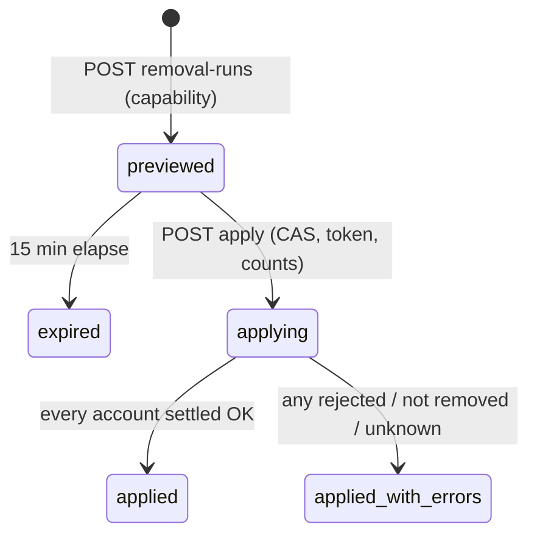

# Tutor Offboarding — departed-tutor detector and Wise removal — design

Date: 2026-10-01. Owner: Kevin. Status: design approved in conversation (four sections), awaiting spec review.

## 1. Why

Admins do not remove the Wise accounts of tutors who have left. On 1 Oct 2026 the Wise roster held
**164 teacher accounts for 90 people**; **38 people (61 accounts)** had no upcoming class, and most of them had
not taught for months. A former tutor keeps a working Wise login (student details, recordings, chats) and keeps
cluttering Wise and BGScheduler (search, dropdowns, reminders, AI and LINE suggestions).

Goals:

- Rank every tutor by how likely they are no longer with BeGifted, with plain-language reasons.
- One button removes the selected departed tutors' accounts from the Wise institute, safely and audibly.
- Learn the likelihood from BeGifted's own history, and log every human decision so a trained model is possible later.

Non-goals:

- Automatic removal. No cron or background job ever removes an account.
- Removing Wise ADMIN-relation (staff) accounts. They get a read-only panel.
- Removing the unused online/onsite variant account of a tutor who is still active.
- Deleting the Wise user itself (no API exists) or any course, session, feedback or payout record.
- Fixing payroll's current-roster tier lookup (a documented side effect, §12).

## 2. Owner decisions (1 Oct)

| Topic | Decision |
|---|---|
| Purpose | Security/access and a clean roster. Favour catching every departed tutor; a human confirms each removal |
| Who may remove | No preference given; design default adopted: admins holding an owner-managed capability grant |
| Seasonality | Long breaks that end in a return are rare. A long gap is strong evidence; "Still with us" covers exceptions |
| Approach | A — calibrated evidence score (not a fixed rule; not a trained model yet) |
| Validation | Owner confirmed the prototype's 23-person "very likely gone" list matches reality |
| Wise ADMIN accounts | Read-only "Staff accounts" panel, no remove button; departed staff are removed by hand in Wise |
| Sections 1–4 | Scoring engine, dashboard, removal flow, errors/testing/rollout approved as presented |

## 3. Facts established (1 Oct 2026, read-only)

### 3.1 Wise

- **There is no delete-user API.** The only removal is `POST /institutes/{instituteId}/removeParticipant`, body
  `{ "userId": "<id>" }`, response `{ "status": 200, "message": "Success", "data": "User removed from institute successfully" }`.
  It is in the public Postman collection's "Creating Users" folder with a *student* example. Nothing documents it for
  teachers, which id it expects for them, whether it is reversible, or what happens to their courses and sessions.
  It must be verified before any live use (§8.4).
- `WiseClient` exposes `get`/`post`/`put` only, and by default retries a POST on network errors, 408, 429 and 5xx.
  A removal must go through a client with retries disabled.
- The live roster (`GET /institutes/{id}/teachers`) returns more than `WiseTeacher` declares
  (`_id`, `userId`, `name`, `tags`). Each row also carries `instituteId`, `joinedOn`, `relation`, `status`,
  `updatedAt`, `classes[] {_id, name, subject}`, and `userId.{email, phoneNumber, profilePicture, activated}`.
- Roster on 1 Oct: 164 rows, all `status: ACCEPTED`; `relation` TEACHER 153 / **ADMIN 11**; 25 rows with zero
  `classes`; `joinedOn` is 2026-01 for 111 rows (most likely the Wise migration date, not a hire date) and Jul–Sep
  2026 for 24 rows.
- Re-adding someone is possible (`POST /institutes/{id}/sendBulkInvite`, or the vendor create-user call), but their tags
  and course assignments must be re-entered.

### 3.2 BGScheduler data

| Source | Tutor key | Gives | Coverage |
|---|---|---|---|
| `progress_test_attendance_ledger` | `tutor_canonical_key` | attended sessions | since 2026-03-01 |
| `past_session_blocks` | `group_canonical_key` | blocking sessions that passed | since 2026-04-22 |
| `post_class_sessions` | `canonical_tutor_key` | sessions with `final_status` | since 2026-07-21 |
| `future_session_blocks` (active snapshot) | group / `wise_teacher_id` | upcoming sessions | all future |
| `recurring_availability_windows` (active snapshot) | group / `wise_teacher_id` | working hours (no rows = none) | current |
| `dated_leaves` (active snapshot) | group | upcoming Wise leave | 0–182 days ahead |
| `wise_activity_events` | `actor_wise_user_id` + `actor_role` | teacher / admin actions in Wise | since 2026-05-27 |
| `leave_requests` | `tutor_canonical_key` | leave-form submissions | full form history |
| `tutor_attendance_enrollments` | `canonical_key` | full-time tutors (`active`) | since 2026-09-15 |
| `tutor_wise_accounts` | `wise_teacher_id` → `canonical_key` | durable account ownership; `status = 'absent'` once an account leaves the roster | since 2026-09-05 |

`tutor_contacts.active` is read widely but no code ever sets it to `false`. `tutor_business_profiles.active` is
admin-editable. No account has become `absent` since tracking began, so there are **zero labelled removals** today.

### 3.3 Backtest (Mar–Sep 2026, ledger + past session blocks, about 70 teaching tutors)

| Gap length | Gaps that ended with the tutor returning | Still-open gaps that long | Return rate |
|---|---:|---:|---:|
| ≥ 21 days | 13 | 21 | ≈ 38% |
| ≥ 30 days | 8 | 19 | ≈ 30% |
| ≥ 45 days | 4 | 15 | ≈ 21% |
| ≥ 60 days | 1 (an 82-day summer gap) | 15 | ≈ 6% |
| ≥ 90 days | 0 | 14 | 0% |

### 3.4 Prototype (throwaway script, not committed)

Scoring today's roster with the method in §4 gave 23 people / 41 accounts at ≥ 97%, one person at 70% (last class 30
days ago), one at 41% (recent Wise activity), two Active, and nobody between 70% and 97%. Excluded, first match
wins: 11 people with a Wise ADMIN account, 2 full-time tutors, 47 with upcoming classes, 3 new accounts. The owner
confirmed the 23 are all gone.

## 4. Scoring engine

### 4.1 Unit and key

**OFF-01.** The unit is a *person*: an identity group's `canonicalKey`. A person has one or two Wise accounts
(online / onsite); a removal acts on all of their current accounts. Accounts map to people through
`tutor_wise_accounts`, which survives an account leaving the roster.

### 4.2 Signals

| Signal | Source | Use |
|---|---|---|
| Days since last class | max taught start over the three history sources (§3.2), cancelled excluded | base likelihood (§4.3) |
| Upcoming classes | `future_session_blocks`, blocking only | any → excluded (OFF-04) |
| Working hours | `recurring_availability_windows` | none → evidence |
| Assigned courses, login activated, relation, joined date | **new** `tutor_wise_accounts` columns written by the snapshot sync from the roster it already fetches (no extra Wise calls) | no courses / never activated → evidence; relation and joined date → exclusions |
| Recent Wise actions | `wise_activity_events`, actor is one of the person's Wise user ids, role teacher, last 30 days | counter-evidence |
| On leave | upcoming `dated_leaves`, or a `leave_requests` row whose leave ends in the future | counter-evidence |
| Full-time tutor | `tutor_attendance_enrollments.active` | excluded |
| Admin decision | `tutor_offboarding_decisions` (§7) | excluded while snoozed |

**OFF-02.** An unknown signal contributes nothing; it is never evidence of departure. Examples: an account whose
availability fetch failed in the active snapshot (a `data_issues` row) has *unknown* working hours, not zero; a null
roster column (not yet synced) is unknown.

### 4.3 Calibration — likelihood from BeGifted's own history

1. **Taught dates.** A session counts as taught when it is an attendance-ledger row with meeting status `ENDED`, a
   blocking past session block, or a post-class session with final status `ENDED`. For each person with at least one taught session,
   take the distinct Asia/Bangkok dates with a taught session, on or after `HISTORY_START = 2026-03-01`.
2. **Gaps.** Consecutive taught dates `a < b` form a *closed* gap of `b − a` days (the tutor returned). The time from
   the last taught date to today is the person's *open* gap.
3. **Return rate.** For each threshold `t ∈ {21, 30, 45, 60, 90}` days: `R_t` = closed gaps of at least `t` days,
   `O_t` = open gaps of at least `t` days, and `r_t = (R_t + 0.5) / (R_t + O_t + 1)` (Jeffreys smoothing, so a
   small sample never yields 0% or 100%). `P_t = 1 − r_t` is the probability of being gone.
4. **Monotone.** `P_t` is forced non-decreasing in `t` (each value is at least the previous threshold's).
5. **Small samples.** When `R_t + O_t < 5`, `P_t` falls back to the 1 Oct defaults:
   21 → 0.60, 30 → 0.70, 45 → 0.78, 60 → 0.90, 90 → 0.96.
6. **Base likelihood** for a person: gap under 21 days → `0.03`; otherwise `P_t` for the largest `t ≤ gap`.
   **OFF-14.** A person with no taught session on record has gap = days since `max(HISTORY_START, earliest joinedOn
   of their accounts)`.

People who never taught are excluded from steps 1–5, because their gaps are not observed returns or departures.
Open gaps may still close later, so the estimate leans slightly toward "gone"; that is acceptable because a human
confirms every removal. Today the method gives roughly 61% / 70% / 78% / 91% / 97% for the five thresholds.

### 4.4 Score and bands

`likelihood = σ(logit(base) + Σ weights)`, rounded and capped at 99% (the page never claims certainty).

| Evidence | Counts when | Weight (log-odds) |
|---|---|---:|
| No working hours | every account's availability is known (no fetch issue) and has zero windows | +0.8 |
| No assigned courses | every account's course count is known and zero | +0.8 |
| Login never activated | every account's `activated` is known and false | +0.5 |
| Recent Wise teacher action | any teacher-role event by one of their user ids in the last 30 days | −2.0 |
| On leave | upcoming Wise leave, or a leave request ending in the future | −1.5 |

Bands: **≥ 90 Very likely gone**, **70–89 Likely gone**, **40–69 Unclear**, **< 40 Active**. Each row lists the reasons
behind its number in plain words ("Last class 4 months ago", "No working hours set", "Never logged in to Wise").

### 4.5 Exclusions

An excluded person is never selectable; the row shows why.

- **OFF-03.** Any account with Wise `relation = ADMIN` → shown only in the read-only Staff accounts panel.
- **OFF-04.** Any upcoming blocking session → "Teaching: N upcoming classes". Re-checked live at preview and apply (§6).
- **OFF-05.** New account: joined less than 60 days ago and no taught session on record → "New, not started yet".
- Full-time tutor (active attendance enrollment).
- "Still with us" decision whose snooze has not expired.
- Any account with `tutor_wise_accounts.status = 'identity_conflict'` → "Identity needs fixing in Wise first".
- No class on record and a joined date not yet known (roster details not synced yet) → "Waiting for Wise account
  details". Under OFF-02 a brand-new hire must never look departed.

**OFF-06.** Removal additionally requires the last class to be at least 45 days ago (for a person with no class on
record: their earliest account joined at least 60 days ago). This keeps the latest payroll month and post-class payout
window closed before an account disappears. Urgent cases are removed by hand in Wise.

Selectable for removal = band is not Active, no exclusion, OFF-06 met, freshness gate open.

### 4.6 Freshness gate

**OFF-07.** If the active tutor snapshot (`snapshots.created_at`) is more than 2 hours old, or the last successful run
of any other history feed (the progress-test sync, the post-class collector, the Wise activity sync, the
leave-request sync) is more than 3 days old, the
page shows an amber banner, marks every score provisional, and blocks removal. A broken sync must never make
everyone look idle. The snapshot is judged by its own age, not by `sync_runs.status`: since onboarding began
(5 Sep) a promoted run is still recorded `failed` whenever contact warnings exist, so `sync_runs` has no recent
`success` row even though snapshots promote every 30 minutes.

### 4.7 Computation and caching

Computed on request from Postgres (164 accounts; about 38,000 history rows across the three sources on 1 Oct),
behind a `"use cache"` service
tagged `snapshot`, so the existing 30-minute sync invalidates it. Decisions and grants are read uncached. No new cron.

### 4.8 Module layout — `src/lib/tutor-offboarding/`

| File | Responsibility |
|---|---|
| `types.ts` | `PersonSignals`, `CalibrationCurve`, `PersonScore`, DTOs |
| `signals.ts` | SQL loaders → `PersonSignals[]` (`db: Database = getDb()` seam) |
| `calibration.ts` | pure: taught dates → `CalibrationCurve` |
| `score.ts` | pure: signals + curve → likelihood, band, reasons, exclusion, selectable |
| `data.ts` / `service.ts` | dashboard payload (uncached reads / cached façade) |
| `access.ts` / `api.ts` | `require*` guards (admin, owner, capability) and `tutorOffboardingErrorResponse` (Shape B) |
| `removal.ts` | preview, apply, readback, reconcile (PR 2) |

## 5. Dashboard

Page `/tutor-offboarding`; nav label "Tutor Offboarding" in **Scheduling & Tutors**. Same layout as the approved
autowriter page: inbox (two thirds), rail (one third), detail in a side drawer. No KPI cards. Plain language for
non-technical admins.

- **Top line:** one sentence, e.g. "23 tutors (41 Wise accounts) are very likely no longer with us · data 12 min old".
  Freshness failures (OFF-07) turn it into an amber banner.
- **Inbox:** Very likely gone → Likely gone → Unclear. Each row: checkbox (only when selectable), name, likelihood bar
  and %, last class ("4 months ago · 3 Jun"), reason chips, account chips (Online / Onsite with email), and a
  **Still with us** button. Clicking a row opens the drawer: last class per source, working hours, courses, last Wise
  action, leave, and each account's Wise details.
- **Selection bar** (sticky): "Remove 5 tutors (9 Wise accounts) from Wise". Enabled only for capability holders;
  everyone else sees why it is disabled.
- **Still with us:** optional note; snooze for 90 days (default) or 1 year. The person moves to Excluded with who,
  when and the note, plus Undo. Every decision stores the likelihood, band and reasons at that moment (future labels).
- **Rail:**
  - *How the score works* — the curve in words ("Idle 60+ days → 91% never came back · based on 72 tutors since
    1 Mar") and the evidence list.
  - *Staff accounts* (read-only) — the Wise ADMIN accounts with last Wise admin action and last class; no remove button.
  - *Excluded* (collapsed) — teaching (count), new accounts, full-time, snoozed, identity conflicts.
  - *Who can remove* (owner only) — add or remove grant emails; every change audited.
- **History tab:** removal runs (who, when, reason, per-account outcome) and the decision log.

Access: the page and `/api/tutor-offboarding/*` follow `allowedPages`; every route also checks `role === "admin"`
itself, because non-admin roles pass the proxy. Owner = `SUPER_ADMIN_EMAILS`.

## 6. Removal flow (PR 2)

1. **Preview** (no Wise writes). The admin selects people and clicks Remove. The server re-validates each against the
   current score (§4.5, OFF-06, OFF-07), then reads Wise live: the roster (one GET) and all upcoming sessions (a few
   paginated GETs). Per account the plan is *remove* or *skip* with a reason (became ADMIN, new upcoming class, no
   longer on the roster, account details changed). It stores a run with status `previewed`, a `previewToken` (hash of
   the plan) and an expiry 15 minutes out.
2. **Confirm dialog.** Shows the plan ("Remove 9 accounts for 5 tutors · 1 skipped: new class found"), requires a reason
   of at least 10 characters and the admin typing the account count.
3. **Apply.** The request sends `{ previewToken, confirmed: true, reason, accountCount }`, which must match the
   stored run. The run moves `previewed → applying` with a compare-and-set update; **OFF-13**, a partial unique
   index, allows at most one `applying` run at a time. One roster GET is made at apply start; then, one account at
   a time:
   1. compare the account with its preview snapshot and skip it on any drift (gone, became ADMIN, details changed);
   2. write its audit row as `sending`, including a full account snapshot (name, email, phone, tags, courses,
      joined date) so it can be re-added later;
   3. **OFF-09.** Call `removeParticipant` exactly once with retries disabled. 2xx → `sent`; 4xx → `rejected`;
      network error, timeout or 5xx → `unknown`. An unknown outcome is settled only by readback, never by resending.
4. **Readback.** Re-fetch the roster once: absent → `verified`; still present → `not_removed`. The run ends `applied`
   or `applied_with_errors`.

**OFF-08.** Only this apply request, with a valid unexpired preview, ever sends a Wise write.

**OFF-11.** Preview and apply both re-read the caller's capability grant from Postgres on every request; the login
token is never trusted for it.

**OFF-10. Write gate.** Live mode requires `WISE_TEACHER_REMOVAL_VERIFIED === "true"` and a production deployment
(`VERCEL_ENV === "production"`). Otherwise apply runs in **manual mode**: each account is recorded `manual_required` and
the page shows a checklist ("Remove in Wise: Aong (Online), aong@…"). Manual mode is useful from day one.

**Reconcile.** After each snapshot sync updates `tutor_wise_accounts`, a hook (errors logged with `console.error`, never
failing the sync) moves `manual_required` accounts that are now `absent` to `removed_manually`.

**OFF-12. Local cleanup.** When every account of a person is `verified` or `removed_manually`, set
`tutor_contacts.active = false` and `tutor_business_profiles.active = false`, saving the previous values on the run
account rows. If such an account later reappears on the roster (someone re-added them), the same hook restores the
saved values and marks the rows `restored`.

## 7. Data model

Migration numbers are assigned at build time: `origin/main` ends at 0101 and the autowriter plans earmark 0102–0104.
`npm run db:generate` emits catch-up DDL because the snapshots stop at 0090, so trim each generated file to its own DDL.

**Migration A (PR 1)**

- `tutor_wise_accounts` gains nullable `wise_relation text`, `wise_joined_on timestamptz`, `wise_course_count integer`,
  `wise_activated boolean`. Null = unknown. They are written from roster fields the sync already fetches, by a
  best-effort step right after promotion (`persistRosterFacts`), outside the promotion transaction, so a failure of
  that step never blocks a sync; `absent` rows keep their last values. The columns are declared on the Drizzle table,
  so the sync's own reads and upserts of `tutor_wise_accounts` name them: migration A must be applied to production
  before this code deploys, or every sync fails with `42703` (undefined column).
- `tutor_offboarding_decisions`: `id`, `canonical_key`, `kind` (`still_with_us`), `note`, `snooze_until`,
  `likelihood_at_decision`, `band_at_decision`, `reasons jsonb`, `decided_by_email`, `decided_at`, `revoked_at`,
  `revoked_by_email`; index on `canonical_key` where `revoked_at is null`.
- `tutor_offboarding_access_grants`: `email` (normalized, primary key), `granted_by_email`, `granted_at`.
- `tutor_offboarding_access_audit_log`: `id`, `action` (`grant` / `revoke`), `email`, `actor_email`, `created_at`.

**Migration B (PR 2)**

- `tutor_offboarding_runs`: `id`, `status` (`previewed`, `applying`, `applied`, `applied_with_errors`, `expired`),
  `mode` (`live`, `manual`), `reason`, `preview_token`, `preview_expires_at`, `tutor_count`, `account_count`,
  `created_by_email`, `created_at`, `applied_by_email`, `applied_at`, `finished_at`; partial unique index on `status`
  where `status = 'applying'` (OFF-13).
- `tutor_offboarding_run_accounts`: `id`, `run_id`, `canonical_key`, `display_name`, `wise_teacher_id`,
  `wise_user_id`, `is_online_variant`, `account_snapshot jsonb`, `likelihood_at_preview`, `reasons jsonb`,
  `plan` (`remove`, `skip`), `skip_reason`, `status` (`planned`, `skipped`, `sending`, `sent`, `rejected`, `unknown`,
  `verified`, `not_removed`, `manual_required`, `removed_manually`, `restored`), `request_payload`,
  `response_payload`, `error_message`, `local_state_before jsonb`, `sent_at`, `verified_at`, `updated_at`;
  unique on (`run_id`, `wise_teacher_id`).

Enumerated columns use `text` with a CHECK constraint, as the newest tables do (no new Postgres enum types).

## 8. Interfaces

### 8.1 API (`/api/tutor-offboarding`)

| Method | Path | Gate | Purpose |
|---|---|---|---|
| GET | `/api/tutor-offboarding` | admin | dashboard payload |
| POST | `/api/tutor-offboarding/decisions` | admin | Still with us |
| DELETE | `/api/tutor-offboarding/decisions/{decisionId}` | admin | undo a decision |
| GET | `/api/tutor-offboarding/grants` | owner | list grants |
| POST | `/api/tutor-offboarding/grants` | owner | `{ action: "grant" \| "revoke", email }` (no email in the URL) |
| POST | `/api/tutor-offboarding/removal-runs` | capability | preview (PR 2) |
| GET | `/api/tutor-offboarding/removal-runs/{runId}` | admin | run detail (PR 2) |
| POST | `/api/tutor-offboarding/removal-runs/{runId}/apply` | capability (+ OFF-10) | apply (PR 2) |

### 8.2 Wise layer

- `WiseTeacher` gains the optional roster fields from §3.1.
- `removeWiseInstituteParticipant(client, instituteId, userId)` → `POST /institutes/{id}/removeParticipant`.
- `createTeacherRemovalWiseClient()`: `maxRetries: 0`, concurrency 1, throws when credentials are missing.

### 8.3 Pages and components

`src/app/(app)/tutor-offboarding/page.tsx` (async Server Component, client shell in `<Suspense>` with a skeleton,
rethrows `HANGING_PROMISE_REJECTION`) and `src/components/tutor-offboarding/` (workspace, inbox, drawer, rail
panels, remove dialog, history). Nav: a new `NavToolId` in `src/lib/navigation/tools.ts`.

### 8.4 Endpoint verification probe (PR 2 ships the script; running it needs the owner's go-ahead)

1. The owner creates, or approves creating, a labelled dummy teacher "ZZ BGS Removal Probe" on an address the owner
   controls, with no courses and no sessions.
2. `scripts/probe-wise-teacher-removal.ts --teacher-id <id> --confirm remove-probe-teacher` refuses unless the target's
   name starts with "ZZ BGS Removal Probe" and it has no courses and no sessions. It calls `removeParticipant` once with
   the Wise **user** id, prints the response, and re-reads the roster.
3. If Wise rejects the user id, the script stops. It never retries with the teacher-row id; the owner decides.
4. Re-invite the dummy in the Wise UI and record whether it returns with the same user id.
5. Record the result in `docs/reference/wise-api.md` (writeback table). Only then may the owner set
   `WISE_TEACHER_REMOVAL_VERIFIED=true` in Vercel production.

## 9. Error handling

- Routes use Shape B: one `try` around the `require*` guard and the logic, mapped by `tutorOffboardingErrorResponse`.
  Unknown errors become a generic 500; at the Wise write boundary only `error.name` is logged.
- Signal loaders follow OFF-02; a failed history source trips OFF-07, not a wrong score.
- Preview: a Wise read failure aborts the whole preview (nothing stored). Apply: a per-account failure is recorded and
  the loop continues; the readback settles every account.
- Optional-table pattern: if the new tables are missing (migration not yet applied), GET returns a typed "not set up"
  payload with HTTP 200, as other optional features do.

## 10. Testing

- **Pure units:** `calibration` (censoring, smoothing, monotone fix, small-sample fallback, empty history); `score`
  (each exclusion, OFF-02 unknowns, bands, 99% cap, never-taught gap, OFF-06 selectability).
- **Removal state machine** with a mocked Wise client: flag off → manual; sent / rejected / unknown; readback;
  drift skip; 45-day guard; token or count mismatch; expired preview; double apply; preview deployment refused;
  local cleanup only when all of a person's accounts are gone; restore on reappearance.
- **Route tests:** 401 / 403 (non-admin, no capability, not owner) / 400, Shape B mapping.
- **Sync test:** roster extras persisted by `planTutorContacts`; `absent` rows keep their last values.
- **Integration (Testcontainers):** single-applying index, snooze expiry, `manual_required → removed_manually` reconcile.
- Navigation tests updated. No cron changes.

## 11. Rollout

Both PRs stay draft until a reviewer reports CLEAR (PR 2 is a destructive Wise write path). Migrations and merges need
the owner's word.

1. **PR 1: read-only dashboard.** Migration A; roster extras in the sync; scoring engine; page with inbox, drawer,
   Still with us, staff panel, owner grant panel, How the score works; docs (feature page, API, DB, Wise roster
   fields). Rendered with fixture data to a PNG for the owner before merge. Gate: migration A is applied to
   production before PR 1 merges (the sync reads the new columns).
2. **PR 2: removal flow.** Migration B; Wise helper and no-retry client; preview / confirm / apply in manual and live
   modes; reconcile hook; History tab; probe script; docs (`env.md` flag, Wise writeback table).
3. **Operations**, each with the owner's go-ahead: apply migrations to production → admins use manual mode → run the
   probe (§8.4) → the owner sets `WISE_TEACHER_REMOVAL_VERIFIED=true`.

## 12. Risks and known side effects

- **Endpoint semantics unverified** (id type, course unassignment, whether past sessions and feedback stay attached).
  The probe covers the first two; history retention cannot be tested on a dummy with no sessions. Accepted, because
  only tutors idle for 45 days or more are removed and Wise keeps session records under the course.
- **Payroll:** re-syncing an *old* month that contains a removed tutor loses their tier, because payroll reads the
  current roster's tags. Manual removals in Wise already cause this today. The run's account snapshot keeps their tags
  if payroll ever needs a fallback.
- **Historical views** (Parent Report windows, credit-control past sessions) resolve teachers through
  `tutor_wise_accounts`, whose `absent` rows keep their canonical key; PR 2 adds a test to pin that.
- **Small sample:** about 70 tutors over 7 months. The rail shows the sample size; logged decisions allow recalibration
  or a trained model later.
- **Nickname reuse:** a new hire reusing a departed tutor's nickname could inherit their history under the same
  canonical key. OFF-05's grace period and the account chips in the drawer make that visible; no automatic handling.

## 13. Follow-ups (not in this spec)

- Nav count badge for "very likely gone" via `/api/home/summary`, to nudge admins.
- A trained model (approach C) once enough decisions are logged.
- Flagging unused online/onsite variant accounts of active tutors.
